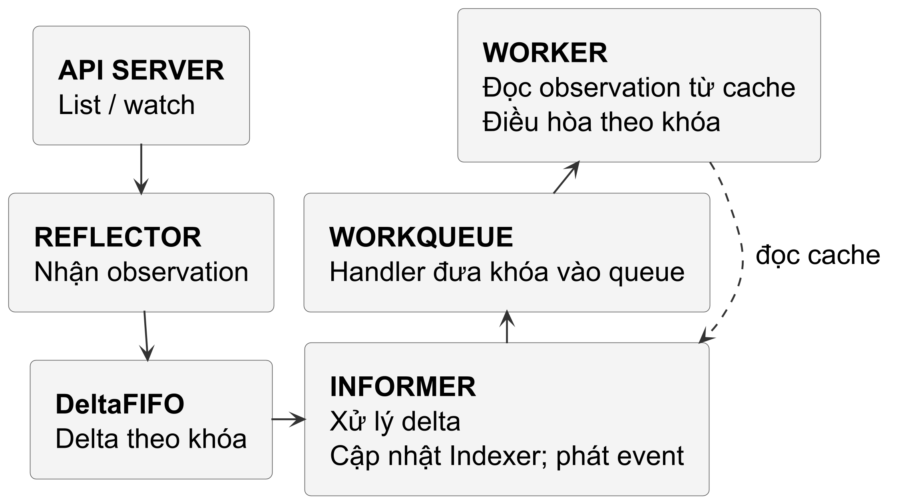
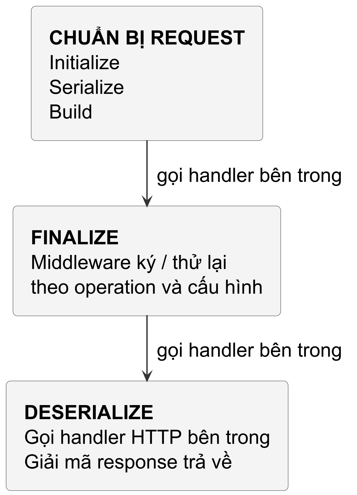
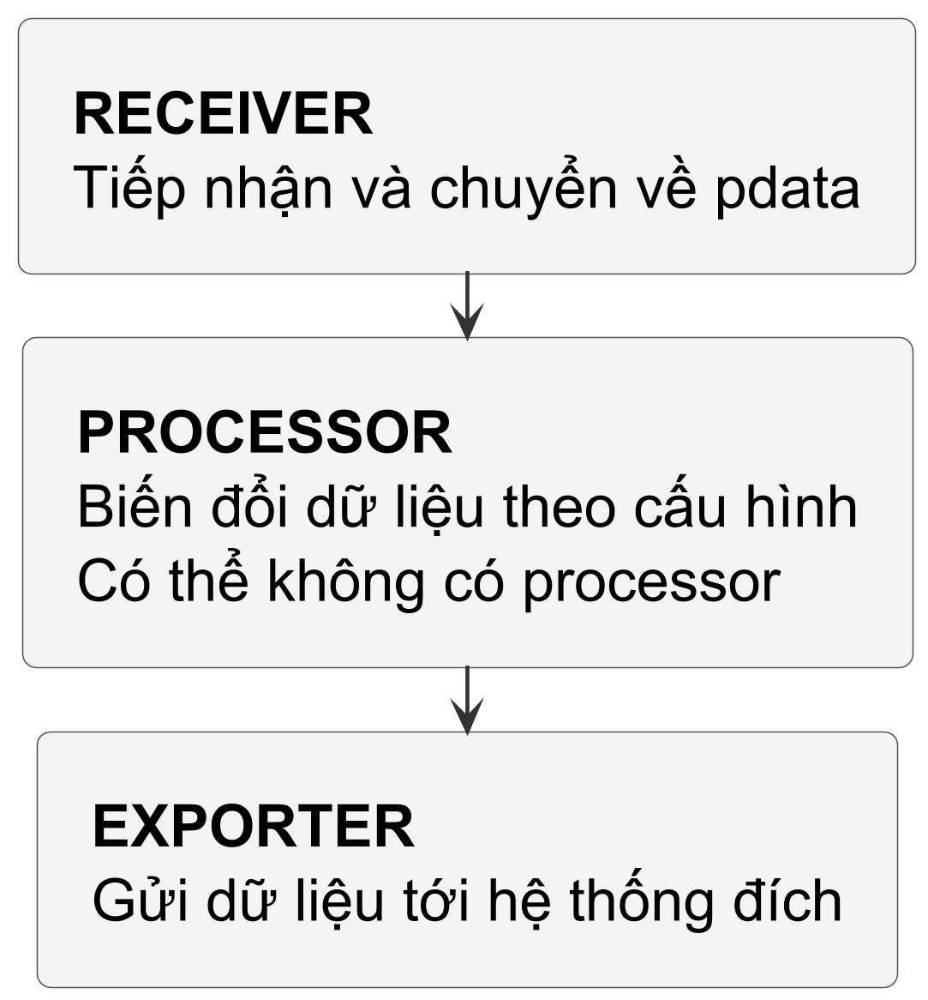
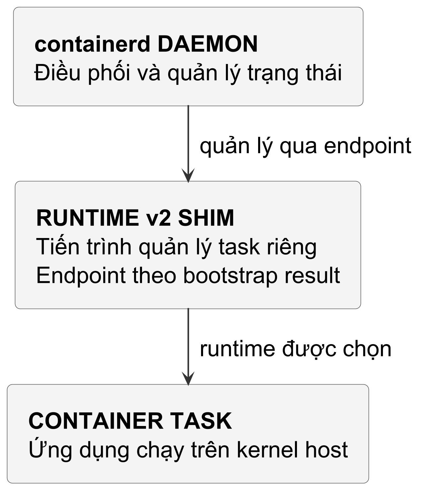
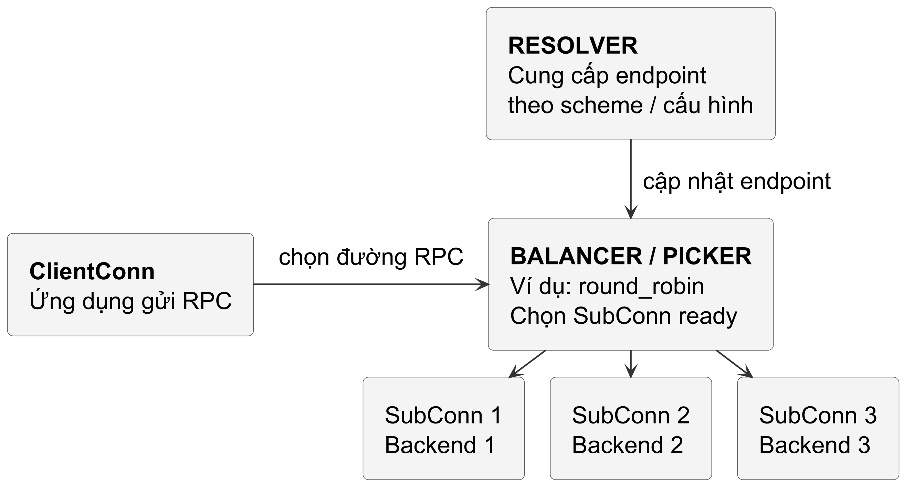
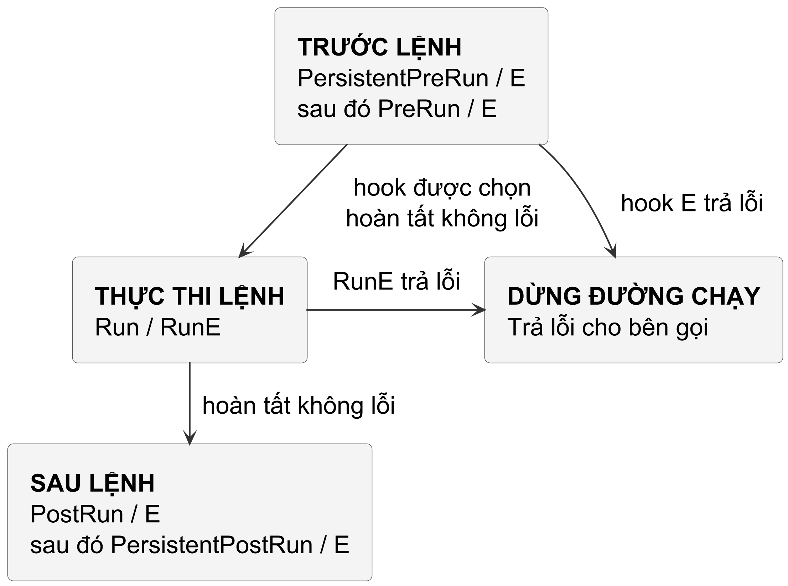
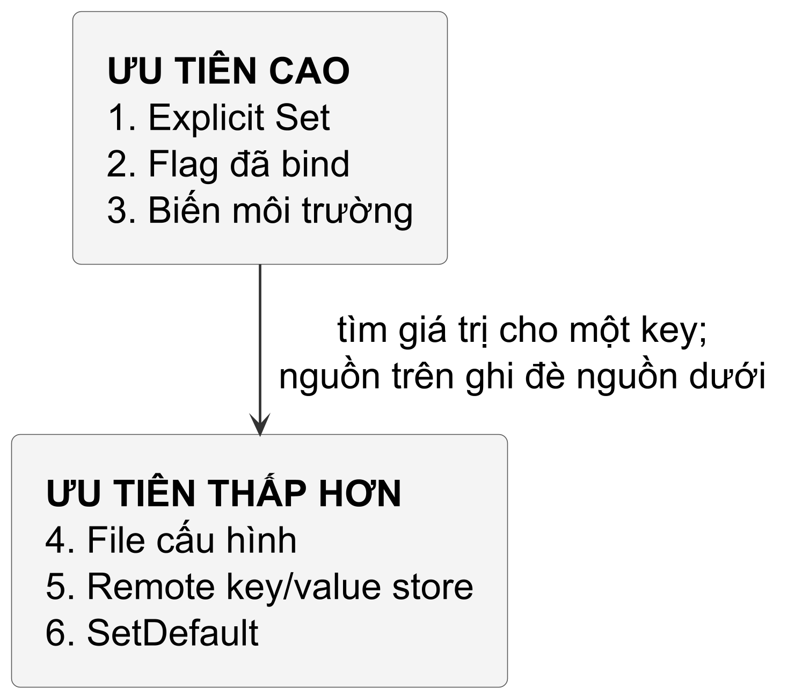
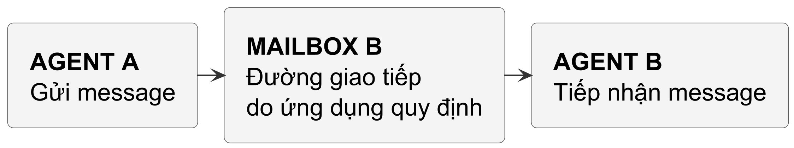

# BACK MATTER — ATLAS MÃ NGUỒN 50 THƯ VIỆN GO DEVOPS & CLOUD
## Điểm neo để đọc API và implementation đã ghim

Phụ bản này đứng sau Chương 29 và ngay trước Atlas Lỗi Go. Các nhận xét về implementation chỉ áp dụng cho version và commit ghi ở mỗi mục, không phải cam kết API cho mọi version. Khóa source chứng minh identity của checkout, không tự chứng minh mọi giải thích cơ chế; khi dùng một chi tiết để quyết định production, đọc code và test tại commit đó.

Phụ bản chọn 50 thư viện Go trong các lĩnh vực DevOps, cloud, networking, observability, IaC và hạ tầng Agent. Mỗi mục ghi version/commit được ghim để người đọc có thể đối chiếu. Mô tả API hoặc hợp đồng công khai không đồng nghĩa đã kiểm chứng mọi chi tiết implementation; câu nào nói đến cơ chế nội bộ phải có điểm neo source tương ứng ở bản đã ghim.

> Quy tắc kiểm chứng: không đoán version, tag, module path hay tên hàm. Một claim về implementation phải có source đã xác minh; cơ chế được neo vào type, struct hoặc file cụ thể. Mỗi mục phân tích cơ chế và ý nghĩa kỹ thuật, không dùng lời quảng bá thay cho bằng chứng.

---

## PHẦN 1: NHÓM NỀN TẢNG TRỌNG YẾU (TIER S: 01–12)

### 01. `k8s.io/client-go` (v0.37.0 — `28076445`)

Nếu controller lặp List toàn bộ Pod mỗi giây, nó tạo công việc tuần tự hóa và truyền snapshot lặp lại. Mức tải phụ thuộc số object, kích thước và API server; không suy ra CPU 100% hay cluster sập chỉ từ 500 Pod. Informer hỗ trợ duy trì observation local từ list/watch để nhiều consumer không phải tự polling toàn bộ tài nguyên theo cùng nhịp.

Reflector duy trì observation bằng list/watch và xử lý thay đổi resourceVersion cùng lỗi transport. Đường khởi tạo cụ thể có thể dùng List hoặc watch-list tùy version, capability và cấu hình. Watch là stream API event, không phải trực tiếp theo dõi mọi thay đổi etcd; HTTP/2 cũng không dùng HTTP/1.1 chunked transfer encoding. Khi lịch sử không còn đủ hoặc stream lỗi, Reflector xử lý recovery theo source đã pin; không phải mỗi lần đứt stream đều bắt buộc List lại.

Dữ liệu nhận về không được chuyển ngay cho người dùng mà đẩy vào một hàng đợi gom cụm đột biến mang tên `DeltaFIFO` (`tools/cache/delta_fifo.go`). Khi một Pod bị sửa đổi dồn dập 10 lần trong nửa giây, `DeltaFIFO` lưu trữ chuỗi delta theo khóa định danh `namespace/name`. Từ đây, vòng lặp xử lý nội bộ của Informer (`controller.processLoop`) rút delta ra, cập nhật đối tượng vào một bộ nhớ đệm luồng an toàn cục bộ gọi là `Indexer` (`tools/cache/index.go`), được bảo vệ bởi `sync.RWMutex`.


@figure Informer cập nhật cache rồi phát event tới handler; handler của ứng dụng đưa khóa vào workqueue. Worker đọc observation hiện có khi điều hòa, không coi payload event là trạng thái cuối cùng.

Điểm neo kỹ thuật đáng giá nhất để học trong `client-go` nằm ở `util/workqueue/queue.go` (`type Typed[T]`). `TypedInterface[T]` là giao diện public; `TypedQueueConfig[T]` là cấu hình. Triển khai `Typed[T]` phối hợp hàng đợi có thể thay thế và hai tập khóa:

```go
type Typed[T comparable] struct {
    queue      Queue[T]
    dirty      sets.Set[T]
    processing sets.Set[T]
    cond       *sync.Cond
    // Các trường lifecycle và metrics khác được lược bỏ.
}
```

Hãy hình dung: Worker đang bận xử lý key `"default/my-pod"` trong tập `processing`. Cùng lúc đó, 5 sự kiện cập nhật liên tiếp của Pod này được Informer gửi tới. `Add(item)` chỉ đánh dấu key trong `dirty` khi nó đang được xử lý, không đẩy thêm vào hàng đợi. Khi worker gọi `Done(item)`, nếu key vẫn `dirty`, nó được đẩy lại đúng một lần. Cơ chế khử trùng lặp này giới hạn việc xếp trùng một key; thứ tự và cấu trúc lưu trữ phụ thuộc triển khai `Queue[T]`. Worker thường lấy key rồi đọc snapshot hiện tại từ Indexer — snapshot đó có thể stale so với API server. Reconciliation lặp lại mới giúp hội tụ về trạng thái mong muốn.

Khi worker không chạy, kiểm tra lifecycle, error của Reflector và cache sync. Thiếu quyền list có thể ngăn initial population; thiếu quyền watch ảnh hưởng nhận cập nhật. Không suy ra HasSynced luôn false chỉ từ một lỗi watch, vì trạng thái sync còn phụ thuộc đường khởi tạo. Phải có cancellation/deadline và quan sát error thay vì chờ vô hạn.

---

### 02. `sigs.k8s.io/controller-runtime` (v0.25.1 — `67b72c25`)

`controller-runtime` tổ chức cache, controller và lifecycle dùng chung, giảm phần wiring phải tự làm với `client-go`. `Reconcile(ctx, Request)` là contract điều hòa, không xóa trách nhiệm thiết kế retry, quyền, cleanup hay shutdown của ứng dụng. Không có một số dòng boilerplate cố định cho mọi controller.

Ở `pkg/manager/internal.go`, `controllerManager.Start` khởi động HTTP servers và webhooks trước caches, rồi mới các nhóm runnable phụ thuộc cache và leader election. Tín hiệu chỉ cancel context nếu caller đã thiết kế signal propagation. Shutdown đi qua stop procedure với timeout cấu hình; không hứa mọi worker luôn hoàn tất mọi side effect trước khi process dừng.

Ở commit này, đọc `pkg/client/client.go`, `Options.Cache` và `CacheOptions`, không tìm một `delegatingClient` trong file `split.go` của version cũ. Cấu hình rút gọn sau minh họa boundary đọc:

```go
type CacheOptions struct {
    Reader       Reader
    DisableFor   []Object
    Unstructured bool
}
```

Client của manager thường dùng cache cho `Get`/`List` của type được cache. Nhưng `client.New` không có `Options.Cache.Reader` thì đọc API server; `DisableFor` và cấu hình unstructured còn có thể chọn đường trực tiếp. Lazy discovery/informer initialization cũng có thể phát sinh HTTP. Không suy ra một `Get` bất kỳ là “zero HTTP”. Write đi tới API server; response thành công còn phải diễn giải theo operation/options, chẳng hạn dry-run không lưu thay đổi. Watch propagation và trạng thái workload thực tế là các boundary riêng, không được xác nhận chỉ bằng một write response.

`reconcile.Request` mang key thay vì snapshot object tại lúc phát event. Khi worker xử lý, object có thể đã đổi. Reconciler chọn reader phù hợp và đọc lại theo key; request không bắt buộc dùng cache và cũng không cung cấp freshness guarantee. Ví dụ dưới đây chọn `r.Get` qua client của reconciler:

```go
var pod corev1.Pod
if err := r.Get(ctx, req.NamespacedName, &pod); err != nil {
    return ctrl.Result{}, client.IgnoreNotFound(err)
}
```

`client.IgnoreNotFound(err)` chỉ chuyển lỗi not-found thành `nil`; nó không làm các side effect trở nên lũy đẳng. Request theo key giúp reconciler đọc trạng thái khi xử lý, nhưng cache có thể stale. Muốn hội tụ an toàn cần thiết kế từng thao tác: kiểm tra ownership, dùng precondition khi ghi và quan sát lại sau lỗi hoặc retry. Khi cần độ mới của API server, chọn client đọc trực tiếp thay vì suy ra từ cache.

---

### 03. `github.com/aws/aws-sdk-go-v2` (v1.47.0 — `b189f382`)

Một lời gọi S3 được SDK serialize, resolve endpoint, ký khi operation yêu cầu và gửi qua HTTP. SigV4 dùng canonical request và credential; không phải mọi đường S3 đều băm toàn bộ body, vì có chế độ unsigned payload. Đọc `aws/signer/v4/middleware.go` và operation source để biết đường ký cụ thể.

SDK dùng `middleware.Stack` của module `github.com/aws/smithy-go`, không phải type khai báo trong `aws/middleware/stack.go`. Năm stage tổ chức request và response path như sau:


@figure Năm step tổ chức đường gọi vào bên trong. Deserialize gọi handler HTTP trước khi giải mã response; sơ đồ lược bỏ đường response đi ngược ra ngoài các step.

1. **Initialize:** Kiểm tra hợp lệ các tham số đầu vào và nạp giá trị mặc định vào ngữ cảnh.
2. **Serialize:** Đưa input operation vào request của transport; đường HTTP dùng `transport/http.Request` của smithy-go cho URL, method, headers và body.
3. **Build:** Chuẩn bị request, chẳng hạn content length và metadata phù hợp operation.
4. **Finalize:** Đường ký và retry được đặt ở đây trước transport; thứ tự middleware cụ thể phải đọc theo operation và cấu hình.
5. **Deserialize:** Đọc mã phản hồi HTTP, giải mã XML/JSON body thành struct kết quả, hoặc ánh xạ mã lỗi AWS (như `NoSuchKey`, `AccessDenied`) thành các struct lỗi cụ thể trong Go.

Xét scenario nhiều client gặp lỗi gần cùng lúc: backoff cố định theo cấp số nhân có thể làm các lần retry tiếp tục dồn thành đợt. `aws/retry/standard.go` ở version ghim dùng Full Jitter để phân tán thời điểm retry trong khoảng backoff. Jitter giảm đồng bộ thời gian, không tạo thêm capacity hay bảo đảm hạ tầng hồi phục; vẫn cần attempt budget, deadline và policy cho side effect.

Ở phiên bản được ghim `github.com/aws/aws-sdk-go-v2` v1.47.0, `retry.Standard` mặc định dùng rate limiter dạng quota với capacity 500 token. Khi `AWS_NEW_RETRIES_2026` không bằng `true`, cấu hình cũ tính `RetryCost` là 5 token cho retry thông thường và `RetryTimeoutCost` là 10 cho retry do timeout. Khi `AWS_NEW_RETRIES_2026=true`, `RetryCost` mặc định là 14 cho lỗi nhất thời, `ThrottlingRetryCost` là 5 cho lỗi throttling, còn `RetryTimeoutCost` không được dùng. Mỗi attempt thành công cộng `NoRetryIncrement` 1 token; retry thành công còn hoàn lại token đã lấy theo đường retry. Đây là hai bộ mặc định của cùng Standard retryer, không phải hai retry mode của SDK. Các cost, capacity và rate limiter đều có thể được cấu hình lại; khi quota không đủ, retry bị chặn. Vì thế không thể gán một chi phí token cố định cho mọi lỗi mạng hoặc mọi cấu hình AWS.

---

### 04. `github.com/prometheus/client_golang` (v1.24.1 — `d6087ee4`)

Nhiều goroutine cập nhật cùng counter có thể tranh chấp lock và cache line chứa state chia sẻ. Chi phí phụ thuộc workload, số writer, kiến trúc và đường đồng bộ; không hứa nó tăng theo một quy luật chung khi thêm core. Cần profile/benchmark trước khi chọn một primitive khác.

Trong `prometheus/counter.go` của version ghim, `type counter` giữ hai phần state và có hai đường cập nhật, không chỉ một vòng CAS cho mọi thao tác:

```go
type counter struct {
    // valBits lưu giá trị float64 bằng bit representation
    valBits uint64
    valInt  uint64
    // ...
}
```

Bộ đếm tách giá trị ra làm hai thành phần: số nguyên (`valInt`) và số thực thập phân (`valBits`). Khi bạn gọi hàm thông dụng nhất là `Inc()` (tương đương `Add(1)`), hàm nhận thấy giá trị tăng là số nguyên dương. Nó lập tức kích hoạt đường dẫn nhanh (fast path):

```go
atomic.AddUint64(&c.valInt, 1)
```

`Inc` dùng `atomic.AddUint64`. Trong `Add`, nhánh integer kiểm tra `float64(uint64(v)) == v`; nếu không thỏa, chẳng hạn `0.15`, code cập nhật `valBits` bằng vòng CAS cho phép cộng float. Không gọi mọi giá trị nguyên là nhánh integer: khả năng biểu diễn còn quan trọng. Chi phí atomic vẫn phụ thuộc target, contention và cache coherence; không có số nanosecond cố định hay ranking “nhanh/chậm” cho mọi môi trường từ hai nhánh này.

Độ phức tạp tiếp theo nằm ở metric có nhãn động: `MetricVec` (`prometheus/vec.go`) dùng cơ chế tra cứu theo bộ giá trị nhãn và tái dùng metric đã tạo. Điều này không chứng minh mỗi lần tra cứu đều không cấp phát; chi phí thực tế cần đo với tập nhãn và đường gọi cụ thể.

Ở scrape path, `Gather()` thu thập metric families, còn handler chọn encoder theo format negotiation và ghi response. Gathering và encoding là hai bước khác nhau; chi phí cấp phát phụ thuộc số metric, tần suất scrape và encoder, không chỉ việc không dùng JSON.

---

### 05. `go.opentelemetry.io/otel` (v1.46.0 — `58db4c89`)

Telemetry có overhead và cần budget. Export đồng bộ thêm thời gian chờ vào request path; queue không giới hạn có thể giữ quá nhiều memory khi backend lỗi. Không có tỷ lệ latency tăng gấp đôi phổ quát. Batch processor chọn queue, timeout, drop/block policy và shutdown behavior; đo overhead và loss theo workload thay vì coi instrumentation là miễn phí.

Ở version ghim, `batchSpanProcessor` trong `sdk/trace/batch_span_processor.go` dùng buffered channel có dung lượng giới hạn để chuyển span sang đường export. Đây là chi tiết implementation hữu ích để hiểu đầy queue và mất span, không phải lợi thế mặc định của channel so với mọi ring buffer:

```go
type batchSpanProcessor struct {
    e             SpanExporter
    o             BatchSpanProcessorOptions
    queue         chan ReadOnlySpan
    dropped       atomic.Uint32
    // ...
}
```

Đoạn rút gọn dưới đây giữ nhánh enqueue/drop sau kiểm tra sampled span; source thật còn có context và instrumentation, không nên chép fragment này như một hàm nguyên vẹn của thư viện:

```go
func (bsp *batchSpanProcessor) enqueueDrop(
    sd ReadOnlySpan,
) bool {
    select {
    case bsp.queue <- sd:
        return true
    default:
        bsp.dropped.Add(1)
        return false
    }
}
```

Trong đường không bật blocking, `select` có nhánh `default` làm enqueue không chờ khi queue đầy. Span có thể bị bỏ và bộ đếm `bsp.dropped` tăng. Nhánh này chỉ giới hạn việc chờ dung lượng queue, không chứng minh cả lời gọi không có chi phí hoặc không tranh chấp. Bật blocking đổi trade-off; shutdown, exporter và timeout còn có contract riêng.

Ở đầu ra, một goroutine chạy nền (`bsp.processQueue`) lắng nghe hai tín hiệu: một timer chu kỳ (`batchTimeout`, mặc định 5 giây) hoặc kích thước lô gom tụ (`maxExportBatchSize`, mặc định 512 spans). Khi một trong hai điều kiện thỏa mãn, lô spans được rút ra và chuyển cho `Exporter.ExportSpans(ctx, batch)`.

`TraceContext` (`propagation/trace_context.go`) extract/inject context theo W3C, trong đó có header `traceparent`. Consumer phải cấu hình và dùng propagator ở boundary thích hợp; đây không phải bảo đảm trace hoàn chỉnh. Khi tạo child span, TraceID nối cùng trace còn SpanID mới phân biệt span với parent. Truyền `context.Context` giúp mang quan hệ ấy qua các hàm, nhưng không tự tạo span, sample hoặc export dữ liệu.

---

### 06. `go.opentelemetry.io/collector` (v0.161.0 — `0bf928af`)

Nếu SDK đo telemetry trong tiến trình, Collector là đường tiếp nhận, xử lý và chuyển tiếp dữ liệu ở cấp hạ tầng. Một bản phân phối Collector có thể cấu hình receiver, processor và exporter để nối nhiều nguồn/đích; danh sách OTLP, Prometheus, Jaeger, Zipkin, Datadog, Elasticsearch hay S3 phụ thuộc component thực sự được đóng gói và cấu hình, không mặc định có trong core module.

Hợp đồng cấu hình Collector nối ba loại component trong pipeline:


@figure Pipeline nối receiver, các processor được cấu hình và exporter. Fan-in, fan-out, queue và retry phụ thuộc cách nối component cùng cấu hình cụ thể.

1. **Receiver:** Lắng nghe trên cổng mạng (gRPC/HTTP), chuyển đổi payload của các giao thức khác nhau về mô hình dữ liệu nội bộ chuẩn hóa mang tên `pdata` (`go.opentelemetry.io/collector/pdata`).
2. **Processor:** Áp dụng các quy tắc biến đổi: gom lô (`batch`), lọc dữ liệu (`filter`), hoặc lấy mẫu (`probabilistic_sampler`).
3. **Exporter:** Dịch `pdata` ngược lại định dạng của hệ thống đích và đẩy qua mạng.

`consumer.Capabilities` cho phép component khai báo nó có thể sửa dữ liệu. Đó là thông tin đầu vào cho việc xử lý chia sẻ dữ liệu ở fan-out, không phải một bảo đảm toàn pipeline không copy; khi thiết kế processor, caller phải tôn trọng hợp đồng ownership của component đang dùng.

Exporter helper có queue/retry policy tùy exporter và cấu hình. Persistent queue dùng storage extension khi được hỗ trợ và cấu hình; không phải mặc định mọi exporter đều có queue, cũng không phải RAM queue đầy sẽ tự spill xuống disk. Phải kiểm tra capacity, unit, overflow policy, retry timeout và storage của exporter đang dùng.

---

### 07. `github.com/moby/moby` (v28.5.2 — `89c5e8fd`)

Trong đường Linux container đang xét, runtime tổ chức process với namespace, filesystem và cgroup theo cấu hình; nó dùng kernel của host, không tự có kernel riêng như VM. Không phải mọi container bật đủ cùng một tập namespace, và cgroup chỉ giới hạn những resource đã cấu hình. Moby điều phối các thành phần này; Docker trên host khác có boundary triển khai khác.

Khi mổ xẻ `daemon/daemon.go` (`type Daemon`), bạn sẽ nhận ra Docker daemon không trực tiếp thực thi container. Nhiệm vụ chính của nó là quản lý trạng thái và phối hợp tài nguyên. Máy trạng thái vòng đời của một container được kiểm soát nghiêm ngặt tại `container/state.go` (`type State`):

```go
type State struct {
    sync.Mutex
    Running           bool
    Paused            bool
    Restarting        bool
    OOMKilled         bool
    Dead              bool
    Pid               int
    ExitCodeValue     int
    ErrorMsg          string
    StartedAt         time.Time
    FinishedAt        time.Time
    // ...
}
```

Mutex của `State` được dùng làm lock chung với `Container`. Các cờ không luôn loại trừ nhau: paused process vẫn có thể Running; `Dead` không chỉ là tên khác của một process vừa nhận SIGKILL. Lock bảo vệ các state transition theo implementation, không tự chứng minh toàn bộ lifecycle bên ngoài không có race.

Khía cạnh kỹ thuật ngoạn mục thứ hai của Moby là hệ thống tập tin phân lớp (Layered Filesystem) thông qua đồ thị driver lưu trữ `daemon/graphdriver/overlay2`. Khi bạn khởi chạy một container từ image Ubuntu:
- Các layer của image được mount dưới dạng các thư mục chỉ đọc (`lowerdir`).
- Container được cấp một thư mục ghi duy nhất (`upperdir`).
- Kernel kết hợp chúng lại thành một thư mục ảo duy nhất (`merged`) bằng hệ thống tập tin `overlayfs`.

Với một file thường nằm trong layer chỉ đọc, OverlayFS có thể copy-up sang writable layer trước khi sửa, tùy operation và cấu hình filesystem. Không dùng `/etc/hosts` làm ví dụ mặc định vì runtime thường quản lý nó bằng mount riêng. Shared volume và bind mount có ownership khác image layer. Copy-on-write không chứng minh container isolation tuyệt đối hay một thời gian start cố định.

---

### 08. `github.com/containerd/containerd/v2` (v2.4.0 — `a7fe631d`)

Nếu daemon quản lý container gặp sự cố, vòng đời của task đang chạy có bắt buộc chấm dứt theo không? Câu trả lời phụ thuộc ranh giới giữa daemon và runtime shim, không phải một cam kết restart luôn êm cho mọi workload.

Câu trả lời nằm ở ranh giới daemon–shim của runtime v2; phía daemon được triển khai trong `core/runtime/v2/shim.go`. `containerd-shim-runc-v2` là một shim cụ thể, không đại diện mọi runtime.


@figure Daemon giao tiếp với shim qua endpoint; shim quản lý task qua runtime được chọn. Ranh giới tiến trình này không bảo đảm mọi failure của daemon đều vô hại với workload.

Daemon dùng shim process riêng để quản lý task. Ở commit được pin, `core/runtime/v2/shim.go` cho thấy containerd nạp shim, đọc bootstrap result và nối tới endpoint của shim. File này không chứng minh shim nào cũng trở thành subreaper, dùng đúng syscall `wait4` hay trực tiếp giữ mọi luồng I/O; muốn khẳng định các chi tiết ấy phải đọc implementation của shim được chọn.

Boundary giữa daemon và shim dùng endpoint có thể chọn ttrpc hoặc gRPC theo bootstrap result trong source đã pin; không có một transport hay mức tiết kiệm memory cố định cho mọi shim. Đường I/O, reaping và recovery phụ thuộc shim/runtime cụ thể.

Shim tách lifecycle task khỏi daemon containerd nên một số trường hợp daemon restart không buộc task dừng. Đây không phải bảo đảm workload không bị ảnh hưởng trong mọi failure; reattach, state storage và hoạt động đang cần daemon có thể lỗi. Thời gian recovery cần đo trên version và cấu hình thật, không gán vài chục millisecond cho mọi host.

---

### 09. `github.com/hashicorp/terraform-plugin-framework` (v1.19.0 — `c7ac25e8`)

String Go có nhiều giá trị, trong đó chuỗi rỗng vẫn là giá trị hợp lệ; pointer có nil và các giá trị không nil. IaC cần biểu diễn thêm việc giá trị chưa biết tại plan time và null theo schema, thay vì dùng chuỗi rỗng cho tất cả trạng thái thiếu dữ liệu.

Hãy xem xét kịch bản sau: Bạn viết một file cấu hình Terraform để tạo một mạng VPC mới, và trong cùng một kế hoạch đó, bạn tạo một Subnet sử dụng thuộc tính `vpc_id = aws_vpc.main.id`. Khi bạn chạy lệnh `terraform plan`, tài nguyên VPC chưa hề được tạo trên AWS, do đó `vpc_id` chưa hề tồn tại. Nếu Terraform gán giá trị đó bằng chuỗi rỗng `""` hoặc `nil`, các bước kiểm tra hợp lệ logic (validation) sẽ báo lỗi cú pháp sai, hoặc tệ hơn, provider sẽ gửi một request vô nghĩa lên cloud provider làm hỏng toàn bộ kế hoạch. Ngược lại, nếu coi nó là đã có giá trị, hệ thống sẽ hành xử sai.

Ở boundary dữ liệu Terraform, `terraform-plugin-framework` dùng các value biểu diễn được known, null và unknown, thay vì chỉ dùng một giá trị primitive Go không mang đủ trạng thái. Điều này không có nghĩa implementation không còn dùng kiểu Go bên trong. Các interface và kiểu value được xem tại `attr/value.go` và các kiểu liên quan:

```go
type StringValue struct {
    state attr.ValueState
    value string
}
```

`types/basetypes/string_value.go` dùng `state` để phân biệt ba trạng thái:
- **Known (Đã biết):** Giá trị đã được xác định cụ thể (ví dụ `"us-east-1"`).
- **Null:** Giá trị vắng mặt theo type model; có thể đến từ cấu hình bỏ trống, biểu thức trả null hoặc logic provider. Không suy ra ý định người dùng chỉ từ `IsNull()`.
- **Unknown:** Giá trị chưa biết trong phase đang xét, chẳng hạn thuộc tính computed ở plan. Nó không chỉ áp dụng cho tài nguyên cloud hay luôn được giải quyết bởi một tài nguyên phụ thuộc.

`internal/fwserver/server.go` tổ chức các operation của framework; tầng server adapter cung cấp provider protocol tương ứng. Khi đọc `IsUnknown()` và `IsNull()`, câu hỏi cần trả lời là provider sẽ trì hoãn, giữ null hay tính một giá trị nào ở phase này. Gộp hai trạng thái thành chuỗi rỗng sẽ làm mất thông tin mà Terraform cần khi plan và apply.

---

### 10. `helm.sh/helm/v3` (v3.22.0 — `144ca65f`)

Một thay đổi kiến trúc của Helm 3 là bỏ daemon Tiller của Helm 2. Quyền Kubernetes của Tiller phụ thuộc ServiceAccount và RBAC được cấu hình; cấu hình quá rộng tạo rủi ro leo quyền cho người gửi lệnh tới Tiller.

Helm 3 bỏ Tiller và thực hiện action từ client. Quyền Kubernetes phụ thuộc cấu hình REST client và credential thực tế, có thể từ kubeconfig hoặc môi trường chạy service. Đây là thay đổi trust boundary, không phải lời hứa giải quyết mọi rủi ro quyền hạn; chart, hook và quyền client vẫn phải được review.

Không có Tiller thì release history được lưu ở đâu? Đây là đường cần lần theo khi điều tra rollback:

Một storage driver của Helm nằm ở `pkg/storage/driver/secrets.go` (`type Secrets`): khi chọn driver Secrets, release history được lưu trong Kubernetes Secret ở namespace triển khai, với nhãn nhận diện. Đây là đường mặc định phổ biến, không phải storage backend duy nhất Helm hỗ trợ:

```
name: sh.helm.release.v1.my-app.v1
labels:
  name: my-app
  owner: helm
  status: deployed
  version: "1"
```

Toàn bộ thông tin của bản phát hành — bao gồm source chart, file `values.yaml` đã merge, và toàn bộ chuỗi manifest YAML kết quả sinh ra từ `pkg/engine/engine.go` — được gom lại thành một struct `Release`, sau đó được tuần tự hóa JSON, nén bằng thuật toán gzip, mã hóa base64 và nhét trọn vẹn vào trường `data["release"]` của Secret.

Khi rollback, Helm đọc release history từ storage đã cấu hình và dùng action rollback để tạo revision mới, rồi cập nhật tài nguyên qua Kubernetes API. Đây không đơn thuần là giải nén một Secret, tính diff và Patch mọi tài nguyên. Helm 3 bỏ Tiller; quyền thực tế phụ thuộc credentials và RBAC của client đang gọi.

---

### 11. `github.com/go-git/go-git/v5` (v5.19.2 — `3eeb238d`)

Một image `scratch` không tự mang shell, git hay C runtime; các biến thể distroless có thành phần khác nhau và có thể mang library native. Nếu image không có executable git, gọi `exec.Command` không thể dùng nó. go-git là một lựa chọn library in-process; lựa chọn khác là đóng gói git phù hợp. Phải kiểm tra đúng image digest và dependency cần dùng, không suy ra từ nhãn “tối giản”.

`go-git` tách các thao tác object/packfile ở tầng plumbing khỏi các thao tác repository ở tầng porcelain. Phân tầng này giúp đọc đường đi của dữ liệu mà không cần gọi Git CLI:

Tầng plumbing (`plumbing/format/packfile/parser.go`, `packfile.go`) đọc packfile chứa các Git object, trong đó object delta tham chiếu một base object bằng offset hoặc object ID. Base không nhất thiết là “file của commit cũ”; đối tượng có thể là blob, tree, commit hoặc tag. Đường giải mã cần tìm base và áp dụng chuỗi delta để tái tạo object. Không suy ra toàn bộ object graph luôn được giữ trong RAM.

`plumbing/storer/storer.go` khai báo `EncodedObjectStorer`, tách thao tác với Git object khỏi backend lưu trữ. Hai lựa chọn cho ví dụ là:
- `storage/filesystem`: Ghi các object và reflog xuống thư mục `.git` trên ổ đĩa vật lý như Git truyền thống.
- `storage/memory`: Lưu trữ toàn bộ các object Git bên trong một mảng băm trên RAM (`storage/memory.Storage`).

```go
r, err := git.Clone(memory.NewStorage(), nil, &git.CloneOptions{
    URL: "https://github.com/my-org/my-repo",
})
```

Đoạn code trên minh chứng cho tính linh hoạt của kiến trúc: Một controller GitOps có thể clone một repository, đọc nội dung file cấu hình YAML tại commit HEAD, tính toán diff, và kết thúc vòng lặp mà không lưu object storage của Git xuống ổ đĩa. `memory.Storage` tránh được chi phí filesystem I/O cho lưu trữ Git objects, nhưng vẫn tốn CPU cho hashing và giải nén delta, cùng với áp lực allocation/GC tương ứng với kích thước repository.

---

### 12. `golang.org/x/crypto/ssh` (v0.57.0 — `3f62bf11`)

Một `ssh.Client` có thể multiplex shell, SFTP và port-forwarding trên cùng một connection nếu các consumer dùng chung phiên ấy. Mở nhiều tab terminal độc lập thường tạo nhiều connection nếu không cấu hình chia sẻ. Channel của protocol cho phép nhiều luồng logic, không bảo đảm mọi ứng dụng SSH mặc định chỉ dùng một TCP socket.

Làm thế nào SSH có thể điều phối nhiều luồng dữ liệu khác nhau trên một socket mà không bị xáo trộn hoặc làm nghẽn lẫn nhau?

Mã nguồn tại `ssh/mux.go` (`type mux`) và `ssh/channel.go` (`type channel`) chứa đựng câu trả lời. Giao thức SSHv2 phân chia kết nối TCP duy nhất thành nhiều **kênh logic (logical channels)**. Mỗi khi bạn gọi `client.NewSession()`, một gói tin `msgChannelOpen` được gửi qua mạng để đàm phán một kênh logic mới với ID riêng biệt. Bộ phân kênh `mux` lắng nghe luồng socket vật lý, đọc header của từng gói tin SSH và định tuyến các payload dữ liệu vào channel tương ứng.

Xét scenario một channel liên tục xuất dữ liệu trong khi consumer đọc chậm, còn channel khác dùng port forwarding. Cần phân biệt cửa sổ nhận riêng của channel với tài nguyên TCP dùng chung; không thể suy ra thông lượng hay thời gian chặn từ tên thao tác `cat /dev/urandom`.

SSH có flow control theo channel để receiver giới hạn lượng dữ liệu sender được gửi cho channel đó. Nó không loại bỏ contention của connection chung, TCP head-of-line blocking hay giới hạn memory của application; vẫn cần budget và xử lý consumer chậm.
- Mỗi kênh logic sở hữu một biến kích thước cửa sổ nhận dữ liệu độc lập (`myWindow uint32`).
- Bên gửi chỉ được phép truyền một lượng byte tối đa bằng đúng kích thước cửa sổ mà bên nhận đã cấp phép.
- Khi ứng dụng của bạn gọi `session.StdoutPipe().Read(buf)` và đọc bớt dữ liệu ra khỏi bộ đệm, mã nguồn trong `channel.go` mới gửi một gói tin kiểm soát đặc biệt mang tên `msgChannelWindowAdjust` để cấp thêm hạn ngạch nhận byte cho bên gửi.

Nếu consumer ngừng đọc và cửa sổ nhận của kênh đó hết, sender không thể tiếp tục gửi data cho riêng kênh ấy cho tới khi có điều chỉnh cửa sổ. Các kênh khác có cửa sổ riêng, nhưng vẫn chia sẻ cùng TCP connection và tài nguyên process; vì vậy không có bảo đảm chúng luôn “mượt mà” khi một consumer chậm.

---

## PHẦN 2: NHÓM HỆ THỐNG CHUYÊN TRÁCH (TIER A: 13–30)

### 13. `github.com/open-policy-agent/opa` (v1.20.2 — `b2c26708`)

Một gateway cần budget cho authorization theo SLO và concurrency của chính nó. Không suy ra budget một millisecond chỉ từ request rate; đo policy, input, contention và end-to-end latency trước khi chọn cách evaluate.

Tại sao OPA có thể đánh giá các tập luật phức tạp viết bằng ngôn ngữ Rego nhanh hơn đáng kể so với phân tích cú pháp lại từ đầu?

OPA parse và compile policy/query thành các representation nội bộ rồi evaluate với input/data. Không mô tả mọi JSON data là một trie, cũng không khẳng định evaluation không thể chạy regex: policy có thể gọi builtin regex. Đọc đường evaluator và builtin của source đã pin khi cần hiểu chi phí thực tế.

Với policy/query ổn định được dùng lặp lại, cân nhắc `PrepareForEval` để tái dùng phần chuẩn bị. Tạo query mới cho mỗi request có thể lặp lại công việc parse/compile, nhưng lựa chọn phụ thuộc lifecycle và yêu cầu policy động. Prepared query không tự chứng minh mọi input đã được authorize đúng:

```go
query, err := rego.New(
    rego.Query("data.authz.allow"),
    rego.Compiler(compiler),
).PrepareForEval(ctx)
```

`PrepareForEval(ctx)` tạo prepared query dùng lại cho các lần `Eval(ctx, rego.EvalInput(input))`. Evaluation vẫn thực hiện logic policy và builtin, không chỉ đối soát con trỏ. Đo phần chuẩn bị riêng với evaluation khi benchmark; không gán một speedup chung.

---

### 14. `github.com/sigstore/cosign/v2` (v2.6.5 — `3e82f50a`)

Khi bạn kéo một container image `registry.internal/app:v1.2.0` về triển khai lên cụm Kubernetes sản xuất, làm sao bạn có thể chứng minh với hệ thống kiểm toán rằng image này thực sự được sinh ra từ pipeline CI/CD chính thức của công ty chứ không phải do một hacker nội bộ sửa đổi đè lên registry?

Cosign hỗ trợ chữ ký tách rời gắn với image digest; ký số nói chung không bắt buộc sửa image. Cách lưu và tìm signature phụ thuộc artifact format và registry support của version được dùng.

Một đường lưu chữ ký kiểu tag dùng tên suy ra từ digest, chẳng hạn:

```
registry.internal/app:sha256-abc....sig
```

Chữ ký gắn với identity của image theo digest, không sửa các layer của image. Đường lưu và truy vấn còn tùy artifact format, OCI referrers và hỗ trợ registry ở bản Cosign đang dùng; ví dụ tag trên không phải định dạng bắt buộc cho mọi chữ ký.

Tính năng nổi bật của Cosign là chế độ **Ký Không Cần Quản Lý Khóa (Keyless Signing)**: Thay vì lưu trữ private key trên máy chủ CI/CD (nơi rất dễ bị lộ lọt), Cosign tích hợp với hai dịch vụ của Sigstore:
1. **Fulcio:** Cấp chứng chỉ ngắn hạn theo policy của CA và identity OIDC; đọc validity thực tế thay vì coi mọi chứng chỉ luôn sống đúng mười phút.
2. **Rekor:** Ghi nhận chữ ký vào một sổ cái nhật ký minh bạch bất biến (Transparency Log).

Trong keyless verification, verifier vẫn cần trust roots và policy identity/issuer, cùng các kiểm tra signature, certificate và transparency evidence của đường verify đang dùng. Một chữ ký hợp lệ không chứng minh image an toàn hay đến từ workflow được phép nếu identity chưa được đối chiếu.

---

### 15. `google.golang.org/grpc` (v1.84.0 — `e84aa5ab`)

Xét scenario có một gRPC client duy trì connection lâu tới Service có nhiều backend. Nếu connection đó được route vào một Pod, nhiều RPC trên nó có thể cùng tới Pod ấy, dù còn backend khác. Đây là ví dụ về granularity cân bằng tải, không phép đo CPU hay cam kết rằng backend chắc chắn sập.

Ranh giới là connection so với request: cân bằng L4 không tự phân phối từng RPC trên một connection tới backend khác. HTTP/1.1 cũng hỗ trợ keep-alive và connection reuse; vấn đề không riêng REST hay gRPC. Muốn phân phối RPC cần resolver biết các endpoint thích hợp và balancer policy phù hợp; resolver chỉ thấy một ClusterIP không tự nhìn thấy toàn bộ Pod.

Để cân bằng tải thực sự, `grpc-go` triển khai kiến trúc **Cân Bằng Tải Phía Máy Khách (Client-Side Load Balancing)** tại `clientconn.go` (`type ClientConn`) và `balancer_conn_wrappers.go`.


@figure Resolver cung cấp endpoint, balancer quản lý SubConn và picker chọn đường cho RPC. Ba backend cùng policy round_robin là cấu hình minh họa, không phải mặc định của mọi ClientConn.

Resolver cung cấp endpoint theo scheme và implementation. Với DNS headless service phù hợp, endpoint có thể là Pod IP; không hứa danh sách luôn mới hoặc đầy đủ. Policy `round_robin` có thể tạo SubConn tới endpoint và chọn đường ready cho RPC; nó không phải mặc định duy nhất. SubConn là abstraction kết nối của balancer, không tên một type trong file transport cũ.

---

### 16. `google.golang.org/protobuf` (v1.36.12 — `cdd4c5f7`)

Protobuf dùng field number và wire type thay cho lặp tên field trên wire. Dung lượng và tốc độ so với JSON phải đo trên schema, value, encoder và workload; không có tỷ lệ 3–10 lần chung.

Để trả lời, hãy nhìn vào cách các byte được mã hóa trong `encoding/protowire/wire.go`. Protobuf không lặp tên trường như `"user_id":` hay `"is_active":` trên wire. Thay vào đó, mỗi trường dùng một tag nhị phân:

`Tag = (Field Number << 3) | Wire Type`

Ba bit cuối cùng xác định kiểu dây (`WireType`: Varint, 64-bit, Length-delimited, hoặc 32-bit), còn các bit phía trên chứa số thứ tự trường của struct.

Phép thuật tối ưu dung lượng của Protobuf nằm ở kỹ thuật mã hóa **Varint (Variable-length Quantity)**:
- Mỗi byte chỉ sử dụng 7 bit để lưu trữ dữ liệu số nguyên.
- Bit cao nhất (Most Significant Bit - MSB) là cờ báo hiệu: nếu MSB bằng 1, nghĩa là giá trị số còn kéo dài sang byte tiếp theo; nếu MSB bằng 0, đây là byte kết thúc của số đó.
- Value `5` dùng một byte varint, chưa tính tag. ZigZag áp dụng cho `sint32`/`sint64`; `int32`/`int64` âm không tự dùng ZigZag và có thể cần mười byte varint.

Runtime protobuf có các đường coder và metadata cho generated message, trong đó có thể dùng unsafe access ở implementation phù hợp. Reflection API vẫn tồn tại; không suy ra mọi decode chỉ là đọc memory hoặc đạt một giới hạn tốc độ phần cứng từ tên file `internal/impl/message.go`.

---

### 17. `github.com/google/go-containerregistry` (v0.22.1 — `8a72a424`)

Xét scenario chỉ cần đọc metadata hoặc tìm một file trong image lớn. `docker pull` tải những layer cần mà local store chưa có; kích thước image đã giải nén không phải số byte phải truyền. Nếu công việc chưa cần layer content, một client đọc manifest/config riêng có thể tránh tải dư. Tìm file còn cần xét layer, whiteout và filesystem view, không chỉ thấy một path trong một tar bất kỳ.

`pkg/v1/image.go` định nghĩa interface `Image`; implementation `remote.Image` có thể trì hoãn việc đọc layer. Interface tự nó không bảo đảm mọi backend đều lazy:

```go
type Image interface {
    // Rút gọn từ pkg/v1/image.go; còn các method khác.
    Manifest() (*Manifest, error)
    ConfigName() (Hash, error)
    RawConfigFile() ([]byte, error)
    Layers() ([]Layer, error)
    LayerByDigest(Hash) (Layer, error)
}
```

`remote.Image` cung cấp image handle với layer access trì hoãn; đọc metadata không đồng nghĩa tải toàn bộ layer. Số request có thể gồm auth, manifest/index và config theo operation; không khẳng định chỉ một GET hoặc một kích thước metadata cố định cho mọi image.

Layer cung cấp reader cho nội dung compressed hoặc uncompressed. Muốn dùng `tar.NewReader`, dùng luồng tar đã giải nén, không đưa gzip byte trực tiếp cho parser tar. Có thể dừng sớm và đóng reader, nhưng bandwidth tiết kiệm phụ thuộc vị trí file, compression và buffering; không có một tỷ lệ từ 20GB xuống vài trăm KB chung cho mọi scan.

---

### 18. `oras.land/oras-go/v2` (v2.6.2 — `105715ee`)

OCI Distribution quy định API trao đổi manifest và blob, trong đó digest hỗ trợ định danh nội dung. Authentication, authorization, backup và phân phối nhiều vùng là khả năng hay policy của registry cụ thể, không phải tất cả đều có sẵn vì nó tuân theo OCI.

Tại sao chúng ta phải xây dựng các hệ thống lưu trữ riêng biệt cho Helm charts, tệp nhị phân WebAssembly (Wasm), tệp cấu hình Terraform, file chữ ký điện tử hay tài liệu thành phần phần mềm (SBOM - Software Bill of Materials), trong khi có thể lưu trữ toàn bộ chúng trực tiếp trên OCI Registry có sẵn của doanh nghiệp?

ORAS (OCI Registry As Storage) hiện thực hóa tầm nhìn đó thông qua mã nguồn tại `registry/remote/repository.go` và `content/oci/store.go`. Trọng tâm kiến trúc của ORAS là interface `Target`:

```go
type Target interface {
    content.Storage
    content.TagResolver
}
```

ORAS hỗ trợ đóng gói artifact với mediaType mô tả nội dung và liên kết qua `subject`. Ví dụ Wasm hay SBOM cần được thử với registry đích: hỗ trợ mediaType, manifest, referrers và policy có thể khác nhau. API cho phép diễn đạt một artifact không bảo đảm mọi registry chấp nhận nó.

`subject` và referrers hỗ trợ liên kết artifact. Lifecycle xóa/garbage collection phụ thuộc registry và policy; ORAS không tự bảo đảm xóa một image sẽ đồng bộ xóa mọi signature/SBOM liên quan.

---

### 19. `github.com/containernetworking/cni` (v1.3.1 — `3f51e880`)

Trong đường CNI thông thường của Pod không dùng hostNetwork, runtime chuẩn bị network namespace rồi plugin thiết lập network theo cấu hình. Không coi mọi Pod đều có namespace mới không interface: loopback, hostNetwork và plugin implementation tạo các trường hợp khác. CNI là contract giữa runtime và plugin, không một topology veth duy nhất.

Kubelet gắn Pod vào mạng lưới cluster bằng cách nào?

Đọc `pkg/skel/skel.go` với `PluginMainWithError`: CNI mô tả contract thực thi plugin process, không phải RPC qua gRPC. Cần phân biệt input điều khiển, cấu hình stdin và output/error mà runtime nhận.

Khi cần cấp phát mạng, container runtime gọi trực tiếp file thực thi của plugin CNI (ví dụ `/opt/cni/bin/bridge` hoặc `calico`) thông qua `pkg/invoke/raw_exec.go`. Mọi tham số điều khiển được truyền qua đúng hai kênh:
1. Các biến môi trường:
   - `CNI_COMMAND`: Hành động cần làm (`ADD`, `DEL`, `CHECK`, hoặc `VERSION`).
   - `CNI_CONTAINERID`: Định danh của container.
   - `CNI_NETNS`: Đường dẫn tới file namespace mạng của Pod trong hệ thống (ví dụ `/proc/12345/ns/net`).
   - `CNI_IFNAME`: Tên interface mà runtime yêu cầu plugin tạo trong namespace; không phải một hằng số bắt buộc `eth0`.
2. Dữ liệu cấu hình mạng dạng JSON được đẩy trực tiếp qua luồng nhập chuẩn: `os.Stdin`.

Với bridge plugin, một đường triển khai có thể tạo veth pair, nối một đầu vào bridge host, đưa đầu kia vào namespace và đặt tên theo `CNI_IFNAME`, rồi dùng IPAM/configure routes. Plugin khác có thể dùng topology khác. Kết quả JSON và lifecycle command phải theo CNI spec; ví dụ veth không định nghĩa toàn bộ chuẩn.

---

### 20. `github.com/cilium/ebpf` (v0.22.0 — `e55144e1`)

Để quan sát syscall hay xử lý packet trong Linux, đã có nhiều cơ chế như audit, ptrace, ftrace, packet capture và kernel module, với điểm quan sát và chi phí khác nhau. eBPF bổ sung cách nạp chương trình vào hook được kernel hỗ trợ. Chọn nó theo dữ liệu cần thu, quyền, kernel và workload, không từ một so sánh chỉ có hai lựa chọn cực đoan.

Với object eBPF đã được biên dịch trước, `cilium/ebpf` cho phép Go loader nạp và gắn chương trình mà không cần cgo hoặc Clang trên máy đích. Máy đích vẫn cần Linux kernel, feature, quyền và resource limit tương thích; đường build object cần toolchain riêng.

`prog.go` (`type ProgramSpec`) và `map.go` (`type Map`) mô tả chương trình và map; các tầng nội bộ gọi Linux `bpf` syscall khi nạp hoặc thao tác tài nguyên. Không đồng nhất hai file API này với vị trí của lời gọi syscall. Sau khi vượt qua kernel verifier, chương trình có thể được gắn vào hook phù hợp như XDP, TC hoặc kprobe.

Đường kernel → Go có thể dùng BPF ring buffer. `ringbuf/reader.go` (`type Reader`) tạo poller cho file descriptor của map; backend không-Windows tại `ringbuf/reader_other.go` dùng epoll để chờ dữ liệu. `Read` lấy từng record theo API, không phải lời hứa “batch read” cho mọi caller. Throughput và mức tiêu thụ tài nguyên phụ thuộc hook, kích thước event và workload; không suy ra speedup từ riêng cơ chế chờ.

---

### 21. `github.com/vishvananda/netlink` (v1.3.1 — `17daef60`)

Gọi ip bằng subprocess là một dependency vào executable, quoting/arguments và lifecycle process. Một CNI plugin có thể dùng library netlink để bỏ các lượt spawn đó. Chi phí phải đo theo số operation và workload; không tự suy ra bảng process bị quá tải chỉ vì code dùng CLI.

Với các thao tác link của ví dụ, `netlink` gửi message tới kernel Linux qua Netlink thay vì khởi chạy executable `ip`. Đọc `netlink_linux.go` và `link_linux.go`; không suy ra cả ứng dụng không còn subprocess hay mọi thao tác mạng đều là Netlink.

Ở tầng transport Netlink bên dưới, việc mở socket có dạng khái niệm:

```go
fd, err := unix.Socket(
    unix.AF_NETLINK, unix.SOCK_RAW, unix.NETLINK_ROUTE,
)
```

Khi gọi `netlink.LinkAdd(&netlink.Veth{...})`, thư viện tạo Netlink request và thực thi qua `NETLINK_ROUTE`, không chạy shell. `link_linux.go` cho thấy `RTM_NEWLINK` và `req.Execute`; các chi tiết mở socket và syscall gửi nằm ở tầng transport bên dưới, không phải đoạn code chép nguyên từ `LinkAdd`.

Kernel trả kết quả hoặc lỗi theo Netlink protocol. Bỏ subprocess thay đổi đường đi và dependency, nhưng thời gian tạo veth và speedup so với CLI cần benchmark theo host, namespace và operation; không có con số vài phần mười millisecond hay hàng trăm lần chung.

---

### 22. `github.com/crossplane/crossplane-runtime` (v1.20.11 — `84fc49a3`)

Kubernetes vốn được thiết kế để điều phối container trên một cụm máy chủ cục bộ. Nhưng triết lý điều hòa (Reconciliation loop) của Kubernetes xuất sắc đến mức người ta muốn dùng nó để quản lý toàn bộ thế giới điện toán đám mây: tạo database AWS RDS, cấp phát Google Cloud Storage, hay cấu hình Azure Virtual Network.

Làm thế nào để biến một API REST bất đồng bộ của AWS thành một đối tượng điều hòa tuần hoàn chuẩn mực của Kubernetes?

`crossplane-runtime` đặt hợp đồng với tài nguyên bên ngoài tại `pkg/reconciler/managed/reconciler.go`. `ExternalClient` là alias của `TypedExternalClient[resource.Managed]`; đoạn sau rút gọn interface generic ở commit đã pin:

```go
type TypedExternalClient[T resource.Managed] interface {
    Observe(
        ctx context.Context, mg T,
    ) (ExternalObservation, error)
    Create(
        ctx context.Context, mg T,
    ) (ExternalCreation, error)
    Update(
        ctx context.Context, mg T,
    ) (ExternalUpdate, error)
    Delete(
        ctx context.Context, mg T,
    ) (ExternalDelete, error)
    Disconnect(ctx context.Context) error
}
```

Đọc bốn trách nhiệm sau trong reconciler cùng management policy; không coi đây là bốn lời gọi luôn chạy tuần tự ở mọi reconcile:
1. **Observe (Quan sát):** Reconciler định kỳ gọi `Observe()` để thăm dò trạng thái thực tế của tài nguyên trên cloud provider.
2. **Late initialization:** Provider có thể đưa giá trị quan sát vào field spec chưa được đặt, theo logic resource và management policy. Phải kiểm tra field nào thuộc quyền provider; không tự suy rằng mọi default luôn giữ nguyên ý định người dùng.
3. **Reconcile State (Điều hòa sai lệch):** Nếu tài nguyên chưa tồn tại, nó gọi `Create()`. Nếu tài nguyên đã tồn tại nhưng cấu hình bị sai lệch (drift) so với file YAML khai báo, nó gọi `Update()` để kéo trạng thái cloud về đúng mong muốn.
4. **Delete & Finalizer:** Khi managed resource được yêu cầu xóa, policy và finalizer điều phối cleanup tài nguyên ngoài cụm. Xóa file YAML local không tự là API delete, và managed object không phải CRD definition. Management policy có thể chọn orphan thay vì xóa; đọc đường `ShouldDelete` cùng observe/delete để hiểu lúc finalizer được gỡ.

Crossplane có thể dùng Kubernetes làm control plane cho các tài nguyên mà provider và policy hỗ trợ. Không phải mọi dịch vụ cloud hay mọi field đều được quản lý theo cùng semantics; ownership, late initialization và deletion policy cần đọc theo managed resource.

---

### 23. `github.com/fluxcd/pkg/runtime` (runtime/v0.114.0 — `a1797f9a`)

Khi một hệ thống GitOps tự động hóa triển khai phần mềm cho hàng trăm microservices, tình huống sự cố tồi tệ nhất là: Một commit cấu hình bị sai cú pháp, việc đồng bộ thất bại, nhưng người vận hành không hề hay biết và phải bỏ ra hàng giờ đồng hồ đào bới qua hàng chục nghìn dòng log của pod controller để tìm nguyên nhân.

Helpers trong `runtime/conditions/setter.go` giúp controller cập nhật condition theo cách nhất quán. Condition là thông tin controller báo về quá trình xử lý, không biến mọi tài nguyên thành một state machine có quan sát đầy đủ. Vẫn cần định nghĩa trạng thái nào có ý nghĩa và ai chịu trách nhiệm ghi status.

Helper condition của Flux dùng các kiểu condition cho những resource triển khai contract tương ứng; nó không áp đặt `.status.conditions` lên mọi Custom Resource trong Kubernetes. Ví dụ:

```go
conditions.MarkTrue(
    obj, meta.ReadyCondition,
    "ReconciliationSucceeded",
    "Applied revision: %s", revision,
)
```

Nếu việc đồng bộ gặp sự cố (ví dụ lỗi xác thực SSH với GitHub), controller không chỉ ghi log ra màn hình console, mà gọi:

```go
conditions.MarkFalse(
    obj, meta.ReadyCondition,
    "AuthenticationFailed",
    "Invalid SSH private key",
)
```

Helper cập nhật condition trên object trong memory. Controller còn phải ghi status qua Kubernetes API; helper không tự ghi etcd. Cột hiển thị của `kubectl get` phụ thuộc CRD printer columns; muốn xem Reason/Message có thể cần đọc status chi tiết.

`ObservedGeneration` ghi generation của spec mà writer status đã xử lý. So sánh với metadata.generation giúp phát hiện status chưa theo kịp spec; nó không chứng minh cache không stale hoặc toàn bộ reconciliation đã thành công.

---

### 24. `github.com/google/go-github/v92` (v92.0.0 — `5149b4d7`)

Khi viết một con bot tự động hóa GitHub Actions hoặc công cụ dọn dẹp các pull request cũ trong một tổ chức doanh nghiệp có hàng nghìn repositories, bạn sẽ phải đối mặt với bài toán phân trang (pagination) và giới hạn tần suất gọi API (Rate Limiting).

Với REST endpoint phân trang theo page trong ví dụ, GitHub chỉ đường tiếp theo bằng HTTP header `Link`, chẳng hạn `<https://api.github.com/...page=2>; rel="next"`. Không lấy loop theo page này áp cho mọi endpoint hay cursor API.

`go-github` có đường offset pagination trong `github/github.go`. Nhiều hàm list nhận `ListOptions` và trả `*github.Response`; một số API dùng cursor hoặc dạng phân trang khác, nên ví dụ sau chỉ dành cho endpoint dùng page number:

```go
opt := &github.PullRequestListOptions{
    ListOptions: github.ListOptions{PerPage: 100},
}
for {
    prs, resp, err := client.PullRequests.List(
        ctx, "my-org", "my-repo", opt,
    )
    if err != nil {
        return err
    }
    // Xử lý prs...
    if resp.NextPage == 0 {
        break // Đã duyệt hết tất cả các trang
    }
    opt.Page = resp.NextPage
}
```

Trong `github.go`, `Response.populatePageValues` đọc quan hệ của header `Link`. Loop theo page dưới đây dùng `resp.NextPage`, dừng khi không có page-number tiếp theo (`0`). Response còn có thông tin cursor cho các kiểu pagination khác. SDK parse header không thay việc kiểm tra error, quota, deadline hoặc sự thay đổi dữ liệu giữa các trang.

Đồng thời, struct `github.Response` công khai các trường `Rate: Rate{Limit, Remaining, Reset}`, cho phép các worker tự động điều chỉnh tốc độ gọi hoặc chủ động ngủ đông (`time.Sleep`) cho đến thời điểm `Reset` khi nhận thấy hạn ngạch gọi API của GitHub sắp cạn kiệt.

---

### 25. `github.com/spf13/cobra` (v1.10.2 — `88b30ab8`)

Một số CLI Go như `kubectl`, `helm`, `gh` và `hugo` dùng Cobra để tổ chức lệnh phân cấp, flags và help. Chúng có các quy ước tương tự, không phải mọi CLI Go đều dùng cùng framework hay có hành vi giống nhau:

`cobra` trong `command.go` tổ chức command, flag và các điểm hook. Hãy đọc đường Execute thay vì suy từ trải nghiệm CLI rằng mọi lỗi đã được framework xử lý.

Cobra tổ chức toàn bộ ứng dụng CLI dưới dạng một **Cây Lệnh Phân Cấp (Hierarchical Command Tree)**. Mỗi lệnh là một nút trên cây sở hữu con trỏ tới lệnh cha (`parent *Command`) và danh sách các lệnh con (`commands []*Command`).

Trong đường command execution của version ghim, các hook được chọn có thứ tự sau; hook có thể vắng, bản `E` có thể trả lỗi làm dừng đường chạy:


@figure Chỉ các hook được chọn mới chạy; hook có thể vắng. Lỗi từ hook E hoặc RunE ngắt đường chạy trước các hook phía sau.

Cobra phân biệt `Flags()` của lệnh với `PersistentFlags()` có thể kế thừa xuống cây lệnh. Lệnh con có thể khai báo flag trùng tên hoặc đổi behavior; đọc resolution thực tế thay vì mặc định một flag luôn có cùng nghĩa ở mọi cấp.

`PersistentPreRun` có thể đặt tác vụ khởi tạo chung ở lệnh cha. Cần kiểm tra cách Cobra chọn hook theo cây lệnh ở version đang dùng: hook của cha không phải cam kết sẽ luôn chạy nếu lệnh con khai báo hook tương ứng.

---

### 26. `github.com/spf13/viper` (v1.21.0 — `394040ca`)

12-Factor App khuyến nghị tách cấu hình thay đổi theo deployment khỏi code; đó là hướng dẫn thiết kế, không phải guarantee của Viper. Trong ví dụ, các nguồn cấu hình có thứ tự ưu tiên cần được kiểm tra:
- Khi chạy trên máy tính cá nhân (local dev): Đọc cấu hình từ file `config.yaml`.
- Khi đóng gói vào Kubernetes: Nhận cấu hình ghi đè từ các biến môi trường (Environment Variables) hoặc cờ dòng lệnh CLI.
- Khi không có cấu hình ưu tiên cao hơn, Viper có thể dùng giá trị từ `SetDefault`. Giá trị mặc định vẫn cần validation theo contract ứng dụng; framework không làm nó tự trở nên an toàn.

Làm thế nào để kết hợp tất cả các nguồn cấu hình này mà không biến mã nguồn thành một mớ hỗn độn các câu lệnh `if-else`?

Viper ở version đã pin có thứ tự ưu tiên gồm explicit `Set`, flag đã bind, environment, config file, remote key/value store và default. Đây là quy tắc tìm value, không thay validation miền giá trị hay policy secret:


@figure Với một key, Viper ưu tiên nguồn phía trên khi nguồn ấy có giá trị hợp lệ theo cấu hình. Đây là thứ tự ưu tiên khi đọc, không phải lịch nạp file.

`GetInt` đọc theo precedence đó. `DATABASE_PORT` chỉ là key môi trường tương ứng khi đã cấu hình binding hoặc key replacer phù hợp; dấu chấm trong config key không tự luôn đổi thành gạch dưới. Nếu `Set` đã override key, nó đứng trên cả flag. Sau khi tìm và chuyển giá trị, application vẫn cần kiểm tra range và báo lỗi config phù hợp.

Cơ chế này mang lại sự linh hoạt tối đa cho các kỹ sư DevOps: Ứng dụng của bạn có thể được triển khai ở nhiều môi trường mà không cần thay đổi code, chỉ điều chỉnh nguồn cấu hình theo thứ tự ưu tiên.

---

### 27. `github.com/fsnotify/fsnotify` (v1.10.1 — `76b01a6e`)

Hot reload là một policy của ứng dụng, không phải tác dụng tự động của việc sửa ConfigMap. Với volume ConfigMap, kubelet có thể cập nhật file sau một khoảng trễ; biến môi trường và mount `subPath` có semantics khác. Ứng dụng còn phải nhận ra thay đổi, parse, validate và công bố config mới an toàn. Không giả định một callback fsnotify là đủ cho mọi cách cập nhật file.

`fsnotify` hiện thực hóa tính năng này bằng cách trừu tượng hóa các cơ chế thông báo sự kiện tập tin cấp thấp của từng hệ điều hành:
- Trên Linux: Sử dụng các hàm hệ thống `inotify_init1` và `inotify_add_watch` (`backend_inotify.go`).
- Trên Windows: Sử dụng hàm Win32 API `ReadDirectoryChangesW` (`backend_windows.go`).
- Trên macOS: backend kqueue ở version được pin; README vẫn ghi FSEvents chưa được hỗ trợ.

Tuy nhiên, có một cái bẫy chết người mà rất nhiều kỹ sư Go mắc phải khi triển khai hot reloading trên Kubernetes: **Cái bẫy Symlink của ConfigMap**.

Kubernetes không ghi đè trực tiếp nội dung vào file cấu hình đang mở. Thay vào đó, nó tạo một thư mục mới có tên là một chuỗi timestamp, mount dữ liệu vào đó, rồi thực hiện hoán đổi một liên kết mềm (symlink) mang tên `..data` trỏ sang thư mục mới, sau đó xóa thư mục cũ.

Nếu code Go của bạn chỉ lắng nghe sự kiện `fsnotify.Write` trên file cấu hình:

```go
if event.Op&fsnotify.Write == fsnotify.Write { ... }
```

Watch một file có thể mất hiệu lực khi file được thay atomically thay vì ghi tại chỗ. Với projected volume Kubernetes, cần hiểu việc đổi symlink và sự kiện của filesystem/OS. Theo dõi directory và xử lý rename/remove, đăng ký lại khi cần, rồi parse/validate config mới trước publication là một policy có thể kiểm tra. Không hứa hot reload tức thời hoặc không gián đoạn chỉ từ một callback fsnotify.

---

### 28. `go.uber.org/zap` (v1.28.0 — `5b81b37b`)

Nếu ứng dụng của bạn xử lý tải cao, việc ghi lại log trên mỗi request có thể trở thành nguồn áp lực cấp phát đáng kể. Nếu sử dụng thư viện log thông thường dựa trên `fmt.Printf` hoặc các thư viện dùng `interface{}`:

```go
log.Printf(
    "User %d transferred %f to user %d",
    fromID, amount, toID,
)
```

Đưa value vào interface không tự bảo đảm heap allocation. Escape analysis, call path và formatter quyết định allocation thực tế. Nếu logging là đường nóng, kiểm tra escape output và benchmark đúng field, formatter và destination trước khi kết luận GC pressure.

`zap` hướng tới logging có ít cấp phát ở các đường nóng; kết quả còn phụ thuộc encoder, field, output và phiên bản thư viện.

Cơ chế cốt lõi nằm ở cấu trúc `zap.Field` (`zapcore/field.go`):

```go
type Field struct {
    Key       string
    Type      zapcore.FieldType
    Integer   int64
    String    string
    Interface any
}
```

Khi bạn ghi log: `logger.Info("transfer", zap.Int64("from", fromID), zap.Float64("amount", amount))`, `zap.Int64` không hề đưa số nguyên vào `interface{}`! Nó gán thẳng giá trị vào trường `Integer int64` bên trong struct `Field`.

`zapcore/json_encoder.go` dùng bộ đệm tái sử dụng qua `sync.Pool` và ghi trực tiếp nhiều trường vào buffer. Điều đó giảm allocation trong những đường đi phù hợp, nhưng không cho phép suy ra một ngưỡng nano-giây hay `0 allocs/op` cho ứng dụng khác. Muốn so sánh với logger khác, cần benchmark cùng Go version, encoder, destination và tập field.

---

### 29. `go.uber.org/automaxprocs` (v1.6.0 — `1ea14c35`)

`automaxprocs` quan trọng nhất trong bối cảnh lịch sử của các binary Go cũ chạy trong container có CPU limit thấp. Trước Go 1.25, mặc định `GOMAXPROCS` không xét cgroup CPU bandwidth limit, nên một process có thể chọn số lượng song song gần số CPU host thay vì giới hạn CPU của container.

Edition dùng toolchain Go 1.27.1; các module lab có directive riêng cần kiểm tra khi build. Với Go từ 1.25 trên Linux, mặc định `GOMAXPROCS` có thể xét CPU logic, affinity và throughput limit của cgroup, rồi cập nhật định kỳ. Main module hoặc workspace khai báo Go 1.24 trở xuống có thể giữ mặc định tương thích cũ. `GODEBUG=containermaxprocs=0` tắt xét quota; `updatemaxprocs=0` tắt cập nhật. Đặt `GOMAXPROCS` thủ công bằng biến môi trường hoặc API cũng vô hiệu cập nhật tự động. CPU request của Kubernetes không phải quota này; `GOMAXPROCS` không thay việc kernel áp quota.

Vì vậy không thể kết luận rằng đặt `GOMAXPROCS` bằng quota sẽ loại bỏ throttling. Nó có thể giảm các đỉnh song song bất lợi cho một workload, nhưng GC, syscall, loại workload, quota phân số và chính sách scheduler đều còn ảnh hưởng đến độ trễ. Runtime Go 1.27 cũng có các quy tắc làm tròn và không hạ mặc định xuống dưới hai chỉ vì cgroup quota.

Một cách dùng lịch sử của `automaxprocs` là import side effect tại `maxprocs/maxprocs.go`:

```go
import _ "go.uber.org/automaxprocs"
```

Khi được nạp, thư viện đọc cấu hình cgroup và gọi `runtime.GOMAXPROCS` theo chính sách của nó. Đây vẫn có thể hữu ích cho Go cũ, cho chính sách cấu hình rõ ràng, hoặc các cạnh môi trường cần kiểm chứng. Với Go 1.27 chạy mặc định, không nên xem nó là phụ thuộc bắt buộc chỉ để runtime hiểu Kubernetes CPU limit.

`Quota = cfs_quota_us / cfs_period_us`

Biểu thức này mô tả quota throughput của cgroup v1, không phải CPU request và cũng không phải cam kết throughput thực tế của ứng dụng. Hãy đo latency, CPU throttling và `runtime.GOMAXPROCS(0)` trên đúng workload trước khi quyết định giữ một override.

---

### 30. `github.com/hashicorp/go-retryablehttp` (v0.7.8 — `e1f5485f`)

Xét scenario một client retry sau response 503 rồi dần gặp lỗi thiếu file descriptor. Retry count không đủ để kết luận nguyên nhân; kiểm tra body có được đóng, số connection, goroutine và descriptor đang giữ. Đây là tình huống để luyện điều tra, không phải kết quả đo hay tần suất sự cố của thư viện.

Một nguyên nhân cần điều tra là vòng đời `response.Body` trong `net/http.Transport`. Caller phải luôn đóng `response.Body`; việc đọc đến EOF có thể là điều kiện hữu ích cho một số đường tái sử dụng kết nối, nhưng không phải bảo đảm tái sử dụng. Transport, giao thức, kích thước body, server và kết nối hiện có đều ảnh hưởng kết quả.

Nếu bạn chỉ đơn thuần viết:

```go
resp, err := client.Do(req)
if err != nil {
    return err
}
if resp.StatusCode >= 500 {
    resp.Body.Close() // Có thể không reuse, không tự là leak.
    // Thực hiện retry...
}
```

Kết nối có thể không đủ điều kiện để tái sử dụng khi body bị bỏ dở. Tùy tình trạng kết nối và Transport, client có thể đóng kết nối thay vì giữ nó trong idle pool. Dưới tải cao, một pattern retry sai hoặc giới hạn connection không phù hợp có thể làm số file descriptor tăng; cần đo `httptrace`, connection metrics và lỗi thực tế trước khi kết luận nguyên nhân.

Ở `client.go`, thư viện dùng helper bounded drain trước khi đóng body. Mã minh họa policy, không phải signature chép nguyên từ source:

```go
func (c *Client) drainBody(body io.ReadCloser) {
    defer body.Close()
    _, _ = io.Copy(
        io.Discard, io.LimitReader(body, respReadLimit),
    )
}
```

Trước mỗi lần thử lại, thư viện có thể dùng `io.LimitReader` để giới hạn lượng dữ liệu bỏ đi trước khi đóng body. Đây là trade-off giữa lượng đọc thêm, bộ nhớ và khả năng giữ kết nối; nó không chứng minh TCP đã được “thanh tẩy” hoặc connection chắc chắn quay lại pool.

---

## PHẦN 3: NHÓM MỞ RỘNG CHUYÊN SÂU (TIER B: 31–43)

### 31. `golang.org/x/sync` (v0.23.0 — `f75267d8`)

Xét scenario nhiều request cùng thấy cache miss cho một key rồi cùng truy vấn database. Các lời gọi chồng thời gian có thể tạo tải dư thừa. Số request, capacity và ảnh hưởng cần đo trên workload thật; tên cache stampede không cho một ngưỡng gây sập chung.

`singleflight.Group` trong `singleflight/singleflight.go` cho phép gộp các lời gọi cùng key đang diễn ra:

```go
var g singleflight.Group
v, err, shared := g.Do("product_123", func() (any, error) {
    return fetchProductFromDB("product_123")
})
```

`singleflight.Group.Do` gộp những lời gọi cùng key đang chồng thời gian: một call chạy function, các caller trùng chờ và nhận cùng kết quả. Implementation Do dùng WaitGroup; DoChan có đường channel riêng. Sau khi call hoàn tất, call mới có thể chạy function lại; đây không phải cache và không bảo đảm 10.000 request bất kỳ chỉ tạo một query. Scope, cancellation, error sharing và Forget cần policy riêng.

`errgroup.WithContext` tạo group và derived context bị cancel khi hàm đầu tiên trả lỗi hoặc `Wait` kết thúc. Một zero `errgroup.Group` không tự có context để cancel. `semaphore.Weighted` hỗ trợ giới hạn concurrency theo trọng số; caller còn phải release phần đã acquire.

---

### 32. `golang.org/x/time` (v0.16.0 — `fb013b3d`)

Một implementation token bucket minh họa có thể dùng goroutine với ticker để nạp token vào channel. Khoảng tick là lựa chọn của ví dụ, không phải thành phần bắt buộc của thuật toán.

Nếu tạo một goroutine và timer cho mỗi limiter, tài nguyên nền tăng theo số limiter ngay cả khi nhiều limiter không có request. Cần đo chi phí ấy thay vì gắn một số người dùng với kết luận hết tài nguyên. `rate.Limiter` chọn cách tính lượng token theo thời gian đã trôi qua khi có thao tác.

Mã nguồn của `rate.Limiter` tại `rate/rate.go` (`type Limiter`) triển khai **Thuật Toán Token Bucket Không Cần Goroutine Chạy Nền**.

Bên trong struct `Limiter` hoàn toàn không có goroutine hay timer nào cả. Các trường trạng thái quan trọng của implementation hiện tại bao gồm: `sync.Mutex` bảo vệ toàn bộ struct, `limit Limit` (tốc độ nạp token), `burst int` (dung lượng tối đa), `tokens float64` (số token hiện có), `last time.Time` (thời điểm cập nhật cuối), và `lastEvent time.Time` (dùng cho Reserve). Đây là implementation detail của version hiện tại, không phải API contract.

Khi một request gọi vào hàm `AllowN(now, n)`:
1. Nó lấy thời điểm hiện tại `now`.
2. Nó tính khoảng thời gian trôi qua kể từ lần gọi cuối: `Δt = now − last`.
3. Nó tính lượng token khả dụng từ elapsed time và rate, có giới hạn burst.
4. Đường reserve quyết định có chấp nhận không; không phải mọi lần `AllowN` thất bại đều ghi lại `last` và trừ token. `Wait`/reservation còn có semantics và timer riêng, khác đường `Allow` không chờ.

Implementation tính token theo khoảng thời gian khi gọi thao tác, không có goroutine/timer nền riêng cho từng `Limiter`. Nhưng `Wait` có thể tạo timer cho caller cần chờ; operation vẫn tốn CPU, lock và state. Số instance phù hợp phải theo workload và ngân sách, không suy ra khả năng scale không có chi phí.

---

### 33. `github.com/hashicorp/go-plugin` (v1.8.0 — `155dcddc`)

Package `plugin` có giới hạn tương thích và platform được tài liệu hóa. Host và plugin cần toolchain/build configuration cùng các dependency chung tương thích; khác biệt có thể gây lỗi nạp hoặc runtime failure. Không phải cứ lệch một flag là chắc chắn panic ngay. Out-of-process plugin đổi boundary tương thích sang protocol và lifecycle IPC, với chi phí và failure mode riêng.

`go-plugin` tổ chức host và plugin thành các process giao tiếp qua IPC. Cần phân biệt handshake nhận diện executable/protocol với authentication; cookie không bảo vệ trước một plugin độc hại.

Với đường plugin dùng `go-plugin`, host giao tiếp với **tiến trình plugin riêng** qua RPC. Không suy rộng cơ chế này thành mọi loại plugin và extension của Terraform.

Quá trình bắt tay diễn ra như sau:
1. Host khởi chạy process plugin bằng API tạo process của OS, với environment có magic cookie và cấu hình handshake. Không mô tả đường Windows là fork.
2. Tiến trình plugin khởi động, mở một điểm lắng nghe cục bộ (Unix Domain Socket hoặc port TCP ngẫu nhiên tùy cấu hình), và in ra stdout dòng thông báo sẵn sàng kèm theo địa chỉ kết nối.
3. Plugin kiểm tra magic cookie để tránh chạy nhầm ngoài host; host parse dòng địa chỉ và protocol trên stdout để kết nối. Cookie không xác thực peer. Transport `net/rpc` hay gRPC và cấu hình TLS có trust boundary riêng.

Lợi ích của thiết kế này bao gồm: Plugin có thể được viết bằng ngôn ngữ khác nhau và biên dịch độc lập, miễn là phù hợp với transport và protocol được cấu hình (gRPC path hỗ trợ cross-language tốt hơn net/rpc path). Về **cách ly sự cố (Fault Isolation)**: panic xảy ra trong tiến trình con plugin không trực tiếp panic tiến trình mẹ — đây là lợi ích thực sự của kiến trúc out-of-process. Tuy nhiên plugin vẫn có thể làm host treo (hung RPC), tiêu hao CPU/RAM/I/O của máy chủ, hoặc làm hỏng tài nguyên chia sẻ bên ngoài; không nên hiểu là cách ly hoàn toàn.

---

### 34. `github.com/hashicorp/hcl/v2` (v2.25.0 — `00057cf0`)

Tại sao HashiCorp không dùng YAML hay JSON để viết cấu hình cho Terraform mà lại kỳ công sáng tạo ra một ngôn ngữ riêng mang tên HCL (HashiCorp Configuration Language)?

HCL native syntax hỗ trợ block, attribute và expression; HCL còn có JSON syntax. Việc dùng HCL cho Terraform cho phép tách parse cấu trúc khỏi evaluate biểu thức theo context. YAML hay JSON là format dữ liệu khác; khả năng biểu thức còn phụ thuộc application dùng chúng, không phải một tuyên bố rằng YAML không thể mô hình hóa cấu hình phức tạp.

Mã nguồn của `hcl/v2` được cấu trúc thành hai tầng tách bạch rõ rệt: Tầng Cú Pháp Cấu Trúc (`hclsyntax/parser.go`) và Tầng Đánh Giá Ngữ Cảnh (`eval_context.go`).

HCL có thể parse cấu hình trước khi có giá trị cho các biến trong biểu thức. `EvalContext` cung cấp biến và hàm khi caller quyết định evaluate biểu thức; HCL không tự xây hay lập lịch đồ thị phụ thuộc của Terraform. Terraform là application dùng HCL và quyết định lúc nào các giá trị tham chiếu sẵn sàng.

---

### 35. `github.com/hashicorp/terraform-plugin-go` (v0.31.0 — `09a1181b`)

Nếu `terraform-plugin-framework` (thư viện số 09) là giao diện cấp cao thân thiện dành cho lập trình viên, thì `terraform-plugin-go` là tầng nền móng cấp thấp (Low-Level RPC Protocol) giao tiếp trực tiếp với Terraform Core.

Package `tfprotov6` định nghĩa hợp đồng RPC của Terraform Provider Protocol v6. Các giá trị động có thể mang dữ liệu MessagePack hoặc JSON theo protocol. Không quy toàn bộ dữ liệu trạng thái thành một định dạng nhị phân duy nhất khi đọc contract này.

`tftypes.Value` biểu diễn type, null và unknown khi trao đổi dữ liệu với Terraform. Caller cần giữ schema và trạng thái ấy qua conversion; có type model không tự bảo đảm mọi adapter của application đều không làm mất thông tin.

---

### 36. `github.com/prometheus/common` (v0.71.0 — `9a4aff03`)

Một scrape workload nhiều target có thể tốn CPU ở parser. Chi phí phụ thuộc số sample, nhãn, format và input; không suy ra trần CPU từ một số target giả định. Đọc parser của expfmt để hiểu grammar, rồi benchmark đúng dữ liệu nếu lựa chọn parser là một quyết định performance.

`expfmt/text_parse.go` triển khai parser trạng thái cho Prometheus text exposition format.

Bộ giải mã đọc luồng đầu vào và nhận diện tên metric, bộ nhãn, giá trị cùng timestamp theo grammar. Không suy ra số cấp phát, lợi thế performance hoặc mức phổ biến của format từ riêng cấu trúc parser; nếu throughput là tiêu chí chọn format, đo trên dữ liệu thật.

---

### 37. `modernc.org/sqlite` (v1.59.0 — `c96a4e6c`)

Driver dùng cgo cần C toolchain phù hợp khi build và có thêm allocator/lifetime boundary. Cross-build cần native target support. Chi phí crossing phụ thuộc operation và môi trường; không có số nanosecond chung nếu không có benchmark cùng hardware, payload, Go version và cấu hình.

Driver `modernc.org/sqlite` tại version đã pin không dùng cgo ở đường driver. Đây là lựa chọn triển khai; cần kiểm tra target được hỗ trợ và các dependency của chính version được build.

Đây là driver SQLite không dùng cgo trong đường build được tài liệu hóa, không phải lời hứa tương thích và hiệu năng cho mọi target. Cơ chế chuyển dịch C sang Go, biểu diễn con trỏ và allocator là chi tiết implementation cần đọc đúng source ở version được ghim; không dùng suy đoán về bố trí bộ nhớ để chọn driver.

Tránh cgo có thể đơn giản hóa build trên target mà driver hỗ trợ. Không kết luận driver Go luôn dùng nhiều memory hơn hay luôn chậm hơn bản C: so sánh cần cùng SQLite version, query, concurrency, database, hardware và cấu hình. Chọn driver theo compatibility, lifecycle và chi phí vận hành trước; nếu performance quyết định lựa chọn, benchmark đúng workload.

---

### 38. `go.opentelemetry.io/contrib` (v1.46.0 — `c4c6248e`)

OpenTelemetry Go cốt lõi (mục 05) cung cấp API/SDK. Các module contrib cung cấp integration cho thư viện chuẩn như `net/http` và cho thư viện khác như client gRPC. Cần chọn module và version tương thích với SDK; đây không phải một bộ wrapper tự bao phủ mọi dependency của ứng dụng.

`otelhttp` cung cấp wrapper cho `http.Handler` trong `instrumentation/net/http/otelhttp/handler.go`.

Khi bọc một `http.Handler` tiêu chuẩn bằng `otelhttp.NewHandler(handler, "my-operation")`, middleware thực hiện một chu trình hoàn chỉnh:
1. Trích xuất context từ request header theo propagator đã cấu hình. Đọc `traceparent` cần propagator hỗ trợ W3C Trace Context; không tự suy ra chỉ từ wrapper.
2. Khởi tạo một Server Span mới và nhúng vào `r.Context()`.
3. Dùng `request.NewRespWriterWrapper` cùng `httpsnoop.Wrap` để ghi nhận status code và số byte phản hồi, đồng thời giữ các interface tùy chọn của writer gốc. `http.ResponseWriter` chuẩn không có hàm đọc lại status code sau khi ghi.
4. Khi handler kết thúc, middleware đặt span status theo semantic convention, ghi response attributes và kết thúc span. Cách diễn giải mã 5xx thuộc semantic convention được dùng, không phải một lệnh `RecordError` vô điều kiện trong handler.

Wrapper tạo điểm instrumentation cho đường request đã bọc. Trace propagation, sampling, exporter và middleware khác vẫn quyết định dữ liệu cuối; một dòng bọc handler không chứng minh trace xuyên service đã đầy đủ.

---

### 39. `github.com/aquasecurity/trivy` (v0.74.0 — `e1fd17a0`)

Trivy phát hiện package/version từ artifact rồi đối chiếu nguồn vulnerability phù hợp. Scan latency phụ thuộc image, cache, scanner được bật, database và I/O; không có cam kết vài giây cho mọi image.

Mã nguồn tại `pkg/fanal/artifact/artifact.go` hé lộ quy trình bóc tách từng lớp (layer by layer) của Trivy.

Artifact analysis xử lý filesystem/layer và các analyzer đã chọn. Các file metadata thường có ích gồm:
- Hệ điều hành Linux: `/var/lib/dpkg/status` (Debian/Ubuntu), `/lib/apk/db/installed` (Alpine), hoặc cơ sở dữ liệu RPM.
- Ứng dụng ngôn ngữ: `go.sum`, `package-lock.json`, `pom.xml`, `requirements.txt`.

Kết quả phụ thuộc analyzer và dữ liệu package có trong artifact; không bảo đảm suy ra mọi version chính xác từ mọi file. Trivy còn có các scanner khác như secret và misconfiguration, nên không mô tả mọi scan là chỉ đọc manifest trong RAM. Vấn đề cache, database freshness và scanner coverage cần ghi trong scan contract.

---

### 40. `github.com/in-toto/in-toto-golang` (v0.11.0 — `36d782ff`)

Trong một quy trình CI/CD hiện đại, mã nguồn trải qua nhiều bước: Lập trình viên commit -> CI checkout -> Biên dịch nhị phân -> Chạy unit test -> Đóng gói container image. Kẻ tấn công có thể không tấn công được vào Git, nhưng có thể can thiệp vào máy chủ build để hoán đổi file nhị phân ngay sau khi biên dịch xong và trước khi đóng gói.

`in-toto` cung cấp model metadata và verifier để kiểm tra các bước mà layout yêu cầu; đọc `in_toto/model.go` (`type Link`) để biết dữ liệu nào thực sự được ghi.

Mỗi bước trong pipeline CI/CD được ghi nhận lại bằng một tài liệu bằng chứng gọi là **Link Metadata**:
- **Materials:** Tên và digest của những đầu vào được recorder thu thập theo cấu hình; SHA-256 là một thuật toán thường dùng, không phải mọi file đều mặc nhiên được ghi.
- **Products:** Tên và digest của đầu ra được thu thập. Artifact ngoài tập này không được bảo vệ chỉ vì bước có một Link.
- Metadata có thể được ký bởi recorder với key được layout tin. Chữ ký chỉ ràng buộc dữ liệu đã ghi với key, không chứng minh recorder không bị can thiệp.

Verifier đối chiếu signatures và rules của layout với materials/products đã được ghi. Coverage phụ thuộc những file và bước được policy yêu cầu, cùng trust của key và recorder; không hứa phát hiện mọi tráo đổi nếu một artifact hoặc boundary chưa được ghi nhận.

---

### 41. `github.com/theupdateframework/go-tuf/v2` (v2.4.2 — `f5edbde3`)

Khi máy chủ tự động tải các bản cập nhật phần mềm hoặc chữ ký container từ xa, nó phải đối mặt với nhiều hình thức tấn công tinh vi: Kẻ tấn công có thể giả mạo máy chủ cập nhật, hoặc nguy hiểm hơn, thực hiện cuộc tấn công đóng băng thời gian (Freeze/Replay Attack): liên tục gửi lại một bản cập nhật cũ đã có lỗ hổng bảo mật nhưng chữ ký vẫn còn hợp lệ.

TUF tách trách nhiệm metadata giữa các role để giới hạn trust và kiểm tra update theo version, expiration và signature:
1. **Root Role:** Xác định các key và threshold được tin cậy cho metadata. Giữ root key offline là khuyến nghị bảo vệ quan trọng; không phải bằng chứng rằng mọi deployment thực tế đều làm vậy.
2. **Targets Role:** Ký xác nhận danh sách các tệp tin cập nhật cùng mã hash và dung lượng chính xác.
3. **Snapshot Role:** Ghi version và có thể ghi hash/length của metadata targets và delegated roles cần dùng, nhằm kiểm tra một tập metadata nhất quán. Nó không kiểm kê mọi file của hệ thống.
4. **Timestamp Role:** Tham chiếu snapshot metadata và có expiration để giúp client phát hiện freeze. Thời hạn là policy triển khai; timestamp không phải chứng thực liên tục giờ hệ thống của server.

TUF client kiểm tra metadata version, expiration, role signatures và các quan hệ theo policy/spec; expiration hỗ trợ chống freeze, không thay mọi cơ chế chống rollback. Không suy ra mọi hệ ký artifact như Sigstore đều dùng cùng update protocol TUF ở từng operation.

---

### 42. `cloud.google.com/go` (v0.123.0 — `4e837358`)

Với download lớn trên WAN, retry từ byte đầu có thể lặp nhiều công việc. Range read/resume có thể hữu ích, nhưng phải kiểm tra generation/identity của object và contract API; không ghép các byte từ hai version khác nhau thành một file rồi gọi đó là download thành công.

Thư viện Cloud Storage của Google giải quyết bài toán phục hồi dữ liệu tại `storage/reader.go` (`type Reader`).

`Reader` có API `io.ReadCloser`. Trong đường HTTP của `storage/http_client.go`, `httpReader` giữ số byte đã đọc và callback reopen; lỗi retryable có thể mở lại range theo offset và generation. Không phải mọi lỗi hoặc transport đều cùng behavior. Đường decompressive transcoding còn có trường hợp phải đọc bỏ byte đã thấy; kiểm tra source và generation condition thay vì hứa mọi lần resume đều không lặp dữ liệu truyền.

Metadata server là một nguồn credential trong môi trường Google Cloud được cấu hình phù hợp. Việc ứng dụng nhận identity nào phụ thuộc môi trường và cấu hình xác thực, kể cả đường Workload Identity; không suy ra từ riêng `storage.Reader` hay `compute/metadata` rằng mọi container đều có token đúng quyền.

---

### 43. `github.com/Azure/azure-sdk-for-go/sdk/azcore` (sdk/azcore/v1.23.1 — `d86ae78b`)

Azure SDK for Go dùng policy pipeline để tổ chức các bước như authentication, retry và transport. Với client ARM đang xét, xem `sdk/azcore/runtime/pipeline.go`; không suy ra rằng mọi lời gọi HTTP trong một ứng dụng đều đi qua pipeline này.

Một pipeline của Azure là một chuỗi các `Policy` được thực thi tuần tự:
- **Authentication Policy:** Dùng `TokenCredential` mà caller cấp; Managed Identity chỉ là một cách cung cấp credential, không mặc định cho mọi client.
- **Telemetry Policy:** Gắn metadata nhận diện SDK/request theo cấu hình; không khẳng định Azure portal trực tiếp dùng trường đó cho mọi request.
- **Retry Policy:** Áp dụng retry theo policy cho response/error phù hợp, có xét thông tin server như `Retry-After` khi đường thực thi hỗ trợ.

Client có thể thêm policy theo các điểm mở rộng mà SDK hỗ trợ. Thứ tự, per-call/per-retry scope và dịch vụ dùng client ấy phải được kiểm tra; không suy ra một cấu hình client thay đổi mọi dịch vụ Azure trong process.

---

## PHẦN 4: HẠ TẦNG AI AGENT & ĐIỀU PHỐI HIỆN ĐẠI (FRONTIER: 44–50)

### 44. `github.com/modelcontextprotocol/go-sdk` (v1.8.0 — `3f3b699b`)

MCP định nghĩa cách client và server trao đổi tool/resource qua protocol; ứng dụng vẫn phải xác định server nào được tin, dữ liệu nào được phép đọc và hành động nào caller được phép yêu cầu.

Go SDK tổ chức server trong `mcp/server.go` và transports trong package `mcp`. Giao thức dùng JSON-RPC với stdio hoặc HTTP transport phù hợp version; Streamable HTTP không đồng nghĩa transport SSE cũ. SDK không tự biến một tool thành hành động được phép.

JSON Schema là kiểm tra cấu trúc, không phải bộ phát hiện prompt injection. Một argument có thể đúng schema nhưng chứa yêu cầu không được phép; chính sách handler phải kiểm tra nghĩa và quyền.

JSON Schema kiểm tra cấu trúc và constraint đã khai báo, không phân biệt mọi nội dung chuỗi an toàn với instruction độc hại. Handler vẫn cần semantic validation, authenticated identity, authorization và giới hạn egress/side effect. Process sandbox là một lớp có trade-off riêng; CNI chỉ thiết lập network, không tự là security sandbox cho Agent.

---

### 45. `github.com/google/adk-go` (HEAD-main — `f9ce16ef`)

ADK tổ chức model call, tool và session thành một vòng thực thi nhiều bước. Đọc đường runner ở commit ghim để biết state nào được giữ và lúc nào một tool được gọi; không suy ra quyền tự trị từ tên framework.

Ở ADK, đọc package `agent` và `tool/functiontool`. Wrapper function tool dùng config name/description và input/output types hoặc schema được cung cấp; không giả định nó tự parse mọi docstring Go thành quyền hay tool semantics.

Session, runner và tool call tạo các boundary lifecycle khác nhau. Khi triển khai, phải kiểm tra budget cho model calls, token, thời gian và side effect bằng API thực có ở version được pin; không dựa vào một field `MaxSteps` chưa được đối chiếu. Framework không tự cấp quyền production hay bảo đảm task hoàn tất.

---

### 46. `github.com/microsoft/agent-framework-go` (HEAD-main — `5fea5266`)

Ở commit đã ghim, hãy đọc feature và giới hạn của Go implementation trước khi chọn nó cho ứng dụng; nhãn enterprise không thay thế test compatibility và failure recovery.

README của commit đã pin mô tả các package `agent`, `provider`, `tool` và `workflow`. Đây là Go implementation đang public preview, không có feature parity mặc định với .NET/Python. Middleware, workflow và checkpoint là các abstraction để đọc tiếp; không quy một `runtime.go` tưởng tượng thành bảo đảm tự planning, authorization hay Redis/CosmosDB session isolation.

---

### 47. `github.com/cloudwego/eino` (v0.9.21 — `ba04fde8`)

`eino` của CloudWeGo cung cấp các component và orchestration cho ứng dụng LLM trong Go. So sánh overhead với framework Python cần workload và phép đo tương đương, không suy ra từ ngôn ngữ implementation.

`compose/graph.go` mô hình hóa graph và mode chạy. Directed graph không mặc nhiên là DAG: source phân biệt Pregel mode có thể chứa cycle với DAG mode và validation tương ứng.

Mỗi thành phần trong pipeline — bộ thu hồi dữ liệu RAG (`Retriever`), mẫu câu lệnh (`PromptTemplate`), mô hình ngôn ngữ (`ChatModel`), và công cụ (`Tool`) — được coi là một Node trên đồ thị, kết nối với nhau bằng các cạnh (Edges) truyền dữ liệu kiểu mạnh.

Một stream abstraction có thể phục vụ nhiều consumer, nhưng fan-out cần policy backpressure, cancellation và bộ đệm. Nếu một nhánh hiển thị token cho người dùng trước khi nhánh moderation kết luận, đó là kiểm tra sau phát hành, không phải bảo đảm chặn nội dung trước khi lộ ra. Với yêu cầu chặn trước, cần buffer/gate theo đơn vị nội dung đã chọn và chấp nhận độ trễ tương ứng; không coi streaming song song là safety boundary tự có.

---

### 48. `trpc.group/trpc-go/trpc-agent-go` (v1.11.2 — `5a0030b6`)

Một Agent phụ thuộc provider có thể gặp throttling, timeout hoặc lỗi transport. Tần suất và latency cần đo ở provider, model và thời điểm thật; không có con số ba mươi giây chung cho mọi API.

Khi dùng `trpc-agent-go`, kiểm tra các package agent/tool và middleware của version thực tế. Hai yêu cầu thiết kế sau là policy cần triển khai và test, không claim rằng framework tự bật sẵn chúng:
- **Circuit Breaker (scenario):** Chọn threshold và cửa sổ quan sát để chuyển sang Open, giới hạn request thử lại và định nghĩa half-open. Fallback cần model/semantics phù hợp; không có ngưỡng 20% hay local model dự phòng tự động cho mọi hệ thống.
- **Metrics & Tracing:** Thiết kế correlation, đo token và thời gian theo provider response, rồi kiểm tra export và privacy. Có span không chứng minh billing được đo chính xác.

---

### 49. `github.com/kagent-dev/kagent` (HEAD-main — `375fe73a`)

Nếu bạn muốn trao quyền cho một AI Agent tự động điều tra nguyên nhân sự cố trong cụm máy chủ Kubernetes, làm thế nào để ngăn chặn con AI đó vô tình thực hiện một lệnh tai hại như xóa nhầm namespace `production`?

README ở commit này mô tả `Agent`, `ModelConfig`, `ToolServer` và controller/engine/UI/CLI. Kubernetes-native resource là cách tổ chức lifecycle, không bảo đảm Agent không thể xóa namespace.

Không suy ra từ chữ task rằng mọi invocation là một CRD `Task` hoặc luôn tạo một sandbox Pod mới. Nếu ứng dụng chọn sandbox-per-task, đó là deployment policy phải đối chiếu controller source và cấu hình, cùng identity/egress của tool server thực sự chạy hành động.

Trong scenario này, sandbox chỉ được cấp quyền đọc cần thiết và có owner dọn tài nguyên. Nhưng ServiceAccount không đại diện toàn bộ sandbox: token mount, network egress, host mounts, security context và quyền bên ngoài Kubernetes vẫn phải được kiểm tra. Pod không có quyền sửa qua Kubernetes API vẫn có thể tạo side effect trên một endpoint khác nếu egress và credential cho phép.

---

### 50. `github.com/agentscope-ai/agentscope-go` (HEAD-main — `8f82bd22`)

Khi nhiều Agent cùng sửa state có pointer dùng chung, chương trình vẫn cần synchronization và ownership như các chương concurrency đã dạy. Race hoặc deadlock không tất yếu chỉ vì có nhiều Agent; chúng phụ thuộc access và giao thức phối hợp.

`agentscope-go` là một lựa chọn tổ chức Agent, message và lifecycle. Khi đọc source đã pin, phải phân biệt abstraction Actor với những mechanism implementation thực sự có; tên framework không chứng minh isolation hoặc mọi failure đã được giải quyết.


@figure Mailbox là mental model của policy giao tiếp. Go và framework không tự cấm direct call hay chia sẻ pointer giữa các agent.

Một mô hình actor có thể đặt state và mailbox riêng cho từng Agent, nhưng Go không tự cấm direct call hay chia sẻ pointer. Thiết kế ứng dụng phải quy định giao tiếp và ownership, rồi kiểm tra các access thực tế. Không suy ra an toàn chỉ từ tên pattern.

README mô tả agent, tools, workflow, contexts và channels. Diagram mailbox phía trên là mental model thiết kế ứng dụng, không khẳng định mỗi Agent trong framework luôn là một actor process cô lập. Budget vẫn cần xét model calls, memory, network và lifecycle của từng implementation.

---

## 5. TỔNG KẾT & QUY TẮC BẢO TOÀN KIẾN TRÚC

Sau các chương, sách đặt Atlas mã nguồn 50 thư viện Go DevOps và cloud để nối kiến thức với implementation thực tế. Phụ lục A — Atlas Lỗi Go — nằm sau Atlas mã nguồn và luôn là nội dung cuối cùng của sách.

Atlas này không tồn tại độc lập mà là điểm tựa thực tế cho các chương trước đó trong cuốn sách:
- Informer và controller-runtime liên hệ **Chương 17, 21–23**; Chương 16 dạy observability, không phải Kubernetes client API.
- Kỹ thuật `sync/atomic` trong `client_golang` và `zap` minh họa cho **Chương 08** (Một race bắt đầu từ đâu) và **Chương 10** (Khi chương trình chậm hoặc phình).
- Vòng lặp xử lý `io.ReadCloser` và drain body trong `aws-sdk-go-v2` và `go-retryablehttp` neo chặt vào **Chương 11** (Lần theo một request HTTP) và **Chương 20** (OpsProbe Capstone).
- Tinh chỉnh CFS quota của `automaxprocs` và netlink socket giải thích tường tận các ranh giới hệ điều hành được trình bày tại **Chương 15** (Từ incident đến công cụ).

`library_sources/lock.json` khóa identity của 50 nguồn, không bảo đảm một binary hay cấu hình khác có cùng behavior. Đọc API contract, implementation và test như ba lớp bằng chứng khác nhau. Các scenario/policy là yêu cầu thiết kế của bài học; những chi tiết source chỉ có phạm vi commit ở heading, không phải một lời hứa về mọi version tương lai.
