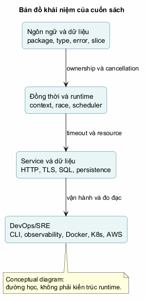

# Lời nói đầu

## Cuốn sách này dùng để làm gì?

Anh không cần thêm một danh sách cú pháp để chép lại. Điều khó hơn, và đáng
học hơn, là tự đi từ một yêu cầu mơ hồ đến một chương trình có thể giải thích,
kiểm thử, sửa và vận hành. Go phù hợp với hành trình ấy vì ngôn ngữ nhỏ vừa đủ
để ta nhìn rõ phần lớn quyết định, còn thư viện chuẩn lại chạm được vào file,
network, process và dịch vụ thật.

Em sẽ không coi việc đọc xong một chương là bằng chứng anh đã biết. Sau mỗi
khái niệm sẽ có lúc phải đoán kết quả, lần theo dữ liệu, đọc code lạ hoặc sửa
một lỗi có chủ đích. Nếu bí, hãy ghi giả thuyết trước khi chạy code. Một lần
đoán sai nhưng biết vì sao sai có giá trị hơn một lần nhận đáp án đúng từ AI.

Edition này được kiểm chứng với **Go 1.27.1** vào **20-09-2026**. Những phần
gắn với release hoặc implementation sẽ được gắn nguồn và mô tả đúng mức của
chúng: language specification không phải runtime implementation; một kết quả
benchmark trên máy em cũng không phải định luật tự nhiên.

## Cách dùng sách

Đọc phần giải thích, gõ lại ví dụ tối thiểu, rồi thay đổi một điều nhỏ trước
khi xem lời giải. Hãy để terminal phản biện suy nghĩ của mình. `go fmt`, `go
test` và `go vet` không phải nghi thức; chúng là ba câu hỏi khác nhau: code có
được trình bày theo chuẩn chung không, hành vi có giữ lời hứa không, và có lỗi
tĩnh đáng ngờ không?

Khi đi tới các phần DevOps/SRE, em sẽ luôn quay lại nền tảng. Một timeout HTTP
không chỉ là một con số; nó nối với `context`, socket, pool kết nối, retry và
ngân sách thời gian của request. Sơ đồ sau là bản đồ khái niệm của đường đi đó,
không phải một guarantee của Go runtime.

## Quy ước

Code block là code có thể gõ, trừ khi ghi rõ “minh họa”. Output terminal chỉ
được nêu khi có thể chạy hoặc khi được gắn nhãn minh họa. Với bài tập, dừng ở
đường ngăn trước khi đọc đáp án; đừng biến em thành nút autocomplete có chân.

