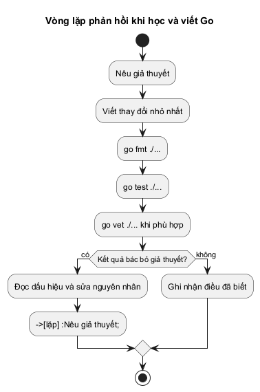

# Mở cửa vào Go

Bạn không cần thuộc ngay danh sách từ khóa để bắt đầu. Điều cần trước tiên là nhìn một tệp Go và hiểu: phần nào đặt tên cho chương trình, phần nào nạp công cụ từ thư viện, phần nào tạo ra giá trị, và nơi nào chỉ dẫn máy tính bắt đầu thực thi.

Cuốn sách này không đi bằng các mẩu bài học quá ngắn kiểu liệt kê tính năng rời rạc. Nó đi bằng những lần thay đổi cách nhìn: đọc được mã nguồn trước, nhìn được giá trị chuyển dịch trong bộ nhớ sau, rồi mới tiến dần đến những lúc nhiều goroutine, mạng, dữ liệu và môi trường vận hành thực tế khiến trực giác ban đầu không còn đủ. Khi một chủ đề cần một lỗi, một trace hay một thí nghiệm để thấy rõ bản chất, chương đó sẽ bắt đầu từ chính bằng chứng ấy.

## Chương trình Go nhỏ nhất có thể chạy được

Hãy bắt đầu bằng chương trình kinh điển nhất: in một dòng chữ ra màn hình console. Bạn tạo một tệp có tên `main.go`:

~~~go
package main

import "fmt"

func main() {
	fmt.Println("Chào bạn đến với thế giới Go!")
}
~~~

Để chạy chương trình này, bạn mở terminal tại thư mục chứa tệp và gõ lệnh:

~~~bash
go run main.go
~~~

Chương trình sẽ in ra dòng chữ: `Chào bạn đến với thế giới Go!`.

Nhưng đằng sau bốn dòng mã ngắn ngủi này là những nguyên lý nền tảng chi phối toàn bộ các hệ thống lớn viết bằng Go như Docker hay Kubernetes. Ta hãy cùng giải phẫu từng token để xây dựng mô hình tinh thần chuẩn xác ngay từ ngày đầu tiên.

## Bóc tách cú pháp nguyên tử của một chương trình

Trình biên dịch của Go (Go compiler) không đọc mã nguồn như một đoạn văn xuôi. Nó bóc tách tệp thành các **token** (từ vựng cú pháp), kiểm tra xem các token có xếp đúng ngữ pháp hay không, rồi mới tiến hành sinh mã máy.

1. **`package main`**:
   - `package`: Từ khóa mở đầu mọi tệp nguồn Go. Nó khai báo rằng các định danh trong tệp này thuộc về một gói mã nguồn có tên là `main`.
   - `main`: Tên gói đặc biệt được quy định trong Go Specification. Một chương trình hoàn chỉnh có thể chạy được (complete executable program) bắt buộc phải nằm trong gói có tên là `main` và phải chứa hàm `func main()`. Nếu thiếu một trong hai điều kiện này, trình biên dịch sẽ không tạo ra tệp thực thi độc lập (executable binary).

2. **`import "fmt"`**:
   - `import`: Từ khóa nạp gói thư viện bên ngoài vào tệp hiện tại.
   - `"fmt"`: Tên gói thư viện chuẩn chuyên trách định dạng nhập xuất dữ liệu (Format I/O). Đường dẫn gói được đặt trong cặp dấu ngoặc kép.

3. **`func main() { ... }`**:
   - `func`: Từ khóa định nghĩa một hàm.
   - `main`: Tên hàm khởi điểm của toàn bộ chương trình. Khi chương trình khởi chạy, quá trình khởi tạo diễn ra trước: các biến cấp gói được khởi tạo và các hàm `init()` (nếu có) được thực thi tuần tự theo đồ thị phụ thuộc. Sau khi giai đoạn khởi tạo hoàn tất, Go runtime mới chính thức gọi hàm `main()` để bắt đầu thực thi logic chính. Hàm `main` khởi điểm không nhận tham số và không trả về giá trị.
   - `()`: Cặp ngoặc đơn chứa danh sách tham số (ở đây để trống vì hàm không nhận tham số).
   - `{ ... }`: Khối lệnh bao bọc thân hàm. Các câu lệnh bên trong cặp ngoặc nhọn này sẽ được thực thi tuần tự từ trên xuống dưới.

4. **`fmt.Println(...)`**:
   - `fmt`: Tên của gói thư viện mà ta đã nạp ở phần `import`.
   - `.`: Toán tử truy cập định danh được xuất (exported identifier). Trong Go, mọi hàm hoặc biến bắt đầu bằng chữ cái in hoa (như `Println`) đều được xuất công khai để các gói khác sử dụng.
   - `Println`: Tên hàm in ra một chuỗi văn bản và tự động ngắt dòng ở cuối.
   - `"Chào bạn đến với thế giới Go!"`: Một chuỗi ký tự nguyên văn (string literal) biểu diễn dữ liệu cố định trong bộ nhớ.

## Biên dịch mã máy: `go run` khác `go build` thế nào?

Khi làm việc với Go, bạn sẽ thường xuyên sử dụng hai câu lệnh cốt lõi của bộ công cụ:

| Lệnh | Cơ chế thực hiện | Mục đích sử dụng |
| :--- | :--- | :--- |
| `go run main.go` | Biên dịch mã nguồn và chạy trực tiếp chương trình mà không tạo tệp nhị phân trong thư mục làm việc hiện tại. | Thử nghiệm nhanh, viết mã thử nghiệm, kiểm tra logic cục bộ. |
| `go build main.go` | Biên dịch toàn bộ mã nguồn thành tệp thực thi mã máy độc lập (`main.exe` trên Windows hoặc `main` trên Linux/macOS theo nền tảng mục tiêu). | Triển khai lên máy chủ, đóng gói container, chuyển giao sản phẩm. |

Tệp thực thi do `go build` tạo ra là mã máy thực thi (native machine code). Nó không cần máy ảo (như JVM trong Java) và không cần trình thông dịch (như Python). Tuy nhiên, một tệp nhị phân được biên dịch cho một hệ điều hành và kiến trúc CPU cụ thể (ví dụ Windows amd64) sẽ không thể chạy trực tiếp trên nền tảng khác (như Linux arm64) nếu không biên dịch chéo qua các biến môi trường `GOOS` và `GOARCH`, hoặc nếu chương trình phụ thuộc vào các thư viện C liên kết động (`cgo`). Khi biên dịch thuần Go tĩnh (`CGO_ENABLED=0`), bạn có thể sao chép tệp nhị phân sang môi trường đích tương ứng và chạy mà không cần cài đặt Go.

## Vòng lặp phản hồi: Dự đoán → Chạy → Giải thích

Học lập trình không phải là học thuộc lòng quy tắc, mà là rèn luyện phản xạ dự đoán hành vi của hệ thống. Trước khi gõ lệnh chạy, hãy tự hỏi: *"Nếu mình đổi một token thì điều gì sẽ xảy ra?"*

@figure Vòng lặp phản hồi giả thuyết - đo đạc - sửa mã nguồn. Trình biên dịch không phải là chướng ngại vật; trình biên dịch là người cộng tác phản hồi nhanh nhất cho dự đoán của bạn.

Hãy làm thử hai thí nghiệm nhỏ ngay bây giờ:

1. **Thí nghiệm 1:** Đổi `package main` thành `package hello`, rồi gõ `go run main.go`.
   - *Kết quả:* Compiler từ chối chạy và báo lỗi: `package command-line-arguments is not a main package`. Trình biên dịch khẳng định rằng nó không thể tìm thấy điểm khởi đầu của chương trình nếu gói không mang tên `main`.
2. **Thí nghiệm 2:** Thêm dòng `import "time"` nhưng không dùng hàm nào của gói `time` trong thân hàm `main`.
   - *Kết quả:* Compiler báo lỗi ngay tại lúc biên dịch: `imported and not used: "time"`.

Triết lý của Go là không khoan nhượng với mã thừa. Một gói thư viện được nạp mà không dùng (`imported and not used`), hoặc một biến cục bộ trong thân hàm được khai báo mà không đọc (`declared and not used`) đều dẫn đến lỗi biên dịch. (Ngược lại, các khai báo biến ở cấp gói không gây lỗi biên dịch nếu chưa được dùng). Sự khắt khe này giúp các dự án hàng triệu dòng mã của Go luôn tinh gọn, sạch sẽ và biên dịch với tốc độ chớp nhoáng.

> **Cách đọc cuốn sách này:** Đừng lướt qua các khối mã nguồn. Mỗi khi gặp một đoạn mã, hãy thử nói thành lời nó tạo ra giá trị gì, giá trị đó được lưu trữ ở đâu và điều gì sẽ thay đổi nếu ta thay thế một toán tử. Bây giờ, cánh cửa đã mở, ta hãy bước vào Chương 1 để học cách đọc và viết những chương trình Go thực thụ.
