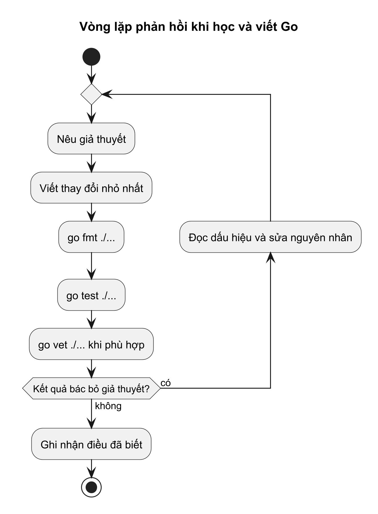

<!-- BOOK_ROLE: FOUNDATION_CORE -->

# Mở cửa vào Go

Một tệp nguồn Go chứa văn bản mã hóa UTF-8. Để chạy nó, bộ công cụ phải chọn các tệp thuộc chương trình, kiểm tra cú pháp và kiểu, biên dịch rồi liên kết thành tệp thực thi. Compiler có thể từ chối một phép cộng sai kiểu; nó không biết một endpoint có đúng với yêu cầu vận hành hay không. Ta sẽ dùng sự phân biệt ấy ngay từ chương trình đầu tiên.

Trước mắt, hãy đọc một tệp nhỏ và xác định ba điều: nó thuộc package nào, nó dùng tên nào từ package khác, và hàm nào sẽ chạy sau giai đoạn khởi tạo. Chưa cần biết allocator hay scheduler để trả lời đúng ba câu hỏi này.

## Chương trình tối thiểu và Luồng thực thi

Lưu chương trình sau trong tệp `main.go`:

~~~go
package main

import "fmt"

func main() {
	fmt.Println("he thong san sang")
}
~~~

Để chỉ thị bộ công cụ biên dịch và chạy tệp mã nguồn trên môi trường dòng lệnh, ta thực thi:

~~~bash
go run main.go
~~~

Chương trình ghi dòng `he thong san sang` ra đầu ra tiêu chuẩn, thường là terminal đang chạy lệnh. Dòng này xuất hiện khi `main` gọi `fmt.Println`, không phải khi compiler đọc string trong source.

## Đọc từng thành phần

`package` và `import` là khai báo; `func main()` khai báo một hàm; trong thân hàm có lời gọi `fmt.Println(...)`. Dấu ngoặc nhọn giới hạn thân hàm, còn dấu ngoặc kép tạo string literal. Những vai trò này giúp anh phân biệt phần mô tả chương trình với hành động xảy ra khi chương trình chạy.

### Khai báo gói và Không gian tên: `package main`

Mỗi tệp nguồn Go có một package clause trước các import và khai báo khác; comment có thể đứng trước nó. `package main` nói tệp này thuộc package tên `main`. Các khai báo cấp package được dùng chung giữa các tệp của package; tên import và biến cục bộ có phạm vi khác, sẽ được lần cụ thể ở Chương 1.

Theo đặc tả chính thức của Go, một chương trình hoàn chỉnh có thể thực thi độc lập (complete program) được tạo thành bằng cách liên kết một package không được package nào khác import, gọi là main package, cùng toàn bộ các package phụ thuộc bắc cầu của nó. Main package này bắt buộc phải có tên package là `main` và phải chứa một khai báo hàm `main` không nhận tham số và không trả về kết quả (`func main()`). Khai báo `package main` đơn thuần chưa đủ để sinh ra file thực thi nếu thiếu định nghĩa hàm `main`. Ngược lại, một package không phải `main` đại diện cho một thư viện; khi chạy lệnh `go build` trên một thư viện như vậy, bộ công cụ Go sẽ biên dịch mã nguồn để kiểm tra tính hợp lệ về cú pháp và kiểu dữ liệu nhưng mặc định không phát sinh tệp thực thi nào trên đĩa.

### Nhập thư viện chuẩn: `import "fmt"`

`import "fmt"` khai báo phụ thuộc vào package thư viện chuẩn có import path `"fmt"`. Trong tệp này, tên `fmt` cho phép truy cập các định danh được export của package, chẳng hạn `fmt.Println`. Import không phải câu lệnh gọi một hàm để “nạp công cụ” mỗi khi luồng thực thi đi qua nó.

Import thông thường phải được dùng. Để thấy ranh giới, xóa lời gọi `fmt.Println` nhưng giữ `import "fmt"`: compiler báo import không được sử dụng. Đổi thành `import . "fmt"` vẫn không làm chương trình đó hợp lệ. Dot import đưa các định danh được export vào phạm vi tệp để viết `Println(...)` không có tiền tố; nó không miễn quy tắc sử dụng import. Chỉ dạng `import _ "fmt"` trong phép thử này khai báo phụ thuộc chỉ để lấy hiệu ứng khởi tạo, không tạo tên package để gọi. Trong chương trình đầu tiên, cách viết thông thường `fmt.Println` giữ nguồn gốc tên rõ hơn.

### Hàm khởi điểm và khởi tạo package: `func main()`

Từ khóa `func` định nghĩa một hàm. Tên hàm `main` đại diện cho điểm nhập cuộc thực thi logic của người dùng. Hàm `main` khởi điểm không nhận bất kỳ tham số nào và không trả về giá trị.

Theo Go specification, chương trình khởi tạo các package trước khi gọi `main`. Package được import phải khởi tạo xong trước package phụ thuộc vào nó; trong mỗi package, khởi tạo biến cấp package đi trước các hàm `init`. Đó là contract anh dùng để dự đoán code người dùng. Việc toolchain chuẩn dựng scheduler và allocator trước đó là tầng triển khai runtime, không phải danh sách thao tác mà ngôn ngữ bắt mọi implementation phải làm theo. Chương 5 sẽ đào sâu thứ tự khởi tạo; các chương runtime mới lần đường bootstrap đã pin theo phiên bản.

### Truy xuất định danh công khai và Xuất dữ liệu: `fmt.Println`

Trong `fmt.Println`, `fmt` là tên package được import và `Println` là tên hàm được export của package đó. Dấu `.` nối hai tên trong một định danh có tiền tố package.

Một định danh được export khi bắt đầu bằng chữ hoa Unicode thuộc nhóm Lu và được khai báo ở cấp package, hoặc là tên field hay method. Vì vậy `Println` được dùng từ package khác; một biến cục bộ tên `Result` trong `main` không vì chữ hoa mà trở thành API. Theo contract của `fmt`, `Println` định dạng các argument, thêm newline và ghi ra standard output. Trong thư viện chuẩn Go 1.27.1, nó dùng `os.Stdout`; đường I/O tới OS phụ thuộc đối tượng đầu ra và nền tảng, không phải lời hứa về một file descriptor cụ thể của API `Println`.

## Biên dịch Mã máy: Phân biệt `go run` và `go build`

Bộ công cụ Go cung cấp hai lệnh cơ bản với vai trò rõ ràng trong vòng đời phát triển:

| Câu lệnh | Hợp đồng công cụ (Tool Contract) | Hành vi tệp trên đĩa | Bối cảnh sử dụng |
| :--- | :--- | :--- | :--- |
| `go run main.go` | Build rồi chạy main package được chỉ định. | Dùng executable tạm; không xuất binary vào working directory. | Thử nghiệm local. |
| `go build .` | Build package hiện tại; main package có thể tạo executable. | Với main package, mặc định xuất executable theo tên package/directory; `-o` chọn output khác. | Tạo artifact để phân phối. |

Trong lần gọi mặc định của toolchain Go 1.27.1, `go run` dùng tệp thực thi tạm và dọn work directory khi kết thúc; tùy chọn `-work` giữ lại thư mục đó để điều tra. Work directory khác `GOCACHE`, nơi toolchain giữ kết quả build có thể tái sử dụng giữa các lần gọi.

Tệp nhị phân sinh ra từ `go build` là mã máy thực thi trực tiếp trên vi kiến trúc CPU đích. Nó không chạy trên máy ảo như bytecode của Java và không dựa vào trình thông dịch như Python.
 

Tệp thực thi do toolchain chuẩn tạo ra có mã ứng dụng cùng phần hỗ trợ runtime cần cho chương trình, không phải toàn bộ source runtime hay mọi thư viện Go. Khả năng chạy trên máy khác còn phụ thuộc target OS, kiến trúc, cách liên kết và tài nguyên ngoài như tệp cấu hình. Chương 17 sẽ kiểm tra các phụ thuộc ấy trong container; ở đây build thành công chưa đủ để kết luận triển khai ở đâu cũng chạy.

## Vòng lặp Phản hồi: Giả thuyết, Đo đạc và Giải thích

Trước khi sửa một dòng, hãy dự đoán: thay đổi này làm chương trình bị từ chối trước khi chạy, hay vẫn chạy nhưng cho kết quả khác? Sau đó chạy phép thử nhỏ để so dự đoán với bằng chứng. Cách làm này hữu ích hơn việc chỉ ghi nhớ một thông báo lỗi.

@figure Vòng lặp phản hồi giả thuyết - đo đạc - sửa mã nguồn. Trình biên dịch không phải là chướng ngại vật; trình biên dịch là công cụ kiểm định tĩnh sớm nhất cho các dự đoán của bạn.

Bảng dưới đây minh họa ba thí nghiệm nhỏ về ranh giới kiểm tra tĩnh của Go compiler:

| Thí nghiệm kiểm chứng | Thao tác thay đổi mã nguồn | Phần chính của diagnostic | Cơ chế phân tích của Compiler |
| :--- | :--- | :--- | :--- |
| Đổi tên gói khởi điểm | Đổi `package main` thành `package worker`, sau đó chạy `go run main.go`. | `is not a main package` | Gói đích không thỏa mãn điều kiện tạo tệp thực thi độc lập; đây là kiểm tra của `go run`. |
| Import không sử dụng | Thêm dòng `import "time"` nhưng không tham chiếu định danh được export nào của `time`. | `"time" imported and not used` | Compiler kiểm tra việc sử dụng import; không phải chứng minh toàn bộ dependency graph đã tối thiểu. |
| Khai báo biến cục bộ thừa | Khai báo `workerID := 1` trong `main` nhưng không dùng. | `workerID declared and not used` | Kiểm tra usage của biến cục bộ; không phải chứng minh toàn bộ dead code đã được phát hiện. |

Compiler bắt một lớp lỗi cú pháp, kiểu và usage trước khi chạy; nó không chứng minh phần lớn lỗi vận hành đã bị loại bỏ. Deadline, quyền, resource budget và yêu cầu nghiệp vụ vẫn cần phép kiểm tra khác. Chương tiếp theo đi vào định danh, kiểu dữ liệu và phạm vi biến để anh biết chính xác compiler đang kiểm tra điều gì.
