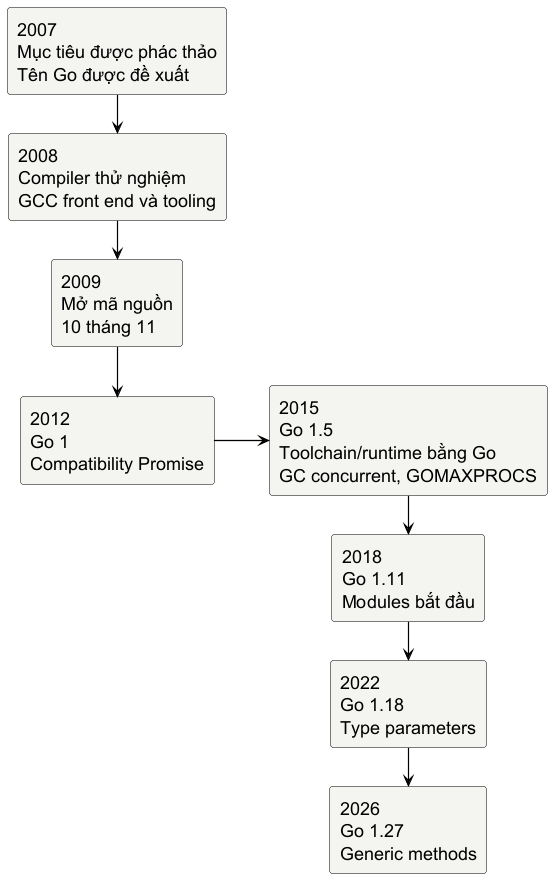
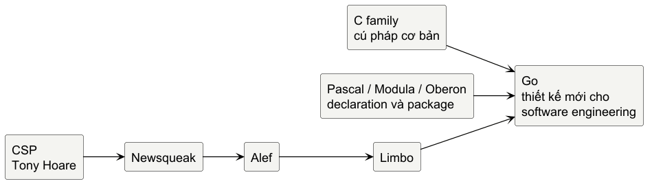

# Trước khi viết dòng Go đầu tiên

Go không bắt đầu bằng câu hỏi “cú pháp nào còn thiếu?”. Nó bắt đầu bằng một vấn đề kỹ thuật rất cụ thể: đến năm 2007, máy tính đã nhanh hơn rất nhiều, nhưng việc xây và sửa một hệ thống phần mềm lớn vẫn bị kéo chậm bởi ngôn ngữ, build system và lượng bookkeeping mà lập trình viên phải mang theo.

Ở Google khi ấy, Robert Griesemer, Rob Pike và Ken Thompson làm việc giữa những codebase rất lớn, hệ thống nối mạng và phần cứng đang chuyển mạnh sang nhiều lõi. C++ và Java là lựa chọn phổ biến cho server; chúng đem lại những năng lực quan trọng, đồng thời tạo ra một lượng phức tạp đáng kể trong quá trình build, quản lý dependency và tổ chức chương trình. Ở phía khác, các ngôn ngữ động cho cảm giác phát triển nhanh hơn, nhưng đánh đổi một phần kiểm tra kiểu và đặc tính thực thi. Bài toán không phải là chọn một phe thắng phe còn lại. Bài toán là liệu một ngôn ngữ có thể đem hiệu quả biên dịch, hiệu năng và an toàn kiểu vào cùng một quy trình làm việc nhẹ hơn hay không.

Ngày 21 tháng 9 năm 2007, ba người bắt đầu phác thảo mục tiêu của một ngôn ngữ mới trên bảng trắng. Vài ngày sau, ngày 25 tháng 9, Pike đề xuất cái tên Go. Thiết kế ban đầu diễn ra song song với công việc khác; đầu năm 2008, Thompson đã có compiler thử nghiệm sinh mã C để thử các ý tưởng. Đến giữa năm, dự án đủ rõ để hướng tới compiler dùng trong thực tế. Ian Lance Taylor bắt đầu GCC front end vào tháng 5 năm 2008; Russ Cox gia nhập cuối năm ấy và giúp đưa prototype, library cùng tooling tiến gần một ngôn ngữ có thể dùng.

@figure Dòng thời gian không kể mọi release. Nó chỉ giữ các bước làm thay đổi lời hứa của Go với người viết phần mềm: công khai, ổn định, triển khai lại nền tảng, dependency rõ ràng và generics tương thích ngược.

Go được mở mã nguồn ngày 10 tháng 11 năm 2009. Ba năm đầu là giai đoạn ngôn ngữ còn thay đổi nhanh: nhóm thiết kế và cộng đồng thử, bỏ, sửa, rồi mới chốt một nền tảng ổn định. Go 1 phát hành ngày 28 tháng 3 năm 2012. Từ đây, Go 1 Compatibility Promise trở thành một phần của văn hóa dự án: code nguồn viết cho Go 1 được kỳ vọng tiếp tục build và chạy trong các bản Go 1 sau, với các ngoại lệ được nêu rõ. Lời hứa ấy làm thay đổi cách một feature được cân nhắc. Một bổ sung không chỉ cần hữu ích hôm nay; nó phải sống được cùng hệ sinh thái trong nhiều năm.

Go 1.5 là một cột mốc về implementation. Toolchain compiler chuyển từ C sang Go, runtime cũng trở thành Go kèm một phần assembly. Garbage collector được thiết kế lại để chạy phần lớn công việc đồng thời với chương trình; scheduler cho phép giá trị mặc định của GOMAXPROCS chuyển từ 1 sang số logical CPU. Đó là những thay đổi nằm dưới mặt ngôn ngữ, nhưng chúng làm rõ mục tiêu ban đầu: một chương trình Go cần hợp với phần cứng nhiều lõi, không bắt người viết phải tự gánh mọi chi tiết của runtime.

Những thay đổi lớn sau đó cũng đi theo nhịp tiến hóa thay vì đập đi làm lại. Go 1.11 đưa modules vào như một lựa chọn thay cho GOPATH, với versioning và package distribution tích hợp vào toolchain; mô hình này dần thành cách quản lý dependency quen thuộc. Go 1.18, phát hành năm 2022, đưa type parameters vào ngôn ngữ. Đến Go 1.27 năm 2026, generic methods nối phần còn thiếu vào câu chuyện đó: method declaration có thể có type parameters riêng. “Go 2” vì thế không thành một nhánh rewrite tách rời; nhiều ý tưởng được thử, thảo luận và đưa dần vào dòng Go 1.x khi chứng minh được giá trị của chúng.

## Một dòng họ ý tưởng, không phải một cây sao chép

Go thuộc nhiều dòng tư tưởng cùng lúc. Cú pháp cơ bản đặt nó gần họ C. Cách nhìn về declaration, package và sự rõ ràng cấu trúc nhận ảnh hưởng đáng kể từ Pascal, Modula và Oberon. Concurrency có một lịch sử dài hơn: CSP của Tony Hoare đi qua Newsqueak, Alef và Limbo trước khi channels trở thành một phần của Go. Những đường này giải thích vì sao một số ý tưởng nghe quen, chứ không làm Go thành bản sao của bất kỳ ngôn ngữ nào trong số đó.

@figure Nhánh CSP giải thích lịch sử của channels; nhánh C và Pascal/Modula/Oberon giải thích những điểm xuất phát khác. Thiết kế cuối cùng vẫn được tạo cho bài toán engineering mà Go nhắm đến.

Một ngôn ngữ được sinh ra cho codebase lớn không chỉ cần syntax gọn. Nó cần một cách làm việc chung quanh syntax: build nhanh, formatter, package/dependency rõ, compiler cho phản hồi sớm và tooling có thể phân tích source. Đó là lý do Go thường được nói đến cùng gofmt, go test và go command, thay vì chỉ cùng một danh sách tính năng ngôn ngữ.

## Thiết kế bằng cách từ chối

Trong giai đoạn đầu, nhóm sáng lập đặt nặng đồng thuận: một feature chỉ đi tiếp khi cả nhóm thấy nó thực sự cần. Câu hỏi không dừng ở “có thể thêm gì?”, mà còn là “có thể bỏ gì để hệ thống vẫn đủ sức làm việc?”. Kết quả là một bộ trade-off có chủ ý.

> **Một điều đáng nhớ:** sự vắng mặt của inheritance hierarchy, operator overloading, exception-style error handling hay generics trong giai đoạn đầu không phải bản tuyên ngôn rằng các cơ chế ấy luôn tệ. Mỗi cơ chế có ích trong những ngữ cảnh khác. Go ưu tiên một mô hình dễ đọc, dễ phân tích, biên dịch nhanh và dễ giữ ổn định; cái giá là một số biểu đạt quen thuộc không có mặt hoặc đến muộn hơn.

Không có type hierarchy buộc người đọc đi tìm cây kế thừa; thay vào đó, interface và composition sẽ được nói kỹ khi ta đã đọc vững code cơ bản. Không có operator overloading giúp ý nghĩa của các toán tử ít thay đổi theo type. Error được trả như value thay vì theo đường exception-style. Và generics được hoãn lại cho đến khi thiết kế có thể đem giá trị đủ lớn so với độ phức tạp nó thêm vào type system và toolchain. Đây là các lựa chọn kỹ thuật có thể tranh luận, không phải luật đạo đức.

Nhìn lịch sử theo cách này giúp giải thích cảm giác đầu tiên khi đọc Go. Bạn sẽ thấy nhiều câu ngắn, ít keyword, declaration rõ và tooling hiện diện sớm. Những đặc điểm ấy là dấu vết của một mục tiêu: giảm ma sát cho người đang cùng người khác xây, đọc và sửa phần mềm lâu dài.

Sau gần hai thập kỷ tiến hóa, cách tốt nhất để gặp các quyết định ấy không phải đọc thêm lịch sử. Hãy đặt chúng trước mắt trong một tệp .go rất nhỏ.

## Ghi chú kiểm chứng

@references
1. Go Team. Frequently Asked Questions: Origins and Design. go.dev/doc/faq
2. Cox, Russ. Toward Go 2. 13 July 2017. go.dev/blog/toward-go2
3. Go Team. Go 1 and the Future of Go Programs. March 2012. go.dev/doc/go1compat
4. Gerrand, Andrew. Go 1.5 is released. 19 August 2015. go.dev/blog/go1.5
5. Bonventre, Andrew. Go 1.11 is released. 24 August 2018. go.dev/blog/go1.11
6. Go Team. Go 1.18 is released! 15 March 2022. go.dev/blog/go1.18
7. Go Team. Go 1.27 Release Notes. 2026. go.dev/doc/go1.27
