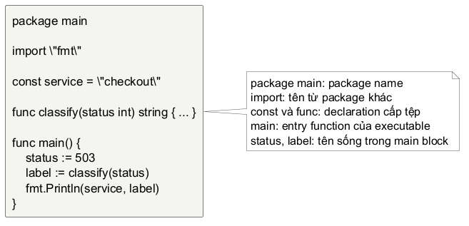
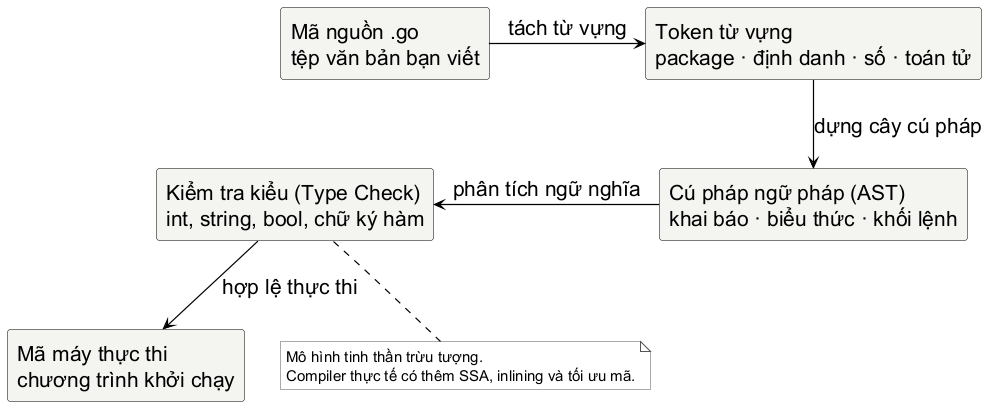
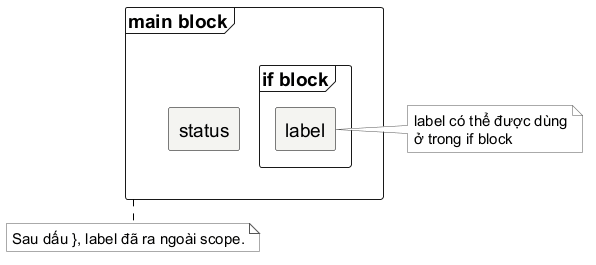

<!-- BOOK_ROLE: FOUNDATION_CORE -->

# Chương 1 — Đọc và viết một chương trình Go

Một tệp mã nguồn Go có cấu trúc hình học rất chặt chẽ: phần đầu xác định tệp thuộc về gói nào, vài dòng khai báo đặt ở cấp tệp, rồi đến các khối lệnh lồng nhau bằng những cặp ngoặc nhọn. Ta sẽ bắt đầu từ một chương trình thực tế: nó tiếp nhận một mã trạng thái HTTP của dịch vụ mạng, xác định tình trạng hoạt động và in ra thông báo chẩn đoán cho kỹ sư vận hành. Ví dụ này có đủ dữ liệu, phép tính, nhánh rẽ và thông điệp thực thi, nhưng không bị che lấp bởi sự phức tạp của một dự án lớn.

~~~go
package main

import "fmt"

const service = "checkout"

func classify(status int) string {
	if status >= 500 {
		return "failed"
	}
	return "healthy"
}

func main() {
	status := 503
	label := classify(status)
	fmt.Println(service, label)
}
~~~

<!-- pagebreak -->

@figure Giải phẫu trực quan cấu trúc một tệp nguồn Go. Tên gói, hàm khai báo và hàm khởi điểm có ranh giới rõ ràng.

Chưa cần đọc thuộc từng dòng. Hãy quan sát luồng chảy của chương trình qua ba câu hỏi: chương trình bắt đầu chạy ở đâu, giá trị nào được tạo ra trong bộ nhớ, và thông điệp nào được gửi ra màn hình? Câu trả lời lần lượt là: hàm `main`, giá trị nguyên văn `503` cùng chuỗi kết quả từ hàm `classify`, và lời gọi hàm in `fmt.Println`.

## Bản đồ cấu trúc của một tệp nguồn

Từ trên xuống dưới, tệp mã nguồn trên được chia thành bốn vùng không gian rõ rệt:

1. **Khai báo gói (`package`):** Xác định tệp thuộc về phân vùng mã nguồn nào.
2. **Nạp thư viện (`import`):** Cho phép tệp tham chiếu các hàm và kiểu dữ liệu từ các gói khác.
3. **Khai báo cấp tệp:** Nơi định nghĩa hằng số (`const`), biến cấp gói (`var`) hoặc các hàm tự viết (`func`).
4. **Hàm khởi điểm (`func main`):** Nơi chuỗi các câu lệnh bắt đầu được thực thi tuần tự sau khi hoàn tất khởi tạo.

| Dòng mã | Vai trò ngữ pháp | Tác dụng |
| :--- | :--- | :--- |
| `package main` | Khai báo gói | Đặt tệp vào gói `main` để tạo tệp thực thi. |
| `import "fmt"` | Khai báo nhập gói | Cho phép dùng các định danh được xuất từ gói `fmt`. |
| `const service = "checkout"` | Khai báo hằng | Gắn tên `service` với một hằng chuỗi bất biến. |
| `func classify(status int) string` | Khai báo hàm | Khai báo hàm nhận `int` và trả về `string`. |
| `status >= 500` | Biểu thức so sánh | So sánh giá trị và tạo ra giá trị `bool`. |
| `return "failed"` | Câu lệnh trả về | Kết thúc lời gọi hiện tại và trả chuỗi cho bên gọi. |
| `status := 503` | Khai báo biến ngắn | Khai báo biến `status` cục bộ và khởi tạo bằng `503`. |
| `fmt.Println(service, label)` | Lời gọi hàm | Triệu gọi hàm `Println` của gói `fmt` để xuất dữ liệu. |

Việc định vị chính xác vai trò ngữ pháp của từng dòng giúp ta đọc thông điệp lỗi của trình biên dịch một cách bình tĩnh: lỗi có thể nằm ở một biểu thức sai cú pháp, một phép so sánh cấn kiểu dữ liệu, hay một biến bị gọi ngoài phạm vi sống, thay vì cảm giác hoang mang rằng "toàn bộ chương trình đang bị hỏng".

@figure Mô hình các lớp xử lý của Go compiler. Trình biên dịch đọc tệp văn bản từ cấp độ từ vựng (token), dựng cây cú pháp trừu tượng (AST), kiểm tra chặt chẽ tính tương thích của kiểu dữ liệu, rồi mới sinh mã máy thực thi.

## Định danh và Từ khóa

Trong đoạn mã trên, `service`, `fmt`, `Println`, `classify`, `status` và `label` là các **định danh (identifiers)** — những cái tên do con người đặt ra để gọi một biến, một hàm, hoặc một gói mã nguồn.

Ngược lại, `package`, `import`, `const`, `func`, `if` và `return` là các **từ khóa (keywords)** của ngôn ngữ Go. Chúng là những từ dành riêng được quy định bất biến trong Go Specification; bạn không bao giờ được phép đặt tên biến hay tên hàm trùng với các từ khóa này.

Quy tắc đặt tên định danh trong Go rất nhất quán:
- Tên định danh gồm các chữ cái, chữ số và dấu gạch dưới `_`, bắt đầu bằng một chữ cái hoặc dấu gạch dưới.
- Quy ước đặt tên theo kiểu lạc đà: `MixedCaps` hoặc `camelCase` (ví dụ `readTimeout`, `workerPool`), không dùng kiểu gạch dưới `snake_case`.
- **Nguyên tắc xuất khẩu (Export rule):** Nếu một định danh bắt đầu bằng chữ cái in hoa (như `Println`), nó được công khai cho các gói khác bên ngoài nạp vào sử dụng. Nếu bắt đầu bằng chữ thường (như `classify`), nó là định danh nội bộ, chỉ được phép gọi bên trong nội bộ gói đó.

## Khai báo biến từ nguyên lý đầu tiên

Biến là một vùng lưu trữ dữ liệu được đặt tên trong chương trình. Trong Go, có bốn cách khai báo biến, phản ánh từng ý đồ sư phạm và bối cảnh kỹ thuật cụ thể:

### 1. Khai báo tường minh đầy đủ (`var`)

Cú pháp: `var <tên_biến> <kiểu_dữ_liệu> = <giá_trị>`

~~~go
var maxConnections int = 100
~~~

Ở đây, từ khóa `var` bắt đầu câu lệnh khai báo, `maxConnections` là tên định danh, `int` là kiểu dữ liệu số nguyên, và `100` là giá trị khởi tạo ban đầu. Cách viết này nói rõ mọi chi tiết cho compiler và người đọc, thường dùng khi ta muốn định hình kiểu dữ liệu một cách tuyệt đối không thể nhầm lẫn.

### 2. Khai báo với suy luận kiểu (Type Inference)

Nếu giá trị khởi tạo đã mang một kiểu dữ liệu rõ ràng, Go compiler tự suy luận ra kiểu của biến mà ta không cần ghi lại tên kiểu:

~~~go
// Trình biên dịch tự suy luận endpoint có kiểu string
var endpoint = "http://localhost:8080"
~~~

### 3. Khai báo không khởi tạo và Giá trị mặc định (Zero Value)

Trong nhiều ngôn ngữ như C hay C++, nếu bạn khai báo một biến mà không gán giá trị, ô nhớ đó có thể chứa dữ liệu rác ngẫu nhiên còn sót lại.

Go loại bỏ hoàn toàn nguy cơ này bằng cơ chế **Zero Value**: Mọi biến khi được khai báo mà không có giá trị khởi tạo sẽ tự động nhận giá trị mặc định của kiểu đó:

~~~go
var attemptCount int // attemptCount tự động nhận giá trị 0
var isReady bool      // isReady tự động nhận giá trị false
var errorMsg string   // errorMsg tự động nhận chuỗi rỗng ""
~~~

| Kiểu dữ liệu | Giá trị mặc định (Zero Value) | Ý nghĩa thực tế |
| :--- | :---: | :--- |
| Số nguyên (`int`, `int64`, `uint`...) | `0` | Số không |
| Số thực (`float32`, `float64`) | `0.0` | Số không dấu phẩy động |
| Logic (`bool`) | `false` | Trạng thái sai |
| Chuỗi ký tự (`string`) | `""` | Chuỗi rỗng độ dài bằng 0 (không phải `nil`) |
| Con trỏ, lát cắt, bản đồ, kênh, interface | `nil` | Chưa trỏ vào vùng dữ liệu nào |

### 4. Khai báo biến ngắn (`:=`)

Trong thân hàm, cú pháp khai báo ngắn `:=` là cách viết phổ biến nhất của lập trình viên Go:

~~~go
status := 503
~~~

Toán tử `:=` thực hiện cùng lúc ba nhiệm vụ: khai báo biến mới, suy luận kiểu dữ liệu từ vế phải, và gán giá trị khởi tạo.

> **Lưu ý bất biến:** Cú pháp `:=` **chỉ được phép sử dụng bên trong thân hàm**. Ở cấp độ tệp (ngoài thân hàm), mọi biến bắt buộc phải khai báo bằng từ khóa `var` hoặc `const`.

### Bảng so sánh các hình thức khai báo

| Cú pháp | Phạm vi sử dụng | Khi nào nên dùng? | Ví dụ |
| :--- | :--- | :--- | :--- |
| `name := value` | Chỉ trong thân hàm | Biến cục bộ ngắn gọn, khởi tạo trực tiếp | `count := 1` |
| `var name type` | Trong hàm và cấp tệp | Biến đón nhận giá trị sau (dùng zero value) | `var err error` |
| `var name = value` | Trong hàm và cấp tệp | Biến cấp gói hoặc suy luận kiểu rõ ràng | `var timeout = 30 * time.Second` |
| `var name type = value` | Trong hàm và cấp tệp | Chỉ định rõ kiểu giao diện (interface) | `var r io.Reader = &buf` |

### Phân biệt phép khai báo `:=` và phép gán `=`

Đây là điểm cần phân biệt rõ khi mới học Go:
- `:=` là **khai báo biến mới**: Giới thiệu định danh mới vào phạm vi hiện tại. Vế trái bắt buộc phải có ít nhất một biến mới.
- `=` là **phép gán lại giá trị**: Ghi giá trị mới vào biến đã tồn tại từ trước. Phép gán không tạo ra tên mới.

~~~go
count := 1  // Khai báo biến mới count và gán 1
count = 2   // Gán lại giá trị 2 cho biến count đã có

// count := 3
// Lỗi biên dịch: no new variables on left side of :=
~~~

## Phạm vi sống của biến (Scope và Shadowing)

Compiler phân tích câu lệnh `status := 503` thành ba thành phần cú pháp:

~~~text
status    :=    503
  │       │      │
định danh  toán tử  giá trị nguyên văn
~~~

Biến `status` sinh ra ở đâu thì sẽ sống trong khối lệnh bao bọc nó. Khối lệnh trong Go được giới hạn bởi cặp ngoặc nhọn `{ ... }`.

~~~go
func main() {
	status := 503
	if status >= 500 {
		label := "failed"
		fmt.Println("Bên trong if:", label)
	}
	// fmt.Println(label)
	// Lỗi biên dịch: undefined: label
}
~~~

Biến `label` được khai báo bên trong khối lệnh `if`, do đó tầm vực của nó chỉ giới hạn trong khối lệnh này. Khi ra khỏi dấu ngoặc nhọn đóng `}` của khối `if`, định danh `label` không còn hiệu lực trong tầm vực và không thể tham chiếu được nữa. Nếu cố tình gọi `fmt.Println(label)` ở ngoài, trình biên dịch sẽ từ chối biên dịch ngay lập tức với lỗi `undefined: label`.

@figure Trực quan hóa ranh giới phạm vi sống (scope) của biến. Biến khai báo trong khối lệnh con không thể được tham chiếu từ khối lệnh cha đứng bên ngoài.

### Nguy cơ che khuất biến (Variable Shadowing)

Khi bạn dùng toán tử khai báo ngắn `:=` bên trong một khối lệnh con với một tên trùng với biến ở khối lệnh cha, bạn tạo ra một biến mới hoàn toàn, che khuất (shadow) biến bên ngoài:

~~~go
func main() {
	retries := 0
	if retries == 0 {
		// Khai báo biến mới trong khối if, che khuất biến ngoài
		retries := 3
		fmt.Println("Trong if:", retries) // 3
	}
	// Biến ngoài vẫn giữ nguyên giá trị 0 ban đầu
	fmt.Println("Ngoài if:", retries) // 0
}
~~~

Lỗi này rất khó phát hiện bằng mắt thường vì cả hai dòng mã đều hợp lệ về cú pháp. Để cập nhật biến `retries` bên ngoài, trong khối `if` ta phải dùng phép gán thuần túy: `retries = 3`.

## Hệ thống Kiểu Dữ liệu Cơ bản

Go là ngôn ngữ định kiểu tĩnh (statically typed). Mọi giá trị đều có kiểu dữ liệu xác định được kiểm tra tại thời điểm biên dịch.

### 1. Số nguyên (Integer)
- `int` và `uint`: Kiểu số nguyên có dấu và không dấu phổ biến nhất. Kích thước bit của chúng phụ thuộc vào nền tảng: trên hệ thống 64-bit, `int` là 64 bit; trên hệ thống 32-bit, `int` là 32 bit.
- Các kiểu có kích thước cố định tường minh: `int8`, `int16`, `int32`, `int64`, và các bản không dấu tương ứng `uint8` (còn gọi là `byte`), `uint16`, `uint32`, `uint64`.
- `rune`: Đại diện cho một điểm mã Unicode (Unicode code point), thực chất là một bí danh (alias) của kiểu `int32`.

### 2. Số thực (Floating-point)
- `float32` (độ chính xác đơn) và `float64` (độ chính xác kép).
- Lập trình viên Go hầu như luôn dùng `float64` cho tính toán số thực để đảm bảo độ chính xác theo chuẩn IEEE-754.

> **Cảnh báo vận hành:** Không bao giờ dùng toán tử so sánh bằng tuyệt đối `==` trên số thực vì sai số làm tròn số học nhị phân (rounding error). Thay vào đó, hãy kiểm tra xem khoảng cách chênh lệch tuyệt đối có nhỏ hơn một ngưỡng sai số cho phép ($\epsilon$) hay không.

### 3. Logic (Boolean)
- Kiểu `bool` chỉ có hai giá trị: `true` hoặc `false`.
- Các toán tử logic: `&&` (VÀ), `||` (HOẶC), `!` (PHỦ ĐỊNH).

### 4. Chuỗi ký tự (String)
- Kiểu `string` trong Go là một dãy byte bất biến (immutable sequence of bytes). Mặc dù văn bản nguồn Go được quy ước mã hóa theo chuẩn UTF-8, bản thân một `string` có thể chứa các byte tùy ý, không bắt buộc phải luôn là chuỗi UTF-8 hợp lệ.
- Vì là bất biến, bạn không thể thay đổi từng byte của chuỗi sau khi nó đã được tạo ra. Muốn biến đổi dữ liệu, ta cần tạo một chuỗi mới hoặc chuyển sang lát cắt `[]byte`.

### 5. Chuyển đổi kiểu tường minh (Type Conversion)

Trong Go, **các biến có kiểu định danh khác nhau không tự động chuyển đổi ngầm định**. Một biến kiểu `int` và một biến kiểu `int64` là hai kiểu dữ liệu khác biệt; trình biên dịch sẽ từ chối phép cộng giữa chúng trừ khi bạn chuyển đổi tường minh:

~~~go
var a int = 10
var b int64 = 20
// var c int64 = a + b
// Lỗi biên dịch:
// invalid operation: a + b (mismatched types int and int64)
// Chuyển đổi tường minh trước khi cộng:
var c int64 = int64(a) + b
~~~

(Ngoại lệ là các hằng số chưa định kiểu — *untyped constants* — như số nguyên văn `500`, có thể gán linh hoạt cho bất kỳ kiểu số nào chứa được giá trị đó).

Cú pháp chuyển đổi kiểu có dạng: `T(v)` trong đó `T` là kiểu đích và `v` là giá trị cần chuyển.

## Toán tử và Biểu thức

Biểu thức là sự kết hợp giữa các giá trị và các toán tử để tính toán sinh ra một giá trị mới.

- **Toán tử số học:** `+` (cộng), `-` (trừ), `*` (nhân), `/` (chia), `%` (chia lấy phần dư).
  * *Chú ý:* Phép chia giữa hai số nguyên `5 / 2` sẽ cho kết quả là `2` (phần thập phân bị cắt cụt). Muốn có kết quả `2.5`, ít nhất một vế phải là số thực: `5.0 / 2`.
- **Toán tử so sánh:** `==` (bằng), `!=` (khác), `<` (nhỏ hơn), `<=` (nhỏ hơn hoặc bằng), `>` (lớn hơn), `>=` (lớn hơn hoặc bằng). Kết quả luôn là `bool`.
- **Toán tử tăng giảm:** `count++` và `count--`.
  * *Quy tắc Go:* Trong Go, `count++` là một **câu lệnh**, không phải là một **biểu thức**. Vì vậy, bạn **không được phép** viết `x = count++` hay `++count`. Đây là thiết kế có chủ đích của tác giả Go nhằm triệt tiêu hoàn toàn những lỗi khó hiểu sinh ra từ side-effects.

## Bộ ba xuất dữ liệu và Bảng định dạng

Thư viện chuẩn `fmt` cung cấp ba hàm in ấn chủ đạo:
1. `fmt.Print(...)`: In các đối số nối tiếp nhau ra stdout, không tự thêm khoảng trắng và không tự xuống dòng.
2. `fmt.Println(...)`: In các đối số ra stdout, tự động thêm dấu cách giữa các đối số và luôn thêm ký tự xuống dòng ở cuối.
3. `fmt.Printf(format, ...)`: In dữ liệu theo chuỗi định dạng (format string) với các động từ định dạng (formatting verbs) bắt đầu bằng ký tự `%`.

~~~go
name := "gateway"
port := 8080
fmt.Printf("Dịch vụ %s tại cổng %d\n", name, port)
~~~

| Ký hiệu Verb | Ý nghĩa | Ví dụ áp dụng | Kết quả hiển thị |
| :---: | :--- | :--- | :--- |
| `%v` | Giá trị mặc định theo kiểu dữ liệu | `fmt.Printf("%v", 503)` | `503` |
| `%+v` | In kèm tên trường của cấu trúc (struct) | `fmt.Printf("%+v", s)` | `{Name:checkout Port:80}` |
| `%#v` | Biểu diễn theo cú pháp Go | `fmt.Printf("%#v", "text")` | `"text"` |
| `%T` | In ra tên kiểu dữ liệu của biến | `fmt.Printf("%T", 503)` | `int` |
| `%t` | In giá trị logic boolean (`true`/`false`) | `fmt.Printf("%t", true)` | `true` |
| `%d` | In số nguyên hệ thập phân (cơ số 10) | `fmt.Printf("%d", 255)` | `255` |
| `%x` / `%X` | In số nguyên dưới dạng hệ thập lục phân (hex) | `fmt.Printf("%x", 255)` | `ff` |
| `%f` | In số thực dấu phẩy động | `fmt.Printf("%.2f", 3.14159)` | `3.14` |
| `%s` | In các byte dưới dạng chuỗi ký tự | `fmt.Printf("%s", "ok")` | `ok` |
| `%q` | In chuỗi có cặp dấu ngoặc kép an toàn | `fmt.Printf("%q", "ok")` | `"ok"` |
| `%p` | In địa chỉ con trỏ dưới dạng địa chỉ ô nhớ | `fmt.Printf("%p", &status)` | `0xc000014088` |

## Điều khiển luồng: `if`, `switch` và `for`

### 1. Rẽ nhánh có điều kiện với `if / else`

Cú pháp `if` trong Go không cần cặp ngoặc đơn `()` bao quanh điều kiện, nhưng **bắt buộc phải có cặp ngoặc nhọn `{}`** bao quanh thân khối lệnh, kể cả khi thân lệnh chỉ có một dòng:

~~~go
if status >= 500 {
	fmt.Println("Lỗi máy chủ nội bộ")
} else if status >= 400 {
	fmt.Println("Lỗi phía máy khách")
} else {
	fmt.Println("Yêu cầu thành công")
}
~~~

Đặc biệt, Go cho phép đặt một **câu lệnh khởi tạo ngắn** đứng ngay trước mệnh đề điều kiện, ngăn cách bởi dấu chấm phẩy `;`:

~~~go
if err := executeCheck(); err != nil {
	fmt.Println("Kiểm tra thất bại:", err)
}
~~~

Biến `err` được khai báo trong câu lệnh ngắn này sẽ chỉ sống trong phạm vi khối lệnh `if` và các khối `else` đi kèm. Khi khối `if/else` kết thúc, biến `err` tự động biến mất, giúp mã nguồn không bị ô nhiễm định danh tạm.

### 2. Lựa chọn rời rạc với `switch`

Cấu trúc `switch` trong Go linh hoạt hơn nhiều so với các ngôn ngữ họ C:
- Không cần viết lệnh `break` ở cuối mỗi case. Khi một case thỏa mãn, Go thực thi xong khối lệnh của case đó rồi tự động thoát ra khỏi `switch`.
- Nếu thực sự muốn chạy tiếp xuống case bên dưới, bạn phải dùng từ khóa `fallthrough` một cách tường minh.
- Có thể gom nhiều giá trị vào cùng một case: `case 200, 201, 204:`.

~~~go
func statusCategory(code int) string {
	switch code {
	case 200, 201:
		return "Thành công"
	case 404:
		return "Không tìm thấy"
	case 500, 503:
		return "Lỗi hạ tầng"
	default:
		return "Không xác định"
	}
}
~~~

Ngoài ra, Go hỗ trợ **switch không biểu thức** (`switch {}`), trong đó mỗi case là một biểu thức logic độc lập, giúp thay thế các chuỗi `if / else if` phức tạp:

~~~go
switch {
case status >= 500:
	return "critical"
case status >= 400:
	return "warning"
default:
	return "normal"
}
~~~

### 3. Vòng lặp duy nhất: `for`

Go là ngôn ngữ tinh gọn: **Go chỉ có một từ khóa lặp duy nhất là `for`**. Không có `while`, không có `do-while`. Mọi dạng vòng lặp đều được thể hiện qua `for`:

#### Dạng 1: Vòng lặp ba thành phần kinh điển
~~~go
for i := 0; i < 5; i++ {
	fmt.Println("Lần thử thứ:", i)
}
~~~

#### Dạng 2: Vòng lặp điều kiện (tương đương `while`)
~~~go
retries := 0
for retries < 3 {
	fmt.Println("Đang thử lại...")
	retries++
}
~~~

#### Dạng 3: Vòng lặp vô hạn
~~~go
for {
	// Lặp cho đến khi gặp lệnh break hoặc return
	if isJobFinished() {
		break
	}
}
~~~

#### Dạng 4: Lặp qua tập hợp dữ liệu với `for range`
~~~go
codes := []int{200, 404, 500}
for index, code := range codes {
	fmt.Printf("Chỉ số: %d, Mã trạng thái: %d\n", index, code)
}
~~~

Nếu không dùng đến chỉ số `index`, ta dùng dấu gạch dưới `_` để thông báo cho trình biên dịch bỏ qua:

~~~go
for _, code := range codes {
	fmt.Println("Mã:", code)
}
~~~

> **Nguyên tắc bộ nhớ:** Khi duyệt mảng hoặc lát cắt qua `for range`, biến phần tử thứ hai (`code`) là một bản sao giá trị của phần tử tại thời điểm duyệt. Thay đổi biến `code` không làm thay đổi phần tử trong mảng gốc.

## Hàm từ nguyên lý đầu tiên

Hàm là một khối mã độc lập được đặt tên để thực hiện một nhiệm vụ cụ thể, có thể tái sử dụng nhiều lần từ các nơi khác nhau trong chương trình.

### Tham số hình thức và Đối số thực tế

- **Tham số (parameters):** Biến được khai báo trong chữ ký hàm. Ví dụ trong `func classify(status int)`, biến `status` là tham số hình thức.
- **Đối số (arguments):** Giá trị cụ thể được truyền vào hàm khi triệu gọi. Ví dụ trong `classify(503)`, số `503` là đối số thực tế.

Khi một hàm được triệu gọi, các biểu thức đối số được đánh giá, rồi giá trị kết quả được gán cho các tham số tương ứng. Go tuân thủ chặt chẽ ngữ nghĩa truyền theo giá trị (*pass by value*): hàm luôn nhận bản sao giá trị của đối số. Tuy nhiên, sao chép giá trị không đồng nghĩa với việc sao chép toàn bộ dữ liệu nền: nếu giá trị đó là một con trỏ, một slice descriptor hay một map handle, bản sao ấy vẫn mở đường truy cập đến cùng một cấu trúc dữ liệu dùng chung.

### Trả về nhiều giá trị

Go hỗ trợ hàm trả về cùng lúc nhiều giá trị độc lập. Đây là nền tảng cho quy ước xử lý lỗi kinh điển của Go: trả về cặp giá trị `(kết quả, lỗi)`:

~~~go
func divide(a, b int) (int, error) {
	if b == 0 {
		return 0, fmt.Errorf("không thể chia cho số không")
	}
	return a / b, nil
}
~~~

Nơi gọi sẽ hứng đồng thời hai giá trị:

~~~go
result, err := divide(10, 2)
if err != nil {
	fmt.Println("Thất bại:", err)
	return
}
fmt.Println("Kết quả:", result)
~~~

### Hàm đệ quy

Hàm đệ quy là hàm tự gọi lại chính nó để giải quyết bài toán nhỏ hơn cùng cấu trúc. Mọi hàm đệ quy bắt buộc phải có điều kiện dừng (base case) rõ ràng, nếu không hàm sẽ tự gọi vô tận và làm cạn kiệt tài nguyên bộ nhớ:

~~~go
func factorial(n int) int {
	// Điều kiện dừng (Base case)
	if n <= 1 {
		return 1
	}
	// Bước đệ quy
	return n * factorial(n-1)
}
~~~

## Nhập môn Con trỏ (Pointers)

Khi một biến được khai báo, nó đại diện cho một vị trí lưu trữ mang kiểu dữ liệu xác định. Một con trỏ (pointer) là một giá trị chứa địa chỉ của một biến khác.

Go cung cấp hai toán tử nền tảng để làm việc với con trỏ:
1. **Toán tử lấy địa chỉ (`&`):** Đặt trước tên biến để trích xuất địa chỉ ô nhớ của biến đó.
2. **Toán tử giải tham chiếu (`*`):** Đặt trước biến con trỏ để truy cập hoặc ghi đè giá trị tại vị trí mà con trỏ đang trỏ tới.

~~~go
func main() {
	x := 100
	// p là con trỏ kiểu *int, chứa địa chỉ của x
	var p *int = &x

	fmt.Println("Giá trị x:", x)           // 100
	fmt.Printf("Địa chỉ &x: %p\n", &x)     // 0xc000014088
	fmt.Printf("Con trỏ p:  %p\n", p)      // 0xc000014088
	fmt.Println("Giá trị *p:", *p)         // 100

	*p = 200 // Ghi đè giá trị tại ô nhớ p trỏ tới
	fmt.Println("Giá trị mới x:", x)       // 200
}
~~~

Con trỏ cho phép các hàm khác nhau cùng thao tác và biến đổi một vùng dữ liệu chung mà không cần sao chép toàn bộ khối dữ liệu đó trong bộ nhớ. Ta sẽ đi sâu vào ứng dụng thực tế của con trỏ khi xử lý cấu trúc dữ liệu và phương thức ở Chương 3.

## Đọc thông điệp biên dịch như một người cộng tác

Trong quá trình học và làm việc với Go, bạn sẽ liên tục nhận phản hồi từ trình biên dịch. Đừng hoảng sợ khi nhìn thấy thông báo lỗi. Hãy xem compiler như một người cộng sự nghiêm khắc kiểm tra chất lượng mã nguồn trước khi nó kịp gây ra sự cố trên môi trường vận hành.

Ta hãy thử nghiệm ba tình huống lỗi kinh điển nhất:

| Tình huống | Hành động tạo lỗi có chủ ý | Dự đoán nguyên nhân ngữ pháp |
| :--- | :--- | :--- |
| **Trường hợp A** | Gán `status = 503` khi chưa từng khai báo biến `status`. | Lỗi định danh: Tên biến chưa được giới thiệu vào scope. |
| **Trường hợp B** | Khai báo hàm nhận tham số kiểu `string` nhưng nơi gọi lại truyền vào biến kiểu `int`. | Lỗi xung đột kiểu: Đối số thực tế không khớp với chữ ký hàm. |
| **Trường hợp C** | Cố tình gọi `fmt.Println(label)` ở ngoài khối lệnh `if`. | Lỗi tầm vực: Định danh `label` không tồn tại ngoài khối lệnh `if`. |

Khi biên dịch các trường hợp trên với Go, compiler đưa ra phản hồi chính xác đến từng dòng và từng vị trí:

~~~text
[trường-hợp-a]
.\main.go:4:2: undefined: status

[trường-hợp-b]
.\main.go:9:15: cannot use status (variable of type int) as
    string value in argument to classify

[trường-hợp-c]
.\main.go:8:6: undefined: label
~~~

- Ở **Trường hợp A**, trình biên dịch thông báo `undefined: status`: Tên biến chưa từng được khai báo trong tầm vực.
- Ở **Trường hợp B**, thông báo `cannot use status (variable of type int) as string value in argument to classify`: Hệ thống kiểu tĩnh ngăn ngừa truyền sai kiểu dữ liệu vào hàm.
- Ở **Trường hợp C**, thông báo `undefined: label`: Định danh `label` không còn hiệu lực ngoài khối lệnh `if`.

> **Bài tập nhỏ cuối chương:** Bạn hãy viết một hàm `severity(code int) string` sử dụng `switch` để phân loại các mã HTTP: mã từ 500 trở lên là `"critical"`, từ 400 đến 499 là `"warning"`, còn lại là `"normal"`. Sau đó, trong hàm `main`, hãy dùng vòng lặp `for range` duyệt qua một danh sách mã `[]int{200, 404, 503}` và in kết quả ra màn hình bằng `fmt.Printf` với verb `%d` và `%s`.

Đến đây, bạn đã nắm vững toàn bộ những viên gạch nền tảng nhỏ nhất của ngôn ngữ Go: từ cấu trúc tệp, từ khóa, định danh, biến, giá trị mặc định, kiểu dữ liệu, biểu thức, câu lệnh điều khiển, hàm, cho đến con trỏ sơ khởi. Bạn đã có đủ công cụ ngữ pháp để đọc và hiểu hầu hết các tệp mã nguồn Go cơ bản. Ở chương tiếp theo, ta sẽ khám phá cấu trúc dữ liệu quan trọng nhất và cũng hay gây hiểu nhầm nhất trong Go: lát cắt (slice) và cơ chế chia sẻ bộ nhớ nền.
