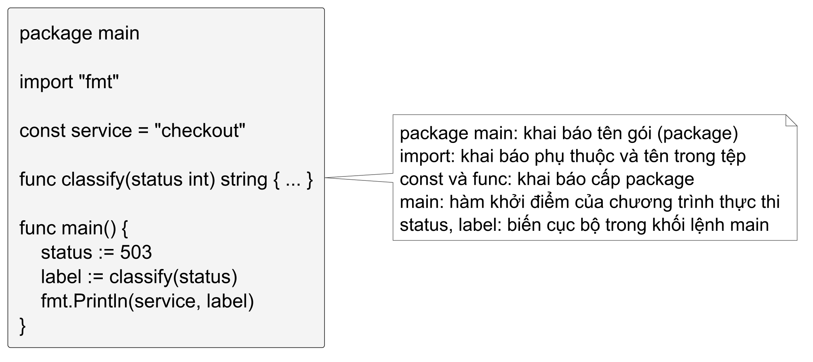
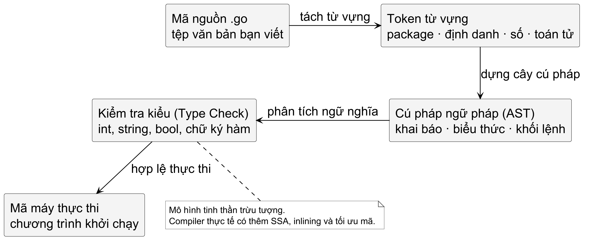
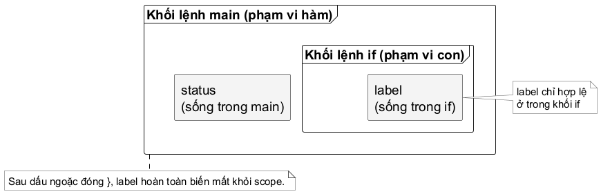

<!-- BOOK_ROLE: FOUNDATION_CORE -->

# Chương 1 — Đọc và viết một chương trình Go

Chương trình dưới đây dùng một mã trạng thái HTTP đã có sẵn để tạo nhãn rồi in kết quả. Nó chưa gọi mạng, và quy tắc `status >= 500` chỉ là policy của ví dụ, không phải định nghĩa đầy đủ về sức khỏe dịch vụ. Ta sẽ lần từ từng tên và dấu trong source tới giá trị được tạo, nhánh được chọn và dữ liệu đi ra terminal.

~~~go
package main

import "fmt"

const service = "checkout"

func classify(status int) string {
	if status >= 500 {
		return "failed"
	}
	return "healthy"
}

func main() {
	status := 503
	label := classify(status)
	fmt.Println(service, label)
}
~~~

## Chạy chương trình trong một module nhỏ

Lưu đoạn mã trên thành `main.go` trong một thư mục trống. Trước khi chạy, tạo một module cục bộ cho thư mục ấy. Lệnh `go mod init` tạo tệp `go.mod` và khai báo module path; một module quản lý một hoặc nhiều package cùng các dependency của chúng. Module chưa phải là một package, cũng không có nghĩa mã phải được công bố lên mạng. Ở bài đầu này, chỉ cần biết thư mục đang thuộc một module và công cụ Go dùng `go.mod` để xác định module ấy cùng các dependency khi cần.

~~~powershell
go mod init example.com/first-go
go run .
~~~

Lệnh đầu tạo `go.mod`; `example.com/first-go` là tên định danh minh họa, không phải một địa chỉ mà anh phải sở hữu. Lệnh sau yêu cầu Go xây package `main` trong thư mục hiện tại rồi chạy executable tạm. Ta sẽ trở lại module, đường dẫn import, đồ thị phụ thuộc và cách một package trở thành ranh giới ở Chương 5. Hiện tại chỉ cần giữ một mốc thực hành: mỗi lab nằm trong một thư mục có `go.mod` riêng, và terminal phải đứng đúng thư mục của lab trước khi chạy lệnh được ghi trong bài.

@figure Giải phẫu trực quan cấu trúc một tệp nguồn Go. Tên gói, các khai báo cấp tệp và hàm khởi điểm có ranh giới rõ ràng.

Để thấu suốt chương trình trên, ta lần theo luồng chuyển dịch trạng thái qua ba câu hỏi: chương trình bắt đầu thực thi ở đâu, giá trị nào được tạo ra, và thông điệp nào được gửi ra ngoài? Câu trả lời lần lượt là: điểm khởi đầu nằm tại hàm `main`, giá trị số nguyên `503` được gán vào biến `status` rồi truyền qua hàm `classify` theo ngữ nghĩa giá trị để nhận lại chuỗi phân loại, và cuối cùng lời gọi hàm `fmt.Println` gửi dữ liệu qua thiết bị đầu ra tiêu chuẩn.

## Bản đồ Cấu trúc của một Tệp Nguồn

Từ trên xuống dưới, tệp mã nguồn được phân chia thành bốn vùng không gian cú pháp rõ rệt:

Khai báo gói (`package`): Xác định không gian tên và đơn vị biên dịch mà tệp trực thuộc.

Khai báo import (`import`): Đặt phụ thuộc và tên dùng để tham chiếu các định danh được export từ package khác.

Khai báo cấp tệp: Không gian định nghĩa hằng số (`const`), biến toàn cục của gói (`var`), hoặc các kiểu dữ liệu và hàm dùng chung (`func`).

Hàm khởi điểm (`func main`): Điểm neo mà Go runtime kích hoạt để bắt đầu thực thi logic sau khi hoàn tất giai đoạn khởi tạo môi trường.

| Dòng mã | Vai trò ngữ pháp | Tác động thực thi |
| :--- | :--- | :--- |
| `package main` | Khai báo gói | Báo hiệu cho compiler tạo tệp thực thi độc lập khi có hàm `main`. |
| `import "fmt"` | Khai báo import | Đặt tên `fmt` trong phạm vi tệp; không phải một thao tác I/O lúc chạy. |
| `const service = "checkout"` | Khai báo hằng | Gắn định danh `service` với chuỗi bất biến tại lúc biên dịch. |
| `func classify(status int) string` | Khai báo hàm | Xác lập chữ ký hàm nhận `int` và trả về `string`. |
| `status >= 500` | Biểu thức so sánh | Đánh giá điều kiện nhị phân, sinh giá trị `bool`. |
| `return "failed"` | Câu lệnh trả về | Trả giá trị chuỗi cho bên gọi và chuyển giao quyền điều khiển. |
| `status := 503` | Khai báo biến ngắn | Giới thiệu biến `status` mang kiểu `int` và gán giá trị 503. |
| `fmt.Println(service, label)` | Lời gọi hàm | Định dạng các argument rồi ghi ra standard output. |

Việc định vị chính xác vai trò ngữ pháp của từng dòng giúp ta đọc thông điệp lỗi của trình biên dịch một cách bình tĩnh: lỗi có thể bắt nguồn từ một biểu thức sai cú pháp, một phép so sánh cấn kiểu dữ liệu, hay một biến bị gọi ngoài phạm vi sống, thay vì cảm giác hoang mang rằng toàn bộ chương trình đang bị hỏng.

@figure Mô hình các lớp xử lý của Go compiler. Trình biên dịch đọc tệp văn bản từ cấp độ từ vựng (token), dựng cây cú pháp trừu tượng (AST), kiểm tra chặt chẽ tính tương thích của kiểu dữ liệu, rồi mới sinh mã máy thực thi.

## Quan hệ Giữa Khai báo, Biểu thức, Câu lệnh, Kiểu và Giá trị

Để xây dựng một mô hình tư duy vững chắc, ta cần phân biệt rạch ròi các khái niệm nền tảng thường bị đánh đồng trong lập trình:

Khai báo: Giới thiệu một tên và thứ mà tên ấy chỉ tới, như biến, hằng số, kiểu hoặc hàm, trong một phạm vi xác định. Với `const service = "checkout"`, tên `service` chỉ tới một hằng số; nó không phải một câu gán lại biến mỗi lần `main` chạy.

Biểu thức (Expression): Kết hợp toán hạng và toán tử để tính giá trị. Ví dụ `status >= 500` cho một giá trị kiểu `bool`. Lời gọi hàm cũng là biểu thức: có thể trả một hoặc nhiều kết quả; lời gọi không trả kết quả được dùng như câu lệnh. Ngữ cảnh quyết định cách dùng các kết quả ấy. Đánh giá biểu thức có thể gọi hàm làm thay đổi dữ liệu hoặc gây panic, nên không đồng nghĩa với một phép tính không có tác động phụ.

Câu lệnh (Statement): Là đơn vị thực thi hoàn chỉnh chỉ dẫn máy tính thực hiện một hành động cụ thể, chẳng hạn như rẽ nhánh điều kiện (`if`), lặp vòng (`for`), gán giá trị (`=`), hoặc trả về từ hàm (`return`). Câu lệnh cấu thành luồng chảy động của chương trình.

Kiểu dữ liệu (Type): Là định nghĩa trừu tượng quy định tập hợp các giá trị hợp lệ và tập hợp các phép toán được phép thực hiện trên các giá trị đó. Kiểu cho compiler biết các operation hợp lệ; representation vật lý, kích thước và cách mã máy dùng giá trị còn phụ thuộc implementation và kiến trúc.

Giá trị (Value): Là dữ liệu hoặc kết quả cụ thể thuộc một kiểu. Kiểu quyết định những phép toán có nghĩa đối với giá trị đó. Việc trình biên dịch có phải hiện thực giá trị trong thanh ghi, bộ nhớ hay loại bỏ chỗ lưu trữ khi tối ưu là quyết định triển khai, không phải một phần của định nghĩa giá trị ở tầng ngôn ngữ.

Lời gọi hàm (Function call): Là cơ chế chuyển giao quyền thực thi từ hàm gọi sang hàm được gọi, kèm theo việc đánh giá các biểu thức đối số và truyền các giá trị đó theo ngữ nghĩa truyền giá trị của Go. Một Go compiler có thể inline thân hàm hoặc truyền tham số qua thanh ghi/ngăn xếp theo ABI nội bộ, nhưng đó là quyết định triển khai cần được đo hay quan sát ở đúng toolchain, không phải contract của source code.

## Định danh và Từ khóa

Trong ví dụ trên, `service`, `fmt`, `Println`, `classify`, `status` và `label` là các định danh (identifiers) — những cái tên do lập trình viên hoặc thư viện quy ước để đại diện cho biến, kiểu hoặc hàm. Ngược lại, `package`, `import`, `const`, `func`, `if` và `return` là các từ khóa (keywords) bất biến của ngôn ngữ Go, được dành riêng cho trình phân tích cú pháp.

Định danh bắt đầu bằng chữ cái Unicode hoặc `_`, theo sau bởi chữ cái Unicode, chữ số Unicode hoặc `_`. Quy ước Go thường dùng `MixedCaps` hay `mixedCaps` cho tên nhiều từ. `snake_case` vẫn hợp lệ về cú pháp; chọn cách đặt tên nhất quán với API và code xung quanh, không coi convention là lệnh cấm của compiler.

Export cần hai điều kiện: tên bắt đầu bằng chữ hoa Unicode thuộc nhóm Lu, và tên được khai báo ở cấp package hoặc là tên field hay method. `Println` thỏa cả hai; `classify` không được export. Biến cục bộ `Label` trong thân hàm vẫn chỉ là biến cục bộ, không trở thành API vì viết hoa.

## Khai báo Biến và Khởi tạo Bộ nhớ

Biến giữ một giá trị thuộc kiểu xác định. Bốn cách viết dưới đây khác nhau ở việc ghi kiểu và giá trị khởi tạo, không quyết định biến nằm trên stack hay heap:

Khai báo tường minh bằng `var`: `var name Type = value` chọn kiểu cho biến; biểu thức khởi tạo phải gán được cho kiểu ấy. Ví dụ `var status int = 503` tạo biến kiểu `int` với giá trị ban đầu 503.

Khai báo suy luận kiểu: Cú pháp `var name = value` cho phép compiler tự động suy diễn kiểu từ giá trị khởi tạo ở vế phải, giúp loại bỏ sự lặp lại thừa thãi.

Khai báo không khởi tạo và Quy tắc Zero Value: Nếu một biến được khai báo dưới dạng `var name Type` mà không gán giá trị khởi tạo tường minh, đặc tả ngôn ngữ Go bảo đảm biến đó nhận giá trị zero value theo đúng kiểu dữ liệu.

Khai báo ngắn trong thân hàm bằng `:=`: Cú pháp `name := value` kết hợp đồng thời việc khai báo biến mới, suy luận kiểu và gán giá trị. Cú pháp này chỉ hợp lệ bên trong thân hàm, không được phép dùng ở cấp độ tệp.

| Kiểu dữ liệu | Giá trị Zero Value theo Đặc tả Ngôn ngữ | Ghi chú ngữ nghĩa |
| :--- | :---: | :--- |
| Số nguyên (`int`, `int64`, `byte`...) | `0` | Giá trị số không. |
| Số thực (`float32`, `float64`) | `0.0` | Số không dấu phẩy động. |
| Logic (`bool`) | `false` | Trạng thái sai mặc định. |
| Chuỗi ký tự (`string`) | `""` | Chuỗi rỗng với độ dài bằng 0. |
| Con trỏ, slice, map, channel, func, interface | `nil` | Zero value có ý nghĩa và giới hạn thao tác riêng theo từng kiểu; Chương 2–3 lần rõ các trường hợp dữ liệu. |

Với biến được khai báo theo ngữ nghĩa Go thông thường, không có giá trị khởi tạo tường minh thì biến nhận zero value, không nhận byte rác từ chỗ lưu trữ trước đó. Đây không phải lời hứa cho bộ nhớ ngoài được đưa vào qua `unsafe` hay cgo. Zero value cũng chưa chắc hợp lệ với nghiệp vụ: `var port int` đọc được giá trị 0, nhưng API yêu cầu port `1..65535` vẫn phải từ chối nó.

Cam kết ngữ nghĩa này không đồng nghĩa với việc mỗi biến đều bắt buộc phải chiếm một ô nhớ vật lý trong RAM và trình biên dịch luôn phải thực hiện lệnh memset xóa sạch các byte về số 0. Tùy thuộc vào chiến lược tối ưu hóa, trình biên dịch có thể xóa giá trị trên thanh ghi CPU, gấp hằng số (constant-fold), hoặc thậm chí loại bỏ hoàn toàn việc cấp phát lưu trữ nếu biến không còn được dùng đến. Việc xóa các byte bộ nhớ về 0 chỉ là một cơ chế triển khai (implementation mechanism) trong các trường hợp vùng nhớ lưu trữ thực sự được hiện thực hóa (materialized) trên stack frame hoặc heap.

Khai báo ngắn cần ít nhất một biến mới không phải `_`. Nó có thể dùng lại biến đã khai báo trong cùng block nếu kiểu không đổi; khi ấy biến cũ được gán giá trị, không tạo bản thứ hai. Còn khai báo tên trùng ở block con tạo một biến khác.

> **Dừng để dự đoán.** Đọc đoạn mã sau và dự đoán chính xác hai dòng output: biến `x` trong block con nhận giá trị nào? Sau khi thoát khỏi block con, `x` có giá trị là 1, 2 hay 4?

~~~go
x := 1
x, y := 2, 3
{
	x := 4
	fmt.Println(x, y)
}
fmt.Println(x, y)
~~~

#### Đáp án — chỉ đọc sau khi đã tự làm
Kết quả in ra là `4 3`, sau đó là `2 3`.
1. **Tại `x, y := 2, 3`**: Do xuất hiện trong cùng block và có biến mới `y`, Go áp dụng quy tắc redeclaration: `x` cũ nhận giá trị mới `2`, không tạo biến mới thứ hai.
2. **Tại block con `{ x := 4 ... }`**: Khai báo ngắn trong một phạm vi từ vựng mới tạo ra một biến `x` hoàn toàn mới, che khuất (shadowing) biến `x` của block ngoài. Lệnh in đầu tiên xuất ra `4` (từ `x` nội bộ) và `3` (từ `y` của block cha).
3. **Sau khi thoát block con**: Biến `x` cục bộ hết phạm vi từ vựng. Dòng in cuối cùng đọc `x` của block cha (đang mang giá trị `2`) và `y` (`3`), cho kết quả `2 3`.

Phản ví dụ: Bỏ `y` để viết tiếp `x := 2` trong cùng block sẽ bị compiler từ chối với lỗi `no new variables on left side of :=`. Ngược lại, phép gán `x = 2` thì hợp lệ vì chỉ thay đổi giá trị của biến sẵn có. Phạm vi từ vựng, không phải hình dạng riêng lẻ của `:=`, quyết định biến nào được dùng lại.

## Hằng số: giá trị chưa cần một ô nhớ

Trước khi đọc tiếp, thử dự đoán vì sao `const small = 500` gán được cho `int16`, nhưng một variable `n := 500` không tự gán được cho variable `int16`. Hai bên cùng viết số 500; khác biệt nằm ở kiểu và thời điểm kiểm tra, không ở độ lớn của RAM.

~~~go
const small = 500
var code int16 = small
n := small
// var other int16 = n // cần conversion tường minh
_ = code
_ = n
~~~

`small` là hằng số nguyên chưa có kiểu. Khi gán vào `code`, giá trị phải biểu diễn được bằng `int16`; khi dùng `:=` không có kiểu đích, kiểu mặc định của hằng số nguyên là `int`. Vì vậy `n` đã là variable kiểu `int`. Nếu thay 500 bằng 70000, phép gán vào `int16` bị compiler từ chối. Nếu viết `const small int = 500`, anh đã chọn kiểu ngay trong khai báo; hằng số có kiểu không còn được đối xử như hằng số chưa có kiểu ở phép gán ấy. Hằng số biểu diễn giá trị ở thời điểm biên dịch, không phải một variable bất biến có địa chỉ để lấy bằng `&`.

`iota` giúp diễn đạt một chuỗi hằng số trong cùng một nhóm khai báo. Nó bắt đầu từ 0, tăng theo từng mục khai báo hằng số trong nhóm, không theo số dòng văn bản; một mục khai báo nhiều tên vẫn dùng cùng giá trị `iota`. Mục bỏ biểu thức dùng lại biểu thức và kiểu của mục trước. Hãy tính ba giá trị rồi mới chạy thử:

~~~go
const (
	Pending = iota
	Running
	Stopped
)
const Restarted = iota // nhóm mới, trở lại 0
~~~

Đây là tên cho các số nguyên, chưa phải một cơ chế enum tự kiểm tra giá trị hợp lệ. Variable `int` vẫn nhận được số không thuộc ba trạng thái. Nếu số được lưu vào database hay truyền qua giao thức, chèn một dòng giữa nhóm có thể đổi ý nghĩa các giá trị về sau; khi ấy giá trị tường minh và chính sách tương thích quan trọng hơn việc gõ ít ký tự. Chương 3 sẽ thêm một kiểu có tên để phân biệt ý nghĩa, nhưng kiểu ấy cũng không tự kiểm tra miền giá trị.

Trong `labs/edition-contracts`, `TestConstantsAndIdentity` giữ trace này thành thí nghiệm nhỏ. Hãy đổi hằng số chưa có kiểu thành hằng số kiểu `int`, rồi giải thích lỗi gán trước khi sửa. Quy tắc nguồn là các mục Constants, Constant declarations và Representability của Go specification, phiên bản ngôn ngữ Go 1.27; test chỉ kiểm tra những trường hợp đã chọn.

## Phạm vi Từ vựng và Vòng đời Lưu trữ: Scope không đồng nghĩa với Lifetime

Một trong những nhầm lẫn phổ biến nhất của người mới học là đồng nhất phạm vi từ vựng của tên biến (scope) với vòng đời lưu trữ của giá trị trong bộ nhớ (lifetime). Đây là hai khái niệm độc lập:

Phạm vi từ vựng: Vùng source mà một tên có thể được tham chiếu hợp lệ. Block có ngoặc nhọn là trường hợp dễ thấy; Go còn có các block ngầm của tệp, `if`, `for`, `switch` và các cấu trúc khác. Khi gặp tên trùng, phải tìm khai báo thuộc phạm vi nào, không chỉ đếm ngoặc.

Vòng đời lưu trữ (Storage Lifetime): Là khoảng thời gian mà vùng nhớ lưu trữ giá trị của biến thực sự tồn tại trong không gian bộ nhớ của tiến trình.

~~~go
func main() {
	status := 503
	if status >= 500 {
		label := "failed"
		fmt.Println("Bên trong if:", label)
	}
	// Lệnh fmt.Println(label) ở đây sẽ gây lỗi biên dịch:
	// undefined: label
}
~~~

Biến `label` được khai báo bên trong khối lệnh `if`. Khi luồng đọc của trình biên dịch vượt ra ngoài dấu ngoặc nhọn đóng `}`, phạm vi từ vựng của tên `label` kết thúc; định danh này nằm ngoài lexical scope tại vị trí đó, nên quá trình phân giải tên (name resolution) của compiler không tìm thấy khai báo hợp lệ, từ chối câu lệnh với thông báo: `undefined: label`.

Tuy nhiên, việc định danh hết phạm vi từ vựng không đồng nghĩa với việc giá trị bị hủy ngay lập tức. Nếu một con trỏ hoặc closure vẫn làm giá trị có thể quan sát được, compiler sẽ chọn representation đủ dài cho lifetime đó; trong một lần build nó có thể là heap. Nếu không, compiler có thể dùng thanh ghi, stack hoặc bỏ hẳn storage. Scope là quy tắc tên của ngôn ngữ; vị trí lưu trữ là chi tiết tối ưu hóa, nên đừng suy ra cái sau chỉ từ cái trước.

@figure Trực quan hóa ranh giới phạm vi từ vựng (lexical scope) của biến. Tên biến khai báo trong khối con không thể được tham chiếu từ khối cha bên ngoài.

Một cạm bẫy kỹ thuật nguy hiểm là hiện tượng che khuất biến (variable shadowing). Khi lập trình viên sử dụng toán tử `:=` bên trong một khối lệnh con với một tên biến trùng với biến đã có ở khối lệnh cha, Go sẽ tạo ra một biến hoàn toàn mới, che khuất biến bên ngoài trong suốt phạm vi của khối con:

~~~go
func main() {
	retries := 0
	if retries == 0 {
		retries := 3
		fmt.Println("Gia tri trong if:", retries)
	}
	fmt.Println("Gia tri ngoai if:", retries)
}
~~~

Chương trình in ra giá trị 3 bên trong khối `if`, nhưng biến `retries` ban đầu ở ngoài vẫn giữ nguyên giá trị 0. Để cập nhật biến của khối cha, ta phải sử dụng phép gán `=` thay vì toán tử khai báo ngắn `:=`.

## Hệ thống Kiểu Dữ liệu Cơ bản

Go kiểm tra kiểu trước khi chạy. Với hai biến số thuộc các kiểu khác nhau như `int` và `int64`, cùng giá trị hoặc cùng kích thước lưu trữ không làm phép cộng hay phép gán trực tiếp hợp lệ. Ta cần conversion tường minh trong ví dụ dưới đây. Quy tắc gán được rộng hơn riêng trường hợp số; Chương 3 sẽ phân biệt identity của kiểu, assignability và interface satisfaction.

Specification quy định `int` và `uint` cùng kích thước, 32 hoặc 64 bit; toolchain Go 1.27.1 trên target amd64 đang dùng chọn 64 bit. Các kiểu `int8`, `int16`, `int32`, `int64` và bản không dấu tương ứng có width cố định. `byte` là alias của `uint8`; `rune` là alias của `int32`, thường dùng để biểu diễn điểm mã Unicode, nhưng kiểu `int32` không tự kiểm tra một số có phải điểm mã hợp lệ hay không.

Kiểu số thực gồm `float32` và `float64` tuân theo chuẩn IEEE-754. Toán tử so sánh bằng `==` hoàn toàn hợp lệ với số thực khi tính bằng nhau tuyệt đối (exact equality) chính là hợp đồng bài toán đòi hỏi (chẳng hạn so sánh với `0.0` hoặc hằng số cố định). Tuy nhiên, đối với các giá trị sinh ra từ chuỗi phép tính có sai số làm tròn (rounding error), ta thường cần tiêu chí gần bằng phù hợp với từng miền nghiệp vụ cụ thể, thay vì áp đặt máy móc một giá trị epsilon cố định cho mọi bài toán.

Kiểu logic `bool` chỉ nhận một trong hai giá trị `true` hoặc `false`, đồng hành cùng các toán tử logic gồm phép và `&&`, phép hoặc `||`, và phép phủ định `!`.

`string` là chuỗi byte bất biến: anh có thể gán một string khác cho biến, nhưng không gán vào `text[0]` để sửa byte của string đang có. `len` đếm byte, không đếm ký tự hiển thị. Chương 2 sẽ dùng UTF-8 và phép chuyển sang byte slice để kiểm tra hai điều này; không cần giả định layout bộ nhớ của string để dùng đúng contract.

Phép chuyển đổi kiểu bắt buộc phải thực hiện tường minh theo cú pháp `T(v)`, trong đó `T` là kiểu đích và `v` là giá trị cần chuyển:

~~~go
var a int = 10
var b int64 = 20
var c int64 = int64(a) + b
~~~

Hằng số chưa có kiểu như `500` được xử lý theo quy tắc representability đã thử ở phần hằng số: `var code int16 = 500` hợp lệ vì giá trị biểu diễn được trong `int16`. Điều này khác với gán một biến đã có kiểu `int` sang `int16`; đừng gọi mọi phép gán hợp lệ là conversion ngầm hay xem hằng số như ngoại lệ duy nhất của hệ thống kiểu.

## Toán tử và Biểu thức

Toán tử số học bao gồm cộng `+`, trừ `-`, nhân `*`, chia `/`, và chia lấy dư `%`. Phép chia giữa hai số nguyên `5 / 2` luôn cho kết quả nguyên `2` do phần thập phân bị cắt cụt; nếu muốn nhận kết quả số thực, ít nhất một toán hạng phải mang kiểu số thực như `5.0 / 2`.

Toán tử so sánh gồm `==`, `!=`, `<`, `<=`, `>` và `>=`. Kết quả là giá trị logic; theo spec, kết quả so sánh là boolean chưa có kiểu và nhận kiểu phù hợp theo ngữ cảnh. Chẳng hạn `failed := status >= 500` tạo biến `failed` kiểu `bool`.

Về mặt cú pháp, `count++` và `count--` là câu lệnh, không phải biểu thức. Vì vậy `x = count++` không hợp lệ; Go cũng không có dạng prefix `++count`. Quy tắc này không cấm mọi biểu thức có side effect: một lời gọi hàm vẫn có thể thay đổi state.

## Xuất Dữ liệu Định dạng với Gói `fmt`

Gói thư viện chuẩn `fmt` cung cấp ba cơ chế xuất dữ liệu chủ đạo với các đặc tính riêng biệt:

`fmt.Print`: Xuất các đối số nối tiếp nhau ra stdout mà không tự động chèn khoảng trắng phân cách (trừ khi hai đối số liên tiếp không phải là chuỗi) và không tự ngắt dòng.

`fmt.Println`: Xuất các đối số ra stdout, tự động thêm dấu cách giữa các đối số và luôn thêm ký tự xuống dòng ở cuối.

`fmt.Printf`: Định dạng chuỗi theo mẫu (format string) thông qua các ký hiệu động từ định dạng (verbs) bắt đầu bằng ký tự `%`.

| Ký hiệu Verb | Ý nghĩa định dạng | Ví dụ biểu diễn |
| :---: | :--- | :--- |
| `%v` | Biểu diễn giá trị mặc định theo kiểu dữ liệu tự nhiên. | `fmt.Printf("%v", 503)` xuất `503`. |
| `%+v` | Mở rộng biểu diễn struct kèm theo tên từng trường dữ liệu. | `fmt.Printf("%+v", req)` xuất `{Path:/ ID:1}`. |
| `%#v` | Biểu diễn theo cú pháp Go của giá trị (Go-syntax representation); không phải mọi kết quả đều là biểu thức compile trực tiếp được. | `fmt.Printf("%#v", "ok")` xuất `"ok"`. |
| `%T` | Xuất tên định danh của kiểu dữ liệu. | `fmt.Printf("%T", 503)` xuất `int`. |
| `%t` | Xuất giá trị logic (`true` hoặc `false`). | `fmt.Printf("%t", true)` xuất `true`. |
| `%d` | Xuất số nguyên theo hệ thập phân cơ số 10. | `fmt.Printf("%d", 255)` xuất `255`. |
| `%x` / `%X` | Xuất số nguyên hoặc mảng byte dưới dạng hệ thập lục phân. | `fmt.Printf("%x", 255)` xuất `ff`. |
| `%f` | Xuất số thực dấu phẩy động (có thể định dạng độ rộng như `%.2f`). | `fmt.Printf("%.2f", 3.14159)` xuất `3.14`. |
| `%s` | Xuất chuỗi ký tự hoặc mảng byte dưới dạng văn bản. | `fmt.Printf("%s", "ready")` xuất `ready`. |
| `%q` | Xuất chuỗi có dấu ngoặc kép và escape theo cú pháp Go; không thay validation hay lọc secret. | `fmt.Printf("%q", "ready")` xuất `"ready"`. |
| `%p` | Xuất giá trị con trỏ ở dạng thập lục phân có tiền tố 0x; không phải địa chỉ RAM vật lý. | `0xc000014088` là địa chỉ minh họa; `fmt.Printf("%p", &status)` có thể cho địa chỉ khác theo lần chạy. |

## Điều khiển Luồng: Rẽ nhánh và Lặp

Go tối giản hóa cấu trúc điều khiển luồng, loại bỏ các biến thể cú pháp dư thừa để giữ mã nguồn đồng nhất trên diện rộng.

### Rẽ nhánh Điều kiện với `if / else`

Cú pháp `if` trong Go không yêu cầu cặp ngoặc đơn bọc điều kiện, nhưng bắt buộc phải có cặp ngoặc nhọn `{}` bao quanh khối lệnh, bất kể khối lệnh chỉ có một dòng đơn.

Go hỗ trợ câu lệnh khởi tạo ngắn đặt ngay trước mệnh đề điều kiện, phân cách bởi dấu chấm phẩy `;`:

~~~go
if err := executeCheck(); err != nil {
	fmt.Println("Kiem tra that bai:", err)
}
~~~

Tên `err` dùng được trong điều kiện `err != nil`, thân `if` và các nhánh `else` của cùng câu lệnh. Nó không dùng được sau khi câu lệnh `if` kết thúc. Đây là phạm vi tên, không phải cơ chế tự đóng tài nguyên mà error có thể liên quan.

### Lựa chọn Rời rạc với `switch`

Cấu trúc `switch` trong Go tự động kết thúc khi một nhánh `case` thỏa mãn, không đòi hỏi lập trình viên phải chèn lệnh `break` thủ công như các ngôn ngữ họ C. Nếu chủ đích muốn luồng chạy tiếp xuống nhánh kế tiếp, từ khóa `fallthrough` phải được khai báo tường minh.

Go cũng hỗ trợ `switch` không điều kiện (`switch {}`). Các `case` được kiểm tra theo thứ tự và nhánh đầu tiên đúng được chọn; dạng này có thể làm một chuỗi điều kiện dễ đọc hơn, không phải lúc nào cũng nên thay `if / else if`:

~~~go
switch {
case status >= 500:
	return "failed"
case status >= 400:
	return "warning"
default:
	return "healthy"
}
~~~

### Vòng lặp Duy nhất: `for`

Go chỉ có một từ khóa lặp duy nhất là `for`. Mọi nhu cầu lặp từ ba thành phần truyền thống, lặp theo điều kiện (tương đương `while`), lặp vô tận, cho đến duyệt tập hợp dữ liệu (`for range`) đều được biểu đạt thông qua `for`.

~~~go
// Dang 1: Lap co bien dem truyen thong
for i := 0; i < 3; i++ {
	fmt.Println("Lan thu:", i)
}

// Dang 2: Lap theo dieu kien (tuong duong while)
for retries < 3 {
	retries++
}

// Dang 3: Lap vo han (cho den khi break hoac return)
for {
	if isDone() {
		break
	}
}

// Dang 4: Duyet mang hoac slice voi range
statuses := []int{200, 404, 500}
for index, code := range statuses {
	fmt.Printf("Chi so %d mang gia tri %d\n", index, code)
}
~~~

Trong ví dụ `[]int` này, `code` nhận bản sao giá trị phần tử; gán lại `code` không sửa phần tử của `statuses`. Muốn sửa phần tử gốc, dùng index rồi gán `statuses[index]`. Nếu phần tử về sau chứa pointer, slice hay map, bản sao vẫn có thể dẫn tới dữ liệu dùng chung; Chương 2–3 sẽ lần sự khác biệt đó. `_` bỏ kết quả index khi không cần dùng.

## Hàm và Ngữ nghĩa Truyền Giá trị

Hàm là đơn vị đóng gói logic độc lập, nhận vào các tham số hình thức và trả về kết quả cho bên gọi.

Go truyền đối số theo giá trị (pass by value): tham số nhận giá trị của đối số, không trở thành chính biến của bên gọi. Đây là ngữ nghĩa của lời gọi, không phải cam kết về một lệnh sao chép bit hay vị trí stack/thanh ghi; compiler có thể tối ưu nếu giữ nguyên hành vi quan sát được. Với số nguyên, gán lại tham số không đổi biến gốc. Với con trỏ hoặc cấu trúc chứa con trỏ, giá trị được truyền vẫn có thể dẫn tới vùng dữ liệu chung.

Go cho phép hàm trả về cùng lúc nhiều giá trị độc lập, tạo tiền đề cho khuôn mẫu xử lý lỗi tiêu chuẩn của ngôn ngữ bằng cách trả về cặp giá trị gồm kết quả dữ liệu và đối tượng lỗi:

~~~go
func parsePort(raw string) (int, error) {
	if raw == "" {
		return 0, fmt.Errorf("cong mang khong duoc de trong")
	}
	return 8080, nil
}
~~~

`parsePort` ở đây chỉ là stub để đọc chữ ký hai kết quả: nó chưa phân tích số và trả 8080 cho mọi input không rỗng. Không dùng nó để validation port; parser có kiểm tra range sẽ xuất hiện ở Chương 5. Nơi gọi nhận cả hai kết quả và kiểm tra lỗi trước khi dùng số:

~~~go
port, err := parsePort("8080")
if err != nil {
	fmt.Println("Loi phan tich:", err)
	return
}
fmt.Println("Cong mang:", port)
~~~

## Nhập môn Con trỏ: Địa chỉ Ô nhớ và Phép Giải Tham chiếu

Biến là tên gọi đại diện cho một vị trí lưu trữ giá trị. Con trỏ (pointer) là một giá trị chứa địa chỉ trong không gian địa chỉ của tiến trình trỏ tới một vị trí lưu trữ khác.

Toán tử lấy địa chỉ `&` trích xuất giá trị con trỏ trỏ tới biến đứng sau nó. Toán tử giải tham chiếu `*` đặt trước một biến con trỏ để đọc hoặc ghi đè giá trị tại vị trí mà con trỏ đang tham chiếu. Giá trị con trỏ in ra qua `%p` đại diện cho địa chỉ trong không gian địa chỉ ảo của tiến trình theo quy ước của nền tảng, không phải địa chỉ RAM vật lý.

~~~go
func main() {
	x := 100
	var p *int = &x

	fmt.Printf("Gia tri goc: %d\n", x)     // 100
	fmt.Printf("Dia chi &x:  %p\n", &x)    // Vi du 0xc000014088
	fmt.Printf("Gia tri *p:  %d\n", *p)    // 100

	*p = 200
	fmt.Printf("Gia tri moi: %d\n", x)     // 200
}
~~~

Con trỏ cho phép các hàm khác nhau cùng thao tác và biến đổi một vùng dữ liệu mà không phải sao chép toàn bộ khối dữ liệu đó qua từng lời gọi hàm.

## Thí nghiệm Nhỏ: Hợp ngữ Compiler Plan 9 đối chiếu với Mã máy objdump

Để hiểu rõ đường đi từ mã nguồn xuống phần cứng, ta cần phân biệt rạch ròi hai tầng biểu diễn thường bị nhầm lẫn: bản danh sách hợp ngữ trung gian của compiler (`-S`) và mã máy thực thi sau liên kết (`objdump`).

Thí nghiệm dùng Go 1.27.1, target `windows/amd64`, với source ở `labs/part1-reading-go/testdata/classify/main.go` đúng như ví dụ mở chương. Chạy từ thư mục `labs/part1-reading-go`. Cờ `-l` tắt inlining cho package đang build để hàm nhỏ `classify` còn hiện ra riêng; đây là điều kiện quan sát, không phải cấu hình tối ưu production. Một lệnh tạo binary đồng thời in listing compiler:

~~~bash
go build -gcflags="-l -S" -o classify.exe ./testdata/classify
~~~

Biểu diễn trung gian Plan 9 từ `cmd/compile/internal/ssagen`:

~~~text
main.classify STEXT nosplit size=34 align=0x0 args=0x8
    locals=0x0 funcid=0x0
	TEXT	main.classify(SB), NOSPLIT|NOFRAME|ABIInternal, $0-8
	CMPQ	AX, $500
	JLT	21
	LEAQ	go:string."failed"(SB), AX
	MOVL	$6, BX
	RET
	LEAQ	go:string."healthy"(SB), AX
	MOVL	$7, BX
	RET
~~~

Đoạn trích giữ các lệnh liên quan tới điều kiện và kết quả, bỏ các dòng metadata; header được ngắt dòng cho vừa khung. Plan 9 dùng symbol như `go:string."healthy"(SB)` chưa có địa chỉ liên kết cuối cùng. Đọc chính binary vừa tạo bằng `objdump`, thay vì build lại một source hay bộ cờ khác rồi so hai kết quả:

~~~bash
go tool objdump -s "main\.classify" classify.exe
~~~

Các cột địa chỉ, byte lệnh và instruction dưới đây được trích từ lần build local ấy; cột tên tệp/dòng và padding bị lược bỏ. Địa chỉ tuyệt đối có thể đổi khi môi trường hay artifact thay đổi, không phải giá trị cần học thuộc:

~~~text
  0x1400a5260: 483df4010000    CMPQ AX, $0x1f4
  0x1400a5266: 7c0d            JL 0x1400a5275
  0x1400a5268: 488d053e100000  LEAQ runtime.rodata+685(SB), AX
  0x1400a526f: bb06000000      MOVL $0x6, BX
  0x1400a5274: c3              RET
  0x1400a5275: 488d057b110000  LEAQ runtime.rodata+1015(SB), AX
  0x1400a527c: bb07000000      MOVL $0x7, BX
  0x1400a5281: c3              RET
~~~

Sự đối chiếu giữa hai đầu ra làm nổi bật bản chất của toolchain:

Trong hàm `classify` của build này, ABI nội bộ dùng `AX` cho argument `status`; hàm không dựng stack frame riêng. Điều đó không có nghĩa mọi hàm Go đều không dùng stack, hay tên thanh ghi là contract của source.

Giá trị `$500` trở thành `$0x1f4` trong cách hiển thị của objdump, cùng giá trị số. Nhánh `JLT 21` của listing tương ứng `JL 0x1400a5275`, được mã hóa bằng `7c 0d`. Cả hai đều đi tới đường trả `"healthy"` khi `status < 500`; không có bằng chứng từ cặp đầu ra này rằng linker đã đảo điều kiện.

Các symbol string được giải quyết thành địa chỉ trong vùng mà objdump hiển thị là `runtime.rodata`. `LEAQ` đặt địa chỉ dữ liệu vào `AX`, `MOVL` đặt độ dài byte 6 hoặc 7 vào `BX`, rồi `RET` trả kết quả theo ABI của build này. Đây là biểu diễn cụ thể của string result, không thay định nghĩa string bất biến ở tầng ngôn ngữ.

## Đọc Thông điệp Biên dịch: Phân tích Tĩnh Thay vì Phỏng đoán

Khi gặp lỗi biên dịch, hãy tìm tên, biểu thức hoặc khai báo mà diagnostic đang chỉ tới. Bảng này tách các loại lỗi để anh chọn một phép thử nhỏ:

| Tình huống kiểm chứng | Thao tác tạo lỗi cú pháp | Thông báo thực tế từ Go 1.27.1 Compiler | Tầng phân tích của Compiler |
| :--- | :--- | :--- | :--- |
| Định danh chưa khai báo | Gán `status = 503` mà chưa từng khai báo biến. | `undefined: status` | Tầng phân giải tên (Symbol table lookup): Định danh không tồn tại trong bảng ký hiệu hiện hành. |
| Vượt ngoài tầm vực từ vựng | Gọi `fmt.Println(label)` ngoài khối `if`. | `undefined: label` | Tầng phân tích tầm vực (Lexical scoping): Tên biến nằm ngoài lexical scope tại điểm gọi. |
| Khai báo lại không có biến mới | Dùng `x := 10; x := 20` liên tiếp. | `no new variables on left side of :=` | Kiểm tra cú pháp khai báo ngắn: Vế trái của `:=` bắt buộc phải có ít nhất một biến mới. |
| Sai lệch kiểu tham số hàm | Truyền `int` vào hàm nhận `string`. | `cannot use status (variable of type int) as string value in argument to takesString` | Tầng kiểm tra kiểu tĩnh (`types2`): Chữ ký hàm từ chối đối số không tương thích kiểu. |
| Phép toán lệch kiểu số học | Thực hiện `a + b` giữa `int` và `int64`. | `invalid operation: a + b (mismatched types int and int64)` | Tầng kiểm tra kiểu tĩnh (`types2`): Cấm phép toán hai ngôi ngầm định giữa hai kiểu khác nhau. |

Thông điệp biên dịch chỉ ra lỗi mà compiler phát hiện tại vị trí đang xét; nó không chứng minh chương trình đã đúng với yêu cầu hay an toàn khi chạy. Phân biệt lỗi phân giải tên, cú pháp và kiểu dữ liệu giúp bạn đặt giả thuyết cụ thể rồi kiểm chứng bằng một thay đổi nhỏ. Chương 2 tiếp tục cách điều tra đó với slice: vì sao một bản sao giá trị vẫn có thể chia sẻ bộ nhớ nền.
