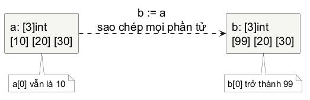
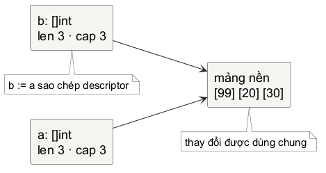
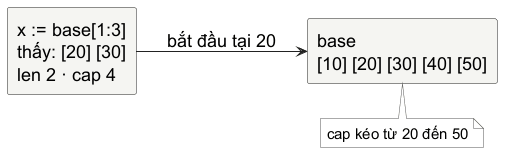
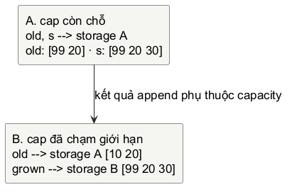

# Chương 2 — Khi một bản sao vẫn chia sẻ dữ liệu

Chạy đoạn này trước khi cố giải thích nó. Nếu bạn đoán a và b khác nhau sau dòng b[0] = 99, đó là một dự đoán rất hợp lý - và cũng là cánh cửa vào phần này.

~~~go
a := []int{10, 20, 30}
b := a
b[0] = 99

fmt.Println(a)
fmt.Println(b)
~~~

Kết quả từ lab part2-values là:

~~~text
[99 20 30]
[99 20 30]
~~~

Đừng ghi nhớ riêng một câu “slice nguy hiểm”. Thay vào đó, ta sẽ lần ngược từ kết quả: Go đã copy cái gì khi chạy b := a, và dữ liệu nào không được copy?

## Một baseline để dự đoán

Với một int, assignment tạo ra một giá trị độc lập. Cả a và b đều có giá trị riêng của chính chúng.

~~~go
a := 10
b := a
b = 99

fmt.Println(a, b) // 10 99
~~~

Go đã copy value của a vào b. Sau đó b nhận value mới; a không có lý do gì để đổi. Đây là quy tắc nền: assignment copy value. Điều còn thiếu là một value có thể chứa gì.

Array giúp ta kiểm tra quy tắc ấy với nhiều phần tử. Độ dài là một phần của type, nên [3]int và [4]int là hai array type khác nhau. Khi array được gán, toàn bộ array value được copy.

~~~go
a := [3]int{10, 20, 30}
b := a
b[0] = 99

fmt.Println(a) // [10 20 30]
fmt.Println(b) // [99 20 30]
~~~

@figure Assignment của array copy các phần tử. Việc thay b[0] chỉ chạm vào array b.

Đến đây, trực giác “copy nghĩa là độc lập” vẫn đúng. Sự thay đổi xuất hiện chỉ khi ta bỏ một ký tự trong type: [3]int trở thành []int.

## Khoảnh khắc slice đổi kết quả

~~~go
a := []int{10, 20, 30}
b := a
b[0] = 99
~~~

[]int không phải array không ghi độ dài. Nó là slice type. Một slice value mô tả một đoạn liên tiếp của underlying array. Ngôn ngữ định nghĩa slice value có length, capacity và một reference tới underlying array. Đó là mental model hữu ích cho semantics; nó không phải lời hứa rằng mọi Go implementation phải dùng đúng một struct hay ABI như hình.

@figure b := a copy slice value, gồm cửa sổ nhìn vào dữ liệu, len và cap. Cả hai descriptor vẫn dẫn tới cùng underlying array, nên b[0] thay đổi phần tử mà a cũng nhìn thấy.

Vì vậy hai câu sau cùng đúng, và không mâu thuẫn:

@table Copy value và chia sẻ storage là hai tầng khác nhau của cùng một phép gán.

| Câu nói | Đúng ở đâu? |
| --- | --- |
| Assignment copy value. | b nhận một slice value riêng: đổi len của b bằng reslice không tự đổi len của a. |
| Hai slice có thể cùng đổi dữ liệu. | Slice value có thể cùng reference một underlying array; mutation một element hiện ra qua mọi slice cùng nhìn element đó. |

Từ aliasing dùng cho tình huống nhiều đường tham chiếu đến cùng dữ liệu. Nó không phải lỗi tự thân. Aliasing giúp cắt một cửa sổ trên buffer mà không copy cả buffer. Nó thành bug khi một người đọc tưởng mình có dữ liệu riêng nhưng thực tế lại đang sửa vùng dùng chung.

## Cửa sổ, length và capacity

Đặt một slice lên một slice khác để thấy descriptor thực sự đang mô tả gì.

~~~go
base := []int{10, 20, 30, 40, 50}
x := base[1:3]

fmt.Println(x)      // [20 30]
fmt.Println(len(x)) // 2
fmt.Println(cap(x)) // 4
~~~

x bắt đầu ở phần tử 20 của base và kết thúc trước 40. Vì thế length là 2. Capacity đếm số phần tử từ điểm bắt đầu của x đến cuối backing array mà x hiện có thể mở rộng tới; ở đây là 20, 30, 40, 50, nên là 4.

@figure x nhìn thấy hai phần tử đầu của cửa sổ. cap(x) không nói x đang có bốn phần tử; nó nói x có thể được reslice hoặc append trong phạm vi backing array hiện tại.

Hãy tự dự đoán trước khi chạy:

~~~go
base := []int{1, 2, 3, 4}
a := base[:2]
b := base[1:3]
a[1] = 99

fmt.Println(base)
fmt.Println(a)
fmt.Println(b)
~~~

Kết quả là [1 99 3 4], [1 99], [99 3]. a[1] và b[0] đều chỉ vào phần tử base[1]. Hình vẽ không thay thế được việc lần index: nó chỉ cho biết vì sao có thể có một phần tử chung để lần.

## append là một phép thử về capacity

append không hứa luôn dùng lại array cũ, cũng không hứa luôn tạo array mới. Nó trả về resulting slice. Khi backing array còn chỗ, implementation có thể dùng lại; khi capacity không đủ, append phải cấp underlying array mới đủ lớn cho kết quả. Vì return value mang descriptor có thể đã đổi, viết s = append(s, value) là dạng thông thường.

~~~go
s := make([]int, 2, 4)
s[0], s[1] = 10, 20
old := s

s = append(s, 30)
s[0] = 99

fmt.Println(old) // [99 20]
fmt.Println(s)   // [99 20 30]
~~~

Ở đây s còn capacity. old và s có length khác nhau, nhưng vẫn có thể cùng nhìn hai element đầu của backing array. Ngược lại, full slice expression bên dưới giới hạn capacity của view ở 2, nên append buộc phải có storage khác cho grown:

~~~go
old := []int{10, 20}
s := old[:2:2]
grown := append(s, 30)
grown[0] = 99

fmt.Println(old)   // [10 20]
fmt.Println(grown) // [99 20 30]
~~~

@figure Hình mô tả hai semantics mà code phải chịu được. Đừng suy luận allocation từ một capacity tình cờ; nếu code cần một kết quả riêng, hãy tạo bản copy có chủ ý.

## Một aliasing bug có người dùng thật

Một function “chỉ chuẩn bị preview” đôi khi phá dữ liệu của caller.

~~~go
func redactPreview(fields []string) {
	fields[0] = "***"
}

requestFields := []string{"api-key", "region"}
redactPreview(requestFields)
fmt.Println(requestFields) // [*** region]
~~~

Parameter fields nhận một slice value mới, nhưng descriptor ấy vẫn reference storage của requestFields. Việc đổi element là mutation shared storage. Nếu mục tiêu thật sự là tạo preview độc lập, copy phần tử sang một slice mới trước:

~~~go
func redactedCopy(fields []string) []string {
	preview := make([]string, len(fields))
	copy(preview, fields)
	preview[0] = "***"
	return preview
}
~~~

copy sao chép tối đa số phần tử vừa với destination và trả về số phần tử đã copy. Ở đây make tạo backing array mới, nên preview độc lập ở tầng slice elements. Đổi lấy independence là allocation và chi phí copy; với buffer lớn hoặc đường xử lý nóng, đó là một quyết định cần có lý do. Với một preview cần an toàn khỏi mutation, nó diễn đạt đúng intent.

> **Điều tra ngắn:** hãy viết test cho redactedCopy. Test cần chứng minh đồng thời hai điều: kết quả có *** ở phần tử đầu, và requestFields ban đầu vẫn là api-key. Chỉ kiểm tra output preview chưa đủ để bắt aliasing bug.

## String: bytes trước, text sau

String cũng là value, nhưng nó có luật riêng: string là immutable sequence of bytes. len đếm byte; index trả về byte. Text thường là UTF-8, song Go không yêu cầu mọi string phải chứa UTF-8 hợp lệ.

~~~go
text := "Việt"
fmt.Println(len(text)) // 6

for index, value := range text {
	fmt.Println(index, value)
}
~~~

Lab chạy đoạn này với kết quả:

~~~text
6
0 86
1 105
2 7879
5 116
~~~

V và i mỗi chiếm một byte. ệ được mã hóa bằng ba byte UTF-8, vì vậy rune tiếp theo bắt đầu ở byte index 5. range trên string decode UTF-8: giá trị thứ hai là rune, thường dùng để biểu diễn Unicode code point. byte là alias của uint8; rune là alias của int32. Code point vẫn không đồng nghĩa với “một ký tự người dùng nhìn thấy”: một grapheme có thể gồm nhiều code point. Ta chưa cần giải quyết segmentation ở đây; chỉ cần không nhầm len với số ký tự hiển thị.

String không cho gán trực tiếp text[0] = 'v'. Khi cần dữ liệu byte có thể sửa, chuyển sang []byte, thao tác, rồi tạo string mới nếu cần. Việc chuyển đổi đó diễn đạt một thay đổi ý định: từ text immutable sang buffer mutable.

## Pointer là câu hỏi khác

Sau slice, pointer dễ bị giải thích sai như “slice nhưng rõ hơn”. Pointer là một value trực tiếp reference một variable khác; slice là một descriptor cho segment của underlying array. Chúng có thể cùng dẫn tới sharing, nhưng chúng trả lời hai câu hỏi khác nhau.

~~~go
count := 10
p := &count
*p = 99
fmt.Println(count) // 99
~~~

Ở đây &count tạo pointer tới variable count, còn *p truy cập variable đó. Pointer sẽ có chương riêng khi ta cần thiết kế API quanh mutation trực tiếp và nil. Trước khi đến đó, hãy giữ model vừa xây: luôn hỏi value nào được copy, và value ấy có reference tới storage hay variable nào không.

Nếu câu trả lời là “không”, assignment thường tạo independence như int và array. Nếu câu trả lời là “có”, aliasing có thể là công cụ tốt hoặc một bug - tùy việc bạn có làm rõ ownership và mutation hay không.

## Một quyết định ở ranh giới API

Khi một hàm nhận hoặc trả về slice, câu hỏi thiết kế không phải là “Go có copy không?” mà là: **ai được phép sửa storage này, và trong khoảng thời gian nào?** Một hàm lọc dữ liệu có thể trả về một view để tránh allocation; khi đó caller cần biết view ấy còn dùng chung buffer. Một hàm dựng response hoặc preview thường nên trả về dữ liệu độc lập, vì caller không có lý do để đoán một thay đổi sau đó sẽ đi ngược vào input.

Không có đáp án mặc định miễn phí. Copy tốn allocation và thời gian; chia sẻ tiết kiệm chúng nhưng làm contract về ownership quan trọng hơn. Trước khi tối ưu, hãy viết test cho hành vi mutation mà API hứa. Sau đó, khi đọc một bug khó hiểu, lần theo ba bước: value nào được gán, value đó reference storage nào, và ai còn có thể chạm storage ấy. Đó là cách biến “slice lạ quá” thành một cuộc điều tra có thể kiểm chứng.
