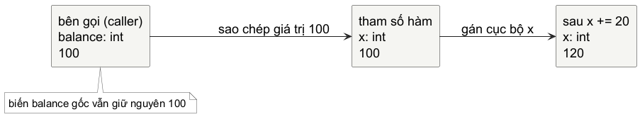
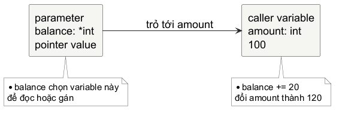
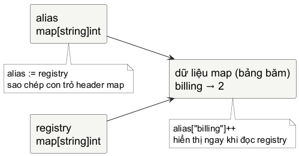
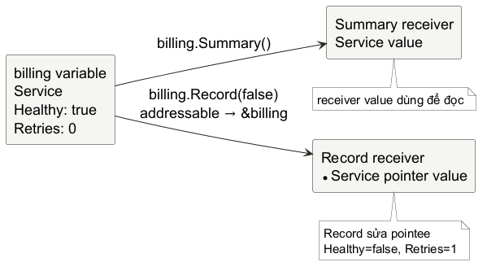
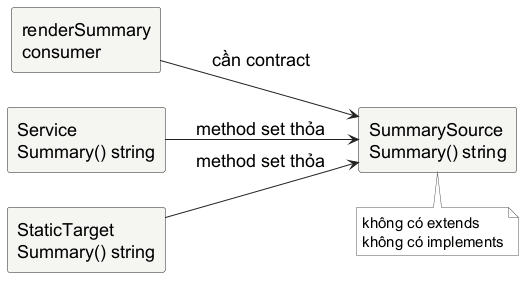

# Chương 3 — Mô hình dữ liệu và trách nhiệm thay đổi

`opsprobe` sẽ dần trở thành một CLI kiểm tra trạng thái phụ thuộc. Trước khi nó gọi HTTP hay đọc tệp cấu hình, nó đã có một bài toán nhỏ hơn: làm sao để biểu diễn trạng thái của một service mà người đọc không phải tự ghép bốn biến rời rạc trong đầu?

~~~go
serviceName := "billing"
cổng := 8080
healthy := true
retries := 0
~~~

Bốn biến này đi cùng nhau. Chúng mô tả một service, nhưng compiler chưa biết điều đó. Càng nhiều hàm nhận chúng rời rạc, càng dễ đổi nhầm thứ tự, quên truyền một field, hoặc cập nhật một bản sao mà tưởng đã cập nhật trạng thái chung. Ta sẽ refactor dần mô hình này. Mỗi lần thay đổi, ta dừng ở cùng một câu hỏi: **hàm nhận giá trị nào, và giá trị ấy mở đường tới dữ liệu nào?**

## Bug đầu tiên: bonus đi đâu mất?

Hãy tạm quên service. Một ví dụ nhỏ hơn cho thấy vấn đề rõ nhất:

~~~go
balance := 100

func addBonus(x int) {
	x += 20
}

addBonus(balance)
fmt.Println(balance) // 100
~~~

`balance` không đổi vì lời gọi hàm cũng là một phép truyền giá trị. Khi gọi `addBonus(balance)`, hàm nhận một tham số `x` có giá trị `100`. Câu `x += 20` thay giá trị trong biến `x`; nó không quay lại gán cho biến `balance` của bên gọi. Đây không phải một ngoại lệ của `int`, mà là nền cho mọi chữ ký hàm trong chương này.

@figure Lời gọi `addBonus(balance)` copy giá trị 100 vào tham số `x`. Sơ đồ biểu diễn semantics của biến và giá trị, không khẳng định vị trí vật lý của chúng trong RAM.

Nếu hàm cần tạo một giá trị mới, cách trên rất tốt: giá trị đi vào, kết quả đi ra bằng `return`. Ví dụ, `withBonus(balance)` có thể trả `120`, và bên gọi chọn có gán kết quả đó cho `balance` hay không. Nhưng một số thao tác có ý nghĩa là thay đổi chính biến bên gọi đã đưa vào. Lúc ấy cần biểu đạt đường đi tới biến đó một cách rõ ràng.

## con trỏ: con đường tới một biến

Với operand có thể lấy địa chỉ `x` có type `T`, `&x` tạo con trỏ giá trị type `*T` trỏ tới biến `x`. Nếu `p` có type `*T`, `*p` là biến type `T` mà con trỏ đó trỏ tới. Hai câu này phân biệt năm thứ thường bị gộp làm một:

- **biến** là nơi chương trình có thể đọc hoặc gán giá trị, như `balance`.
- **giá trị** là dữ liệu đang được lưu, như `100`.
- **address** là kết quả của phép lấy địa chỉ `&balance` trong ngữ cảnh Go.
- **con trỏ giá trị** là giá trị có type như `*int`; nó có thể trỏ tới một biến hoặc là `nil`.
- **pointee** là biến mà con trỏ hiện trỏ tới.

Ta không cần giả định biến ấy nằm cố định trên stack hay heap. Đó là quyết định implementation có thể thay đổi. Điều cần dùng khi đọc mã nguồn là quan hệ ngôn ngữ: con trỏ giá trị có đang trỏ tới một biến hợp lệ hay không.

~~~go
func addBonus(balance *int) {
	*balance += 20
}

amount := 100
addBonus(&amount)
fmt.Println(amount) // 120
~~~

Ở bên gọi, `&amount` tạo con trỏ tới biến `amount`. tham số `balance` vẫn là một giá trị được copy vào hàm - lần này giá trị đó là con trỏ. Khi `*balance += 20` chạy, dereference `*balance` chọn chính biến `amount` làm đích gán. Bản sao của con trỏ không tạo bản sao của pointee.

@figure `balance` trong hàm là con trỏ giá trị được truyền theo giá trị. `*balance` truy cập pointee; sơ đồ cố ý không dùng địa chỉ số hay stack/heap để tránh biến mental model thành chi tiết runtime.

Phép `&` không dùng được với mọi biểu thức. Thông thường, operand của `&` phải có thể lấy địa chỉ: biến, dereference con trỏ, index của slice, field của struct có thể lấy địa chỉ, hoặc index của array có thể lấy địa chỉ là những trường hợp quan trọng ở giai đoạn này. Go specification có một ngoại lệ hữu ích: được phép lấy địa chỉ của composite literal, như `&Service{Name: "billing"}`. Không cần gọi composite literal là “có thể lấy địa chỉ” để dùng đúng quy tắc; hãy nhớ hai ý riêng: `&x` thường cần một nơi có thể gán, còn literal có ngoại lệ được phép tạo giá trị rồi lấy địa chỉ của nó. Map index không có thể lấy địa chỉ - ta sẽ thấy lý do thực hành của giới hạn đó khi đưa map vào mô hình service.

### Nil là thiếu pointee, không phải "con trỏ rỗng vô hại"

Zero giá trị của con trỏ type là `nil`. `nil` không trỏ tới biến nào, nên dereference nó gây run-time panic.

~~~go
var bonus *int

if bonus == nil {
	fmt.Println("chưa có bonus")
	return
}
*bonus += 20
~~~

Dereference `*bonus` cần một pointee để chọn làm đích gán; `nil` không có pointee, nên dereference nó panic. Kiểm tra `nil` là một phần của contract: hàm này có chấp nhận "không có giá trị" hay bên gọi phải luôn truyền con trỏ hợp lệ? Đừng thêm `nil` check theo thói quen. Hãy quyết định và thể hiện điều đó qua API, test, hoặc lỗi trả về khi có lý do.

## Gom state thành một giá trị có tên

Quay lại bốn biến rời rạc. Một struct gom chúng thành một giá trị mà domain có thể gọi tên:

~~~go
type Service struct {
	Name    string
	cổng    int
	Healthy bool
	Retries int
}

billing := Service{
	Name:    "billing",
	cổng:    8080,
	Healthy: true,
}
~~~

`type Service` khai báo một named type; phần thân struct khai báo các field và type của chúng. Struct literal đặt giá trị cho các field được nêu. `Retries` không xuất hiện trong literal nên nhận zero giá trị của `int`, là `0`. Zero giá trị không thay thế validation: một `Service{}` hợp lệ về type nhưng chưa chắc hợp lệ cho một service thật. Trong domain này, cổng `0` có thể nghĩa là "chưa cấu hình".

Struct không phải class thiếu method. Trước hết nó là một giá trị có nhiều phần mang cùng một ý nghĩa. Field access chỉ đọc hoặc gán một phần của giá trị:

~~~go
billing.Retries++
fmt.Println(billing.Name, billing.Retries) // billing 1
~~~

Một struct cũng được copy khi gán hoặc truyền làm đối số. Với các field trong `Service` hiện tại, copy tạo các field độc lập:

~~~go
candidate := billing
candidate.Healthy = false

fmt.Println(billing.Healthy)   // true
fmt.Println(candidate.Healthy) // false
~~~

@figure Assignment copy struct giá trị hiện tại theo từng field. Nếu một field về sau là slice, map hoặc con trỏ, struct vẫn được copy nhưng field đó có thể mang theo một reference; lúc ấy phải phân tích tiếp giá trị của field thay vì gắn nhãn "struct luôn độc lập".

Nested struct hữu ích khi một phần của domain tự nó đã có ý nghĩa. Ví dụ, host và cổng thường đi cùng nhau hơn là hai field phẳng:

~~~go
type điểm cuối struct {
	Host string
	cổng int
}

type Service struct {
	Name     string
	điểm cuối điểm cuối
	Healthy  bool
	Retries  int
}
~~~

Việc nesting không tự động làm thiết kế tốt hơn. Nó có ích khi tạo ra một khái niệm đọc được, như `Endpoint`; gom chỉ để tránh thấy nhiều field thường làm model khó tìm hơn.

## Khi hàm sửa một bản copy

Ta muốn `opsprobe` đánh dấu service không khỏe sau một lần probe thất bại. Phiên bản đầu tiên trông rất có lý:

~~~go
func markUnhealthy(service Service) {
	service.Healthy = false
	service.Retries++
}

markUnhealthy(billing)
fmt.Println(billing.Healthy, billing.Retries) // true 0
~~~

Không có bug bí ẩn ở đây. `billing` được copy vào tham số `service`; hàm thay đổi struct copy rồi return. bên gọi còn giữ giá trị cũ. Nếu đây là một transform thuần, ta có thể trả `Service` mới. Nếu ý định là mutate state bên gọi đang quản lý, chữ ký hàm cần nói điều đó:

~~~go
func markUnhealthy(service *Service) {
	service.Healthy = false
	service.Retries++
}

markUnhealthy(&billing)
fmt.Println(billing.Healthy, billing.Retries) // false 1
~~~

`T` và `*T` không có nghĩa "immutable" và "mutable". Một local giá trị `Service` vẫn có thể bị gán field; một con trỏ tham số có thể chỉ được đọc. Khác biệt là một `T` tham số mang struct giá trị riêng, còn một `*T` tham số mang khả năng truy cập pointee của bên gọi. Chọn con trỏ khi hàm phải thay đổi pointee, khi biểu diễn sự vắng mặt bằng `nil` là một phần hữu ích của domain, hoặc khi API có lý do rõ ràng khác. Chọn giá trị khi hàm cần snapshot cục bộ, transform rồi return, hoặc sharing sẽ làm contract khó hiểu hơn.

### Cùng một lời gọi, bảy giá trị khác nhau

Đến đây có thể đọc nhiều chữ ký hàm bằng một quy tắc duy nhất: Go truyền đối số theo giá trị. "Theo giá trị" không trả lời xong câu hỏi; ta còn phải nhìn giá trị đó chứa dữ liệu nào hoặc reference nào.

@table Mỗi lời gọi đều copy đối số giá trị vào tham số; khả năng chia sẻ nằm trong giá trị được copy.

| tham số | giá trị được copy khi gọi | Thay đổi từ hàm có hiện ra ở bên gọi? |
| --- | --- | --- |
| `x int` | số nguyên | Không, trừ khi return và bên gọi gán kết quả. |
| `a [3]int` | toàn bộ array giá trị | Không, các element của bản copy bị sửa riêng. |
| `s []int` | slice giá trị, gồm reference tới array nền | Sửa element có thể hiện ra; cắt lại lát cắt tham số không tự đổi len bên gọi. |
| `m map[string]int` | map giá trị, có reference tới map data | Ghi/xóa entry hiện ra qua map giá trị cùng map data. |
| `p *int` | con trỏ giá trị | `*p = ...` sửa pointee của bên gọi nếu con trỏ hợp lệ. |
| `v Service` | các field của struct giá trị | Không với các field giá trị; xem từng field nếu chúng chứa reference. |
| `p *Service` | con trỏ giá trị | Sửa field qua `p` sửa pointee của bên gọi nếu con trỏ hợp lệ. |

Bảng này không phải bảng để học thuộc type. Nó là cách lần một lời gọi: tham số mới nhận bản copy nào; bản copy ấy có dẫn đến dữ liệu chung hay biến chung không; biểu thức nào là đích biến đổi dữ liệu? Đó cũng là lý do giá trị bộ tiếp nhận và con trỏ bộ tiếp nhận sẽ được học sau cùng methods, thay vì biến dấu `*` thành một nghi thức.

> **Bài tập - sửa đúng contract:** Viết `recordFailure(service Service)` sao cho bên gọi nhận được `Healthy == false` và `Retries` tăng một. Trước khi nhìn đáp án, chọn một trong hai contract: hàm return một `Service` mới, hoặc hàm nhận `*Service` và mutate pointee.

**Đáp án.** Nếu bên gọi quản lý cùng một state và hàm được đặt tên như một command, con trỏ làm ý định trực tiếp:

~~~go
func recordFailure(service *Service) {
	service.Healthy = false
	service.Retries++
}

recordFailure(&billing)
~~~

Một biến thể giá trị vẫn đúng khi API diễn đạt transform:

~~~go
func failedCopy(service Service) Service {
	service.Healthy = false
	service.Retries++
	return service
}

billing = failedCopy(billing)
~~~

Hai phiên bản khác nhau ở trách nhiệm của bên gọi. Phiên bản con trỏ cho phép hàm tác động lên state đã có; phiên bản return khiến việc thay state nằm rõ ở câu gán của bên gọi. Không có "bản nhanh hơn" mặc định quan trọng hơn contract ở đây.

**Thực hành - một bug vẫn compile.** Trong `labs/part3-data-models`, mở `main_test.go` trước. Ở `recordProbe`, tạm bỏ câu `registry[name] = service`, rồi chạy riêng `TestRecordProbeUpdatesExistingMapEntry`. mã nguồn vẫn compile vì local struct copy được sửa hợp lệ; test mới chỉ ra entry trong map không hề nhận giá trị mới. Khôi phục bằng đường biến đổi dữ liệu mà anh đã lần, không bằng cách sửa expectation. Sau đó xóa thân `recordFailure` và tự dựng lại nó từ `TestRecordFailureMutatesPointee`.

---

**Đáp án — chỉ đọc sau khi đã tự làm.** Map lookup trả một `Service` giá trị. Sửa local `service` chưa chạm map data; phép gán ngược vào `registry[name]` mới là biến đổi dữ liệu của registry. `recordFailure` cần nhận `*Service` và sửa pointee, vì test đòi bên gọi quan sát cùng state thay đổi.

## Nhiều service cần lookup, không cần thêm biến

Một `Service` model một service. Khi `opsprobe` giữ nhiều service theo tên, ta không muốn `billing`, `search`, `checkout` thành các biến độc lập. Map diễn đạt một quan hệ key/giá trị:

~~~go
services := map[string]Service{
	"billing": {
		Name:    "billing",
		cổng:    8080,
		Healthy: true,
	},
}

billing, found := services["billing"]
fmt.Println(found, billing.cổng) // true 8080
~~~

`string` là key type; `Service` là element type. `found` là kết quả thứ hai của map lookup, thường gọi là comma-ok. Nó phân biệt key không có mặt với element có zero giá trị. Một lookup một-result vẫn hoàn toàn hợp lệ: `services["missing"].Retries` đọc `Retries` của zero giá trị `Service{}`, nên cho `0`. Nhưng `0` khi ấy có thể là “chưa có service” hoặc “service có `Retries == 0`”; đó là lý do phải dùng comma-ok khi sự hiện diện của entry mang ý nghĩa.

~~~go
attempts := map[string]int{"billing": 0}

count, found := attempts["billing"]
fmt.Println(count, found) // 0 true

count, found = attempts["search"]
fmt.Println(count, found) // 0 false
~~~

Map literal tạo map đã sẵn sàng ghi. `make(map[string]Service)` cũng tạo map sẵn sàng ghi. Ngược lại, zero giá trị của map là `nil`: đọc từ nil map cho zero giá trị, `range` qua nó có zero iteration, nhưng gán entry vào nil map sẽ panic. Một map nhận từ bên gọi vì thế cần contract rõ như con trỏ: bên gọi có luôn khởi tạo nó không, hay hàm chịu trách nhiệm tạo nó trước khi ghi?

~~~go
var services map[string]Service
fmt.Println(services["billing"].Name) // ""

// services["billing"] = billing
// panic: assignment to entry in nil map
services = make(map[string]Service)
services["billing"] = billing
~~~

`delete(services, "billing")` xóa một entry; xóa key không có mặt là an toàn. Nhưng `range` map không có thứ tự được chỉ định. Nếu CLI cần output ổn định, hãy lấy key, sort chúng, rồi in theo thứ tự đã chọn - đừng coi thứ tự đang tình cờ xuất hiện là contract của map.

### Map copy giá trị, chia sẻ map data

Map không phải con trỏ và ta không cần mô tả hash table internals để dùng nó đúng. Assignment và call copy map giá trị. Nếu hai map giá trị cùng reference map data, ghi qua một giá trị hiện ra qua giá trị kia:

~~~go
registry := map[string]int{"billing": 1}
alias := registry
alias["billing"]++

fmt.Println(registry["billing"]) // 2
~~~

@figure Assignment copy map giá trị. Khi giá trị ấy reference cùng map data, biến đổi dữ liệu entry qua `alias` hiện ra khi đọc qua `registry`; hình là conceptual diagram, không mô tả hash table implementation.

Một chi tiết làm map khác slice và array khi update struct giá trị: map index không có thể lấy địa chỉ. Vì vậy đoạn này không hợp lệ:

~~~go
// services["billing"].Healthy = false // không hợp lệ
~~~

`services["billing"]` cho một `Service` giá trị để đọc; nó không cho một biến mà ta có thể lấy địa chỉ field hay gán field trực tiếp. Cách giá trị-oriented là lấy giá trị ra, đổi, rồi gán lại:

~~~go
service := services["billing"]
service.Healthy = false
services["billing"] = service
~~~

Nếu domain muốn registry quản lý các `*Service`, thì biến đổi dữ liệu qua pointee có thể trực tiếp hơn, nhưng đổi lại registry có thể chứa nil con trỏ và ownership cần được làm rõ:

~~~go
services := map[string]*Service{
	"billing": {
		Name:    "billing",
		cổng:    8080,
		Healthy: true,
	},
}

services["billing"].Healthy = false
~~~

Đây không phải lời mời chọn `map[string]*Service` mặc định. Với giá trị nhỏ như `Service` hiện tại, `map[string]Service` và "lấy - sửa - gán lại" thường bộc lộ điểm biến đổi dữ liệu rõ hơn. con trỏ trong map chỉ đáng dùng khi nó giải quyết một contract thực: object identity dùng chung, biến đổi dữ liệu phải đi qua nhiều nơi, hoặc giá trị lớn và đã có lý do đo đạc/thiết kế.

> **Bài tập - đọc zero giá trị:** Một probe trả về `latencyByService map[string]int`. Viết mã nguồn phân biệt `billing` có latency `0` với `billing` chưa có kết quả. Sau đó xóa kết quả của `billing` mà không cần kiểm tra key có tồn tại.

**Đáp án.** Comma-ok mang thông tin hiện diện; `delete` tự xử lý key thiếu:

~~~go
latency, found := latencyByService["billing"]
if !found {
	fmt.Println("chưa có kết quả")
} else {
	fmt.Println(latency)
}

delete(latencyByService, "billing")
~~~

## Một update có trách nhiệm trong registry

`opsprobe` chưa cần network để hưởng lợi từ model này. Một update giá trị-oriented cho registry không cần con trỏ: lấy struct giá trị ra khỏi map, sửa bản local, rồi gán nó trở lại entry. Map tham số được truyền theo giá trị, nhưng map giá trị ấy vẫn mở đường tới map data của bên gọi; chính phép gán cuối là biến đổi dữ liệu có chủ ý lên registry chung.

~~~go
func recordProbe(
	registry map[string]Service,
	name string,
	healthy bool,
) bool {
	service, found := registry[name]
	if !found {
		return false
	}

	service.Healthy = healthy
	if !healthy {
		service.Retries++
	}
	registry[name] = service
	return true
}
~~~

chữ ký hàm này nói rõ ba vai: `registry` là map giá trị để lookup và gán entry; `name` là snapshot string; `healthy` là snapshot bool. `service` là struct copy lấy từ entry. Nếu key không có, hàm không bịa ra service mới mà trả `false`; nếu có, nó ghi giá trị đã sửa về map. Khi công cụ bắt đầu đọc cấu hình và probe điểm cuối ở phần sau, cách đọc chữ ký hàm này sẽ giúp ta biết dữ liệu nào được chia sẻ, dữ liệu nào được snapshot, và biến đổi dữ liệu nào có thể lần lại.

Sau chương này, một chữ ký hàm không còn chỉ là tên type. Nó cho biết ta đang đưa vào hàm một snapshot, một cửa sổ tới storage dùng chung, một map giá trị dẫn tới map data, hay một con trỏ mở đường tới biến bên gọi. Khi cần debug biến đổi dữ liệu, hãy viết ra trước/sau lời gọi: biến nào tồn tại ở bên gọi, tham số nào xuất hiện ở hàm, và biểu thức nào thực sự là đích gán.

## Khi hành vi thuộc về service

`recordProbe(registry, name, healthy)` đã làm đúng việc, nhưng khi `opsprobe` có thêm nhiều thao tác quanh một service, chữ ký bắt đầu lặp lại cùng một chủ thể. Một hàm cần tạo nhãn cho service, một hàm khác ghi kết quả probe, hàm nữa kiểm tra cấu hình. Lúc này method giúp đặt hành vi cạnh type mà nó đọc hoặc thay đổi; nó không thay đổi quy tắc giá trị semantics đã xây.

~~~go
func (service Service) Summary() string {
	return service.Name
}

func (service *Service) Record(healthy bool) {
	service.Healthy = healthy
	if !healthy {
		service.Retries++
	}
}
~~~

Một method là hàm có bộ tiếp nhận: phần tham số đặc biệt đứng trước tên method. `Summary` nhận `Service` giá trị, nên bộ tiếp nhận là một struct giá trị được dùng để tạo kết quả. `Record` nhận `*Service`, vì hành vi này có ý định sửa pointee. Tên bộ tiếp nhận không phải từ khóa và không phải một biến toàn cục bí mật; nó chỉ là tham số được viết ở vị trí riêng để gắn method với `Service`.

~~~go
billing := Service{Name: "billing", Healthy: true}

fmt.Println(billing.Summary()) // billing
billing.Record(false)
fmt.Println(billing.Healthy, billing.Retries) // false 1
~~~

`billing.Record(false)` hợp lệ vì `billing` là biến có thể lấy địa chỉ. Trong trường hợp này, Go cho phép cách viết ngắn của `(&billing).Record(false)`. Sự tiện lợi ấy không biến giá trị bộ tiếp nhận thành con trỏ bộ tiếp nhận: method set của `Service` chỉ có methods khai báo với bộ tiếp nhận `Service`; method set của `*Service` có cả methods bộ tiếp nhận `Service` lẫn `*Service`.

@figure Method vẫn dựa trên bộ tiếp nhận giá trị. `Summary` dùng Service giá trị; `Record` cần `*Service` để chọn pointee làm đích biến đổi dữ liệu. Mũi tên là trace semantics, không mô tả bộ nhớ vật lý.

Điều này giải thích một lỗi compiler rất có ích. Map index không có thể lấy địa chỉ, nên Go không thể tự lấy địa chỉ ổn định cho một giá trị trả về từ map để gọi con trỏ-bộ tiếp nhận method:

~~~go
// services["billing"].Record(false) // không hợp lệ

service := services["billing"]
service.Record(false)
services["billing"] = service
~~~

Đoạn sửa dùng đúng mô hình cũ: map lookup cho struct giá trị, local biến `service` có thể lấy địa chỉ, con trỏ-bộ tiếp nhận method mutate local pointee, rồi bên gọi gán struct giá trị đã đổi về map. Nếu mã nguồn thật cần nhiều nơi cùng giữ identity của một service, `map[string]*Service` có thể hợp lý; nhưng không dùng con trỏ chỉ để né phép gán lại mà chưa hiểu ownership.

### Composition trước, embedding sau

Một service có điểm cuối và state; hai phần đó là các khái niệm riêng. Composition đơn giản nhất là đặt chúng vào những field có tên, để người đọc thấy quan hệ "có một":

~~~go
type điểm cuối struct {
	Host string
	cổng int
}

type ProbeState struct {
	Healthy bool
	Retries int
}

type Service struct {
	Name     string
	điểm cuối điểm cuối
	State    ProbeState
}
~~~

`Service` có `Endpoint` và `ProbeState`; không có quan hệ kế thừa nào được ngụ ý. Đây là cách composition thường rõ nhất khi domain có các phần độc lập. Embedding cũng là một công cụ của Go, nhưng nó đưa field và method được promote vào selector của type ngoài. Ta sẽ chỉ dùng nó khi một API có lợi từ sự promote đó; hiện tại field có tên giữ ownership và đường đi của data rõ hơn.

## Interface xuất hiện ở nơi cần một hành vi

Một interface không phải bản thiết kế cha để mọi struct đi theo. Nó là một contract nhỏ: mã nguồn tiêu dùng nói mình cần method nào, còn type nào có method set phù hợp thì dùng được. Với `opsprobe`, phần in kết quả chưa cần toàn bộ `Service`; nó chỉ cần một dòng summary.

~~~go
type SummarySource interface {
	Summary() string
}

func renderSummary(source SummarySource) string {
	return "target: " + source.Summary()
}
~~~

`renderSummary` không hỏi bên gọi là `Service`, `StaticTarget`, hay một type tương lai. Nó chỉ gọi `Summary`. Không có từ khóa `implements`: assignment hoặc đối số hợp lệ khi method set của type thỏa interface. Vì `Summary` có giá trị bộ tiếp nhận, cả `Service` và `*Service` đều có method đó trong method set.

~~~go
type StaticTarget string

func (target StaticTarget) Summary() string {
	return string(target)
}

fmt.Println(renderSummary(Service{Name: "billing"}))
fmt.Println(renderSummary(
	StaticTarget("search (maintenance)"),
))
~~~

Kết quả là hai dòng có cùng format dù hai type không có ancestor chung. Interface ở đây được rút ra sau khi có consumer và hai provider có ý nghĩa. Nếu chỉ có một `Service` duy nhất và không có ranh giới cần thay thế, nhận trực tiếp `Service` thường dễ đọc hơn là thêm interface vì dự đoán tương lai.

@figure `renderSummary` chỉ cần `Summary() string`. Sơ đồ cho thấy phụ thuộc đi từ consumer tới contract nhỏ; Service và StaticTarget không cần khai báo một quan hệ kế thừa hay đăng ký implements.

con trỏ bộ tiếp nhận thay đổi interface satisfaction theo đúng rule method set. Nếu contract yêu cầu `Record(bool)`, `Service` giá trị không thỏa vì method đó chỉ thuộc method set của `*Service`; `*Service` mới thỏa.

~~~go
type ProbeRecorder interface {
	Record(bool)
}

func markFailed(recorder ProbeRecorder) {
	recorder.Record(false)
}

billing := Service{Name: "billing", Healthy: true}
markFailed(&billing) // *Service thỏa ProbeRecorder

// markFailed(billing) // sai: Service thiếu Record
~~~

> **Bài tập - chọn contract nhỏ:** `renderSummary` cần biết `Name`, `Port`, `Healthy` và `Retries` hay chỉ cần `Summary() string`? Viết một type thứ hai có thể đi qua `renderSummary` mà không phải là `Service`, rồi giải thích vì sao interface đặt ở consumer thay vì được nhét sẵn vào mọi type.

**Đáp án.** Consumer chỉ cần `Summary() string`, nên interface nên giữ đúng một method đó. `StaticTarget` ở ví dụ trên là một provider thứ hai: nó có thể là dữ liệu đọc từ một report thay vì service sống. Đặt interface cạnh `renderSummary` khiến contract phản ánh nhu cầu thật của consumer; `Service` không phải biết trước mọi interface mà mã nguồn khác sẽ cần.

## Một API nhỏ, đủ để đọc bằng semantics

Ở cuối mạch này, `opsprobe` có thể diễn đạt ba ý định khác nhau mà không cần dựa vào danh từ mơ hồ như "reference type":

- `func (service Service) Summary() string` nhận snapshot bộ tiếp nhận và tạo mô tả.
- `func (service *Service) Record(bool)` nhận con trỏ giá trị, rồi sửa pointee có chủ ý.
- `func renderSummary(SummarySource) string` nhận interface giá trị và chỉ phụ thuộc vào hành vi mà consumer cần.

Composition giữ data model có đường đi rõ ràng; methods đặt behavior cạnh type; interface tạo ranh giới khi có một consumer thực sự cần thay thế provider. Từ đây, chương về errors có thể cho những API này một cách báo thất bại rõ ràng: lỗi probe không nên chỉ đổi `Healthy` rồi biến mất, mà phải đi qua ranh giới hàm với thông tin đủ để bên gọi quyết định.
