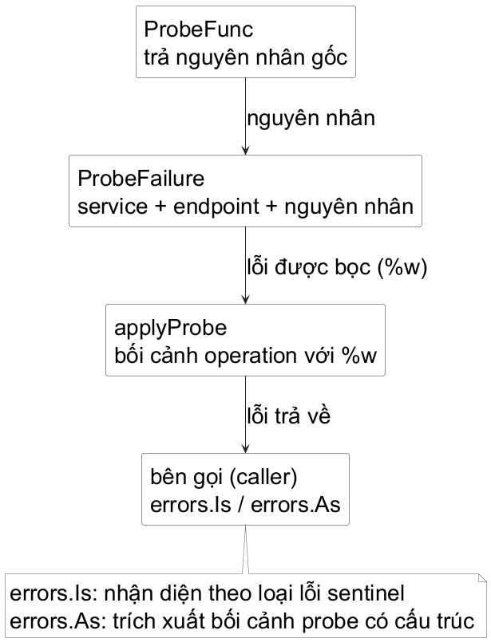
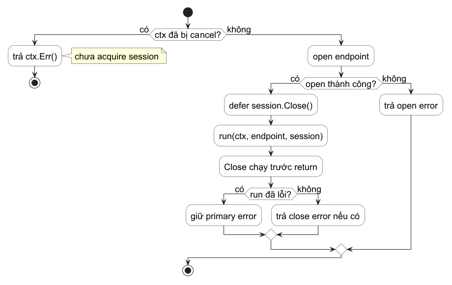

<!-- BOOK_ROLE: FOUNDATION_CORE -->

# Chương 4 — Biên lỗi: để caller quyết định

`opsprobe` vừa có thêm `Service`, state và một hàm ghi kết quả probe. Phiên bản đầu của hàm trả `bool`: `true` nếu tên service tồn tại, `false` nếu không. Nó là một API hợp lệ khi caller chỉ cần biết có ghi được entry hay không.

Nhưng hãy đặt nó vào một tình huống vận hành. Màn hình báo `billing` không healthy. Có ít nhất hai câu hỏi khác nhau: service có được cấu hình không, hay service đã cấu hình nhưng probe tới endpoint thất bại? Một `false` không mang câu trả lời nào đi qua ranh giới function. Caller buộc phải đoán, hoặc đọc state đã bị đổi sau sự kiện.

Chương này không bắt đầu bằng một danh sách hàm trong package `errors`. Nó bắt đầu bằng quyền quyết định: nơi gọi cần nhận được failure nào để chọn thông báo, retry, hay dừng công việc; nơi phát hiện failure cần thêm context nào mà không phá mất identity của nguyên nhân.

## Một failure chưa phải là một quyết định

Ta tách hành vi probe thành một function value. Nó chưa mở network; điều đó sẽ đến ở chương I/O. Hiện tại nó là một boundary có thể thành công hoặc trả về nguyên nhân thất bại:

~~~go
type Endpoint struct {
	Host string
	Port int
}

type ProbeFunc func(Endpoint) error
~~~

`ProbeFunc` nhận endpoint value và trả về `error`. Nếu không có lỗi, giá trị trả về là `nil`. Nếu có lỗi, caller nhận một error value. `error` là interface của Go; điều đáng chú ý ở đây không phải interface đó có một method, mà là failure đi ra trên đường trả về với một shape thống nhất. Không dùng `panic` để báo endpoint unreachable, và cũng không in log bên trong `ProbeFunc` rồi giả vờ thành công.

API ghi kết quả của `opsprobe` đổi từ câu hỏi “có entry không?” sang “tôi đã probe và cập nhật state được chưa?”

~~~go
func applyProbe(
	registry map[string]Service,
	name string,
	run ProbeFunc,
) error
~~~

Signature nói một điều quan trọng trước khi ta đọc implementation: caller không nhận state mới hay một boolean mơ hồ. Nó nhận `nil` khi operation hoàn tất, hoặc một error value để quyết định nhánh kế tiếp. `registry` vẫn là map value dẫn tới shared map data; vì map đang lưu struct value, hàm vẫn lấy entry ra, sửa local `Service`, rồi gán lại entry như ở Chương 3.

## Phân loại để quyết định, thêm context để điều tra

Không phải mọi string lỗi đều là contract. Một CLI có thể muốn đối xử riêng với “tên service không có trong config”, nhưng không nên parse câu tiếng Anh từ `err.Error()` để làm điều đó. Ta tạo một sentinel cho điều kiện mà caller có hành động riêng:

~~~go
var ErrUnknownService = errors.New("service is not configured")
~~~

Khi tên không tồn tại, `applyProbe` không trả sentinel trần. Nó thêm thông tin operation và vẫn giữ nguyên identity bằng `%w`:

~~~go
return fmt.Errorf("unknown %q: %w", name, ErrUnknownService)
~~~

`%w` không chỉ nối string. Nó tạo một error có thể unwrap về nguyên nhân. Vì vậy caller có thể kiểm tra ý nghĩa bằng `errors.Is` thay vì so câu chữ:

~~~go
if errors.Is(err, ErrUnknownService) {
	fmt.Println("thêm service vào config trước khi probe")
	return
}
~~~

Trong câu lệnh trên, caller không cần biết hiện có bao nhiêu lớp context bên ngoài sentinel. `errors.Is` đi theo chuỗi wrapping. Nếu đổi `%w` thành `%v`, thông báo có thể nhìn giống nhau nhưng identity bị cắt; một điều kiện có thể phân loại được đã vô tình thành text chỉ dành cho người đọc.

@figure Biên lỗi không nuốt nguyên nhân. Mỗi lớp chỉ thêm context mà nó thực sự biết; caller chọn `errors.Is` khi cần một quyết định theo loại lỗi và `errors.As` khi cần dữ liệu từ một error cụ thể.

## Một error có dữ liệu mà CLI thực sự cần

Sentinel trả lời “đây có phải loại lỗi đó không?”. Khi probe tới một endpoint đã có cấu hình nhưng thất bại, CLI cần thêm service nào và endpoint nào liên quan. Ta dùng custom error cho context có cấu trúc:

~~~go
type ProbeFailure struct {
	Service  string
	Endpoint Endpoint
	Cause    error
}

func (failure *ProbeFailure) Error() string {
	return fmt.Sprintf(
		"probe %s at %s:%d: %v",
		failure.Service,
		failure.Endpoint.Host,
		failure.Endpoint.Port,
		failure.Cause,
	)
}

func (failure *ProbeFailure) Unwrap() error {
	return failure.Cause
}
~~~

`Error` tạo message cho người đọc. `Unwrap` nói rõ `Cause` vẫn là nguyên nhân nằm dưới lớp context này. Error value cần tìm trong chain là `*ProbeFailure`, vì `ProbeFailure` dùng pointer receiver. Còn argument `target` thực tế truyền cho `errors.As` là `&failure`: pointer tới variable nhận kết quả. Hàm sẽ gán error tìm được vào variable đó:

~~~go
var failure *ProbeFailure
if errors.As(err, &failure) {
	fmt.Printf("%s đang lỗi tại %s:%d\n",
		failure.Service,
		failure.Endpoint.Host,
		failure.Endpoint.Port,
	)
}
~~~

`errors.As` không hỏi “message có chứa host không?”. Nó tìm một error assignable vào type mà caller yêu cầu. Đây là lý do custom error nên có dữ liệu mà caller thật sự dùng, không phải chỉ là một struct bọc mỗi string.

## Failure analysis: state nào phải được ghi, lỗi nào phải được trả?

Đây là implementation của boundary. Hãy đọc nó như một review: mỗi return mang thông tin nào, và state nào còn tồn tại sau return?

~~~go
func applyProbe(
	registry map[string]Service,
	name string,
	run ProbeFunc,
) error {
	service, found := registry[name]
	if !found {
		return fmt.Errorf(
			"unknown %q: %w",
			name,
			ErrUnknownService,
		)
	}

	if err := run(service.Endpoint); err != nil {
		service.Record(false)
		registry[name] = service
		failed := &ProbeFailure{
			Service:  service.Name,
			Endpoint: service.Endpoint,
			Cause:    err,
		}
		return fmt.Errorf("probe %q: %w", name, failed)
	}

	service.Record(true)
	registry[name] = service
	return nil
}
~~~

Nhánh thiếu config trả sớm: không có `Service` để mutate, nên registry không đổi. Nhánh probe thất bại vẫn ghi state `Healthy=false` và tăng retry, rồi trả failure có nguyên nhân. Đây không phải hai cơ chế báo lỗi cạnh tranh; state trả lời “lần quan sát gần nhất ra sao”, còn error trả lời “operation vừa gọi không hoàn tất vì sao”. Nhánh thành công ghi state rồi trả `nil`.

Khi kiểm thử mã nguồn này, hệ thống tập trung chứng minh ba cam kết hợp đồng cụ thể thay vì chỉ so khớp chuỗi thông báo:

| Tình huống kiểm thử | Điều kiện xác minh trạng thái | Điều kiện xác minh lỗi (Error Contract) |
| :--- | :--- | :--- |
| Dịch vụ không tồn tại trong cấu hình | Hàm kiểm tra probe tuyệt đối không được gọi. | `errors.Is(err, ErrUnknownService)` trả về `true`. |
| Thao tác probe thất bại | Trạng thái dịch vụ cập nhật `Healthy=false` và tăng số lần thử lại. | `errors.As` trích xuất thành công `*ProbeFailure`, đồng thời `errors.Is` bảo toàn nguyên nhân gốc. |
| Thao tác probe thành công | Trạng thái dịch vụ cập nhật `Healthy=true` tại đúng endpoint cấu hình. | Giá trị lỗi trả về là `nil`. |

Lab `part4-error-boundaries` biến ba contract này thành test. `ProbeFunc` được thay bằng function nhỏ trong test; không cần mở socket thật để chứng minh error boundary. Hãy mở `main_test.go` trước `main.go`, đổi riêng `%w` thành `%v` ở return cuối của nhánh probe lỗi, rồi chạy `TestApplyProbePreservesFailureCauseAndContext`. Message vẫn gần như cũ, nhưng test phải đỏ vì `errors.Is` không còn thấy nguyên nhân. Khôi phục `%w`, sau đó tạm bỏ nhánh cancellation đặc biệt và chạy `TestApplyProbeCancellationDoesNotChangeHealthState`: lúc này feedback của test cho thấy cancellation đã bị viết nhầm thành health failure. Hai failure injection này đáng làm hơn là chép lại error chain đã có sẵn.

> **Bài tập - giữ lại điều gì?** Một `run` trả `errors.New("connection refused")`. Nếu `applyProbe` đổi `%w` ở return cuối thành `%v`, message của CLI có thể vẫn hiển thị “connection refused”. Contract nào trong ba contract trên đã mất? Viết một assertion thể hiện điều đó.

**Đáp án.** Contract nhận biết nguyên nhân gốc mất: `errors.Is(err, errConnectionRefused)` sẽ false vì chuỗi error không còn unwrap tới error ban đầu. Context cho người đọc không đủ để thay thế identity cho code. Assertion cần tạo `errConnectionRefused`, gọi `applyProbe`, rồi yêu cầu `errors.Is(got, errConnectionRefused)` là true.

## Điểm dừng của boundary này

Ta chưa retry, chưa timeout, và chưa cleanup tài nguyên; mọi thứ đó sẽ chỉ làm mạch này khó đọc nếu đưa vào trước. Hiện tại API đã có ranh giới rõ: `nil` nghĩa là operation hoàn tất, error giữ được nguyên nhân và context, còn caller dùng `Is` hoặc `As` đúng theo quyết định mình cần.

Phần tiếp theo của Chương 4 sẽ đặt error boundary này dưới áp lực của tài nguyên và cancellation: `defer` phải chạy ở đâu, `context` đi qua API nào, và vì sao `panic` không phải đường tắt thay cho một failure có thể dự đoán.

## Cancellation không phải health signal

Một probe có thể bị hủy vì người dùng dừng CLI, vì request cha hết thời gian, hoặc vì service quản lý gọi đang shutdown. Không tình huống nào trong số đó chứng minh endpoint của `billing` đang down. Nếu `applyProbe` gộp mọi error vào nhánh `Record(false)`, một cancellation của caller sẽ tạo ra một health signal giả.

`context.Context` mang deadline và tín hiệu cancellation qua ranh giới API. Nó đi vào đầu signature, không được cất trong `Service`, và được truyền xuống function có thể chặn:

~~~go
type ProbeFunc func(context.Context, Endpoint) error

func applyProbe(
	ctx context.Context,
	registry map[string]Service,
	name string,
	run ProbeFunc,
) error
~~~

Trước khi chạy probe, boundary kiểm tra cancellation để không bắt đầu I/O vô ích. Nếu cancellation đến trong lúc `run` đang làm việc, `run` phải tôn trọng `ctx` và trả một error vẫn nhận diện được bằng `errors.Is(err, context.Canceled)` hoặc `errors.Is(err, context.DeadlineExceeded)`. Trả thẳng `ctx.Err()` là cách đơn giản; wrapping để thêm context cũng đúng nếu không làm mất identity. `applyProbe` nhận diện hai nguyên nhân chuẩn ấy, giữ chúng trong error chain, nhưng không thay health state:

~~~go
if err := ctx.Err(); err != nil {
	return fmt.Errorf("probe canceled: %w", err)
}

if err := run(ctx, service.Endpoint); err != nil {
	if errors.Is(err, context.Canceled) ||
		errors.Is(err, context.DeadlineExceeded) {
		return fmt.Errorf("probe incomplete: %w", err)
	}

	service.Record(false)
	registry[name] = service
	failed := &ProbeFailure{
		Service: service.Name,
		Endpoint: service.Endpoint,
		Cause: err,
	}
	return fmt.Errorf("probe %q: %w", name, failed)
}
~~~

Đây là một policy của `opsprobe`, không phải luật rằng cancellation không bao giờ có ý nghĩa vận hành. Tại boundary này, state `Healthy` có nghĩa là kết quả của lần quan sát hoàn tất. Một operation bị hủy chưa đưa ra quan sát đó. Caller vẫn có thể dùng `errors.Is(err, context.Canceled)` để dừng yên lặng, hoặc `errors.Is(err, context.DeadlineExceeded)` để báo timeout.

## `defer` đứng cạnh acquisition

Cancellation không tự đóng mọi resource mà một function đã mở. Ownership nằm ở nơi acquisition thành công: function nào có session thì function đó phải sắp cleanup trước khi gọi phần có thể return. Ta tách phần này khỏi health state để đọc được policy cleanup mà không lẫn nó với policy endpoint:

~~~go
type ProbeSession interface {
	Close() error
}

type OpenSession func(Endpoint) (ProbeSession, error)
type SessionProbe func(
	context.Context,
	Endpoint,
	ProbeSession,
) error

func runWithSession(
	ctx context.Context,
	endpoint Endpoint,
	open OpenSession,
	run SessionProbe,
) (err error) {
	if err := ctx.Err(); err != nil {
		return err
	}

	session, err := open(endpoint)
	if err != nil {
		return fmt.Errorf("open session: %w", err)
	}
	defer func() {
		if closeErr := session.Close(); closeErr != nil {
			if err == nil {
				err = fmt.Errorf("close session: %w", closeErr)
			}
		}
	}()

	return run(ctx, endpoint, session)
}
~~~

`defer` được đăng ký ngay sau khi `open` thành công. Nếu `open` thất bại, chưa có session để đóng. Nếu `run` return theo bất kỳ nhánh nào, `Close` chạy trước khi `runWithSession` trả result cuối cùng. Named result `err` ở đây có lý do cụ thể: cleanup error chỉ trở thành result khi operation chính đã thành công. Nếu `run` đã có error, code giữ primary failure thay vì thay thế nó bằng một lỗi close thứ cấp. Một hệ thống có yêu cầu lưu cả hai có thể dùng policy khác, nhưng phải làm điều đó có chủ ý.

@figure `defer` không phải một câu thần chú dọn dẹp toàn chương trình. Nó ràng buộc cleanup với scope đã nhận ownership. Error từ `Close` chỉ thay result khi `run` chưa có failure để bảo toàn nguyên nhân chính.

Lưu ý một ranh giới khác: caller tạo context dẫn xuất phải gọi `cancel`, kể cả khi deadline có thể tự hết. Trong code ngắn, pattern là `ctx, cancel := context.WithTimeout(parent, timeout)` ngay sau đó `defer cancel()`. `cancel` giải phóng resource liên quan tới context; còn `session.Close` giải phóng resource mà `runWithSession` đã acquire. Hai cleanup này có owner khác nhau.

## Code review: đừng dùng `recover` để che failure dự đoán được

Một review có thể gặp đoạn sau và thấy nó “tránh crash”:

~~~go
defer func() {
	if recovered := recover(); recovered != nil {
		err = fmt.Errorf("probe failed: %v", recovered)
	}
}()
~~~

Đoạn này không phải cách thay thế cho `return error`. Cancellation, timeout, config thiếu và connection refused đều là outcome mà API đã dự kiến; chúng phải đi qua `error` chain để caller phân loại được. Dùng `recover` ở đây biến bug lập trình như nil dereference hoặc invariant hỏng thành một string mơ hồ, trong khi state có thể đã bị thay đổi dở dang.

`panic` thường phù hợp với lỗi lập trình, invariant nội bộ không giữ được, hoặc boundary recovery được thiết kế rõ để cách ly code không tin cậy. `recover` chỉ có chỗ khi boundary đó có kế hoạch phục hồi state, ghi nhận đầy đủ và có contract rõ ràng sau recovery. `opsprobe` hiện không có boundary như vậy; để panic lộ ra trong test thường trung thực hơn là giả nó thành “probe failed”.

> **Bài tập - trace cleanup:** `ctx` bị cancel sau khi `open` trả một session, còn `run` trả `context.Canceled`. `Close` có được gọi không? Error cuối giữ identity nào? `registry["billing"]` có nên đổi `Healthy` hay `Retries` không?

**Đáp án.** `Close` được gọi đúng một lần vì `defer` đã được đăng ký sau acquisition. `runWithSession` giữ `context.Canceled` là primary error nếu `Close` cũng lỗi; `applyProbe` bọc nguyên nhân đó để `errors.Is(err, context.Canceled)` vẫn true. Vì operation không hoàn tất một quan sát endpoint, policy hiện tại giữ nguyên `Healthy` và `Retries`.

## Kết chương: failure có đường đi

Một error boundary tốt không cố làm mọi failure giống nhau. `ErrUnknownService` cho caller một loại lỗi để cấu hình; `ProbeFailure` giữ context của quan sát thật; wrapping giữ identity; cancellation đi qua `Context` nhưng không bị viết nhầm thành health signal; `defer` đóng resource mà scope đã nhận ownership. `panic` vẫn là tín hiệu khác, không phải lối tắt để khỏi thiết kế result.

`opsprobe` nay nói rõ điều nó sở hữu, quan sát và để caller quyết định. Tiếp theo: package boundary, export và dependency kín.

### Bốn câu hỏi trước khi merge một error boundary

| Tiêu chí kiểm định ranh giới lỗi | Yêu cầu kỹ thuật bắt buộc |
| :--- | :--- |
| Nhận diện định danh lỗi (Error Identity) | Bên gọi có cần rẽ nhánh quyết định theo từng loại lỗi cụ thể không? Nếu có, phải bảo toàn identity bằng sentinel error hoặc custom type có cấu trúc; cấm bắt caller parse chuỗi văn bản. |
| Bản chất quan sát miền nghiệp vụ | Lỗi này có phản ánh trạng thái thực của dịch vụ đích không? Timeout hoặc cancellation từ Context của caller không tự động đồng nghĩa với việc endpoint bị unhealthy. |
| Quyền sở hữu tài nguyên (Resource Ownership) | Tài nguyên được cấp phát ở đâu, và lệnh dọn dẹp qua defer có được đặt ngay sau đó không? Mỗi defer phải gắn trực tiếp với scope chịu trách nhiệm giải phóng. |
| Chính sách bảo toàn lỗi gốc (Primary Error Policy) | Nếu thao tác dọn dẹp trong defer cũng phát sinh lỗi, lỗi ban đầu có bị nuốt mất không? Cần bảo toàn lỗi gốc để không làm gián đoạn việc điều tra sự cố. |

Khi bốn câu trả lời hiện ngay trong chữ ký hàm, chuỗi bọc lỗi, chuyển dịch trạng thái và kiểm thử tự động, người đọc sau không cần phỏng đoán lỗi có bị che lấp, số lần thử lại có bị tăng sai, hay tài nguyên hệ thống có bị rò rỉ hay không. Đó là sự chuẩn bị cần thiết trước khi tách mã nguồn thành các package độc lập.
