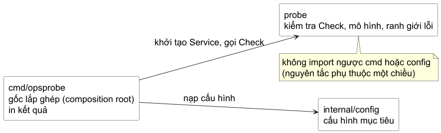

# Chương 5 — Package là ranh giới

Sau Chương 4, `opsprobe` có một API cho một lần probe. Nhưng lab vẫn là một package `main` chứa model, policy error, config giả và cách in ra terminal. Khi mọi thứ còn ngắn, một tệp là lựa chọn tốt. Vấn đề xuất hiện không phải vì số tệp tăng, mà vì một thay đổi ở cách in CLI có thể nhìn thấy mọi chi tiết của probe, và một thay đổi config có thể kéo domain model đi cùng.

Ta sẽ không mở đầu bằng cây thư mục “chuẩn”. Ta bắt đầu bằng một review: code nào phải biết `fmt.Println`, code nào phải biết endpoint, và code nào có quyền quyết định config được đọc từ đâu? Khi câu trả lời khác nhau, boundary cũng phải khác nhau.

## Một dependency graph có thể đọc từ ngoài vào trong

Refactor đầu tiên của `opsprobe` có ba vai:

- `cmd/opsprobe` là command: nhận các dependency, gọi use case và trình bày kết quả.
- `probe` là package importable: sở hữu model cho một lần kiểm tra và không in ra terminal.
- `internal/config` là implementation detail của application: biết target mặc định hôm nay, nhưng không trở thành API công khai mà module khác được hứa hỗ trợ.

@figure Dependency direction là công cụ review. `cmd/opsprobe` là composition root; nó biết các package cụ thể. `probe` không biết CLI hay config source nên có thể được đọc, test và thay thế runner mà không kéo presentation theo.

`go.mod` đặt module path, còn mỗi directory Go là một package. Vì lab dùng module `example.com/golang-master/part5-package-design`, import path của package `probe` là `example.com/golang-master/part5-package-design/probe`. Một package có thể gồm nhiều file trong cùng directory; chia file không tạo thêm boundary nếu chúng vẫn khai báo cùng `package probe`.

~~~text
part5-package-design/
├── go.mod
├── cmd/opsprobe/main.go
├── probe/doc.go
├── probe/check.go
└── internal/config/config.go
~~~

Tên `cmd` là convention hữu ích khi repository có thể chứa nhiều executable; bản thân compiler không trao ý nghĩa đặc biệt cho nó. `main.go` cũng chỉ là tên file theo convention. Boundary thực sự đến từ package clause, import path và hướng dependency.

## Export là lời hứa, không phải cách sửa compile error

Trong `probe`, caller cần tạo service, truyền một runner và đọc result. Những khái niệm ấy mới cần export:

~~~go
package probe

type Endpoint struct { Host string; Port int }
type Service struct { Name string; Endpoint Endpoint }

type Runner func(context.Context, Endpoint) error
type Result struct { Service string; Healthy bool }

func Check(
	ctx context.Context,
	service Service,
	run Runner,
) (Result, error)
~~~

Chữ cái đầu viết hoa không làm type “quan trọng hơn”; nó mở một contract cho package khác. `Check` được export vì command thực sự gọi nó. Helper thêm context error ở bên trong có thể giữ unexported vì chưa có caller nào ngoài `probe` cần nó. Export trước rồi hy vọng một consumer xuất hiện là cách tạo API phải mang gánh nặng tương thích không cần thiết.

Package documentation cũng là một phần của contract. File `probe/doc.go` bắt đầu bằng comment `Package probe ...`, nói package chịu trách nhiệm gì và không chịu trách nhiệm gì. Comment của export nên mô tả behavior mà caller có thể dựa vào, không chỉ lặp lại tên type.

## `internal` là boundary do compiler kiểm tra

Target mặc định là policy của application hiện tại. Ta để nó trong `internal/config`:

~~~go
package config

type Target struct {
	Name string
	Host string
	Port int
}

func DefaultTargets() []Target {
	return []Target{
		{Name: "billing", Host: "billing.internal", Port: 8443},
	}
}
~~~

Package ở `internal` không phải “private bằng thỏa thuận”. Go chỉ cho code nằm trong cây thư mục của parent import nó. Vì `cmd/opsprobe` nằm dưới module root - parent của `internal` - nó import được `internal/config`. Một module khác import `example.com/golang-master/part5-package-design/internal/config` sẽ bị `go` command từ chối.

Đây không phải lý do để nhét mọi package vào `internal` theo phản xạ. Với binary tự chứa, đó thường là default tốt vì không hứa API ngoài. Với `probe` trong lab này, ta cố tình để nó importable để boundary giữa domain operation và CLI được nhìn thấy. Nếu mai kia không còn consumer ngoài application, nó cũng có thể trở thành internal; vị trí phải theo consumer thật, không theo cây thư mục đẹp mắt.

## Composition root chuyển dữ liệu, không giấu dependency

`config.Target` và `probe.Service` không phải cùng type. Chúng thuộc hai boundary khác nhau: config nói dữ liệu được khai báo thế nào; probe nói một operation cần gì. `cmd/opsprobe` là nơi phù hợp để map giữa chúng:

~~~go
for _, target := range config.DefaultTargets() {
	service := probe.Service{
		Name: target.Name,
		Endpoint: probe.Endpoint{
			Host: target.Host,
			Port: target.Port,
		},
	}

	result, err := probe.Check(ctx, service, run)
	if err != nil {
		fmt.Printf("%s: %v\n", service.Name, err)
		continue
	}
	fmt.Printf(
		"%s healthy=%t\n",
		result.Service,
		result.Healthy,
	)
}
~~~

Mapping này trông như boilerplate nhỏ, nhưng nó giữ dependency direction trung thực: `probe` không cần import config, config không cần biết Result, và code in terminal không rò vào domain package. Khi source config chuyển từ default sang file hay environment ở chương sau, `probe.Check` không đổi chỉ vì đường đi của config đã đổi.

## Một refactor có kiểm chứng, không phải một lần dời file

Lab kiểm tra ba điều có thể bị hỏng khi tách package:

- `probe.Check` chuyển cancellation thành error có thể nhận diện bằng `errors.Is`, và không chạy runner khi context đã bị cancel.
- Result thành công mang đúng service name và `Healthy=true`.
- `internal/config` trả dữ liệu độc lập theo từng lần gọi; caller sửa slice nhận được không làm thay default của lần sau.

Test cuối không phải để khẳng định “mọi slice đều dangerous”. Nó chứng minh ownership của config factory: `DefaultTargets` tạo dữ liệu mới cho caller thay vì phát một slice dùng chung. Đây là cùng câu hỏi value semantics của Chương 2, nay được đặt vào một package boundary.

Lần này không bắt đầu từ implementation đã tách. Mở `labs/part5-package-refactor` trong VS Code: điểm xuất phát là một `main.go` monolithic đang chạy. Chạy `go run .` để giữ behavior làm mốc, rồi chạy `go test -tags exercise ./...`. Lỗi compiler vì package `probe` chưa tồn tại là tín hiệu bắt đầu, không phải lỗi để lờ đi: test đang đòi một public boundary mà code chưa có. Từ requirement và test, anh tự quyết định file nào đi vào `probe`, file nào là `internal/config`, và command map hai model ở đâu. Khi xong, `go run ./cmd/opsprobe` phải giữ output, còn `go test -tags exercise ./...` và `go vet ./...` phải xanh.

---

**Đáp án — chỉ đọc sau khi đã tự làm.** Reference implementation nằm ở `labs/part5-package-design`, nhưng chỉ nên mở sau khi acceptance test đã cho phản hồi đầu tiên. Ranh giới cần giữ là: `probe` export operation mà test gọi, `internal/config` giữ policy default và trả slice mới, còn `cmd/opsprobe` là nơi map data rồi in kết quả. Không có lý do để `probe` import ngược config hoặc terminal.

> **Bài tập - đặt code ở đâu?** Một bạn muốn thêm `fmt.Println` vào `probe.Check` để in progress, và muốn `probe` gọi `config.DefaultTargets` để đỡ mapping ở `main`. Với dependency graph trên, hai thay đổi đó tạo ra rủi ro gì? Đề xuất nơi thay thế cho mỗi việc.

**Đáp án.** `fmt.Println` kéo presentation vào package có thể import; command nên quyết định format và nơi ghi output. Để `probe` gọi config đảo dependency từ domain operation sang application policy, khiến test probe phải mang config theo. Progress có thể là result/event do caller trình bày; mapping nên ở command hoặc một application service nằm phía ngoài cả `probe` lẫn config.

## Điểm dừng: package đủ nhỏ để thay đổi

Chưa có một “architecture hoàn chỉnh” nào ở đây: chưa parse file, chưa dùng generic, chưa tạo package cho từng noun. Ta chỉ có một graph mà mỗi mũi tên trả lời được “vì sao package này cần biết package kia?”. Đó là mức cấu trúc đủ để tiếp tục thay đổi code mà không biến mọi thay đổi thành sửa `main`.
