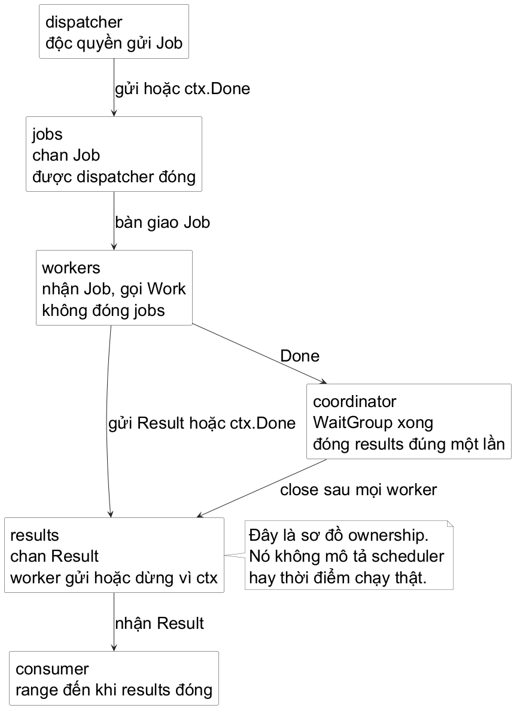

# Chương 9 — Dòng công việc có áp suất

Mô hình tinh thần của chương này là **một send trên kênh truyền là một lần bàn giao còn dang dở cho tới khi bên nhận nhận nó, vùng đệm giữ nó, hoặc người gửi chọn dừng**. kênh truyền không biến công việc thành “song song an toàn” chỉ bằng một dấu `<-`. Nó buộc ta viết rõ ai còn nợ ai một giá trị, ai báo không còn giá trị nào nữa, và điều gì xảy ra khi người nhận không còn chờ.

Hãy bắt đầu bằng một tiện ích có vẻ hợp lý. `firstSuccess` chạy nhiều probe, nhận kết quả đầu tiên rồi return:

~~~go
results := make(chan Result)

for _, probe := range probes {
	go func(probe Probe) {
		result := probe(ctx)
		results <- result
	}(probe)
}

select {
case result := <-results:
	return result, nil
case <-ctx.Done():
	return Result{}, ctx.Err()
}
~~~

Nếu một probe xong trước, bên gọi nhận một `Result` và rời hàm. Những probe xong sau vẫn cố gửi. Vì `results` là unbuffered và không còn bộ tiếp nhận, chúng khối lệnh ở `results <- result`. Đây là goroutine leak: work đã xong nhưng goroutine không thể kết thúc vì nó đang giữ một lần bàn giao không còn ai nhận. `context` không tự cứu đoạn send này; nó chỉ là một tín hiệu mà mã nguồn phải chọn lắng nghe.

## Dừng đúng chỗ send

Một worker gửi kết quả phải nhìn đồng thời hai khả năng: consumer sẵn sàng nhận, hoặc yêu cầu đã hết lý do để tiếp tục. `select` đặt hai quyết định ấy cạnh nhau:

~~~go
select {
case out <- result:
	// Consumer đã nhận quyền sở hữu result.
case <-ctx.Done():
	// Không có lần bàn giao nào nữa.
	// Worker được phép kết thúc.
}
~~~

Đây không phải hết thời hạn (timeout) chung chung. Nếu `out` chưa có bộ tiếp nhận và context chưa bị hủy, worker chờ có chủ đích: áp suất của consumer đã truyền ngược về worker. Nếu context bị hủy, worker bỏ kết quả chưa bàn giao để không bị kẹt. Còn `Work` đang chạy bên trong worker có dừng ngay hay không lại là contract khác: `ctx` là yêu cầu hủy, không thể cưỡng bức một hàm hoặc system call bất kỳ dừng tức thì.

`select` chỉ chọn một communication đang có thể tiến lên. Khi nhiều case cùng sẵn sàng, specification yêu cầu chọn một case theo cách pseudo-random đồng đều; nó không hứa ưu tiên, fairness dài hạn hay thứ tự business. `default` khiến `select` không khối lệnh, vì thế rất dễ vô tình biến “consumer đang chậm” thành “bỏ qua dữ liệu”. Chỉ dùng `default` khi bỏ qua hoặc chuyển sang cơ chế khác là policy được viết rõ.

## vùng đệm là khoảng nợ hữu hạn

Với kênh truyền không vùng đệm, sender và bộ tiếp nhận phải gặp nhau tại cùng một lần communication. Với `make(chan Result, 8)`, sender có thể đi trước tối đa tám result chưa được consumer lấy. Số `8` không làm work nhanh hơn, không phải số worker, và không phải bằng chứng hệ thống chịu tải tám yêu cầu. Nó là lượng backlog chương trình cho phép giữ trong bộ nhớ trước khi áp suất quay lại người gửi.

@table vùng đệm là backlog hữu hạn, không phải số worker

| Thiết kế | Sender được đi trước bao xa? | Câu hỏi phải trả lời |
| --- | --- | --- |
| `make(chan T)` | Không có chỗ đệm; cần bộ tiếp nhận sẵn sàng. | Người gửi có được phép chờ consumer không? |
| `make(chan T, n)` | Tối đa `n` giá trị chưa nhận. | `n` đại diện quota bộ nhớ hay burst nào? Khi đầy thì policy là gì? |
| `select` có `default` | Có thể không gửi dù kênh truyền chưa bị đóng. | Bỏ, log, retry hay trả lỗi có được hứa không? |

Đây là semantics ngôn ngữ, không phải mô hình scheduler: buffered kênh truyền chỉ thay đổi lúc send/receive có thể tiếp tục. Memory model còn cam kết send xảy ra trước khi receive tương ứng hoàn tất. Cam kết ấy giúp truyền một giá trị và các việc đã được chuẩn bị trước send; nó không cấp quyền cho nhiều goroutine cùng sửa một state tùy ý.

## Close nói về người gửi, không nói “mọi thứ ổn”

`close(results)` có nghĩa là sẽ không còn send nào lên `results`. Nó không có nghĩa consumer đã xử lý hết result, không giết worker, và không làm send đang treo tự biến mất. Các giá trị đã vùng đệm vẫn được nhận trước; sau đó receive trả zero giá trị với `ok == false`. Vì vậy `for result := range results` là contract dễ đọc: consumer tiếp tục lấy mọi result đã bàn giao, rồi dừng khi owner đóng kênh.

Chỉ owner của phía gửi mới nên close kênh truyền. Trong một worker pool, không worker nào tự biết mình là worker cuối; cho worker nào xong trước `close(results)` sẽ khiến worker khác send tiếp panic. Ta cần một coordinator biết tất cả worker đã return rồi mới đóng output đúng một lần.

@figure Sơ đồ này là mental model về ownership, không phải timeline scheduler. Mỗi kênh truyền có một owner của tín hiệu kết thúc, và mọi đường worker phải có lối thoát khi consumer không còn nhận.

## Đọc một worker pool như một hợp đồng đóng kênh

Lab `labs/part9-workflow-pressure` không nối thẳng vào `opsprobe`. Ta chưa có requirement môi trường vận hành nào buộc CLI ấy phải chạy nhiều điểm cuối cùng lúc. Dùng reproducer độc lập giữ một câu hỏi đủ sắc: một producer, nhiều worker và một consumer kết thúc với bao nhiêu result, ở thời điểm nào?

Mở `exercise/pool_test.go` trước. Test không cho sẵn hiện thực; nó chỉ đòi các type `Job`, `Result`, `Work` và hàm `Run`. Contract của `Run` có bốn phần:

- Mỗi job hoàn tất bình thường sinh đúng một `Result`.
- Không quá `workers` lời gọi `Work` chạy đồng thời.
- Khi context bị hủy trong lúc output không được tiêu thụ, output vẫn phải đóng; worker không được mắc kẹt ở send.
- Khi dispatcher không còn job và mọi worker đã return, output đóng đúng một lần để consumer có thể kết thúc `range`.

Có một biên nhỏ nhưng đáng giữ ngay từ đầu: nếu `ctx` đã bị hủy trước khi dispatcher kịp bàn giao job, `Work` không được bắt đầu chỉ vì một worker vừa được tạo. hủy thực thi là policy dừng nhận việc mới; đưa một `Job` vào `Work` với context đã hết hạn chỉ tạo thêm một kết quả không còn người sở hữu.

Chạy lệnh khởi đầu; nó phải đỏ vì API chưa tồn tại:

~~~powershell
go test -tags exercise ./exercise
~~~

Đừng thêm vùng đệm lớn để làm test im. Test hủy thực thi cố ý không consume output; một implementation chỉ có `out <- result` sẽ lộ goroutine bị kẹt. Cũng đừng đóng `results` từ worker. Hãy phác trên giấy ba owner trước khi mã nguồn: dispatcher sở hữu send và `close(jobs)`; các worker chỉ receive job rồi send result; coordinator sở hữu `close(results)` sau `WaitGroup.Wait`.

Một khung đủ nhỏ cho điểm send quan trọng là:

~~~go
result := Result{Job: job, Err: work(ctx, job)}

if ctx.Err() != nil {
	return
}

select {
case out <- result:
case <-ctx.Done():
	return
}
~~~

`ctx.Err()` trước `select` là policy có chủ đích của lab: nếu hủy thực thi đã được quan sát sau `Work`, result đó không còn được bàn giao, kể cả khi consumer vừa quay lại. Bên trong `select`, hủy thực thi vẫn là đường thoát cho trường hợp consumer biến mất trong lúc worker đang chờ. Phần còn lại là thiết kế của anh: dispatcher đưa `jobs` vào kênh truyền thế nào để cũng nghe `ctx.Done`; worker nhận đến khi `jobs` đóng ra sao; goroutine nào chờ `WaitGroup`; và trường hợp `workers <= 0` trả output đóng ngay hay bị từ chối ở API boundary. Test hiện tại chốt policy thứ nhất để câu hỏi vẫn tập trung vào vòng đời.

Đừng chỉ kiểm tra hủy thực thi ở dispatcher. Một job có thể đã được bàn giao đúng lúc hủy thực thi xảy ra; worker cần kiểm tra lại trước khi gọi `Work`. Điều này không cưỡng bức một `Work` đang chạy phải dừng — chính `Work` còn phải tôn trọng context của nó — nhưng nó giữ được lời hứa hẹp hơn và kiểm chứng được: sau khi hủy thực thi đã được quan sát, pool không khởi động một job mới.

Sau khi tự làm, chạy bản tham chiếu với race detector:

~~~powershell
go test -race ./fixed
~~~

## Hướng của kênh truyền cho thấy quyền hạn

Trong hàm nội bộ, `chan Job` có cả quyền send và receive. Nhưng biên API có thể thu hẹp quyền đó:

~~~go
func dispatch(ctx context.Context, jobs []Job) <-chan Job
func consume(in <-chan Job, out chan<- Result)
~~~

`<-chan Job` nói bên gọi chỉ được receive; `chan<- Result` nói bên gọi chỉ được send. Direction không thay thế ownership document - hai hàm vẫn phải thỏa thuận ai close - nhưng compiler đã ngăn một số nhầm lẫn lộ liễu. Bên nhận `in` không thể vô tình send; consumer của output không thể `close` một receive-only kênh truyền.

Khi đọc mã nguồn kênh truyền, đừng bắt đầu bằng câu “kênh truyền này buffered hay không?”. Hỏi theo thứ tự khó hơn nhưng hữu ích hơn: giá trị nào đang được bàn giao, bên nào phải còn sống để receive nó, ai có quyền nói không còn send nữa, và hủy thực thi có mở đường thoát cho mọi lần khối lệnh không. Trả lời được bốn câu ấy trước khi chọn capacity thường ngăn được cả leak, deadlock và queue vô hạn.

## Ghi chú kiểm chứng

1. Go Team. The Go Programming Language Specification, mục kênh truyền types, Send các câu lệnh, Receive operator, Close và Select các câu lệnh. go.dev/ref/spec
2. Go Team. The Go Memory Model, mục kênh truyền communication; và Package context. go.dev/ref/mem, pkg.go.dev/context
