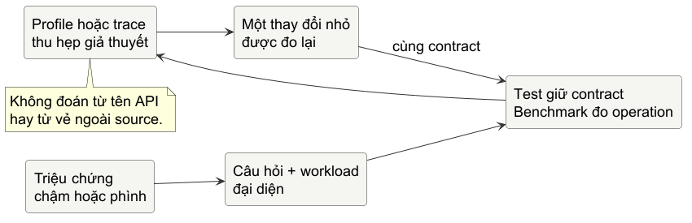

# Chương 10 — Khi chương trình chậm hoặc phình

Một chương trình bị gọi là “chậm” rất dễ kéo theo một cuộc săn tối ưu hóa vô ích. Có người thay `fmt` bằng nối chuỗi, có người thêm goroutine, có người nhìn một dòng trông có vẻ đắt rồi sửa nó. Mọi thay đổi ấy có thể làm code khó đọc hơn mà vẫn không chạm vào thời gian người dùng đang chờ.

Mô hình tinh thần của chương này là: **tối ưu hóa là một giả thuyết được kiểm tra dưới một tải đại diện; một phép đo chỉ trả lời câu hỏi mà nó được thiết kế để trả lời**. Benchmark không tuyên bố service của anh nhanh trong mọi hoàn cảnh. CPU profile không nói bộ nhớ đang phình. Trace không phải bản chụp ý nghĩa của chương trình. Chúng là các dụng cụ khác nhau để thu hẹp vùng suy đoán.

Hãy giả sử một lệnh nhỏ xuất báo cáo kiểm tra endpoint. Nó chạy ổn với vài endpoint, nhưng trong CI có hàng nghìn endpoint thì mất nhiều giây và heap tăng rõ. Câu “hãy tối ưu formatter” mới chỉ là phỏng đoán. Trước khi động vào code, ta cần biến nó thành một câu hỏi kiểm chứng được: *với một danh sách kích thước đã chọn, `Render` tốn thời gian và allocation bao nhiêu; phần tốn chi phí nằm ở đâu; một thay đổi có giữ nguyên output và giảm chi phí đó không?*

## Một benchmark là hợp đồng về phép đo

Một benchmark có ích phải nói rõ phần nào nằm trong phép đo. Nếu nó đọc tệp, tạo dữ liệu ngẫu nhiên, mở kết nối và format kết quả trong cùng một vòng lặp, con số `ns/op` không còn trả lời được một câu hỏi đơn giản. Trước tiên hãy dựng input đại diện ở ngoài vòng đo; sau đó chỉ để phần cần so sánh ở trong vòng.

Từ Go 1.24, benchmark mới nên dùng `b.Loop()`. Lần gọi đầu tiên tự bắt đầu timer sau phần setup, và kết thúc timer khi vòng lặp dừng. Điều đó giảm một lỗi quen thuộc: vô tình đo cả công việc chuẩn bị hoặc để compiler loại bỏ một body không có quan sát được.

~~~go
func BenchmarkRender(b *testing.B) {
	readings := representativeReadings(1_000)

	for b.Loop() {
		Render(readings)
	}
}
~~~

Chạy benchmark với allocation metric:

~~~powershell
go test -bench BenchmarkRender -benchmem -count=6 ./fixed
~~~

`ns/op` là thời gian trung bình của operation trong lần chạy đó. `B/op` và `allocs/op` cho biết bộ khung benchmark đã đo được bao nhiêu byte và lần cấp phát trên mỗi operation. Chúng không phải latency p99 của một HTTP service, cũng không phải lời hứa giữ nguyên khi đổi CPU, version Go, `GOMAXPROCS`, input hoặc load nền của máy. Sáu lần chạy không biến dữ liệu thành chân lý phổ quát; nó giúp anh thấy một thay đổi có bền qua các lần chạy hay chỉ là nhiễu.

Vì thế đừng copy một con số benchmark vào sách hoặc PR rồi gọi nó là “nhanh hơn” mà không giữ lại command, version Go, input và phạm vi. Với một thay đổi có ý nghĩa, hãy so sánh nhiều lần chạy trên cùng máy hoặc dùng công cụ so sánh thống kê phù hợp. Còn trước mắt, điều đáng học là discipline: output phải được giữ đúng trước, rồi mới quan sát chi phí.

@table Mỗi dụng cụ trả lời một câu khác nhau

| Dụng cụ | Câu hỏi nó giúp trả lời | Không tự chứng minh được |
| --- | --- | --- |
| Unit test | Output và error có còn đúng contract? | Thay đổi nhanh hơn hay dùng ít bộ nhớ hơn. |
| Benchmark | Operation này thay đổi thế nào dưới input đã chọn? | Request ngoài đời có latency giống hệt. |
| CPU profile | Khi đang dùng CPU, stack nào tích lũy chi phí? | Thời gian chờ I/O hoặc allocation heap đang là nguyên nhân. |
| Heap/allocation profile | Đường code nào xuất hiện trong mẫu allocation hoặc heap? | Mỗi allocation cá thể đã được đếm chính xác. |
| Execution trace | Trong một khoảng thời gian, runtime và goroutine tiến triển ra sao? | Một dòng source là “thủ phạm” nếu chưa đối chiếu workload. |

## Đừng sửa từ vẻ bề ngoài của code

Lab của chương bắt đầu bằng test đỏ: hàm `Render` chưa tồn tại. Contract là output phải giữ nguyên từng byte theo test; input có thể có hàng nghìn reading; người học tự chọn cách dựng chuỗi rồi tự thêm benchmark. Cách cố tình ngây thơ thường là cộng string trong vòng lặp. Cách tham chiếu dùng `strings.Builder` và `strconv.FormatInt`, nhưng đó chỉ là một lời giải cho contract cụ thể, không phải câu thần chú rằng mọi string đều phải dùng Builder.

~~~powershell
cd labs/part10-measure-first
go test -tags exercise ./exercise
go test -race -tags exercise ./exercise
go test -bench . -benchmem ./fixed
~~~

Sau khi test xanh, hãy nhìn benchmark rồi mới mở `fixed/`. Nếu code của anh nhanh hơn reference nhưng bỏ dấu xuống dòng hoặc đổi format số, anh vừa thắng một cuộc thi khác. Nếu hai bản tương đương trong phạm vi đo, ưu tiên bản dễ đọc hơn. Một tối ưu chỉ đáng giữ khi lợi ích của nó nằm đúng nơi vấn đề cần giải và cái giá về độ phức tạp có thể biện minh.

## Profile để thay “có lẽ” bằng một đường đi có tên

Khi benchmark cho thấy một operation có chi phí đáng quan tâm, profiler giúp xem chi phí tụ lại ở đâu. Thu profile trên workload tương ứng với câu hỏi; đừng lấy profile của một test khởi động program rồi suy luận về đường nóng production.

~~~powershell
go test -run '^$' -bench BenchmarkRender -cpuprofile cpu.out -memprofile mem.out ./fixed
go tool pprof -top cpu.out
go tool pprof -top -alloc_space mem.out
~~~

CPU profile lấy mẫu những lúc process thực sự dùng CPU. Nó phù hợp để tìm stack đang làm computation; nó không biến thời gian request bị block ở network thành CPU time. Heap profile là profile mẫu của allocation/heap, nên `-alloc_space` hữu ích khi hỏi tổng lượng byte đã cấp phát theo đường code, còn `-inuse_space` gần hơn với câu hỏi “đến cuối profile, cái gì đang còn sống”. Hai góc nhìn có thể chỉ đến hai quyết định khác nhau.

`flat` là chi phí gắn trực tiếp vào function; `cum` gồm cả thời gian bên dưới lời gọi của nó. Một function có `flat` nhỏ nhưng `cum` lớn không phải vô tội: nó có thể là cánh cửa dẫn vào công việc đắt. Hãy chọn một stack nổi bật, đọc source và kiểm tra lại bằng benchmark. Đó là vòng lặp điều tra nhỏ nhất:

@figure Một vòng điều tra hiệu năng. Sơ đồ là conceptual; dữ liệu bắt đầu từ workload đại diện, không từ tên một API trông “chậm”.

Profile có overhead và có thể làm méo phép đo. Tài liệu chẩn đoán của Go còn lưu ý một số loại diagnostic có thể ảnh hưởng lẫn nhau. Thu từng loại riêng khi cần chính xác, ghi lại command, và đừng kết luận từ profile lấy trong một môi trường không giống nơi lỗi xuất hiện.

## Trace kể chuyện thời gian, không thay profile

Khi câu hỏi chuyển từ “CPU đi đâu?” sang “goroutine này chờ ai, scheduler có bị nghẽn, hay syscall kéo dài bao lâu?”, execution trace cho một timeline giàu ngữ cảnh hơn. Nó có thể được tạo từ test:

~~~powershell
go test -run TestScenario -trace trace.out ./fixed
go tool trace trace.out
~~~

Trace phù hợp với một khoảng thời gian nhỏ và scenario rõ. Mở trace của một process chạy lâu, workload mơ hồ, rồi tìm một vạch màu lạ là cách chắc chắn để có thêm câu hỏi chứ chưa có đáp án. Đặt khoảng trace quanh hành vi cần điều tra, rồi đối chiếu lại với log, benchmark hoặc request trace ở chương sau.

Ở đây cần tách bốn lớp mà người viết performance rất hay trộn lẫn. Contract của `testing.B.Loop` là documented behavior của package `testing`. CPU/heap profile và execution trace là dữ liệu quan sát được trong một lần chạy. Escape analysis từ compiler là chẩn đoán implementation của compiler hiện tại, không phải luật ngôn ngữ. Còn G/M/P, garbage collector và cách runtime xử lý syscall là implementation detail: chúng quan trọng khi evidence dẫn đến đó, nhưng tên của chúng không phải lời giải thích cho mọi chậm trễ.

~~~powershell
go build -gcflags=-m=2 ./fixed
~~~

Thông báo “escapes to heap” giúp tạo giả thuyết về lifetime hoặc interface boxing trong build hiện tại. Nó không cho phép anh xóa allocation bằng cách ép code khó hiểu, và cũng không thay thế `-benchmem`. Trong chương này, hãy xem escape analysis như một kính lúp phụ. Khi runtime thật sự trở thành nguyên nhân, ta sẽ quay lại bằng thí nghiệm và source đúng phiên bản, thay vì biến mô hình runtime thành mê tín.

Lần tới khi ai đó đề nghị “thêm worker cho nhanh”, hãy hỏi trước: workload nào đang bị chậm; request đang dùng CPU, chờ network hay bị giữ bởi quota; contract nào phải giữ nguyên; và phép đo nào có thể bác bỏ đề nghị ấy? Một câu hỏi đo được thường có giá trị hơn năm thay đổi nhìn có vẻ thông minh.

@references
1. Go Team. Package testing, phần Benchmarks và `B.Loop`. pkg.go.dev/testing
2. Go Team. Diagnostics, phần Profiling và Tracing. go.dev/doc/diagnostics
3. Go Team. Command trace. go.dev/cmd/trace
