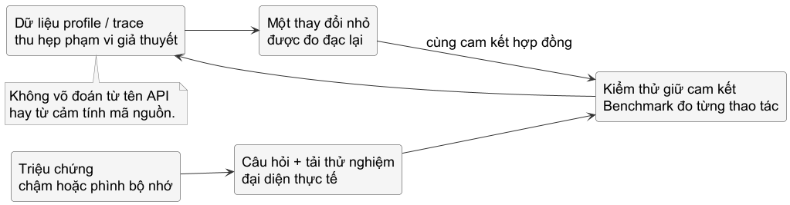

<!-- BOOK_ROLE: FOUNDATION_CORE -->

# Chương 10 — Khi chương trình chậm hoặc phình

Một chương trình bị phán xét là "chậm" hoặc "tốn bộ nhớ" thường kéo theo những nỗ lực tối ưu hóa mù quáng: thay thế gói `fmt` bằng phép cộng chuỗi thủ công, mở thêm hàng loạt goroutine không kiểm soát, hoặc viết lại thuật toán theo những mẹo vặt phức tạp. Những can thiệp này thường làm mã nguồn suy giảm độ trong sáng nghiêm trọng mà không giải quyết được nguyên nhân gốc rễ khiến người dùng hoặc hệ thống phải chờ đợi.

Mô hình tư duy nền tảng của chương này xác lập: tối ưu hóa là việc kiểm chứng một giả thuyết khoa học dưới một khối lượng công việc (workload) mang tính đại diện; một phép đo chỉ trả lời câu hỏi mà nó được thiết kế để đo lường. Benchmark không bảo đảm một dịch vụ mạng sẽ phản hồi nhanh trong mọi tình huống thực tế. Bản ghi CPU profile không phản ánh việc bộ nhớ đang phình to. Dấu vết thực thi (Execution trace) không phải là bản chụp toàn cảnh ngữ nghĩa của mã nguồn. Mỗi công cụ là một dụng cụ đo lường chuyên biệt nhằm thu hẹp không gian suy đoán.

Giả sử một tiến trình kiểm tra dịch vụ định kỳ (`opsprobe`) cần kết xuất báo cáo trạng thái cho hàng nghìn endpoint mạng. Khi chạy trên môi trường tích hợp liên tục (CI), thao tác này tiêu tốn nhiều giây và dung lượng vùng nhớ động (heap) tăng vọt. Thay vì phỏng đoán cảm tính, kỹ sư chuyển hóa vấn đề thành câu hỏi kỹ thuật có thể đo đạc: với một danh sách đầu vào xác định, hàm `Render` tiêu tốn bao nhiêu thời gian CPU và bao nhiêu lần cấp phát bộ nhớ; chu kỳ xử lý đắt đỏ tập trung ở đâu; và một thiết kế thay thế có bảo toàn từng byte đầu ra trong khi giảm thiểu chi phí tài nguyên hay không?

## Bản chất Chuỗi Tối ưu hóa: Từ Source đến Mã máy

Để đặt câu hỏi về hiệu năng, tách quyết định lúc compile khỏi công việc lúc chạy:

| Tầng | Cơ chế cần điều tra | Bằng chứng phù hợp |
| --- | --- | --- |
| Compiler của toolchain đã pin | Inlining, escape analysis, SSA và loại bỏ kiểm tra biên có thể đổi cách thực hiện cùng semantics. | Diagnostic compiler; assembly của cùng source và cờ build. |
| Mã máy của artifact | Instruction, thanh ghi và lời gọi còn lại sau build. | Objdump của đúng binary, không trộn với listing từ build khác. |
| Runtime khi workload chạy | Allocation, GC, lập lịch và I/O tiêu tốn tài nguyên theo đường thực thi. | Benchmark, profile và trace, kèm môi trường và giới hạn phép đo. |

Các bước này là mô hình để đặt câu hỏi, không phải pipeline hay ngưỡng ổn định của ngôn ngữ. Inlining có thể làm thay đổi thông tin mà escape analysis nhìn thấy; compiler cũng có thể đặt một value vào thanh ghi, stack, heap hoặc bỏ hẳn nó. Chỉ khi chi phí đã được đo, output của compiler và profiler mới cho biết điều gì xảy ra với phiên bản, kiến trúc và workload đang xét.

## Phân tích Thoát Bộ nhớ: Ngăn xếp đối đầu Vùng nhớ Động

Trình biên dịch Go dùng escape analysis để suy luận liệu một value có cần tồn tại sau scope mà compiler đang xét hay không. Đây là heuristic triển khai, không phải tính chất cú pháp của một biến hay lời hứa rằng một dòng code luôn cấp phát ở một nơi.

Một value không escape có thể ở stack, thanh ghi hoặc bị tối ưu hóa mất; nó không mặc nhiên có một allocation đo được. Ngược lại, trả con trỏ, lưu vào global hoặc đóng gói vào interface là tín hiệu để compiler phân tích lifetime, không phải luật “chắc chắn heap”. Kết quả còn phụ thuộc thân hàm, inlining, kiến trúc và version. Vì vậy, `-gcflags=all=-m=2` là bằng chứng cho một lần biên dịch cụ thể; benchmark `allocs/op` mới cho biết contract đo có allocation quan sát được hay không.

Chạy `go build -gcflags=all=-m=2 ./fixed` từ `labs/part10-measure-first` với Go 1.27.1. Trích đoạn dưới rút gọn prefix đường dẫn `fixed/`, lược dòng không liên quan và ngắt dòng cho vừa khung; không phải toàn bộ diagnostic:

~~~text
./render.go:13:6: cannot inline Render:
    function too complex: cost 231 exceeds budget 80
./render.go:16:18: inlining call to
    strings.(*Builder).WriteString
./render.go:18:36: inlining call to strconv.FormatInt
./render.go:13:13: readings does not escape
./render.go:16:18: append(strings.b.buf, strings.s...)
    escapes to heap in Render:
  flow: {heap} ← &{storage for append(...)}:
    from append(strings.b.buf, strings.s...) (spill)
    from strings.b.buf = append(...) (assign)
~~~

Output này ghi nhận hai quan sát cho source artifact và toolchain của thí nghiệm:

Thứ nhất, tham số `readings []Reading` được báo `does not escape`. Slice không tự quyết định nơi dữ liệu hay descriptor nằm; kết quả chỉ nói rằng compiler ở lần này không cần kéo value đó ra heap vì việc dùng trong hàm.

Thứ hai, storage tạo bởi `append` trong `strings.Builder` được báo escape. Đó là dữ liệu thực nghiệm hữu ích để giải thích `allocs/op`, không phải quy tắc rằng mọi `append` hoặc mọi `Builder` đều heap-allocate.

## Tối ưu hóa SSA và Loại bỏ Kiểm tra Biên (Bounds Check Elimination)

Một tối ưu hóa quan trọng của backend SSA là loại bỏ kiểm tra biên khi compiler chứng minh được chỉ số hợp lệ. Ở ngữ nghĩa Go, truy cập ngoài biên phải panic; instruction cụ thể dùng để bảo vệ điều đó phụ thuộc compiler và kiến trúc. Output `ssa/prove` dưới đây là quan sát của thí nghiệm Go 1.27.1, không phải hình dạng mã máy mà mọi bản build phải có.

Chạy cùng lệnh build với `-gcflags=all=-d=ssa/prove/debug=1`. Cờ `all` còn phát diagnostic cho thư viện chuẩn; prefix GOROOT được rút gọn ở trích đoạn dưới, không biến các dòng `strings.go` thành output của thân `Render`:

~~~text
./render.go:15:20: Induction variable: limits [0,?), increment 1
./render.go:15:20: Inverted loop iteration
./render.go:21:19: Disproved Less64
strings/strings.go:987:27: Proved IsInBounds
strings/strings.go:988:38: Proved IsSliceInBounds
~~~

Các dòng `render.go` cho thấy nhận diện biến quy nạp và đảo chiều vòng lặp; các dòng `strings.go` báo điều kiện đã được chứng minh trong thư viện chuẩn của lượt build ấy. Muốn kết luận một bounds check cụ thể của `Render` đã bị bỏ, phải tìm đúng source vị trí và đối chiếu diagnostic/assembly tương ứng. Giữ invariant dễ đọc rồi đo, không viết code vòng vèo chỉ để ép một hình dạng tối ưu hóa.

## Cơ chế Thu gom Rác và Đánh đổi Không gian - Thời gian

GC trong runtime chuẩn Go 1.27.1 dùng tracing mark-sweep đồng thời, với write barrier và các pha dừng thế giới mô tả ở `runtime/mgc.go`. Nó không phải lựa chọn thuật toán mà specification bắt mọi implementation phải dùng. GC Guide cung cấp mô hình đánh đổi CPU và bộ nhớ; để giải thích chi tiết của edition này, cần đối chiếu thêm source và release notes, không dùng guide như một benchmark dịch vụ.

Trong `runtime/mgcpacer.go` của Go 1.27.1, `gcBackgroundUtilization = 0.25` đặt mục tiêu background marking theo một phần của `GOMAXPROCS` trong pha mark. Không có nghĩa GC luôn chiếm 25% CPU toàn process hay giữ riêng một P trong bốn P: dedicated, fractional và idle workers cùng tham gia, còn assist có chi phí riêng. Muốn biết workload thực sự trả bao nhiêu CPU cho GC, đọc metric/profile của lượt chạy đó.

Runtime có điểm dừng ở sweep termination và mark termination; thời gian dừng cần đọc từ lượt chạy thật, không lấy mục tiêu thiết kế làm latency guarantee. Trong pha mark, allocation có thể tạo khoản nợ công việc đánh dấu theo tỷ lệ mà pacer tính. Khi goroutine còn nợ, đường mark assist có thể bắt nó làm thêm công việc hoặc chờ credit. Đó là một hướng điều tra khi allocation và latency tăng cùng nhau, không phải phép so sánh đơn giản “tốc độ allocation lớn hơn tốc độ mark” hay bằng chứng tail latency chắc chắn tăng. Đối chiếu trace, `runtime/metrics` và đường assist trong source đã pin.

### Green Tea GC là bối cảnh triển khai, không phải contract

Go 1.27.1 có Green Tea GC trong runtime. Ý tưởng chính của thiết kế này là ưu tiên xử lý theo page/span thay vì coi từng object là đơn vị work duy nhất; mục tiêu là cải thiện locality của một số heap. Nó là implementation detail có thể tiếp tục thay đổi giữa các bản Go và không dự báo kết quả cho một service cụ thể. Khi GC xuất hiện trong profile, câu hỏi vận hành vẫn là: allocation rate, live heap, root set, pointer density và latency của workload đang là bao nhiêu? Đo trước, rồi mới suy luận liệu upgrade Go version, giảm allocation hay đổi cấu trúc dữ liệu có ích.

Hai biến số môi trường chi phối trực tiếp hành vi đánh đổi không gian và thời gian này:

Tham số `GOGC`: Chọn một điểm trên trade-off CPU/bộ nhớ. Với Go hiện đại, target heap còn tính cả GC roots: gần đúng là `live heap + (live heap + roots) * GOGC / 100`. `GOGC=100` không luôn có nghĩa tổng heap bằng đúng hai lần live heap. Tăng nó thường giảm tần suất GC và tăng memory overhead; đó là xu hướng phải xác minh bằng workload thật.

`GOMEMLIMIT`, từ Go 1.19, là soft limit cho đại lượng bộ nhớ runtime quản lý, không chỉ live heap. GC có thể làm việc thường xuyên hơn khi tới limit, nhưng runtime cho phép vượt nó để tránh thrashing. Limit này không phải trần RSS hay trần cgroup. Khi đặt trong container, cần đo cả phần charge ngoài đại lượng runtime tính và chừa headroom tương ứng, không chọn một tỷ lệ “an toàn” chung. Nó không bảo đảm tránh OOM; một workload giữ live data lớn hơn ngân sách vẫn cần thay contract hoặc capacity.

## Đo lường Hiệu năng: Benchmark là Hợp đồng Thực nghiệm

Contract benchmark quyết định việc nào phải tính giờ. Nếu đang đo riêng `Render`, dựng readings trước vòng lặp; nếu đang đo cả pipeline nhận và xử lý input, chi phí chuẩn bị tương ứng có thể chính là phần cần đo. Không loại setup theo nghi thức rồi vô tình làm mất workload mà người dùng phải chịu.

`B.Loop` có từ Go 1.24 và là cách viết phù hợp cho benchmark mới ở edition này; vòng `b.N` vẫn được hỗ trợ. Lần gọi đầu reset timer, lần trả false dừng timer, nên setup đặt trước vòng không được tính vào kết quả:

~~~go
func BenchmarkRender(b *testing.B) {
	readings := representativeReadings(1_000)

	for b.Loop() {
		Render(readings)
	}
}
~~~

Lệnh thực thi đo đạc thống kê nhiều lần:

~~~powershell
go test -bench BenchmarkRender -benchmem -count=6 ./fixed
~~~

Chỉ số `ns/op` là thời gian bình quân theo contract benchmark. `B/op` và `allocs/op` là các metric allocation mà benchmark runner báo cho workload đó; chúng không tự nói tổng RSS hay mọi chi phí của service. Một kết quả đo lường đơn lẻ không đại diện cho chân lý phổ quát; việc chạy 6 lượt liên tiếp (`-count=6`) giúp kỹ sư nhận diện được độ biến thiên (nhiễu đo lường) trước khi đưa ra kết luận.

| Công cụ chẩn đoán | Câu hỏi kỹ thuật được giải đáp | Giới hạn phân tích |
| :--- | :--- | :--- |
| Kiểm thử đơn vị (Unit test) | Đầu ra và mã lỗi có bảo toàn đúng cam kết logic? | Không chứng minh được mã chạy nhanh hơn hay tốn ít RAM hơn. |
| Đo lường chuẩn (Benchmark) | Thao tác này tiêu tốn thời gian và phân bổ bộ nhớ ra sao dưới input chuẩn? | Không phản ánh trực tiếp độ trễ mạng hay tải tương tranh thực tế. |
| Phân tích CPU (CPU profile) | Sample CPU tập trung ở stack/hàm nào? | Không đo trực tiếp thời gian chờ khi goroutine đã block; CPU dùng cho syscall, spin hay đường khóa vẫn có thể xuất hiện. |
| Phân tích Bộ nhớ (Heap profile) | Đường dẫn mã nguồn nào chịu trách nhiệm cho các khối cấp phát trên heap? | Dữ liệu mang tính lấy mẫu thống kê, không ghi nhận từng biến riêng lẻ. |
| Dấu vết thực thi (Execution trace) | Sự kiện runtime và chuyển trạng thái goroutine nào xảy ra trong khoảng đã ghi? | Kích thước và overhead tùy workload, thời gian ghi và version; cần ngân sách, không coi trace là diễn giải mọi semantics của source. |

## Phân tích CPU và Bộ nhớ (pprof)

Khi benchmark phát hiện điểm nghẽn hiệu năng, công cụ trích xuất profile (`pprof`) giúp định vị chính xác vị trí tích lũy chi phí trong cây gọi hàm:

~~~powershell
go test -run '^$' -bench BenchmarkRender `
  -cpuprofile cpu.out -memprofile mem.out ./fixed
go tool pprof -top cpu.out
~~~

Chỉ số `flat` ghi nhận chi phí tiêu tốn trực tiếp bên trong thân hàm, trong khi chỉ số `cum` (cumulative) ghi nhận tổng chi phí tích lũy của hàm đó cùng toàn bộ các hàm con mà nó triệu gọi. Một hàm có `flat` nhỏ nhưng `cum` lớn là dấu hiệu cho thấy nó đang dẫn lối vào một chuỗi thao tác tiêu tốn nhiều tài nguyên.

Nếu nghi goroutine bị giữ lại, Go 1.27 có profile `goroutineleak` ở `runtime/pprof` và endpoint tương ứng của `net/http/pprof`, không còn cần experiment từ Go 1.26. Nó tìm một lớp chờ mà runtime xác định không thể được đánh thức, không tìm mọi leak và không tự thu hồi goroutine. Profile không có hit vẫn cần đối chiếu goroutine dump, ownership của channel và cancellation path như Chương 9. Khi mở trace UI, `go tool trace -http=:6060` từ Go 1.27 chỉ nghe localhost; muốn nghe địa chỉ khác phải chỉ định rõ. Đừng đưa profile/trace có dữ liệu nhạy cảm lên một listener công khai chỉ để tiện xem.

@figure Chu trình điều tra hiệu năng hoàn chỉnh. Dữ liệu bắt đầu từ một bài toán đo lường có khối lượng công việc đại diện, kiểm chứng qua profiler, sau đó đối chiếu mã nguồn và tối ưu hóa có đo đạc đối chứng.

## Nghiên cứu Điển cứu Thực tế: Phân tích Bài toán Nối Chuỗi

Thư mục `labs/part10-measure-first` duy trì hai cách hiện thực cho cùng một yêu cầu định dạng văn bản: phương án cơ sở (`baseline`) nối chuỗi bằng toán tử `+=` lặp lại; phương án tối ưu (`fixed`) sử dụng `strings.Builder` và `strconv.FormatInt`.

Workload gồm 1.000 `Reading`, từ `endpoint-0000` đến `endpoint-0999`, dựng ngoài vòng đo. Lượt kiểm chứng local ngày 01-10-2026 dùng Go 1.27.1, `windows/amd64`, CPU 12th Gen Intel Core i5-12500H, benchmark mặc định báo suffix `-16`, chạy sáu lần trên cùng máy/môi trường, Go version, workload và benchmark contract. Khoảng dưới đây là min–max của sáu kết quả `ns/op`, không phải confidence interval. Độ dao động lớn cho thấy cần cẩn trọng khi suy tỷ lệ speedup; đây không phải phép đo latency của service:

| Phương án hiện thực | Khoảng thời gian mỗi operation | Allocation runner báo |
| :--- | :--- | :--- |
| `baseline` (Toán tử `+=`) | 1.306–3.394 ms/op | 10,443,876–10,443,996 B/op; 1,900–1,901 allocs/op |
| `fixed` (`strings.Builder`) | 26.442–89.994 µs/op | 87,600–87,608 B/op; 917 allocs/op |

Trong source `baseline`, mỗi lần nối thêm giữ lại kết quả string dài hơn cho lượt kế tiếp. Source runtime Go 1.27.1 ở `runtime/string.go`, cùng allocation benchmark, giúp điều tra chi phí dựng lại dữ liệu chuỗi; `fixed` gom output trong Builder. Không suy từ đó rằng mọi phép `+` đều allocate hay gán một tỷ lệ throughput cố định. Khi lấy CPU profile bằng lệnh ở trên, đối chiếu các sample của chính lượt chạy với đường nối/copy, không tái dùng phần trăm từ một profile không còn artifact để kiểm tra.

Test output và benchmark hỗ trợ lựa chọn Builder cho workload này: format được giữ và allocation quan sát giảm. Nó chưa xác nhận service production nhanh hơn, vì chưa đo phần network, tải đồng thời hay trải nghiệm người dùng.

## Tối ưu hóa Dựa trên Hồ sơ Vận hành (PGO)

Từ Go 1.20 và hoàn thiện ở các phiên bản gần đây, Go hỗ trợ kỹ thuật Tối ưu hóa Dựa trên Hồ sơ (Profile-Guided Optimization - PGO).

Trong quy trình biên dịch thông thường, compiler chỉ có cái nhìn tĩnh về mã nguồn, không biết nhánh rẽ nào trong câu lệnh `if` hay phương thức nào của `interface` được gọi thường xuyên nhất trong thực tế. Với PGO, kỹ sư thu thập một tệp CPU profile đại diện (`default.pgo`) từ hệ thống production đang chịu tải thực. Trình biên dịch nạp hồ sơ này vào pass phân tích để:

Một là, profile có thể giúp compiler ưu tiên một số cơ hội inlining ở đường nóng. Heuristic, ngưỡng và kết quả không phải API ổn định; hãy xem diagnostic hay benchmark của đúng version thay vì mặc định một hàm chắc chắn sẽ được inline.

Hai là, profile có thể mở ra cơ hội devirtualization khi compiler chứng minh được điều kiện phù hợp. Đó là tối ưu hóa có thể có, không phải lời hứa rằng mọi interface call nóng sẽ thành lời gọi tĩnh hay luôn inline xuyên package.

Tuy nhiên, PGO chỉ đáng tin khi profile đại diện cho workload muốn tối ưu. Ưu tiên profile từ production; khi không thể, staging hoặc benchmark đủ đại diện cũng có thể dùng. Microbenchmark hẹp thường mô tả quá ít chương trình để làm profile PGO tốt; hãy giữ nó để kiểm contract nhỏ. Dù dùng nguồn nào, vẫn phải đo lại kết quả end-to-end.

## Kỷ luật Tối ưu hóa Kỹ thuật

Với một đề xuất tối ưu hóa, bốn bước sau giữ câu hỏi và bằng chứng đi cùng nhau:

Một là, xác định khối lượng công việc đại diện phản ánh đúng bài toán thực tế.

Hai là, thiết lập kiểm thử đơn vị để cố định hợp đồng kết quả đầu ra không bị biến dạng.

Ba là, sử dụng benchmark, escape analysis và profiler để thu thập số liệu định lượng trước khi can thiệp mã nguồn.

Bốn là, đối chiếu lại số liệu sau khi sửa đổi; nếu mức cải thiện không đủ lớn để bù đắp cho độ phức tạp gia tăng của mã nguồn, kiên quyết giữ lại giải pháp đơn giản và dễ bảo trì nhất.

@references
1. Go Team. Package testing, phần Benchmarks và `B.Loop`. pkg.go.dev/testing
2. Go Team. Diagnostics, phần Profiling và Tracing. go.dev/doc/diagnostics
3. Go Team. Command trace. go.dev/cmd/trace
4. Go Team. Go Garbage Collector Guide. go.dev/doc/gc-guide
5. Go Team. Profile-guided optimization. go.dev/doc/pgo
