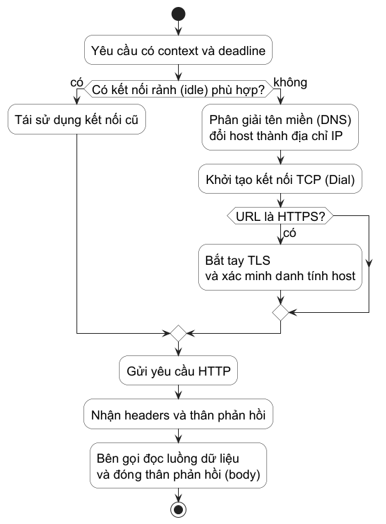

# Chương 11 — Lần theo một yêu cầu HTTP

Ở log, một HTTP call thường chỉ còn lại một dòng: `GET https://api.example/... 1.8s`. Dòng ấy có ích, nhưng nó che gần như toàn bộ câu chuyện. 1.8 giây có thể là DNS, chờ một connection rảnh, TCP dial, TLS handshake, server xử lý, đọc phản hồi body, proxy, hoặc thời hạn xử lý (deadline) của chính bên gọi. Nếu chỉ có một hết thời hạn (timeout) lớn và một log cuối cùng, ta biết yêu cầu thất bại nhưng chưa biết cần sửa lớp nào.

Mô hình tinh thần của chương này là: **một HTTP yêu cầu là chuỗi hợp đồng theo từng chặng; một chặng chỉ xuất hiện khi connection và policy khiến nó cần thiết**. yêu cầu dùng connection idle có thể không DNS, không dial, không TLS lần nữa. Một yêu cầu mới có thể gặp các chặng ấy. Vì vậy sơ đồ dưới đây là bản đồ khả năng, không phải lời hứa về một thứ tự máy móc cho mọi lần gọi.

## Bắt đầu bằng dấu vết thay vì API

`net/http/httptrace` gắn hook vào context của một outgoing yêu cầu. Nó cho phép người điều tra đánh dấu các sự kiện như bắt đầu/kết thúc DNS, dial, TLS handshake, lấy được connection, ghi yêu cầu và nhận byte phản hồi đầu tiên. Hook có thể chạy từ nhiều goroutine và một số có thể đến sau khi yêu cầu đã complete hoặc failed, nên recorder phải đồng bộ nếu anh gom event vào cùng một slice.

~~~go
type event struct {
	name string
	at   time.Duration
}

started := time.Now()
trace := &httptrace.ClientTrace{
	DNSStart: func(httptrace.DNSStartInfo) {
		record("dns start", time.Since(started))
	},
	GotConn: func(info httptrace.GotConnInfo) {
		name := fmt.Sprintf("conn reused=%t", info.Reused)
		record(name, time.Since(started))
	},
	GotFirstResponseByte: func() {
		record("first phản hồi byte", time.Since(started))
	},
}
traceCtx := httptrace.WithClientTrace(req.Context(), trace)
req = req.WithContext(traceCtx)
~~~

Điểm đáng chú ý là `GotConnInfo.Reused`, không phải chỉ timestamp. Nó tách một yêu cầu dùng connection sẵn có khỏi yêu cầu phải mở đường mới. Trace là dữ liệu quan sát của *một round trip*; nó không tự bao phủ chuỗi redirect và không thay thế log ngữ cảnh nghiệp vụ. Gắn yêu cầu ID, target đã được chuẩn hóa và outcome vào log của anh; dùng trace khi một latency cần được bóc ra theo chặng.

@figure Bản đồ khái niệm của một yêu cầu client. Nhánh “connection idle” bỏ qua DNS, TCP và TLS mới; phản hồi body vẫn là tài nguyên bên gọi phải hoàn tất vòng đời.

## Tên, địa chỉ, connection và danh tính không phải một thứ

Tên miền là input ở mức application. `net.Resolver.LookupHost` hỏi resolver cục bộ và trả về một danh sách địa chỉ cho host. Resolver thực tế thay đổi theo hệ điều hành, cấu hình mạng và build; trên Unix, tài liệu `net` mô tả cả pure-Go resolver lẫn đường đi qua C library trong một số điều kiện. Đừng dạy chương trình rằng “Go luôn tự gửi một DNS packet đến đâu đó”. Hãy ghi nhận lỗi DNS là lỗi của lớp resolution, cùng với host và thời hạn xử lý (deadline), rồi để configuration mạng là một boundary riêng.

Một địa chỉ khả dụng chưa phải identity đã được xác thực. Khi URL là HTTPS và cần một connection mới, TLS handshake thương lượng kết nối bảo mật. `tls.Config.ServerName` được dùng để xác minh hostname trên certificate, đồng thời thường được đưa vào handshake để hỗ trợ virtual hosting khi nó không phải IP. Tắt `InsecureSkipVerify` để “sửa certificate error” là bỏ một security boundary, không phải sửa network. Nếu môi trường dùng CA nội bộ, hãy thiết kế root CA và hostname policy có chủ đích; đừng biến bỏ xác minh thành default.

TCP, TLS và HTTP là các lớp khác nhau. Connection được tạo tới địa chỉ/cổng; TLS xác minh peer và thương lượng; HTTP chạy yêu cầu/phản hồi bên trên. Với HTTP/2, nhiều yêu cầu có thể cùng chia một connection. Vì thế “một yêu cầu = một TCP connection” là mental model sai ngay từ đầu.

## thời hạn xử lý (deadline) có phạm vi, không phải một con số trang trí

`http.NewRequestWithContext` ràng context vào toàn bộ vòng đời outgoing yêu cầu: lấy connection, gửi yêu cầu, đọc header và đọc body phản hồi. Đó là thời hạn xử lý (deadline) gần nhất với mục đích bên gọi: bên gọi mất kiên nhẫn thì cả yêu cầu nên biết lý do dừng.

~~~go
ctx, cancel := context.WithTimeout(parent, 2*time.Second)
defer cancel()

req, err := http.NewRequestWithContext(
	ctx,
	http.MethodGet,
	rawURL,
	nil,
)
if err != nil {
	return err
}
resp, err := client.Do(req)
~~~

`http.Client.Timeout` cũng là giới hạn end-to-end cho yêu cầu do client đó thực hiện, kể cả đọc body. `http.Transport` có các chốt hẹp hơn: `TLSHandshakeTimeout`, `ResponseHeaderTimeout`, các giới hạn connection và dialer thời hạn xử lý (deadline). Chúng trả lời các câu policy khác nhau, nên không nên đồng loạt gán một con số “5 giây” vào mọi field.

@table hết thời hạn (timeout) phải gắn với một khả năng chờ cụ thể

| Chốt | Phạm vi | Câu hỏi thiết kế |
| --- | --- | --- |
| Context của yêu cầu | Toàn bộ ý nghĩa của yêu cầu với bên gọi | bên gọi còn cần kết quả sau bao lâu? |
| `Client.Timeout` | End-to-end cho call qua client | Client dùng chung có một ngân sách chung hợp lý không? |
| `TLSHandshakeTimeout` | Handshake TLS mới | Có cần chặn handshake treo mà vẫn cho body dài? |
| `ResponseHeaderTimeout` | Sau khi gửi đủ yêu cầu, chờ phản hồi headers | Server phải bắt đầu phản hồi trong bao lâu? |
| `MaxConnsPerHost` | Tổng connection theo host; dial có thể khối lệnh khi đầy | Bao nhiêu concurrency là quota có chủ đích? |

Một hết thời hạn (timeout) không trả lời retry có an toàn hay không. `Transport` có retry nội bộ hạn chế cho một số lỗi mạng trên connection đã dùng thành công, khi yêu cầu idempotent và body có thể gửi lại; đó là documented behavior của implementation library, không phải lời hứa business. Nếu mã nguồn của anh tự retry `POST`, anh phải định nghĩa idempotency key, retry budget, thời hạn xử lý (deadline) chung và hậu quả khi server đã xử lý nhưng client chưa nhận phản hồi. “Network error” không đồng nghĩa thao tác chưa xảy ra.

## phản hồi body là khoản nợ của bên gọi

`Client.Do` trả `Response` với `Body` không nil khi không có error. bên gọi phải đóng nó. Nếu body không được đọc đến EOF và đóng, transport có thể không reuse được persistent HTTP/1.x connection cho yêu cầu kế tiếp. Đây là lý do một helper client nhỏ cần nhận quyền sở hữu body rõ ràng: hoặc trả `*http.Response` và document bên gọi phải close; hoặc đọc body, close nó, rồi trả một giá trị đã độc lập.

Lab của chương chọn policy thứ hai. Contract bắt đầu bằng test đỏ: `Fetch` phải tạo yêu cầu bằng context bên gọi, đọc toàn bộ body, đóng body, và đổi status ngoài 2xx thành `StatusError`. Không dùng `http.DefaultClient`; test đưa một transport giả vào client để quan sát yêu cầu mà không hề chạm network thật.

~~~powershell
cd labs/part11-yêu cầu-path
go test -tags exercise ./exercise
go test -race -tags exercise ./exercise
go test -tags traceexercise ./exercise
go test -race -tags traceexercise ./exercise
go test ./fixed
~~~

Sau `Fetch`, có một việc độc lập thứ hai: biến các hook trace thành dữ liệu có thể đọc mà không tạo race mới. Mở `exercise/trace_test.go`; test không yêu cầu mở DNS hay server thật. Nó đưa các hook `DNSStart`, `GotConn` và `GotFirstResponseByte` vào một recorder, rồi gọi `GotConn` đồng thời từ nhiều goroutine. Anh tự chọn cấu trúc dữ liệu, cơ chế đồng bộ và tên event, nhưng `Snapshot` phải trả bản copy để bên gọi không sửa lịch sử của recorder. Đây là chương trình tái hiện tối thiểu cho đúng lời cảnh báo ở đầu chương: `httptrace` cho phép hook chạy đồng thời; trace dùng để điều tra yêu cầu không được tự tạo một data race trong công cụ điều tra.

Thứ tự event trong một snapshot tuần tự có thể là bằng chứng tốt cho một yêu cầu cụ thể. Khi hook chạy đồng thời, recorder chỉ hứa giữ event đã nhận mà không bịa một thứ tự nhân quả không tồn tại. Hãy dùng thời điểm để hỗ trợ điều tra, rồi đối chiếu với `GotConnInfo.Reused`, thời hạn xử lý (deadline) và kết quả; đừng suy ra riêng từ danh sách event rằng DNS, dial hay server luôn là chặng chậm nhất.

Khi bên gọi cần stream một phản hồi lớn, policy lab không còn đúng: không nên `io.ReadAll` chỉ để “cho đơn giản”. Khi ấy API phải trả stream và ownership của `Close` quay về bên gọi, giống bài về I/O ở Chương 7. Một API nhỏ nhưng mơ hồ về body thường tạo connection leak lặng lẽ hơn một API có thêm một dòng document.

Client và `Transport` an toàn khi dùng đồng thời; tài liệu `net/http` khuyên tạo rồi reuse chúng vì transport có state như connection cache. Reuse không có nghĩa dùng một global vô danh. Hãy đóng gói một client đã cấu hình đúng policy của service, truyền nó vào boundary cần gọi mạng, và giữ transport cũng như thời hạn xử lý (deadline) có thể kiểm thử được.

### Thí nghiệm local: yêu cầu thứ hai có thật sự dùng connection cũ?

`labs/part11-request-path/fixed/reuse_test.go` dùng `httptest.Server`, một `http.Transport` mới và `httptrace`. Không có DNS hoặc TLS trong thí nghiệm HTTP cục bộ này; đó là chủ ý để cô lập pool idle connection. Hai yêu cầu tuần tự đọc hết rồi đóng body. Test kiểm tra `GotConnInfo.Reused` là `false` cho yêu cầu đầu, `true` cho yêu cầu sau. Nó không chứng minh mọi yêu cầu môi trường vận hành sẽ reuse: server có thể đóng connection, body có thể chưa được trả về pool, quota hay HTTP/2 có thể đổi đường đi. Nó chỉ cho ta bằng chứng tái lập được cho mệnh đề hẹp: sau khi transport có một idle connection phù hợp, round trip kế tiếp có thể bỏ qua việc tạo connection mới.

~~~powershell
cd labs/part11-yêu cầu-path
go test -run TestTransportReusesIdleConnection ./fixed
go test -race ./fixed
~~~

Khi nhìn một yêu cầu chậm, đừng hỏi “API nào chậm?”. Hãy hỏi connection có được reuse không, hết thời hạn (timeout) nào đã hết, DNS/TLS/first byte nằm ở đâu trên trace, body đã được trả nợ chưa, và retry có giữ nguyên nghiệp vụ không. Những câu ấy biến một dòng log 1.8 giây thành một điều tra có thể kết thúc.

@references
1. Go Team. Package `net`, phần Name Resolution và `Resolver.LookupHost`. pkg.go.dev/net
2. Go Team. Package `crypto/tls`, phần `Config.ServerName` và `InsecureSkipVerify`. pkg.go.dev/crypto/tls
3. Go Team. Package `net/http`, phần Clients and Transports, `Request`, `Client` và `Transport`. pkg.go.dev/net/http
4. Go Team. Package `net/http/httptrace`. pkg.go.dev/net/http/httptrace
