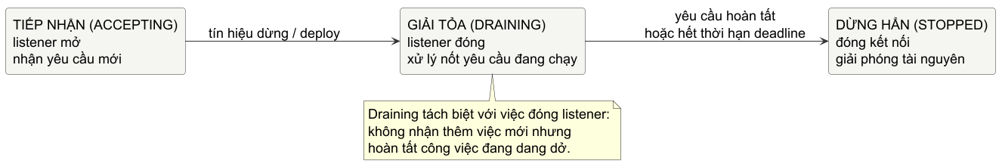

# Chương 12 — Một service sống và tắt thế nào

Một service nhỏ thường bắt đầu bằng `http.ListenAndServe(":8080", handler)`. Dòng đó đủ để mở port, nhưng chưa đủ để nói service đang hứa điều gì với người gọi, với deploy system, hay với người vận hành. Khi process nhận tín hiệu dừng, nếu `main` kết thúc ngay thì request đang xử lý bị cắt. Khi một client gửi header chậm, nếu server không có policy đọc header thì connection có thể giữ tài nguyên lâu hơn dự kiến. Khi handler nhận JSON lạ và cứ cố đoán, boundary giữa input không tin cậy và state nội bộ đã biến mất.

Mô hình tinh thần của chương này là: **service là một boundary biến input không tin cậy thành công việc có giới hạn, rồi rút lui theo một lifecycle có thể quan sát**. Routing, middleware, validation và shutdown chỉ đáng đưa vào khi chúng làm boundary này rõ hơn. Chúng không phải danh sách framework feature.

## Một deploy bị cắt ngang cho thấy thiếu contract nào

Hãy tưởng tượng `/v1/checks` nhận một target, lưu một yêu cầu kiểm tra, rồi trả `201`. Trong một lần deploy, load balancer chuyển traffic đi nhưng process cũ nhận tín hiệu dừng ngay giữa lúc đang ghi response. Có ba trạng thái cần phân biệt: service còn nhận connection mới, đang để request đã nhận đi tới chỗ kết thúc, hay đã dừng. `Server.Shutdown` của `net/http` đóng listener, đóng idle connection, rồi chờ active connection trở về idle và đóng. Nó không tự chờ connection bị hijack, như WebSocket; những connection dài hạn cần lifecycle riêng.

@figure Lifecycle khái niệm khi service graceful shutdown. Deadline của shutdown là policy vận hành: nó giới hạn thời gian chờ, không biến mọi request thành thành công.

Một hàm chạy server có thể giữ contract ấy trong một nơi thay vì để `main` thoát vì mọi error đều trông giống nhau. Hãy đọc phần đầu và phần shutdown dưới đây như hai đoạn liên tiếp của cùng một function; tách chúng ra cũng giúp lifecycle hiện rõ hơn trên trang:

~~~go
func ServeUntilStopped(
	ctx context.Context,
	srv *http.Server,
	ln net.Listener,
	grace time.Duration,
) error {
	if srv == nil {
		return errors.New("HTTP server is required")
	}
	if ln == nil {
		return errors.New("listener is required")
	}
	if grace <= 0 {
		return errors.New("shutdown grace must be positive")
	}

	serveErr := make(chan error, 1)
	go func() { serveErr <- srv.Serve(ln) }()

	select {
	case err := <-serveErr:
		if errors.Is(err, http.ErrServerClosed) {
			return nil
		}
		return fmt.Errorf("serve: %w", err)
	case <-ctx.Done():
	}
~~~

Đến đây server đã nhận yêu cầu dừng, nhưng `ctx` không nên bị dùng trực tiếp làm shutdown context: nó đã canceled. Ta tạo một ngân sách thời gian mới để `Shutdown` có cơ hội drain request đang chạy:

~~~go
	base := context.Background()
	shutdownCtx, cancel := context.WithTimeout(base, grace)
	defer cancel()
	if err := srv.Shutdown(shutdownCtx); err != nil {
		return fmt.Errorf("shutdown: %w", err)
	}
	err := <-serveErr
	if err == nil {
		return errors.New("server stopped without an error")
	}
	if !errors.Is(err, http.ErrServerClosed) {
		return fmt.Errorf("serve after shutdown: %w", err)
	}
	return nil
}
~~~

Ba guard đầu không phải defensive programming vô định. `srv`, `ln` và `grace` là ba điều kiện đầu vào của lifecycle helper; nếu một trong chúng thiếu, chạy `Serve` chỉ để nhận panic hoặc treo không giúp caller sửa cấu hình. `shutdownCtx` được tạo từ `context.Background()` có chủ đích. Root context đã bị cancel để yêu cầu dừng; nếu lấy deadline shutdown trực tiếp từ nó, deadline sẽ bị cancel ngay trước khi `Shutdown` có cơ hội drain. `grace` phải đến từ SLO, thời gian deploy và loại request của service, không phải một con số copy từ ví dụ. Sau deadline, `Shutdown` trả error; quyết định tiếp theo - log, alarm, force close hay để supervisor xử lý - là policy cần được viết rõ ở boundary vận hành.

### Từ signal của process sang context của server

`ServeUntilStopped` đã nhận một `context.Context`, nên `main` chỉ cần nối process lifecycle vào input đó. Trên Unix-like host, `signal.NotifyContext` biến `SIGINT` hoặc `SIGTERM` thành cancellation; `defer stop()` hủy đăng ký signal handling khi `main` rời đi. Sau signal đầu tiên, `ServeUntilStopped` đi vào `Shutdown` với `grace` đã chọn thay vì cắt request ngay.

~~~go
ctx, stop := signal.NotifyContext(
	context.Background(),
	os.Interrupt,
	syscall.SIGTERM,
)
defer stop()

if err := ServeUntilStopped(ctx, srv, ln, 15*time.Second); err != nil {
	return err
}
~~~

Đây là bridge ở process boundary, không phải permission cho handler bỏ qua `r.Context()`: `Shutdown` chờ active request, còn cancellation phải đi tiếp tới database hay outbound HTTP mà request đó đang chờ. Trên Windows, `os.Interrupt` là signal portable; service host và process supervisor phải được kiểm chứng theo môi trường triển khai trước khi giả định `SIGTERM` có cùng đường đi.

## Handler là cửa kiểm tra, không phải nơi “cố hiểu” input

Trong lab, `POST /v1/checks` là một boundary nhỏ. Nó nhận JSON chỉ có `target`, chấp nhận `http` hoặc `https` với host không rỗng, chuyển value hợp lệ sang `Store`, và không tiết lộ lỗi nội bộ của store cho client. Lab chưa thực hiện probe outbound: đó sẽ là một quyết định có rủi ro SSRF và quota, nên không được lén nhét vào một handler minh họa.

> **Dừng để dự đoán:** request có document đầu hợp lệ rồi nối thêm `{"debug":true}` có được gọi `Store` không? Nếu câu trả lời là không, code phải có một bước chứng minh stream đã kết thúc; `Decode` thành công một lần chưa đủ bằng chứng.

~~~go
func (a app) createCheck(
	w http.ResponseWriter,
	r *http.Request,
) {
	if r.Method != http.MethodPost {
		methodNotAllowed(w)
		return
	}

	r.Body = http.MaxBytesReader(w, r.Body, maxRequestBody)
	decoder := json.NewDecoder(r.Body)
	decoder.DisallowUnknownFields()

	var input Check
	err := decoder.Decode(&input)
	if err != nil || validateTarget(input.Target) != nil {
		badRequest(w)
		return
	}
	var extra struct{}
	if err := decoder.Decode(&extra); !errors.Is(err, io.EOF) {
		badRequest(w)
		return
	}
	check, err := a.store.Create(r.Context(), input)
	if err != nil {
		internalError(w)
		return
	}
	writeJSON(w, http.StatusCreated, check)
}
~~~

Lần `Decode` thứ hai không lấy một check khác. Nó chỉ chứng minh sau value đầu tiên còn whitespace và `io.EOF`; nếu còn JSON value, request bị từ chối trước khi chạm `Store`. Đoạn code vẫn không phải decoder hoàn chỉnh cho mọi API: endpoint nhận upload chẳng hạn không thể dùng một giới hạn 4 KiB như vậy. Ý chính là limit, schema và validation phải xuất hiện trước khi input trở thành công việc nội bộ; đừng parse vô hạn rồi mới hỏi request có hợp lệ hay không.

`http.MaxBytesReader` là một quota ở boundary body. `Decoder.DisallowUnknownFields` chọn strict schema, hữu ích khi client gửi JSON nhầm field mà ta không muốn lặng lẽ bỏ qua. Strictness là lựa chọn compatibility: một API mở rộng có thể cần versioning hoặc field policy khác. Nhưng “bỏ qua mọi field lạ” không được là phản xạ vô thức khi input điều khiển hành vi có chi phí.

Lab bắt đầu bằng các test đỏ cho request hợp lệ, method sai, JSON chứa field lạ, document thứ hai và target sai. Tự viết handler trước khi mở `fixed/`:

~~~powershell
cd labs/part12-service-lifecycle
go test -tags exercise ./exercise
go test -race -tags exercise ./exercise
go test -tags lifecycleexercise ./exercise
go test -race -tags lifecycleexercise ./exercise
go test ./fixed
~~~

Test handler còn đặt hai JSON value nối nhau để tách hai failure dễ lẫn: document đầu hợp lệ không cho phép phần còn lại trở thành input bí mật bị bỏ qua. Sau khi handler xanh, test `lifecycleexercise` đưa listener cục bộ và context cancel vào `ServeUntilStopped`; contract là listener phục vụ được request trước cancellation, server return sau shutdown, và precondition sai bị trả thành error thay vì biến thành panic. Test dùng `httptest` hoặc listener cục bộ, nên kiểm chứng được contract HTTP mà không mở port ra mạng. `ResponseRecorder.Result()` là snapshot response sau khi handler đã chạy; đừng `DeepEqual` cả `http.Response`, chỉ assert status, header và body mà API đã hứa.

## Routing và middleware là cách đặt luật ở đúng biên

Một router nhỏ có giá trị khi nhìn vào route table ta biết method nào vào handler nào. Với service còn ít endpoint, `http.ServeMux` và kiểm tra method rõ ràng thường tốt hơn một dependency lớn. Route pattern, authentication requirement và giới hạn body nên đọc được từ boundary; business function phía trong chỉ nhận value đã được kiểm tra và context của request.

Middleware hợp lý là luật áp dụng cho nhiều request: gắn request ID đã được server tạo, log outcome, tracing, authentication hoặc giới hạn rate. Nó không phải nơi để nhét business branching. Nếu middleware cần ghi status và số byte, wrapper `ResponseWriter` phải tôn trọng contract của `net/http`; một wrapper cẩu thả có thể làm hỏng optional interface hoặc ghi header sau body. Bắt đầu bằng middleware nhỏ mà anh có thể test, thay vì sao chép một “stack chuẩn” không ai còn đọc được.

Logging nên trả lời được câu hỏi vận hành: request ID, route/method, status, duration, outcome và lỗi đã phân loại. Nó không nên ghi password, bearer token, cookie hoặc toàn bộ body mặc định. Một error trả cho client là contract public; log nội bộ có thể giữ cause kỹ thuật với mức truy cập phù hợp. Hai thứ có cùng text thường là dấu hiệu boundary chưa rõ.

## Timeout server phòng một kiểu áp suất khác

Timeout client ở chương trước bảo vệ người *gọi*. Server còn phải chọn giới hạn để bảo vệ resource của chính nó. `ReadHeaderTimeout` giới hạn thời gian đọc request header rồi reset deadline để handler tự quyết rate/deadline của body. `ReadTimeout` bao cả request body nhưng không cho handler policy riêng cho từng upload. `WriteTimeout` giới hạn response write; `IdleTimeout` giới hạn chờ request kế tiếp trên keep-alive connection. `MaxHeaderBytes` giới hạn header parser.

@table Server timeout là các policy khác nhau

| Field | Bảo vệ điều gì | Cần quyết định cùng nó |
| --- | --- | --- |
| `ReadHeaderTimeout` | Client gửi header quá chậm | Header hợp lệ cần bao lâu trong mạng thực? |
| `ReadTimeout` | Toàn bộ đọc request, gồm body | Endpoint upload có rate/lifetime riêng không? |
| `WriteTimeout` | Response write kéo dài | Streaming response có cần policy khác? |
| `IdleTimeout` | Keep-alive không gửi request tiếp | Bao lâu connection rảnh vẫn đáng giữ? |
| `MaxHeaderBytes` | Header bất thường lớn | Cookie/proxy hợp lệ chiếm bao nhiêu? |

Không có bộ số chung đúng cho mọi service. Với timeout đọc/ghi/idle, zero có thể nghĩa là không đặt timeout theo documented behavior của `net/http`; `MaxHeaderBytes` có default riêng. Default vô thức vẫn là policy. Chọn workload, proxy, upload path và memory budget trước khi đặt number; rồi kiểm thử ingress thật khi có traffic.

`Server.Shutdown` không giết request active, nên handler cần tôn trọng `r.Context()` khi gọi database, outbound client hoặc worker. Chương 9 và 11 đã cho ta hai nửa còn lại: goroutine phải có đường thoát khi context bị hủy; client request phải nhận context của caller. Graceful shutdown chỉ thực sự graceful khi các boundary bên trong chịu trả lại quyền điều khiển.

Service đáng tin được đánh giá ở boundary: input bị giới hạn ở đâu, business code nhận gì, response/log tách public/private không, server ngừng nhận việc khi nào và request cũ được bao lâu để kết thúc. WebSocket cần một owner riêng. Trả lời được các câu ấy, service có lifecycle để vận hành thay vì chỉ `ListenAndServe`.

@references
1. Go Team. Package `net/http`, phần Handler, Server fields, `Shutdown` và `ResponseWriter`. pkg.go.dev/net/http
2. Go Team. Package `net/http/httptest`, phần `ResponseRecorder` và test server. pkg.go.dev/net/http/httptest
3. Go Team. Security Best Practices for Go Developers. go.dev/doc/security/best-practices
