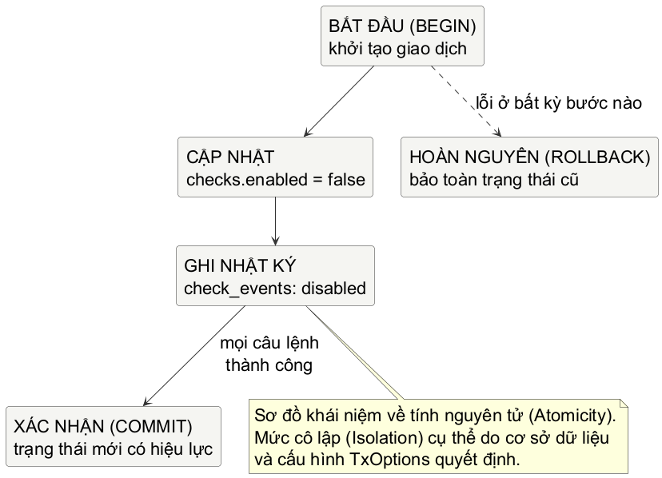

# Chương 13 — Một thay đổi hoặc không có gì

Một buổi trực, service trả `500` cho thao tác tắt một endpoint đang lỗi. Người trực tin rằng request thất bại nên thử lại. Lần đọc tiếp theo lại cho thấy endpoint đã bị tắt, nhưng audit log không có dòng nào nói ai đã làm việc đó. Đây không phải lỗi “quên ghi log” đơn thuần. Từ ngoài nhìn vào, hệ thống đang kể hai câu chuyện mâu thuẫn về cùng một thay đổi.

State bền vững khác với một value nằm trong RAM: nó sẽ được request sau, process khác, hoặc lần khởi động sau dùng làm sự thật. Vì vậy câu hỏi đầu tiên của persistence không phải là chọn ORM hay viết bao nhiêu SQL. Câu hỏi là: **sau khi một thao tác nhiều bước báo xong hoặc báo lỗi, những state nào được phép tồn tại?** Mental model của chương là một boundary: với các thay đổi cùng một ý nghĩa nghiệp vụ, người đọc state phải thấy phiên bản cũ hoặc phiên bản mới đã hoàn tất, không phải một đoạn giữa đường.

## Một `if err != nil` không tự tạo atomicity

Giả sử API `Disable` cần làm hai việc: đổi `checks.enabled` thành `false`, rồi ghi event `disabled`. Đoạn code ngây thơ có vẻ cẩn thận vì đã kiểm tra error sau từng câu SQL:

~~~go
if _, err := db.ExecContext(ctx,
	"UPDATE checks SET enabled = 0 WHERE id = ?", checkID,
); err != nil {
	return err
}

if _, err := db.ExecContext(ctx,
	"INSERT INTO check_events(check_id, action) VALUES (?, ?)",
	checkID, "disabled",
); err != nil {
	return err
}
~~~

Nhưng hai lời gọi độc lập là hai boundary độc lập. Nếu `UPDATE` thành công còn `INSERT` lỗi vì constraint, hàm trả error thật, song database vẫn giữ endpoint ở trạng thái tắt. Caller có lý do để thử lại; người điều tra có một state không có nguyên nhân. Không có dòng `if` nào quay ngược statement đầu chỉ vì statement sau thất bại.

Transaction là cách nói với database rằng các statement này thuộc về một đơn vị: hoặc tất cả được commit, hoặc không statement nào trong đơn vị được giữ lại. Nó không phải bùa chú cho mọi vấn đề consistency; nó chỉ làm lời hứa hẹp nhưng cực quan trọng ấy tại boundary database.

@figure Sơ đồ khái niệm về atomicity của thao tác `Disable`. Hình không khẳng định isolation level nào; database, driver và `TxOptions` mới quyết định chi tiết isolation hỗ trợ được.

> **Dừng để dự đoán:** nếu statement ghi event bị từ chối, test nào chứng minh endpoint vẫn `enabled`? Chỉ assert hàm trả error chưa đủ; state sau lỗi mới là điều contract phải khóa lại.

## Lab: làm cho failure không để lại dấu nửa chừng

Lab này dùng SQLite trong memory qua `modernc.org/sqlite`, một driver thuần Go. Lý do chọn nó là để test chạy cục bộ, không cần Docker, credential hay network. `database/sql` vẫn là API chính của bài; driver chỉ là adapter nói được dialect và protocol của database cụ thể. SQLite ở đây không phải lời khuyên thay PostgreSQL cho mọi service: placeholder, concurrency và operational behavior của hai hệ khác nhau.

Mở `exercise/disable_test.go` trước. Test đã dựng schema và nêu API, nhưng chưa cho implementation. Anh cần viết `Disable` sao cho có đủ bốn contract:

- `check` tồn tại được tắt và có đúng một event `disabled`.
- Không có `check` thì trả `ErrCheckNotFound`, không tự tạo event.
- Nếu event không thể ghi, `check` vẫn giữ `enabled = true`.
- `nil` database là lỗi ở API boundary, không phải một panic muộn trong goroutine hay driver.

~~~powershell
cd labs/part13-transaction-boundary
go test -tags exercise ./exercise
go test -race -tags exercise ./exercise
go test ./fixed
go test -race ./fixed
~~~

Đừng mở `fixed/` trước lượt tự làm đầu tiên. Contract đã nói rõ điều gì phải đúng, còn thiết kế thuộc về anh: transaction được mở ở đâu, cleanup đặt thế nào, statement nào phải chạy qua `tx` thay vì `db`, và `RowsAffected` được dùng ra sao để phân biệt không tìm thấy check với cập nhật thành công.

~~~go
// Đáp án tham chiếu: một transaction, một commit.
func Disable(ctx context.Context, db *sql.DB, checkID int64) error {
	if db == nil {
		return errors.New("database is required")
	}

	tx, err := db.BeginTx(ctx, nil)
	if err != nil {
		return fmt.Errorf("begin disable transaction: %w", err)
	}
	defer tx.Rollback()

	result, err := tx.ExecContext(ctx,
		"UPDATE checks SET enabled = 0 WHERE id = ?", checkID,
	)
	if err != nil {
		return fmt.Errorf("disable check: %w", err)
	}
	changed, err := result.RowsAffected()
	if err != nil {
		return fmt.Errorf("count disabled checks: %w", err)
	}
	if changed == 0 {
		return ErrCheckNotFound
	}

	if _, err := tx.ExecContext(ctx,
		"INSERT INTO check_events(check_id, action) VALUES (?, ?)",
		checkID, "disabled",
	); err != nil {
		return fmt.Errorf("record disable event: %w", err)
	}
	if err := tx.Commit(); err != nil {
		return fmt.Errorf("commit disable: %w", err)
	}
	return nil
}
~~~

Sau khi đã thử, đối chiếu với `fixed/disable.go`. Điểm dễ bỏ sót không phải câu SQL mà là ownership của transaction. `defer tx.Rollback()` được đặt ngay sau khi transaction đã tồn tại. Nếu bất kỳ return nào xảy ra trước `Commit`, rollback là cleanup an toàn; sau `Commit`, rollback chỉ trả về lỗi đã kết thúc và được bỏ qua. Tất cả statement thuộc unit phải gọi trên `tx`. Một `db.ExecContext` chen vào giữa sẽ chạy ngoài transaction này.

`RowsAffected` là thông tin do driver trả về; một database hoặc statement khác có thể không hỗ trợ nó. Lab dùng SQLite, nơi contract này kiểm chứng được. Trong service thật, hãy chọn cách phân biệt “không có record” dựa trên semantics của database và query đang dùng, thay vì xem một API tiện tay là luật chung của SQL.

Dấu `?` cũng không phải syntax phổ quát. SQLite driver của lab dùng placeholder đó; nhiều driver PostgreSQL dùng `$1`, `$2`. Nhưng nguyên tắc không đổi: truyền value qua argument của driver, không ghép input vào string SQL. Parameter binding tách data khỏi cấu trúc câu lệnh; nó không thay cho validation nghiệp vụ, nhưng tránh biến `target` hay `checkID` thành một mảnh cú pháp ngoài ý muốn.

## `*sql.DB` là một handle dùng chung, không phải “một connection”

`database/sql` là standard library cung cấp interface chung quanh SQL hoặc SQL-like database; nó luôn cần một driver cụ thể. Theo documented behavior của package, `*sql.DB` là handle an toàn khi dùng đồng thời và quản lý một pool connection. Vì thế, giữ nó ở application boundary và đóng khi process rút lui; đừng tạo rồi đóng một `*sql.DB` cho từng HTTP request.

Một hiểu nhầm kế tiếp là xem `sql.Open` như bằng chứng database đang sống. Việc mở handle thường không thực hiện kết nối ngay. Khi startup hoặc health policy thực sự cần kiểm tra reachability, dùng `PingContext` với deadline phù hợp; đừng biến một ping thành nghi thức trước mọi query rồi gọi đó là reliability.

~~~go
func OpenAndCheck(ctx context.Context, dsn string) (*sql.DB, error) {
	db, err := sql.Open("sqlite", dsn)
	if err != nil {
		return nil, fmt.Errorf("open database handle: %w", err)
	}
	if err := db.PingContext(ctx); err != nil {
		db.Close()
		return nil, fmt.Errorf("ping database: %w", err)
	}
	return db, nil
}
~~~

Ví dụ này chỉ minh họa boundary. Nó không chép sẵn `SetMaxOpenConns(50)` vì một con số đẹp không phải policy. `SetMaxOpenConns` giới hạn pool; khi mọi connection đang bận, request sau phải chờ. Nếu code đang giữ transaction lại cần một connection khác, giới hạn đó còn có thể tạo deadlock. Chọn giới hạn dựa trên concurrency thực, khả năng database, query time, connection budget và dữ liệu `DB.Stats`, rồi đo ở môi trường gần workload. Đó là measured behavior; Go specification không hứa một throughput hay queue time nào.

Cancellation cũng dừng ở boundary driver. `QueryContext` và `BeginTx` nhận context, nhưng package `database/sql` ghi rõ driver không hỗ trợ context cancellation có thể chỉ return sau khi query hoàn tất. Context vẫn phải được truyền; đồng thời, deadline thực sự của query cần được kiểm chứng với đúng driver và database trước khi đưa vào SLO.

## Đọc cũng mượn tài nguyên

`QueryRowContext` phù hợp khi contract chỉ có tối đa một row; error của nó xuất hiện khi `Scan`. Với nhiều row, `QueryContext` trả về `*Rows`. `Rows` không chỉ là slice lười biếng: nó còn đại diện cho result stream và tài nguyên của driver. Đóng nó ở mọi đường return, đọc đến hết, rồi kiểm tra lỗi iteration.

~~~go
rows, err := db.QueryContext(ctx,
	"SELECT id, target FROM checks WHERE enabled = ?", true,
)
if err != nil {
	return nil, fmt.Errorf("list enabled checks: %w", err)
}
defer rows.Close()

var checks []Check
for rows.Next() {
	var check Check
	if err := rows.Scan(&check.ID, &check.Target); err != nil {
		return nil, fmt.Errorf("scan check: %w", err)
	}
	checks = append(checks, check)
}
if err := rows.Err(); err != nil {
	return nil, fmt.Errorf("iterate checks: %w", err)
}
return checks, nil
~~~

Đoạn code này chưa nói gì về isolation: list có thể thấy row nào khi concurrent writer đang chạy là policy của transaction và database. Nó chỉ chốt lifecycle ở phía Go: query đã mượn resource thì function phải trả nó lại. Đây là cùng một kiểu trách nhiệm ta đã gặp với response body ở Chương 11 và listener ở Chương 12, chỉ ở một boundary khác.

## Transaction giải quyết được gì, và không giải quyết được gì

Transaction giúp nhóm write cùng database. Nó không tự làm HTTP call, publish message, cache invalidation hay email trở thành atomic với commit. Nếu `Disable` vừa commit vừa gọi webhook, failure sau commit có thể để database đúng nhưng webhook chưa đi. Đó là một bài toán khác, thường cần identity, retry có kiểm soát và mô hình như outbox khi requirement đủ rõ; không nên giả vờ rằng một `defer tx.Rollback()` giải quyết nó.

### Atomicity không làm retry tự nhiên an toàn

Quay lại opening incident: response có thể mất *sau* `Commit`. Caller nhìn thấy lỗi mạng nhưng database đã đổi state. Transaction đã giữ lời hứa hẹp của nó: `UPDATE` và `INSERT` cùng tồn tại hoặc cùng không tồn tại. Nó chưa trả lời lần gọi lại có phải là cùng operation hay một yêu cầu mới.

Với `Disable` trong lab, `UPDATE checks SET enabled = 0` có thể trông idempotent: chạy lại vẫn để `enabled = false`. Nhưng `INSERT` audit event có thể ghi thêm một dòng `disabled`. Vì vậy “state cuối đúng” chưa đủ để gọi retry safe; audit, notification, quota hoặc side effect khác có thể đổi mỗi lần execution. `TestDisableRepeatedCallRecordsAnotherAuditEvent` cố ý cho thấy contract hiện tại của lab: gọi `Disable` hai lần tạo hai event. Test xanh không phải dấu xác nhận API retry-safe; nó là bằng chứng ngược lại, để người đọc không vô tình suy ra atomicity thành idempotency.

Khi requirement nói client có thể retry cùng một operation mà chỉ được tạo một hiệu ứng, API cần identity cho operation đó: chẳng hạn idempotency key được caller giữ lại qua lần gửi lại. Service cần xác định key đã được xử lý và trả kết quả phù hợp, thường bằng unique constraint hoặc record idempotency trong cùng database transaction. Chi tiết response khi key trùng, thời gian lưu key và side effect nào thuộc cùng operation đều là phần của điều API hứa. Chúng không tự xuất hiện từ `BeginTx`.

> **Bài suy luận ngắn.** Một caller timeout sau `Commit` rồi gọi lại `Disable` mà không gửi operation identity. State `enabled=false` nói được gì, và audit count nói được gì? Đáp án: caller không thể phân biệt “lần trước của chính tôi đã commit” với “một actor khác đã tắt check”; count hai cũng không cho biết hai lần gọi có phải cùng ý định. Nếu distinction đó quan trọng, retry phải có contract riêng.

Tương tự, transaction không biến mọi concurrent operation thành tuần tự. `sql.TxOptions` cho phép caller yêu cầu isolation; database và driver có thể hỗ trợ, hạ cấp hoặc từ chối tùy hệ. Trước khi dùng isolation để bảo vệ một invariant thật, đọc tài liệu database đang chạy, viết test cạnh tranh cho invariant đó và quan sát lỗi/lock/latency. Ở chương này, ta chỉ khóa một contract nhỏ có thể chứng minh cục bộ: event lỗi thì update không được tồn tại.

Schema cũng là state. Khi service có record thật, `CREATE TABLE` trong test không còn là cách đưa thay đổi ra production. Migration cần thứ tự, người sở hữu, khả năng kiểm tra và kế hoạch rollback hoặc forward-fix. Cache cũng cần source of truth rõ ràng: nếu cache giữ `enabled=true` sau một commit tắt check, caller vẫn đang thấy câu chuyện cũ. Những boundary đó sẽ được mở tiếp sau khi nền transaction đã đủ chắc.

Điểm dừng của chương không phải một câu SQL thần kỳ. Đó là thói quen nhìn một thao tác theo state sau failure: liệt kê các thay đổi thuộc cùng một ý nghĩa, đặt chúng vào transaction nếu chúng cùng database, truyền context, trả resource về pool, và kiểm tra contract bằng một failure thật. Khi đã giữ được lời hứa “tất cả hoặc không gì” ở phạm vi này, ta mới có nền để bàn sâu về schema, cache và consistency giữa nhiều boundary.

@references
1. Go Team. Package `database/sql`: `DB`, `Tx`, `Rows`, context cancellation và pool behavior. pkg.go.dev/database/sql
2. SQLite. Transaction. sqlite.org/lang_transaction.html
3. modernc.org. Package `sqlite`, driver thuần Go dùng trong lab cục bộ. pkg.go.dev/modernc.org/sqlite
