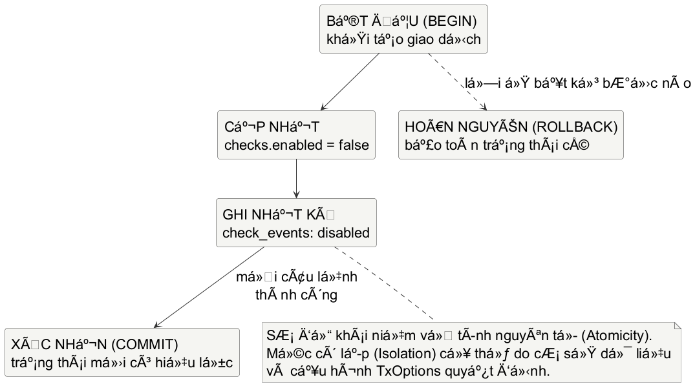

<!-- BOOK_ROLE: FOUNDATION_BRIDGE -->

# Chương 13 — Một thay đổi hoặc không có gì

Một buổi trực, service trả `500` cho thao tác tắt một endpoint đang lỗi. Người trực tin rằng request thất bại nên thử lại. Lần đọc tiếp theo lại cho thấy endpoint đã bị tắt, nhưng audit log không có dòng nào nói ai đã làm việc đó. Đây không phải lỗi “quên ghi log” đơn thuần. Từ ngoài nhìn vào, hệ thống đang kể hai câu chuyện mâu thuẫn về cùng một thay đổi.

State bền vững khác với một value nằm trong RAM: nó sẽ được request sau, process khác, hoặc lần khởi động sau dùng làm sự thật. Vì vậy câu hỏi đầu tiên của persistence không phải là chọn ORM hay viết bao nhiêu SQL. Câu hỏi là: **sau khi một thao tác nhiều bước báo xong hoặc báo lỗi, những state nào được phép tồn tại?** Mental model của chương là một boundary: với các thay đổi cùng một ý nghĩa nghiệp vụ, người đọc state phải thấy phiên bản cũ hoặc phiên bản mới đã hoàn tất, không phải một đoạn giữa đường.

## Một `if err != nil` không tự tạo atomicity

Giả sử API `Disable` cần làm hai việc: đổi `checks.enabled` thành `false`, rồi ghi event `disabled`. Đoạn code ngây thơ có vẻ cẩn thận vì đã kiểm tra error sau từng câu SQL:

~~~go
if _, err := db.ExecContext(ctx,
	"UPDATE checks SET enabled = 0 WHERE id = ?", checkID,
); err != nil {
	return err
}

if _, err := db.ExecContext(ctx,
	"INSERT INTO check_events(check_id, action) VALUES (?, ?)",
	checkID, "disabled",
); err != nil {
	return err
}
~~~

Nhưng hai lời gọi độc lập là hai boundary độc lập. Nếu `UPDATE` thành công còn `INSERT` lỗi vì constraint, hàm trả error thật, song database vẫn giữ endpoint ở trạng thái tắt. Caller có lý do để thử lại; người điều tra có một state không có nguyên nhân. Không có dòng `if` nào quay ngược statement đầu chỉ vì statement sau thất bại.

Transaction là cách nói với database rằng các statement này thuộc về một đơn vị: hoặc tất cả được commit, hoặc không statement nào trong đơn vị được giữ lại. Nó không phải bùa chú cho mọi vấn đề consistency; nó chỉ làm lời hứa hẹp nhưng cực quan trọng ấy tại boundary database.

@figure Sơ đồ khái niệm về atomicity của thao tác `Disable`. Hình không khẳng định isolation level nào; database, driver và `TxOptions` mới quyết định chi tiết isolation hỗ trợ được.

> **Dừng để dự đoán:** nếu statement ghi event bị từ chối, test nào chứng minh endpoint vẫn `enabled`? Chỉ assert hàm trả error chưa đủ; state sau lỗi mới là điều contract phải khóa lại.

## Thực hành: làm cho thất bại không để lại dấu vết nửa chừng

Lab này dùng SQLite trong memory qua `modernc.org/sqlite`, một driver thuần Go. Lý do chọn nó là để test chạy cục bộ, không cần Docker, credential hay network. `database/sql` vẫn là API chính của bài; driver chỉ là adapter nói được dialect và protocol của database cụ thể. SQLite ở đây không phải lời khuyên thay PostgreSQL cho mọi service: placeholder, concurrency và operational behavior của hai hệ khác nhau.

Mở `exercise/disable_test.go` trước. Test đã dựng schema và nêu API, nhưng chưa cho implementation. Anh cần viết `Disable` sao cho có đủ bốn contract:

Một là, `check` tồn tại được tắt và có đúng một event `disabled`.

Hai là, không có `check` thì trả `ErrCheckNotFound`, không tự tạo event.

Ba là, nếu event không thể ghi, `check` vẫn giữ `enabled = true`.

Bốn là, `nil` database là lỗi ở API boundary, không phải một panic muộn trong goroutine hay driver.

~~~powershell
cd labs/part13-transaction-boundary
go test -tags exercise ./exercise
go test -race -tags exercise ./exercise
go test ./fixed
go test -race ./fixed
~~~

Đừng mở `fixed/` trước lượt tự làm đầu tiên. Contract đã nói rõ điều gì phải đúng, còn thiết kế thuộc về anh: transaction được mở ở đâu, cleanup đặt thế nào, statement nào phải chạy qua `tx` thay vì `db`, và `RowsAffected` được dùng ra sao để phân biệt không tìm thấy check với cập nhật thành công.

~~~go
// Đáp án tham chiếu: một transaction, một commit.
func Disable(
	ctx context.Context,
	db *sql.DB,
	checkID int64,
) error {
	if db == nil {
		return errors.New("database is required")
	}
	tx, err := db.BeginTx(ctx, nil)
	if err != nil {
		return fmt.Errorf("begin disable transaction: %w", err)
	}
	defer tx.Rollback()

	result, err := tx.ExecContext(ctx,
		"UPDATE checks SET enabled = 0 WHERE id = ?", checkID,
	)
	if err != nil {
		return fmt.Errorf("disable check: %w", err)
	}
	changed, err := result.RowsAffected()
	if err != nil {
		return fmt.Errorf("count disabled checks: %w", err)
	}
	if changed == 0 {
		return ErrCheckNotFound
	}

	if _, err := tx.ExecContext(
		ctx,
		"INSERT INTO check_events(check_id, action) " +
			"VALUES (?, ?)",
		checkID,
		"disabled",
	); err != nil {
		return fmt.Errorf("record disable event: %w", err)
	}
	if err := tx.Commit(); err != nil {
		return fmt.Errorf("commit disable: %w", err)
	}
	return nil
}
~~~

Sau khi đã thử, đối chiếu với `fixed/disable.go`. Điểm dễ bỏ sót không phải câu SQL mà là ownership của transaction. `defer tx.Rollback()` được đặt ngay sau khi transaction đã tồn tại. Nếu bất kỳ return nào xảy ra trước `Commit`, rollback là cleanup an toàn; sau `Commit`, rollback chỉ trả về lỗi đã kết thúc và được bỏ qua. Tất cả statement thuộc unit phải gọi trên `tx`. Một `db.ExecContext` chen vào giữa sẽ chạy ngoài transaction này.

`RowsAffected` là thông tin do driver trả về; một database hoặc statement khác có thể không hỗ trợ nó. Lab dùng SQLite, nơi contract này kiểm chứng được. Trong service thật, hãy chọn cách phân biệt “không có record” dựa trên semantics của database và query đang dùng, thay vì xem một API tiện tay là luật chung của SQL.

Dấu `?` cũng không phải syntax phổ quát. SQLite driver của lab dùng placeholder đó; nhiều driver PostgreSQL dùng `$1`, `$2`. Nhưng nguyên tắc không đổi: truyền value qua argument của driver, không ghép input vào string SQL. Parameter binding tách data khỏi cấu trúc câu lệnh; nó không thay cho validation nghiệp vụ, nhưng tránh biến `target` hay `checkID` thành một mảnh cú pháp ngoài ý muốn.

## `*sql.DB` là một handle dùng chung, không phải “một connection”

`database/sql` là standard library cung cấp interface chung quanh SQL hoặc SQL-like database; nó luôn cần một driver cụ thể. Theo documented behavior của package, `*sql.DB` là handle an toàn khi dùng đồng thời và quản lý một pool connection. Vì thế, giữ nó ở application boundary và đóng khi process rút lui; đừng tạo rồi đóng một `*sql.DB` cho từng HTTP request.

Một hiểu nhầm kế tiếp là xem `sql.Open` như bằng chứng database đang sống. Việc mở handle thường không thực hiện kết nối ngay. Khi startup hoặc health policy thực sự cần kiểm tra reachability, dùng `PingContext` với deadline phù hợp; đừng biến một ping thành nghi thức trước mọi query rồi gọi đó là reliability.

~~~go
func OpenAndCheck(
	ctx context.Context,
	dsn string,
) (*sql.DB, error) {
	db, err := sql.Open("sqlite", dsn)
	if err != nil {
		return nil, fmt.Errorf("open database handle: %w", err)
	}
	if err := db.PingContext(ctx); err != nil {
		db.Close()
		return nil, fmt.Errorf("ping database: %w", err)
	}
	return db, nil
}
~~~

Ví dụ này chỉ minh họa boundary. Nó không chép sẵn `SetMaxOpenConns(50)` vì một con số đẹp không phải policy. Quản lý connection pool trong `database/sql` xoay quanh bốn chính sách cốt lõi và một giao diện quan sát:

Một là, `SetMaxOpenConns` đặt trần cho tổng số kết nối mở tại một thời điểm, bao gồm cả kết nối đang bận thực thi lẫn kết nối rảnh trong pool. Mặc định giá trị này bằng 0 (không giới hạn). Khi chạm trần, các truy vấn tiếp theo bị chặn và xếp hàng chờ cho đến khi có kết nối được giải phóng hoặc context bị hủy. Nếu một goroutine đang giữ một kết nối trong transaction lại cố gắng thực hiện một truy vấn độc lập từ cùng pool mà không còn kết nối trống, việc chạm trần sẽ trực tiếp dẫn đến bế tắc đồng thời (deadlock).

Hai là, `SetMaxIdleConns` khống chế số lượng kết nối rảnh tối đa được giữ lại trong pool. Giá trị mặc định trong tài liệu hiện hành của thư viện chuẩn là 2 (tài liệu lưu ý giá trị mặc định này có thể thay đổi trong các phiên bản tương lai). Nếu ứng dụng đặt `SetMaxOpenConns` rất cao nhưng giữ nguyên `SetMaxIdleConns` bằng 2, sau mỗi đợt tăng tải đột biến, toàn bộ các kết nối dư thừa sẽ bị đóng ngay lập tức, dẫn đến hiện tượng mở và đóng kết nối liên tục (connection churn), tiêu tốn chi phí bắt tay kết nối và xác thực tài khoản.

Ba là, `SetConnMaxIdleTime` xác định thời gian rảnh rỗi tối đa mà một kết nối được phép nằm chờ trong pool trước khi bị thu hồi (đóng lười khi rảnh), giúp thu nhỏ kích thước pool về mức tối thiểu trong những khung giờ thấp điểm.

Bốn là, `SetConnMaxLifetime` quy định tuổi thọ tối đa mà một kết nối được phép tiếp tục tái sử dụng (reuse) tính từ thời điểm khởi tạo; các kết nối quá hạn có thể được đóng một cách lười (lazily) trước khi tái sử dụng. Đây không phải cơ chế ngắt cưỡng chế (hard kill) khi kết nối đang bận phục vụ truy vấn. Việc chủ động đặt giới hạn tuổi thọ kết nối giúp làm mới tài nguyên kết nối định kỳ theo yêu cầu của hạ tầng hoặc máy chủ cơ sở dữ liệu.

Năm là, phương thức `DB.Stats()` cung cấp dữ liệu quan sát trực tiếp tại runtime qua struct `sql.DBStats`. Các trường `OpenConnections`, `InUse`, `Idle`, `WaitCount`, `WaitDuration`, `MaxIdleClosed`, `MaxIdleTimeClosed` và `MaxLifetimeClosed` hỗ trợ đắc lực cho việc chẩn đoán xem ứng dụng có đang gặp tình trạng thiếu kết nối hay phải chờ đợi kéo dài hay không; chúng là số liệu quan sát hỗ trợ điều tra, không phải lời khẳng định nguyên nhân gốc rễ duy nhất. Việc lựa chọn thông số pool phải dựa trên năng lực của database backend, số lượng bản sao (replicas) cùng chia sẻ database, và dữ liệu thực tế từ `DB.Stats()`, tuyệt đối không sao chép những con số cảm tính từ trên mạng.

Cancellation cũng dừng ở boundary driver. `QueryContext` và `BeginTx` nhận context, nhưng package `database/sql` ghi rõ driver không hỗ trợ context cancellation có thể chỉ return sau khi query hoàn tất. Context vẫn phải được truyền; đồng thời, deadline thực sự của query cần được kiểm chứng với đúng driver và database trước khi đưa vào SLO.

## Đọc cũng mượn tài nguyên

`QueryRowContext` phù hợp khi query được kỳ vọng trả tối đa một row; error xuất hiện khi `Scan`. Nó không kiểm tra uniqueness: nếu query trả nhiều row, `Scan` lấy row đầu và bỏ phần còn lại; nếu không có row, nó trả `sql.ErrNoRows`. Invariant “chỉ có một record” phải được query/schema giữ, không được suy từ tên API. Với nhiều row, `QueryContext` trả `*Rows`, đại diện cho result stream và tài nguyên driver. Đóng nó ở mọi đường return, đọc đến hết rồi kiểm tra lỗi iteration.

~~~go
rows, err := db.QueryContext(ctx,
	"SELECT id, target FROM checks WHERE enabled = ?", true,
)
if err != nil {
	return nil, fmt.Errorf("list enabled checks: %w", err)
}
defer rows.Close()

var checks []Check
for rows.Next() {
	var check Check
	if err := rows.Scan(&check.ID, &check.Target); err != nil {
		return nil, fmt.Errorf("scan check: %w", err)
	}
	checks = append(checks, check)
}
if err := rows.Err(); err != nil {
	return nil, fmt.Errorf("iterate checks: %w", err)
}
return checks, nil
~~~

Đoạn code này chưa nói gì về isolation: list có thể thấy row nào khi concurrent writer đang chạy là policy của transaction và database. Nó chỉ chốt lifecycle ở phía Go: query đã mượn resource thì function phải trả nó lại. Đây là cùng một kiểu trách nhiệm ta đã gặp với response body ở Chương 11 và listener ở Chương 12, chỉ ở một boundary khác.

## Câu lệnh chuẩn bị sẵn (Prepared Statement) và ranh giới tài nguyên

Khi một câu lệnh SQL được gửi tới cơ sở dữ liệu, engine phải phân tích cú pháp (parse), lập kế hoạch thực thi (query plan), rồi mới tiến hành truy vấn. Nếu cùng một mẫu câu lệnh được thực thi hàng nghìn lần lặp lại trong một đợt xử lý, việc lặp lại các bước phân tích này có thể tạo ra chi phí phụ trội không đáng có. `database/sql` cung cấp kiểu `*sql.Stmt` thông qua phương thức `PrepareContext` để biên dịch câu lệnh một lần và thực thi nhiều lần:

~~~go
stmt, err := tx.PrepareContext(ctx,
	"INSERT INTO check_events(check_id, action) VALUES (?, ?)",
)
if err != nil {
	return fmt.Errorf("prepare insert event: %w", err)
}
defer stmt.Close()

for _, action := range actions {
	_, err := stmt.ExecContext(ctx, checkID, action)
	if err != nil {
		return fmt.Errorf("insert event %s: %w", action, err)
	}
}
~~~

Quy tắc sở hữu tài nguyên ở đây rất rõ ràng: một prepared statement tạo từ `db.PrepareContext` sống cùng với vòng đời của database handle và có thể tự động chuẩn bị lại trên các kết nối vật lý khác nhau trong pool khi cần thiết. Ngược lại, statement được tạo bên trong một transaction qua `tx.PrepareContext` gắn chặt với vòng đời của chính transaction đó; khi transaction kết thúc bằng `Commit` hoặc `Rollback`, statement này sẽ tự động đóng và không thể tiếp tục sử dụng. Lệnh `stmt.Close()` tường minh vẫn hữu ích khi muốn giải phóng tài nguyên sớm trước khi transaction hoàn tất, nhưng không phải điều kiện duy nhất để ngăn ngừa rò rỉ trong transaction.

Prepared statement không mặc định đồng nghĩa với việc mọi câu lệnh đều chạy nhanh hơn. Lợi ích tối ưu của prepared statement phát huy rõ rệt khi cùng một mẫu câu lệnh được thực thi lặp lại nhiều lần với các tham số khác nhau (chẳng hạn trong các vòng lặp chèn dữ liệu hàng loạt như dự án `opsprobe` ở Chương 20). Nếu một câu lệnh chỉ được gọi duy nhất một lần trong toàn bộ vòng đời của request, chi phí phụ trội để chuẩn bị câu lệnh cần được cân nhắc và đo đạc thực nghiệm với driver và hệ quản trị cơ sở dữ liệu cụ thể trước khi quyết định áp dụng.

Việc truyền giá trị qua tham số (parameter binding / placeholder) tách biệt rành mạch dữ liệu khỏi cấu trúc câu lệnh SQL, giúp phòng ngừa lớp lỗ hổng tấn công chèn mã SQL (SQL injection) do nối trực tiếp giá trị vào chuỗi truy vấn. Tuy nhiên, theo tài liệu hướng dẫn bảo mật chính thức của Go (`go.dev/doc/database/sql-injection`), parameter binding chỉ áp dụng cho các giá trị tham số; các thành phần động trong câu lệnh như tên bảng, tên cột, mệnh đề `ORDER BY` hoặc các đoạn SQL ghép nối vẫn cần ranh giới kiểm tra và danh sách trắng (allowlist) riêng.

## Transaction giải quyết được gì, và không giải quyết được gì

Transaction giúp nhóm write cùng database. Nó không tự làm HTTP call, publish message, cache invalidation hay email trở thành atomic với commit. Nếu `Disable` vừa commit vừa gọi webhook, failure sau commit có thể để database đúng nhưng webhook chưa đi. Đó là một bài toán khác, thường cần identity, retry có kiểm soát và mô hình như outbox khi requirement đủ rõ; không nên giả vờ rằng một `defer tx.Rollback()` giải quyết nó.

### Atomicity không làm retry tự nhiên an toàn

Quay lại opening incident: response có thể mất *sau* `Commit`. Caller nhìn thấy lỗi mạng nhưng database đã đổi state. Transaction đã giữ lời hứa hẹp của nó: `UPDATE` và `INSERT` cùng tồn tại hoặc cùng không tồn tại. Nó chưa trả lời lần gọi lại có phải là cùng operation hay một yêu cầu mới.

Với `Disable` trong lab, `UPDATE checks SET enabled = 0` có thể trông idempotent: chạy lại vẫn để `enabled = false`. Nhưng `INSERT` audit event có thể ghi thêm một dòng `disabled`. Vì vậy “state cuối đúng” chưa đủ để gọi retry safe; audit, notification, quota hoặc side effect khác có thể đổi mỗi lần execution. `TestDisableRepeatedCallRecordsAnotherAuditEvent` cố ý cho thấy contract hiện tại của lab: gọi `Disable` hai lần tạo hai event. Test xanh không phải dấu xác nhận API retry-safe; nó là bằng chứng ngược lại, để người đọc không vô tình suy ra atomicity thành idempotency.

Khi requirement nói client có thể retry cùng một operation mà chỉ được tạo một hiệu ứng, API cần identity cho operation đó: chẳng hạn idempotency key được caller giữ lại qua lần gửi lại. Service cần xác định key đã được xử lý và trả kết quả phù hợp, thường bằng unique constraint hoặc record idempotency trong cùng database transaction. Chi tiết response khi key trùng, thời gian lưu key và side effect nào thuộc cùng operation đều là phần của điều API hứa. Chúng không tự xuất hiện từ `BeginTx`.

> **Dừng để dự đoán.** Một caller gửi yêu cầu `Disable` nhưng gặp lỗi timeout mạng ở tầng truyền tải và phản hồi từ dịch vụ bị thất lạc. Tại thời điểm nhận lỗi timeout, caller chỉ biết mình chưa nhận được kết quả, trong khi phía server có thể đã commit thành công hoặc chưa từng hoàn tất transaction. Nếu caller tự ý gửi lại lệnh `Disable` mà không mang theo idempotency key, việc quan sát thấy `enabled = false` cùng số lượng bản ghi audit event tăng lên 2 sau đó nói lên điều gì về sự khác biệt giữa sự thật phía server và bằng chứng caller sở hữu, cũng như ranh giới an toàn của việc retry?

#### Đáp án — chỉ đọc sau khi đã tự làm

Sự cố mạng làm đứt gãy kênh truyền khiến caller chỉ sở hữu một bằng chứng duy nhất: yêu cầu đã quá hạn thời gian chờ, hoàn toàn không có bằng chứng xác nhận server đã kịp commit hay chưa. Trong thực tế, server có thể đã commit thành công trước khi phản hồi bị rơi trên đường truyền. Khi caller tự động gửi lại lệnh mà không có idempotency key, trạng thái `enabled = false` trên bảng `checks` không chứng minh được lần gọi nào đã tạo nên kết quả, bởi tài nguyên có thể đã tắt từ lần gọi đầu tiên hoặc do một tiến trình khác can thiệp.

Bằng chứng rõ ràng nhất nằm ở bảng `audit_events`: số lượng bản ghi tăng lên 2 khẳng định giao dịch thứ hai đã thực thi độc lập và ghi thêm tác dụng phụ. Tình huống này chứng minh tính nguyên tử (atomicity) của transaction chỉ bảo đảm các câu lệnh trong một phiên cùng thành công hoặc cùng thất bại, chứ không tự động mang lại tính an toàn khi gọi lại (idempotency). Để caller có thể retry an toàn sau các lỗi mạng không chắc chắn, hệ thống bắt buộc phải cung cấp hợp đồng retry tường minh thông qua idempotency key được kiểm tra và lưu vết nguyên tử cùng transaction nghiệp vụ.

Tương tự, transaction không biến mọi concurrent operation thành tuần tự. `sql.TxOptions` cho phép caller yêu cầu isolation; khi caller yêu cầu non-default isolation level mà driver không hỗ trợ, `BeginTx` trả error. Database và driver thực tế vẫn quyết định các anomaly, lock và latency có ý nghĩa gì, nên trước khi dùng isolation để bảo vệ một invariant thật, đọc tài liệu database đang chạy, viết test cạnh tranh cho invariant đó và quan sát lỗi/lock/latency. Ở chương này, ta chỉ khóa một contract nhỏ có thể chứng minh cục bộ: event lỗi thì update không được tồn tại.

## Tiến hóa lược đồ dữ liệu (Schema Migration) như một trạng thái bền vững

Cấu trúc bảng và các ràng buộc dữ liệu (schema) cũng là trạng thái bền vững. Mã nguồn ứng dụng có thể được rollback về một commit Git cũ chỉ trong vài giây, nhưng dữ liệu trên đĩa cứng đã bị thay đổi thì không thể đảo ngược một cách tự động. Khi dịch vụ bước vào môi trường sản xuất có dữ liệu người dùng thật, việc gọi các câu lệnh tạo bảng tùy tiện trong mã khởi động không còn là giải pháp khả thi. Quản lý schema đòi hỏi sáu nguyên tắc kỷ luật:

Một là, thứ tự di chuyển có phiên bản (versioned migration ordering). Mọi thay đổi schema phải được biểu diễn thành các bước tuần tự có đánh số phiên bản hoặc nhãn thời gian tăng dần, được lưu trữ trong một bảng quản lý (như `schema_migrations`). Mỗi bước chỉ được thực thi đúng một lần và theo đúng thứ tự đã định.

Hai là, quyền sở hữu migration (migration ownership). Một phương án triển khai phổ biến là giao quyền hạn thực thi migration cho một quy trình phát hành chuyên trách (như Kubernetes Job hoặc bước chạy pipeline CI/CD trước khi cập nhật workload). Tuyệt đối không để hàng chục instance của ứng dụng cùng khởi động và cùng tranh nhau chạy các câu lệnh DDL mà không có cơ chế điều phối, vì điều này có thể dẫn đến tranh chấp khóa và gây sập ứng dụng.

Ba là, tính tương thích khi triển khai song song (deploy compatibility). Trong các chiến lược triển khai không gián đoạn (như rolling update hay blue-green), phiên bản code cũ và phiên bản code mới sẽ cùng chạy đồng thời trong một khoảng thời gian. Một chiến lược thường dùng là Mở rộng - Di chuyển - Thu hẹp (Expand - Migrate - Contract): khi cần thêm một cột mới, cột đó cho phép giá trị NULL hoặc có giá trị mặc định để code cũ chưa biết đến cột này vẫn hoạt động bình thường; sau khi toàn bộ instance mới đã nhận việc ổn định, mới tiến hành bước dọn dẹp các trường lỗi thời.

Bốn là, chiến lược xử lý sự cố migration. Sửa tiến (forward-fix) thường được ưu tiên trong thực tế vận hành để tránh rủi ro mất mát dữ liệu mới phát sinh trong giai đoạn chuyển tiếp nếu chạy script đảo ngược (Down migration). Tuy nhiên, lựa chọn giữa forward-fix và rollback phụ thuộc vào mô hình thất bại, tính toàn vẹn của dữ liệu và chính sách vận hành của từng hệ thống.

Năm là, ranh giới transaction đối với DDL. Khả năng bọc câu lệnh DDL trong transaction phụ thuộc vào hệ quản trị cơ sở dữ liệu và phiên bản cụ thể. PostgreSQL hỗ trợ transactional DDL cho nhiều thao tác catalog (như `CREATE TABLE`, `ALTER TABLE`), tuy nhiên kỹ sư vẫn cần xem xét các yếu tố về khóa bảng và các ngoại lệ như `CREATE INDEX CONCURRENTLY`. SQLite hỗ trợ transactional DDL cho các thao tác được engine cho phép (như `ALTER TABLE ADD COLUMN` được kiểm chứng trong fixture của lab). Trong khi đó, MySQL hiện đại (từ MySQL 8.0) hỗ trợ cơ chế atomic DDL ở cấp độ từng câu lệnh riêng lẻ, nhưng các câu lệnh DDL trong MySQL vẫn tự động gây ra lệnh commit ngầm định (implicit commit), do đó không thể kết hợp tùy ý nhiều câu lệnh DDL cùng các thao tác dữ liệu khác vào trong một transaction để rollback toàn phần.

Sáu là, kiểm thử tiến hóa schema. Lab của chương chứng minh cơ chế này qua kiểm thử `TestSchemaMigrationOrderingAndRollback`. Việc nâng cấp schema từ phiên bản 1 lên phiên bản 2 được thực thi trong transaction nguyên tử. Kiểm thử chủ động tạo kịch bản migration lỗi (thêm cột `failed_col` nhưng rollback transaction trước khi hoàn tất ghi nhận phiên bản) và kiểm tra qua `PRAGMA table_info` cùng bảng `schema_migrations` để xác nhận cột hủy không tồn tại và số hiệu phiên bản giữ nguyên ở mức 1; sau đó mới thực thi bước migration v2 hợp lệ và commit thành công.

## Ranh giới bộ nhớ đệm (Cache Consistency) và nguồn chân lý

Khi lưu lượng đọc tăng cao, việc đưa thêm một lớp bộ nhớ đệm (cache) vào kiến trúc là giải pháp phổ biến để giảm tải cho cơ sở dữ liệu. Tuy nhiên, cache là một ranh giới hoàn toàn tách biệt khỏi database. Trong mô hình được chọn ở chương này, cơ sở dữ liệu đóng vai trò là nguồn chân lý (single source of truth).

Mô hình đệm thông dụng nhất là Cache-Aside: Khi đọc, ứng dụng kiểm tra cache trước; nếu không có dữ liệu (cache miss), nó đọc từ database rồi lưu ngược lại vào cache. Khi cập nhật trạng thái: ứng dụng ghi thay đổi vào cơ sở dữ liệu trước, rồi mới tiến hành xóa (invalidate) bản ghi tương ứng trong cache.

Vấn đề cốt lõi của tính nhất quán nằm ở ranh giới thất bại: nếu thao tác cập nhật database thành công nhưng lời gọi mạng xóa cache phía sau gặp sự cố (đứt mạng, timeout, hoặc máy chủ cache bị crash), cơ sở dữ liệu đã mang trạng thái mới nhưng cache vẫn giữ nguyên giá trị cũ. Lượt đọc tiếp theo từ một client khác sẽ lấy dữ liệu lỗi thời từ cache (stale read), tạo ra tình huống hệ thống kể hai câu chuyện mâu thuẫn nhau.

Nguyên nhân căn bản là vì database transaction không thể bảo đảm tính nguyên tử cho một hệ thống cache bên ngoài. Transaction của `database/sql` chỉ có phạm vi hiệu lực bên trong storage engine của cơ sở dữ liệu; nó hoàn toàn không có khả năng rollback một gói tin mạng đã gửi sang Redis hay Memcached.

Cơ chế hết hạn theo thời gian (TTL - Time-To-Live) chỉ là một biện pháp giới hạn khoảng thời gian tối đa mà dữ liệu lỗi thời có thể tồn tại nếu các giả định về chính sách làm mới dữ liệu được thỏa mãn; TTL không phải một bảo đảm đúng đắn tuyệt đối. Kỹ sư phải luôn phân định rõ: với những dữ liệu cho phép eventual consistency (như số lượt xem bài viết, thông tin hiển thị hồ sơ), sự chênh lệch ngắn hạn giữa cache và database là chấp nhận được; nhưng với các bất biến nghiệp vụ quan trọng, giải pháp phụ thuộc vào yêu cầu của hệ thống: đọc trực tiếp cơ sở dữ liệu (bypass cache), sử dụng khóa có phiên bản (versioned keys), mô hình write-through/write-behind với hợp đồng phù hợp, vô hiệu hóa qua sự kiện (event-driven invalidation), hoặc cơ chế kiểm tra phiên bản (version/fencing checks).

Kiểm thử `TestCacheAsideStaleReadOnInvalidationFailure` trong lab cố ý tái lập kịch bản này: database đã cập nhật thành công cờ `enabled = false`, nhưng thao tác xóa cache gặp lỗi khiến cache vẫn trả về `true`. Đây là bằng chứng thực nghiệm rõ ràng nhất để người học không nhầm lẫn giữa tính nguyên tử của transaction với tính nhất quán của toàn bộ hệ thống.

## Biểu diễn tuần tự hóa và tương thích tiến hóa dữ liệu

Như đã phân tích ở Chương 07, việc tuần tự hóa dữ liệu (serialization) biến các cấu trúc dữ liệu trong bộ nhớ thành dòng byte để truyền qua mạng hoặc ghi xuống đĩa. Trong tầng lưu trữ, việc lưu các đối tượng phức tạp dưới dạng chuỗi JSON hoặc mảng byte nhị phân (BLOB) vào một cột của cơ sở dữ liệu là một hợp đồng biểu diễn giữa người ghi (writer) và người đọc (reader) qua các mốc thời gian khác nhau.

Tính tương thích của dữ liệu đã lưu trữ phụ thuộc vào định dạng tuần tự hóa, lược đồ phiên bản, chiến lược di chuyển dữ liệu, ngữ nghĩa giá trị mặc định, khả năng phân biệt giữa việc vắng mặt trường dữ liệu với giá trị zero tường minh, thời gian lưu giữ (retention period), và khả năng viết lại dữ liệu lịch sử nếu cần thiết. Các thẻ tag như `omitempty` (hoặc `omitzero` từ Go 1.24) là các tùy chọn định dạng tuần tự hóa, không phải cơ chế tương thích phổ quát cho mọi trường hợp tiến hóa dữ liệu. Đối chiếu Chương 07 để nắm vững cách thức xử lý dòng byte và ánh xạ dữ liệu.

## Điểm dừng: Giữ vững ranh giới trạng thái bền vững

Điểm dừng của chương không phải là việc thuộc lòng các câu lệnh SQL hay cấu hình máy chủ. Đó là thói quen phân định ranh giới trạng thái một cách có kỷ luật:

Một là, gom cụm các thao tác cùng ý nghĩa nghiệp vụ vào một transaction nguyên tử trên cơ sở dữ liệu, bảo đảm tính toàn vẹn hoặc không gì cả.

Hai là, quản lý kết nối như một tài nguyên dùng chung có giới hạn qua connection pool, đo lường bằng `DB.Stats()` thay vì suy đoán thông số.

Ba là, tận dụng prepared statement cho các thao tác lặp lại theo lô, đồng thời giải phóng tài nguyên với `Close()` và bảo vệ câu lệnh bằng parameter binding.

Bốn là, coi schema như một trạng thái bền vững cần tiến hóa có phiên bản, kiểm soát quyền sở hữu và bảo đảm tương thích hai chiều khi triển khai.

Năm là, nhận thức rõ ranh giới giữa cơ sở dữ liệu và bộ nhớ đệm, luôn xác định nguồn chân lý và chấp nhận đánh đổi tính nhất quán dựa trên yêu cầu bất biến của nghiệp vụ.

Khi các ranh giới này được phân định rõ ràng, hệ thống giảm thiểu các trạng thái dữ liệu mơ hồ, cho phép kỹ sư xác lập và kiểm chứng được các ranh giới thất bại từ mã nguồn ứng dụng đến tầng lưu trữ bền vững.

@references
1. Go Team. Package `database/sql`: `DB`, `Tx`, `Rows`, `Stmt`, `DBStats`, context cancellation và pool behavior. pkg.go.dev/database/sql
2. Go Team. Executing prepared statements. go.dev/doc/database/prepared-statements
3. Go Team. Avoiding SQL injection risk. go.dev/doc/database/sql-injection
4. SQLite. Transaction and ALTER TABLE support. sqlite.org/lang_transaction.html, sqlite.org/lang_altertable.html
5. modernc.org. Package `sqlite`, driver thuần Go dùng trong lab cục bộ. pkg.go.dev/modernc.org/sqlite
6. PostgreSQL Global Development Group. Transactional DDL. postgresql.org/docs/current/mvcc.html
7. MySQL Authors. Statements That Cause an Implicit Commit & Atomic DDL. dev.mysql.com/doc/refman/8.0/en/implicit-commit.html, dev.mysql.com/doc/refman/8.0/en/atomic-ddl.html
