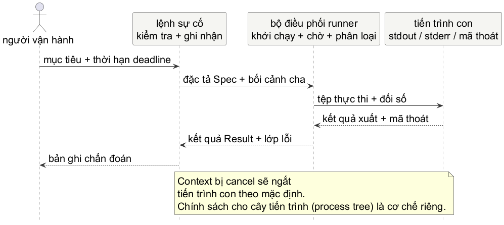

# Chương 15 — Từ sự cố vận hành đến công cụ

Một sự cố vận hành nhỏ thường không thiếu lệnh để gõ. Thiếu là một lời kể đáng tin về điều lệnh đó đã làm. Một người vận hành có thể chạy `curl`, `nslookup`, `git`, hay một công cụ nội bộ rồi nhìn thấy một dòng lỗi. Nhưng dòng lỗi ấy không nói command nào đã thật sự được chạy, nó có nhận đủ thời gian không, có in chẩn đoán ra `stderr` không, hay tiến trình kết thúc bằng exit status nào. Gõ lại cùng một lệnh nhiều lần chỉ làm lịch sử mờ hơn.

Chương này bắt đầu từ một requirement khiêm tốn: một sự cố vận hành command chạy **một công cụ chẩn đoán đã được chọn trước**, chờ nó theo một thời hạn xử lý (deadline), rồi trả về output và trạng thái có thể giải thích. Đây chưa phải feature lớn cho `opsprobe`; trước hết ta dựng một minimal reproducer độc lập để học đúng boundary của tiến trình. Khi contract đã rõ, `opsprobe` mới có thể dùng nó như một building khối lệnh nhỏ.

Mental model của chương là: **command runner là một supervisor nhỏ của tiến trình con**. Nó không chỉ “gọi một binary”. Nó nhận intent đã được validate, sở hữu thời hạn xử lý (deadline), chờ tiến trình kết thúc, giữ output tách biệt, phân loại kết quả, rồi để bên gọi quyết định cách trình bày và ghi nhận. Nếu không sở hữu những điều đó, công cụ có thể biến một sự cố vận hành rõ ràng thành một chuỗi shell command khó tái hiện.

## Một câu lệnh nhìn có vẻ vô hại

Giả sử alert báo phụ thuộc `catalog` trả lời chậm. Một command đầu tiên có thể chạy một probe nội bộ hoặc một program hệ điều hành để lấy thêm manh mối. Cách tắt nhất thường trông như sau:

~~~go
exec.Command("sh", "-c", "probe " + target).Run()
~~~

Nó giấu quá nhiều quyết định. `target` là dữ liệu hay một mảnh shell program? Error có phải exit status khác 0, không tìm được executable, hay thời hạn xử lý (deadline) đã hết? `stdout` và `stderr` đi đâu? Và nếu tiến trình cha của `opsprobe` đang dừng theo vòng đời ở Chương 12, tiến trình con có còn chạy không?

`os/exec` cố ý không tự gọi system shell và không tự mở rộng glob, pipeline hay redirect. Đó là một ranh giới hữu ích: command name và từng đối số là dữ liệu riêng. Nếu thật sự cần shell, ta phải chọn shell, quoting và threat model một cách tường minh; một sự cố vận hành công cụ không nên vô tình nhận quyền chạy shell chỉ vì ghép string.

@figure Mô hình khái niệm. `Result` là bằng chứng cục bộ về một lần chạy; nó không tự chứng minh nguyên nhân gốc của sự cố vận hành.

Trong chapter này, bên gọi chọn executable từ mã nguồn hoặc một allow-list. `target` chỉ là đối số. Đó không phải giải pháp đầy đủ cho mọi công cụ runner, nhưng là boundary đúng cho yêu cầu hiện tại: người dùng không được gửi cả một command line tùy ý qua flag rồi bắt chương trình đoán ý nghĩa của nó.

## Bốn kết cục, không phải một `error`

Một runner có thể trả `error`, nhưng bên gọi cần biết loại failure. Thành công là tiến trình chạy rồi exit status bằng 0. Một command được khởi động thành công nhưng exit với status 7 lại là một kết cục khác: `stderr` của nó có thể chính là dữ liệu chẩn đoán hữu ích. Hết thời hạn xử lý (deadline) là kết cục thứ ba. Không tìm được executable hoặc không thể start là kết cục thứ tư, thường là lỗi cấu hình hoặc môi trường trước cả khi diagnosis bắt đầu.

@table Kết cục của một lần chạy tiến trình

| Kết cục | tiến trình đã start? | `Result` giữ gì | bên gọi nên biết gì |
| --- | --- | --- | --- |
| Exit 0 | Có | stdout, stderr, exit mã nguồn 0 | công cụ hoàn tất theo contract của nó. |
| Exit khác 0 | Có | stdout, stderr, exit mã nguồn | công cụ đã chạy; output có thể giải thích failure. |
| thời hạn xử lý (deadline)/cancel | Có thể đã start | output đã thu được, cờ hết thời hạn (timeout) | Parent context hay ngân sách thời gian đã kết thúc. |
| Không start | Không | command và exit mã nguồn chưa có | Sai executable, quyền hoặc môi trường. |

`Result` và `error` đi cùng nhau vì chúng trả lời hai câu khác nhau. `Result` là bằng chứng thu được; `error` nói lần chạy có thỏa contract không. Vì vậy đừng viết API chỉ trả `error` rồi làm mất `stderr` mỗi khi exit mã nguồn khác 0. Và cũng đừng coi mọi non-zero exit là panic-worthy: công cụ chẩn đoán có thể dùng exit mã nguồn để báo một điều kiện đã được dự tính.

## Viết supervisor nhỏ trước

Lab dùng `Spec` rất hẹp. `Name` là executable đã được bên gọi quyết định, `Args` là các đối số riêng rẽ, còn `Timeout` là ngân sách của lần chạy. `Run` không biết `catalog` là gì, không parse JSON và không tự log. Tách những trách nhiệm này ra giữ cho test có thể kiểm soát tiến trình boundary. Hai khối `Run` dưới đây là các đoạn liên tiếp của cùng một hàm; source đầy đủ, có thể chạy nằm ở `fixed/run.go`.

~~~go
type Spec struct {
	Name    string
	Args    []string
	hết thời hạn (timeout) time.Duration
}

type Result struct {
	Command  []string
	Stdout   string
	Stderr   string
	ExitCode int
	TimedOut bool
}
~~~

`context.Context` vẫn là input đầu tiên. Nó nối runner vào yêu cầu, CLI, hoặc vòng đời của service mà không buộc runner biết signal nào đã xảy ra. Ta tạo một thời hạn xử lý (deadline) con; parent hủy thực thi đi qua cùng đường đó. `exec.CommandContext` dùng context để interrupt tiến trình khi context kết thúc; mặc định `Cancel` của command gọi `Kill` trên tiến trình. Đây là behavior documented của standard library, không phải lời hứa rằng toàn bộ tiến trình tree trên mọi hệ điều hành đã được dọn sạch.

~~~go
func Run(ctx context.Context, spec Spec) (Result, error) {
	if ctx == nil || strings.TrimSpace(spec.Name) == "" {
		return Result{}, ErrInvalidSpec
	}
	if spec.hết thời hạn (timeout) <= 0 {
		return Result{}, ErrInvalidSpec
	}

	runCtx, cancel := context.WithTimeout(ctx, spec.hết thời hạn (timeout))
	defer cancel()

	cmd := exec.CommandContext(runCtx, spec.Name, spec.Args...)
	var stdout, stderr bytes.vùng đệm
	cmd.Stdout = &stdout
	cmd.Stderr = &stderr
	err := cmd.Run()
~~~

Khối đầu kết thúc tại `Run`: nó start tiến trình, chờ tiến trình và hai stream I/O hoàn tất, rồi giữ error gốc để phân loại. Validation phải đi trước `WithTimeout`, vì `context.WithTimeout(nil, ...)` sẽ panic. Hai vùng đệm được gán trước `Run` để bên gọi không phải đoán một dòng chẩn đoán đến từ `stdout` hay `stderr`.

Sau khi tiến trình đã trả, phần còn lại dựng `Result` kể cả khi có error. Đọc nó như đoạn tiếp theo của hàm ở trên:

~~~go
	result := Result{
		Command:  append([]string{spec.Name}, spec.Args...),
		Stdout:   stdout.String(),
		Stderr:   stderr.String(),
		ExitCode: -1,
	}
	if cmd.ProcessState != nil {
		result.ExitCode = cmd.ProcessState.ExitCode()
	}
	if contextErr := runCtx.Err(); contextErr != nil {
		result.TimedOut = errors.Is(
			contextErr,
			context.DeadlineExceeded,
		)
		return result, fmt.Errorf(
			"command context: %w",
			contextErr,
		)
	}
	if err == nil {
		return result, nil
	}
	var exitErr *exec.ExitError
	if errors.As(err, &exitErr) {
		return result, fmt.Errorf(
			"command exited with mã nguồn %d: %w",
			result.ExitCode,
			err,
		)
	}
	return result, fmt.Errorf("start command: %w", err)
}
~~~

Sau `Run`, `ProcessState` chỉ tồn tại nếu tiến trình đã thực sự start và kết thúc; `-1` là giá trị sentinel cho case không có exit status. Cuối cùng, runner hỏi context trước khi phân loại `ExitError`: nếu thời hạn xử lý (deadline) của chính runner đã hết, đó là failure policy quan trọng hơn việc tiến trình kịp trả một status nào trong lúc bị ngắt.

Đoạn này chỉ phù hợp với output nhỏ, có giới hạn bởi contract của công cụ đang gọi. `bytes.Buffer` không phải policy output cho một tiến trình có thể in vô hạn. công cụ môi trường vận hành phải chọn rõ một trong ba hướng: stream có backpressure, capture có giới hạn và truncation được đánh dấu, hoặc chuyển output thành hiện vật gói phát hành. Đừng lén dùng vùng đệm không giới hạn rồi gọi nó là năng lực quan sát (observability).

## Cancel tiến trình không đồng nghĩa dọn cả cây tiến trình

Đây là chỗ rất dễ mang trực giác từ Chương 12 sang sai. `CommandContext` mặc định gọi `Kill` cho **command tiến trình** khi context done. Một command có thể spawn tiến trình khác, để tiến trình đó giữ pipe mở, hoặc cần một protocol graceful riêng. `os/exec` còn có `WaitDelay` để giới hạn một số trường hợp tiến trình con không chịu kết thúc hoặc pipe I/O không đóng; nhưng tiến trình-group, job object, signal sequence và cleanup của công cụ cụ thể là policy phụ thuộc hệ điều hành.

Vì vậy lab không hứa “cancel là không còn tiến trình nào”. Nó hứa điều nhỏ hơn và kiểm chứng được: thời hạn xử lý (deadline) làm `Run` return, kết quả được gắn nhãn, và mã nguồn không treo chờ một command giả lập. Nếu sau này product có công cụ spawn worker tree, requirement mới phải gọi tên target OS và vòng đời mong muốn trước khi thiết kế `SysProcAttr` hay tiến trình group. Đó là một chương systems khác, không phải một option bí mật của `CommandContext`.

## Từ runner sang CLI có thể kể lại

CLI là boundary với con người. Nó không nên nhét parsing flag, validation target, subprocess, formatting và logging vào một `main` dài. `flag.FlagSet` đủ cho command đầu tiên: parse `-target` và `-timeout`, kiểm tra target theo contract của probe, rồi gọi runner với executable đã chọn. Khi `Run` trả về, CLI có thể in report thân thiện; log có cấu trúc chỉ ghi field hữu ích để tái dựng lần chạy.

~~~go
logger.Info(
	"diagnostic completed",
	"công cụ", result.Command[0],
	"exit_code", result.ExitCode,
	"timed_out", result.TimedOut,
)
~~~

Đừng log token, header authorization, toàn bộ environment hay raw command line có secret. `slog` không tự làm dữ liệu nhạy cảm biến mất; chính boundary chọn field nào được đi vào log. Chương 16 sẽ biến một lần chẩn đoán đơn lẻ thành tín hiệu có thể quan sát bằng health, metric, trace và SLO. Hiện tại, điều quan trọng hơn là report không đánh tráo “command không chạy được”, “command chạy nhưng fail”, và “ta đã chủ động ngắt command vì hết ngân sách”.

> **Dừng để dự đoán:** Nếu `Run` chỉ trả `error`, sự cố vận hành report nào sẽ mất khi một probe exit status 2 nhưng đã in lời giải thích hữu ích vào `stderr`? Nếu `Run` chỉ trả `Result` và không trả `error`, bên gọi có còn phân biệt được run thành công với run bị thời hạn xử lý (deadline) không?

## Lab: chứng minh exit status và thời hạn xử lý (deadline)

Mở `labs/part15-incident-command/exercise/run_test.go` trước. Test không gọi `ping`, `curl` hay binary có sẵn của máy. Nó dùng test binary hiện tại làm helper tiến trình, nên case success, exit khác 0 và sleep đều chạy như nhau trên Windows, Linux và macOS. Đó là một cách thiết kế test quan trọng: thay vì phụ thuộc vào công cụ có sẵn của máy, ta kiểm soát tiến trình đang được quan sát.

~~~powershell
cd labs/part15-sự cố vận hành-command
go test -tags exercise ./exercise
go test -race -tags exercise ./exercise
go test ./fixed
go vet ./fixed
go test -race ./fixed
~~~

Contract yêu cầu: spec rỗng hoặc hết thời hạn (timeout) không dương bị từ chối trước khi start; success giữ hai stream riêng và exit mã nguồn 0; non-zero exit giữ `stderr`, exit mã nguồn và vẫn cho `errors.As` thấy `*exec.ExitError`; thời hạn xử lý (deadline) trả error khớp `context.DeadlineExceeded`, đánh dấu `TimedOut`, và không treo. Parent hủy thực thi vẫn trả `context.Canceled`, không bị gọi nhầm là hết thời hạn (timeout). Test exercise đỏ vì behavior chưa được implement, không phải vì package hỏng.

**Đáp án — chỉ đọc sau khi đã tự làm.** Tạo child context sau validation, dùng `exec.CommandContext` với name và args tách riêng, rồi gán hai `bytes.Buffer` trước `Run`. Dựng `Result` bất kể `Run` trả lỗi, vì output/exit status có thể vẫn cần cho sự cố vận hành. Kiểm tra `runCtx.Err()` trước `ExitError` để thời hạn xử lý (deadline) không bị che bởi status của tiến trình vừa bị hủy. Bản fixed không dùng shell và không hứa cleanup tiến trình tree.

## Khi nào runner nhỏ này chưa đủ

Runner này chưa nhận stdin, chưa đặt working directory hay environment riêng, chưa stream output, chưa redact secret, chưa retry, và chưa được xem là executor tổng quát cho input người dùng. Mỗi thứ đó thay đổi attack surface hoặc vòng đời. Ví dụ, `Cmd.Env` thay environment của child chứ không tự merge với environment hiện tại; `Cmd.Dir` làm working directory trở thành một input khác cần validate. Không thêm chúng chỉ vì struct còn chỗ trống.

Điểm dừng của chapter là một tiến bộ nhỏ nhưng có thật: từ việc “gõ lệnh khi hoảng” sang một command có contract về tiến trình. `opsprobe` có thể sau này dùng runner này để gọi một diagnostic đã được chọn, nhưng chỉ khi sự cố vận hành requirement thật cần nó. Trước khi thêm metric, dashboard hay Kubernetes, ta phải biết một lần chạy đơn lẻ đã bắt đầu, kết thúc và thất bại như thế nào.

@references
1. Go Team. Package `os/exec`: `Command`, `CommandContext`, `Cmd`, `ExitError`, `WaitDelay` và quy tắc tìm executable. pkg.go.dev/os/exec
2. Go Team. Package `context`: hủy thực thi, thời hạn xử lý (deadline) và propagation. pkg.go.dev/context
3. Go Team. Package `flag`: `FlagSet` và parse command-line flags. pkg.go.dev/flag
4. Go Team. Package `log/slog`: structured logging và handler. pkg.go.dev/log/slog
