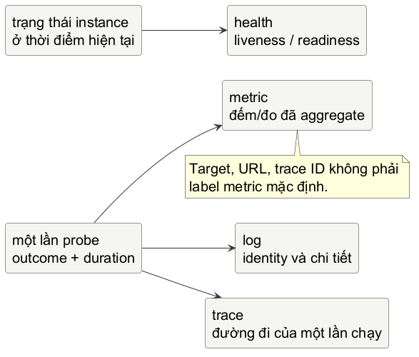

# Chương 16 — Thấy được hệ thống

Sau Chương 15, `opsprobe` có thể kể lại một lần chạy: command nào được gọi, exit code nào quay về, deadline có hết không. Nhưng một incident hiếm khi chỉ hỏi về một lần chạy. “Từ 9 giờ đến giờ dependency có đang tệ dần không?”, “lỗi nằm ở một target hay mọi target?”, “request chậm đi qua những bước nào?” là những câu hỏi khác hẳn. Nếu chỉ giữ một dòng log cuối cùng, ta có chi tiết mà không có xu hướng. Nếu chỉ giữ một biểu đồ tổng, ta có xu hướng mà mất câu chuyện của lần fail cụ thể.

Mental model của chương là: **observability tạo ra các phép chiếu có chủ đích từ hành vi hệ thống; mỗi phép chiếu giữ lại một loại bằng chứng và đánh đổi phần còn lại.** Log giữ identity và chi tiết event. Metric aggregate nhiều event để trả lời câu hỏi theo thời gian. Trace giữ đường đi nhân quả của một lần làm việc qua boundary. Health trả lời một câu hỏi hẹp về instance ngay lúc bị hỏi. Không có signal nào là “bản ghi đầy đủ của hệ thống”.

## Một biểu đồ xanh vẫn có thể nói dối

Giả sử một dashboard ghi `probe_success=1` sau lần probe mới nhất. Khi target fail rồi success trở lại, biểu đồ có thể xanh. Nhưng nó không nói trong mười phút vừa rồi có bao nhiêu lần fail, timeout có bị tính là failure không, hay probe có hề chạy lần nào chưa. Đó không phải vấn đề chọn dashboard đẹp; đó là vấn đề semantic của số liệu.

Một counter có ý nghĩa khi ta biết rõ event nào làm nó tăng. Với probe nhỏ ở đây, policy được chọn là: mỗi lần probe hoàn tất tạo đúng một outcome thuộc tập hữu hạn `success`, `failure`, hoặc `timeout`. Availability SLI của lab là số `success` chia cho tất cả outcome đã hoàn tất. Vì thế timeout nằm ở mẫu số và không được làm biến mất denominator. Đây là một policy của probe availability, không phải định nghĩa phổ quát cho mọi product.

~~~text
availability = successes / completed probes
~~~

Nếu chưa có probe hoàn tất, phép chia không có nghĩa. Đừng trả `1.0` để làm dashboard xanh khi hệ thống chưa có dữ liệu. API lab trả thêm một boolean để caller phân biệt “0% thành công” với “chưa có sample”. Một SLI chỉ là cách đo đã định nghĩa; SLO mới là mục tiêu và time window mà team cam kết cho SLI đó. Câu “99.9%” không có ý nghĩa vận hành trước khi ta biết đo cái gì, trong khoảng nào, và action nào sẽ xảy ra khi tiêu error budget.

## Bốn câu hỏi, bốn loại bằng chứng

@figure Các signal trả lời các câu khác nhau. Diagram là mental model, không phải kiến trúc bắt buộc hay pipeline OpenTelemetry hoàn chỉnh.

@table Chọn signal từ câu hỏi trước

| Câu hỏi | Signal chính | Điều nó không tự chứng minh |
| --- | --- | --- |
| “Lần probe này fail vì sao?” | Log có field và error an toàn | Tần suất hay tỷ lệ failure toàn hệ thống. |
| “Timeout tăng từ khi nào?” | Metric theo thời gian | Target hay request cụ thể nào là nguyên nhân. |
| “Lần chạy này chờ ở boundary nào?” | Trace của một execution | Tần suất của mọi execution nếu trace bị sample. |
| “Có nên đưa traffic vào instance này ngay bây giờ?” | Readiness | SLO của một giờ vừa qua. |

Log không phải metric với string dài hơn. Một log event có thể chứa target đã được redaction, exit code, duration, request ID hay trace ID để người điều tra tìm một execution cụ thể. Metric không nên lấy URL đầy đủ, user ID, raw error, trace ID hay một target biến đổi tùy ý làm label mặc định: mỗi tổ hợp label là một time series khác, nên cardinality không giới hạn biến chi phí và thời gian truy vấn thành một incident mới.

Trace cũng không phải log có mũi tên. Nó biểu diễn quan hệ giữa các operation trong một execution; context propagation là thứ nối các span qua HTTP, queue hay subprocess boundary khi hệ thống đã có instrumentation phù hợp. Chương 11 đã dùng `httptrace` để quan sát một client cục bộ, nhưng nó không tự biến thành distributed tracing. Chương này chỉ chuẩn bị semantic để khi dùng OpenTelemetry sau này, ta biết một attribute, span hay sampling decision đang phục vụ câu hỏi nào.

Health là signal dễ bị lạm dụng nhất. Liveness thường trả lời process còn có thể chạy để supervisor không cần restart mù quáng; readiness trả lời instance có nên nhận traffic không. Cả hai là contract cho control plane ở hiện tại. Một `/readyz` trả `200` bây giờ không chứng minh availability 24 giờ trước, cũng không nên gọi một dependency xa cho mọi liveness probe chỉ để endpoint trông “thông minh”. Dependency nào thuộc readiness là một policy dựa trên khả năng phục vụ thực tế, không phải một checklist copy từ framework.

## Gắn metric vào outcome, không gắn vào cảm giác

Minimal reproducer dưới đây không export Prometheus format và không thay collector. Nó là core semantic mà exporter sau này có thể đọc: outcome là closed set, snapshot là bản copy nhất quán, và SLI không có giá trị khi chưa có sample. Việc giữ lab trong standard library giúp mình kiểm tra contract trước khi thảo luận SDK hoặc backend.

~~~go
type Outcome string

const (
	OutcomeSuccess Outcome = "success"
	OutcomeFailure Outcome = "failure"
	OutcomeTimeout Outcome = "timeout"
)

type Snapshot struct {
	Completed uint64
	Succeeded uint64
	Failed    uint64
	TimedOut  uint64
}

func (s Snapshot) SuccessRatio() (float64, bool) {
	if s.Completed == 0 {
		return 0, false
	}
	return float64(s.Succeeded) / float64(s.Completed), true
}
~~~

`Completed` không phải field thừa. Nó là denominator được ghi độc lập để invariant có thể kiểm tra: `Completed == Succeeded + Failed + TimedOut`. Trong lab, một call `Observe` thành công tăng đúng hai thứ: `Completed` và bucket outcome tương ứng. Unknown outcome phải return error trước khi mutate; nếu code nhận raw string tùy ý rồi tạo bucket mới, closed set biến thành cardinality leak ngay tại source.

~~~go
type Recorder struct {
	mu       sync.Mutex
	snapshot Snapshot
}

func (r *Recorder) Observe(outcome Outcome) error {
	r.mu.Lock()
	defer r.mu.Unlock()

	switch outcome {
	case OutcomeSuccess:
		r.snapshot.Succeeded++
	case OutcomeFailure:
		r.snapshot.Failed++
	case OutcomeTimeout:
		r.snapshot.TimedOut++
	default:
		return ErrUnknownOutcome
	}
	r.snapshot.Completed++
	return nil
}

func (r *Recorder) Snapshot() Snapshot {
	r.mu.Lock()
	defer r.mu.Unlock()
	return r.snapshot
}
~~~

Mutex ở đây không phải “metrics library tự viết”. Nó chỉ giữ invariant của một teaching recorder khi nhiều worker từ Chương 9 cùng báo outcome. `Snapshot` trả value copy, vì caller không được sửa state nội bộ để làm counter quay ngược. Nếu exporter sau này đọc snapshot định kỳ, nó vẫn phải có contract riêng về reset khi process restart, timestamp, cumulative counter hay delta. Bản ghi in-memory này không có retention, không có window và không phải evidence lịch sử sau khi process chết.

> **Dừng để dự đoán:** Một probe `timeout` có phải luôn là “dependency down” không? Chưa chắc. Nó chỉ chứng minh caller không nhận được kết quả trong ngân sách đã chọn. Nhưng trong SLI của lab, timeout vẫn thuộc denominator failure vì user không nhận được lần probe thành công. Nếu product chọn policy khác, metric name, SLI và alert phải đổi cùng nhau.

## SLO không phải một alert thật to

Một SLO đặt expectation có thể đo; alert là policy buộc con người chú ý khi rủi ro với expectation ấy đủ lớn. Không nên alert cho mỗi `failure` event: một target test bị tắt có thể tạo noise, còn một error rate thấp nhưng tăng nhanh trên traffic thật có thể đáng điều tra. Khi có SLI, window và objective, team mới có thể chọn alert dựa trên tốc độ tiêu error budget và runbook phù hợp.

Điều này cũng giải thích vì sao `Completed=0` không được gọi là 100% availability. Không có sample thì không thể suy ra rate; trạng thái hợp lý có thể là `unknown`, dashboard annotation, hoặc alert về telemetry gap tùy policy. Đừng sửa bằng cách chia cho `max(1, completed)`: công thức sẽ chạy, nhưng evidence đã bị thay đổi.

Một alert tốt dẫn tới thao tác tiếp theo. Nó nên chỉ ra service/target, SLI bị ảnh hưởng, time window, owner và nơi xem detail an toàn. Metric đưa người điều tra tới cohort đang xấu; log hay trace giúp trả lời “cái gì khác thường trong cohort đó?”. Đó là một vòng điều tra, không phải bốn sản phẩm quan sát được đặt cạnh nhau.

## Lab: giữ denominator và boundary của label

Mở `labs/part16-observability-evidence/exercise/recorder_test.go` trước. Bài không yêu cầu cài Prometheus, OpenTelemetry hay dashboard. Test bắt contract nhỏ nhưng hay bị làm sai: no data không được giả là 100%; unknown outcome không được làm state thay đổi; và nhiều goroutine ghi outcome không làm vỡ tổng số. Đây là nơi race detector từ Chương 8 trở thành một phần của observability correctness, không phải chỉ là một lệnh “chạy cho yên tâm”.

~~~powershell
cd labs/part16-observability-evidence
go test -tags exercise ./exercise
go test -race -tags exercise ./exercise
go test ./fixed
go vet ./fixed
go test -race ./fixed
~~~

Contract cố ý không nhận `target string`, URL hay error text. Những dữ liệu đó thuộc log/trace hoặc một data model khác có retention và redaction. `Recorder` chỉ giữ một metric aggregate bounded. Khi tests xanh, hãy nhìn `fixed/` và giải thích vì sao `Snapshot` trả struct value thay vì `*Snapshot`, và vì sao một `sync.Mutex` chung là đủ cho correctness trước khi có lý do đo contention.

**Đáp án — chỉ đọc sau khi đã tự làm.** Khai báo `Outcome` là closed set rồi `switch` trước khi tăng `Completed`. Đặt lock bao quanh cả validation và mutation để invalid outcome không thể race với snapshot hay tạo half-update. `SuccessRatio` trả `(float64, bool)`; boolean false là semantic cho no data, không phải error transport. Bản fixed ưu tiên một invariant dễ kiểm chứng hơn một API nhìn “linh hoạt”.

## Stage hai: ba signal đi qua một service thật

Recorder vừa rồi cố ý không biết Prometheus hay OpenTelemetry. Bây giờ, khi
câu hỏi đã rõ, ta nối nó với tool thật mà không xây một platform quan sát khổng
lồ. `labs/part16-real-signals` là một HTTP service nhỏ. Một request vào
`/probe` tạo một server span `probe.request`; việc giả lập dependency tạo child
span `probe.dependency`; kết quả cuối cùng được ghi thành JSON log, Prometheus
counter và histogram. Console exporter in trace ra stdout để thấy quan hệ
parent-child ngay trên máy local.

~~~text
HTTP /probe?mode=timeout
    |
    +-- structured log: mode, outcome, status, duration_ms
    +-- counter: probe_requests_total{outcome="timeout"}
    +-- histogram: probe_request_duration_seconds
    |   {outcome="timeout"}
    `-- trace: request -> dependency (deadline exceeded)
~~~

Đây là một evidence path, không phải ba cách đặt tên cho cùng một dòng. Counter
trả lời *bao nhiêu lần đã hoàn tất theo outcome*. Histogram trả lời *duration
phân bố thế nào so với bucket đã chọn*. Trace giữ quan hệ của **một** request
với dependency nó gọi. Log giữ status và duration của event để người điều tra
không phải suy từ aggregate về một request cụ thể.

Mở `labs/part16-real-signals/README.md`, đọc nhiệm vụ tự điều tra, rồi chạy
service. Console trace và JSON log được tách stdout/stderr có chủ ý: đừng parse
output trace như log application trong production.

~~~powershell
cd labs/part16-real-signals
go test ./...
go vet ./...
go test -race ./...
go run ./cmd/probe-api
~~~

Ở terminal khác, chạy từng failure mode. `curl.exe -i` giữ nguyên HTTP status
thay vì để shell biến response 503/504 thành lỗi khó đọc.

~~~powershell
curl.exe -i http://localhost:8080/probe?mode=ok
curl.exe -i http://localhost:8080/probe?mode=slow
curl.exe -i http://localhost:8080/probe?mode=fail
curl.exe -i http://localhost:8080/probe?mode=timeout
curl.exe -s http://localhost:8080/metrics
~~~

`ok` và `slow` đều là `success`; chậm không tự động đồng nghĩa với failure.
`fail` là dependency trả lỗi ngay và service trả `503`. `timeout` là caller hết
20 ms ngân sách trước dependency giả lập hoàn tất và service trả `504`. Đây là
failure injection có boundary cụ thể, không phải latency ngẫu nhiên. So sánh
JSON log, counter, histogram và trace trước khi mở source: evidence nào phân
biệt `fail` với `timeout` nhanh nhất? evidence nào cho thấy `slow` vẫn thành
công nhưng đã đi qua bucket khác?

@table Instrument của lab và contract của nó

| Instrument | Event boundary | Tập dữ liệu cố ý giữ hẹp | Điều không được suy ra |
| --- | --- | --- | --- |
| `probe_requests_total` | Handler hoàn tất. | `outcome`: `success`, `failure`, `timeout`. | Counter không giữ request nào fail. |
| `probe_request_duration_seconds` | Cùng handler. | Cùng label; bucket 5–250 ms. | Bucket không phải SLO hay percentile chính xác. |
| JSON log | Cùng handler. | mode, outcome, HTTP status, duration. | Một log không là rate theo thời gian. |
| Hai spans | Request và dependency. | mode/outcome; error status khi fail. | Một trace không là thống kê cho mọi request. |

Histogram bucket là một quyết định đo lường. Lab chọn 5, 10, 25, 50, 100 và
250 ms để phân biệt timeout 20 ms với slow 40 ms trên laptop; nó không được
chép thành threshold production. Muốn trả lời câu hỏi latency ở 2 giây, bucket
cao nhất 250 ms đã làm mất độ phân giải cần thiết. Muốn để mỗi route, raw URL,
user ID, trace ID hay error message làm label thì một metric aggregate lại bị
đẩy thành kho event vô hạn. Lab chỉ đặt `outcome` vào label; `mode` có ít giá trị
ở đây, nhưng vẫn không cần để trả lời câu hỏi vận hành đã chọn.

**Dừng để dự đoán.** Sau khi chạy `ok`, `slow`, `fail`, `timeout` một lần,
counter `success` là bao nhiêu? Restart process rồi scrape lại `/metrics`: vì
sao con số reset không chứng minh probe cũ chưa từng diễn ra? Prometheus server
lưu sample theo thời gian là boundary khác với client process đang export số
cumulative hiện tại.

Test của lab không giả vờ thay local collector hay dashboard. Nó kiểm tra ba
contract có thể kiểm tra tự động: metric chỉ có label bounded, JSON log có
`outcome`, và child span thực sự có parent là request span. Source dùng
Prometheus Go client để tạo exposition `/metrics`, và OpenTelemetry Go SDK với
console exporter dành cho debugging local. Khi đưa trace sang collector hay
backend, endpoint, sampling, retention, privacy và quyền truy cập là policy
mới phải được thiết kế; không ghi secret vào attribute chỉ để trace dễ tìm hơn.

## Khi dùng thư viện thật

Khi requirement đã cần `/metrics`, histogram duration, exemplars, trace propagation, collector hoặc backend query, hãy dùng client library và semantic convention được duy trì thay vì tự phát minh wire format. Nhưng SDK không thể chọn SLI cho anh. Trước khi thêm một instrument, hãy viết câu hỏi vận hành, event boundary, unit, label cardinality, reset/restart behavior, ownership và action khi signal xấu. Nếu không trả lời được, thêm metric chỉ tạo thêm dữ liệu chứ không thêm khả năng thấy hệ thống.

Điểm dừng của chương là một thay đổi trong cách nhìn: outcome của Chương 15 không còn là một `Result` bị in ra rồi quên. Nó có thể thành evidence theo thời gian, nhưng chỉ sau khi ta nói thật outcome nào được đếm, signal nào giữ chi tiết, và inference nào số liệu chưa đủ sức làm. Chương 17 sẽ chuyển từ “instance có thể quan sát” sang “artefact được đóng gói và điều phối”; readiness khi ấy sẽ gặp một control plane thật, chứ không chỉ là một endpoint đẹp.

@references
1. OpenTelemetry Authors. Signals: traces, metrics, logs và profiles. opentelemetry.io/docs/concepts/signals/
2. Prometheus Authors. Instrumentation: naming, labels, counters và metric design. prometheus.io/docs/practices/instrumentation/
3. Google SRE. Alerting on SLOs: SLI, objective, error budget và alert policy. sre.google/workbook/alerting-on-slos/
4. Go Team. Package `sync`: `Mutex` và synchronization primitives. pkg.go.dev/sync
5. Prometheus Authors. Prometheus Go client: metric primitives và HTTP exposition. pkg.go.dev/github.com/prometheus/client_golang/prometheus
6. OpenTelemetry Authors. Go exporters: console exporter cho local debugging; collector/backend cho telemetry path thực tế. opentelemetry.io/docs/languages/go/exporters/
