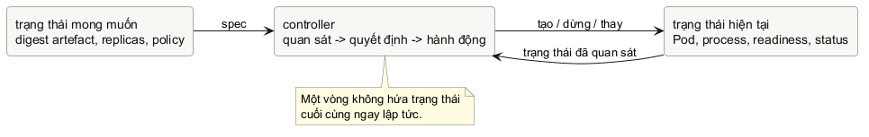

<!-- BOOK_ROLE: APPLICATION_SYSTEMS -->

# Chương 17 — Đóng gói và điều phối

Một chương trình Go chạy được bằng `go run` thường tạo một ảo giác dễ chịu: source, compiler, shell, file cấu hình và process đang ở gần nhau, nên “chạy được” trông như một sự thật đơn giản. Nó không còn đơn giản khi program phải được build một lần, chạy trên máy khác, nhận cấu hình khác, bị dừng giữa chừng, rồi được thay thế khi node biến mất. Lúc ấy, câu hỏi không phải chỉ là “làm sao chạy Docker?” mà là: **ai sở hữu trạng thái mà ta muốn hệ thống duy trì?**

Mental model của chương là: **image đóng gói contract khởi động của một process; orchestrator duy trì desired state bằng vòng reconciliation, không lặp lại một câu lệnh start.** Image nói process mặc định nào, filesystem nào và default argument nào có mặt. Một workload declaration nói bao nhiêu bản sao của artefact ấy cần tồn tại và policy nào áp dụng. Controller quan sát trạng thái hiện tại, chọn một action nhỏ để đưa nó gần desired state hơn, rồi lại quan sát. Không bước nào trong số này tự chứng minh application đã phục vụ đúng business request.

## Một image chạy được chưa phải một deployment

Giả sử team đã build một image và chạy thử một container. Binary in log, cổng mở, request đầu tiên trả `200`. Khi đưa cùng image vào cluster, một instance bị restart vì process kết thúc, instance khác chưa nhận traffic vì chưa ready, còn deployment vẫn đang thay Pod cũ bằng Pod mới. Nếu gọi tất cả là “Docker bị lỗi”, ta đánh mất ba boundary khác nhau:

@table Ba contract không nên trộn làm một

| Boundary | Câu hỏi chính | Bằng chứng phù hợp |
| --- | --- | --- |
| Artifact | Process nào, default args nào, file nào được mang theo? | Image config, digest, Dockerfile, SBOM nếu có. |
| Runtime | Process có start, nhận signal, mở listener và thoát theo contract không? | Exit status, log, health/readiness, resource observation. |
| Control plane | Desired state có đang được đưa gần current state không? | Spec, status, event và action của controller. |

Container không phải một máy ảo thu nhỏ, cũng không biến binary thành service đúng nghĩa. Nó là cách đóng gói filesystem và execution configuration cho một process. Còn `docker run` là một thao tác mệnh lệnh: nó yêu cầu runtime tạo một container ngay lúc này. Kubernetes làm việc ở lớp khác: object có `spec` diễn tả desired state, `status` báo điều đã quan sát, và các controller liên tục cố đưa hai thứ gần nhau hơn. Vì thế, “đã apply YAML” không đồng nghĩa “đã có traffic phục vụ”, cũng như “Pod Running” không đồng nghĩa “mọi container đều ready”.

@figure Desired state là input bền hơn một lệnh start. Controller chạy nhiều vòng; trạng thái cluster có thể luôn thay đổi.

## Image là process contract, không phải bản sao của laptop

OCI image configuration có những execution default như platform, working directory, user, `Entrypoint` và `Cmd`. Với image chạy một binary Go, cách đọc hữu ích là: `ENTRYPOINT` chọn executable bền vững; `CMD` là default argument mà runtime có thể override. Cả hai ở exec form giữ executable và từng argument tách riêng, tránh một shell parent làm mờ quoting và đường đi của signal.

~~~dockerfile
FROM golang:1.27.1 AS build
WORKDIR /src

COPY go.mod go.sum ./
RUN go mod download
COPY . .
RUN CGO_ENABLED=0 go build -trimpath \
  -o /out/probe-api ./cmd/probe-api

FROM gcr.io/distroless/static-debian12:nonroot
COPY --from=build /out/probe-api /probe-api
USER nonroot:nonroot
ENTRYPOINT ["/probe-api"]
CMD ["--config", "/etc/probe-api/config.json"]
~~~

Đây là một **mẫu cấu trúc**, không phải Dockerfile có thể copy nguyên xi cho lab hiện có: repository của sách không có `cmd/probe-api` hay `go.sum` ở root. Chi tiết ấy quan trọng hơn vẻ “production-ready” của snippet. Một Dockerfile chỉ có ý nghĩa khi đường dẫn package, dependency, target platform và runtime assets đều khớp source thật. Đừng thêm `CGO_ENABLED=0`, distroless hay `nonroot` như một câu thần chú; hãy kiểm tra binary có cần C library, CA certificates, timezone data, shell hay write path nào không.

`RUN` chạy ở **build time** và tạo layer; `CMD` chỉ định default khi **container start**. Nhầm hai điều này có thể khiến test hoặc migration bị chạy lúc build, còn image khi start lại không có main process đúng. Tương tự, `COPY` source rồi build trong image không tự làm source reproducible: base image tag có thể trôi, module download cần dependency graph được kiểm soát, và final image phải được nhận diện bằng digest nếu identity chính xác quan trọng hơn một tag dễ đọc.

> **Dừng để dự đoán:** Nếu runtime override `CMD` thành `--config /run/config.json`, executable nào vẫn được chạy? Nếu `ENTRYPOINT` là shell form, process nào thực sự là PID 1 và signal termination sẽ đi qua đâu? Đừng trả lời bằng thói quen: mở image config hay Dockerfile rule của runtime đang dùng.

## Một process làm gì khi control plane muốn dừng nó?

Chương 12 đã tách lifecycle HTTP server khỏi `main`: signal dẫn tới context của application, server ngừng nhận connection mới, rồi `Shutdown` chờ request đang hoạt động trong một grace period. Contract ấy vẫn thuộc về program. Container runtime và kubelet chỉ tạo thêm một upstream event: tới lúc termination, process nhận signal theo runtime policy; Kubernetes cũng có thể chờ một grace period trước khi buộc dừng. Không có lời hứa chung rằng mọi handler active tự bị cancel, mọi subprocess tự biến mất, hay mọi request sẽ hoàn thành.

Vì vậy `ENTRYPOINT ["/probe-api"]` có ý nghĩa vận hành hơn `ENTRYPOINT /probe-api --config ...` khi intent là để binary trở thành process chính. Exec form không giải quyết graceful shutdown thay chương trình, nhưng nó không chèn một command shell giữa runtime và binary. `SIGTERM` vẫn chỉ là một tín hiệu: application phải quyết định cách chuyển nó thành drain, deadline và exit code; hệ điều phối phải được cấu hình với thời gian đủ cho policy đó.

Đây cũng là lúc đọc lại readiness của Chương 16 cho đúng scope. Readiness trả lời “có nên gửi traffic mới vào instance này ngay bây giờ?”. Nó không phải một lời hứa image build đúng, không phải liveness, không phải lịch sử SLO, và không phải cái cớ để restart process vì dependency xa vừa chậm. Khi readiness false, traffic routing có thể dừng hướng request mới tới instance; controller vẫn có thể giữ instance đó tồn tại để nó tự hồi phục hoặc để người vận hành điều tra.

## Desired state không phải một script dài

Một manifest minh họa dưới đây chỉ đặt ba ý rõ ràng: identity của artefact, số bản sao mong muốn và readiness contract. Nó không tuyên bố rằng đây là toàn bộ configuration của một production service.

~~~yaml
apiVersion: apps/v1
kind: Deployment
metadata:
  name: probe-api
spec:
  replicas: 3
  selector:
    matchLabels:
      app: probe-api
  template:
    metadata:
      labels:
        app: probe-api
    spec:
      containers:
        - name: probe-api
          image: registry.example/probe-api@sha256:REPLACE_ME
          args: ["--config", "/etc/probe-api/config.json"]
          readinessProbe:
            httpGet:
              path: /readyz
              port: 8080
~~~

`replicas: 3` không có nghĩa “chạy lệnh start đúng ba lần rồi xong”. Nó là desired count. Controller có thể tạo Pod khi thiếu, tạo replacement khi một Pod bị mất, hoặc từng bước thay replica khi template thay đổi. Pod là đơn vị tương đối ephemeral; một Pod đã được schedule không tự nhảy sang node khác. Higher-level controller mới là thứ tạo Pod khác để workload tiếp tục tiến về desired state.

`image` dùng digest trong ví dụ vì digest là identity bất biến của artefact cụ thể. Tag như `:latest` là một tên có thể trỏ đến image khác ở thời điểm khác; nó có thể hữu ích cho workflow phát triển, nhưng không nên được diễn giải như bằng chứng deployment đang chạy đúng build nào. Placeholder `REPLACE_ME` cố ý làm manifest chưa apply được: một digest bịa ra sẽ tạo configuration trông hoàn chỉnh nhưng không có artefact để kéo.

Một pod spec cũng không phải nơi để nhét mọi config trong code. Environment variable, Secret, ConfigMap, volume, service account, resource request/limit và network policy đều có semantics, quyền truy cập và lifecycle riêng. Khi một field ảnh hưởng tới khả năng start hay readiness, nó là một phần của runtime contract phải test và quan sát; nó không phải “YAML glue” để bỏ qua code review.

## Đọc reconciliation bằng một hàm nhỏ

Kubernetes controller thật quan sát API object, có cache, retry, error handling và nhiều resource khác nhau. Ta không mô phỏng cluster trong lab. Thay vào đó, minimal reproducer giữ lại phần tư duy cốt lõi: một lần quan sát trả về **action kế tiếp**, không hứa system đã hội tụ ngay sau action đó.

~~~go
type ActionKind string

const (
	ActionNone   ActionKind = "none"
	ActionCreate ActionKind = "create"
	ActionDelete ActionKind = "delete"
)

type Action struct {
	Kind  ActionKind
	Count int
}

func NextAction(desired, current int) (Action, error) {
	if desired < 0 || current < 0 {
		return Action{}, ErrNegativeReplicaCount
	}
	switch {
	case current < desired:
		return Action{
			Kind:  ActionCreate,
			Count: desired - current,
		}, nil
	case current > desired:
		return Action{
			Kind:  ActionDelete,
			Count: current - desired,
		}, nil
	default:
		return Action{Kind: ActionNone}, nil
	}
}
~~~

Hàm cố tình không `for` cho đến khi count bằng nhau. Nếu nó tự gọi “start” ba lần, nó sẽ che những event thật giữa các action: create có thể fail, instance có thể chưa ready, current state có thể thay đổi bởi một actor khác, hoặc controller có thể cần rate limit. `ActionNone` không chứng minh application healthy; nó chỉ nói snapshot count được đưa vào hàm đang bằng desired count. Sự khiêm tốn này là một property quan trọng của code điều phối.

Trong controller thật, desired state không phải immutable code constant và current state không phải biến local đáng tin vĩnh viễn. Spec có thể đổi lúc controller đang xử lý; cache có thể cũ; action trả lỗi hoặc thành công một phần. Vì vậy reconciliation phải idempotent: cùng desired/current observation thì `NextAction` đưa cùng action, và action đó có ý nghĩa an toàn khi vòng lặp chạy lại. Đây là documented control-loop pattern; chi tiết retry queue, status condition và ownership reference là implementation/API design của Kubernetes, không phải language semantics của Go.

@table Điều một vòng reconciliation được phép kết luận

| Observation | Action hợp lý của toy reconciler | Điều vẫn chưa biết |
| --- | --- | --- |
| Desired 3, current 1 | Tạo thêm 2 instance. | Hai instance đó có start hay ready không. |
| Desired 3, current 5 | Dừng/bỏ 2 instance. | Instance nào nên bị chọn, connection có cần drain không. |
| Desired 3, current 3 | Không đổi replica count. | Image revision, traffic, latency, SLO và resource health. |

## Lab: tự hoàn thành vòng lặp một bước

Mở `labs/part17-reconciliation-contract/exercise/reconcile_test.go` trước. Bài không cần Docker daemon, cluster, credential hay network. Test đưa desired/current count vào và đòi action bounded, idempotent về kết quả, không biến input âm thành một action “lạ”. Đây không phải Kubernetes giả lập; đó là cách tách mental model của reconciliation khỏi số lượng API mà người học chưa cần biết.

~~~powershell
cd labs/part17-reconciliation-contract
go test -tags exercise ./exercise
go test ./fixed
go vet ./fixed
go test -race ./fixed
~~~

Hãy viết `NextAction` từ contract, không mở `fixed/` trước. Câu hỏi trước khi code là: action nào mang **chênh lệch** giữa desired và current, và case equal cần trả gì để caller không phải đoán? Sau khi tests xanh, tự thay current bằng kết quả giả định của action rồi gọi lại. Điều gì xảy ra ở vòng thứ hai? Đó là trực giác idempotency tối thiểu của chapter.

**Đáp án — chỉ đọc sau khi đã tự làm.** Validate cả hai count trước, vì `desired - current` với số âm có thể biến một configuration lỗi thành action hợp lệ giả. Sau đó trả `create` hay `delete` với `Count` đúng bằng độ chênh; equal trả `ActionNone` với `Count` zero. Không mutate input, không loop, không sleep và không cố “chờ ready”: mỗi thứ đó thuộc boundary khác.

## Stage hai: đưa service thật vào container và cluster

Vòng lặp `NextAction` ở trên giúp ta hiểu bản chất của reconciliation mà chưa
cần tới cluster thật. Nhưng khi đưa một service Go vào vận hành, code không còn
chạy trực tiếp trên máy lập trình. Nó phải được đóng gói vào một OCI image và
giao phó cho một hệ điều phối. `labs/part17-container-kubernetes` dùng chính
HTTP service `probe-api` từ `labs/part16-real-signals` để kiểm chứng trọn vẹn
chuỗi ranh giới này trên môi trường cục bộ.

~~~text
Dockerfile (multi-stage, non-root)
    |
    v
Image: probe-api:dev  --->  Container runtime
                                  | (signal, port, read-only)
                                  v
                            Cluster (kind)
                                  |
            +-------------------+-------------------+
            |                                       |
            v                                       v
      Deployment (desired)                  Service (traffic)
       - readiness: /readyz                  - cluster IP
       - liveness: /livez                    - port fwd
            |
            v
   client-go observer (read-only Get/Watch)
~~~

Trước khi bắt đầu, lab kiểm tra các công cụ bắt buộc bằng script
`scripts/verify-prereqs.ps1`. Nó đòi hỏi `docker`, `kubectl` và `kind` có mặt
trên máy local. Nếu môi trường hiện tại chưa cài đặt những công cụ này, script
sẽ dừng lại với thông báo rõ ràng; khi đó, các lệnh dưới đây là đường dẫn thực
thi minh họa được chuẩn hóa để anh tái lập khi có đủ công cụ, tuyệt đối không
tự ý thay thế bằng một cluster cloud có phí.

~~~powershell
cd labs/part17-container-kubernetes
./scripts/verify-prereqs.ps1
~~~

### Image là contract của process

Dockerfile của lab áp dụng mô hình multi-stage build để tách biệt môi trường
biên dịch với môi trường thực thi. Stage đầu tiên dùng image Go chính thức để tải
module và biên dịch binary với `CGO_ENABLED=0` và cờ `-trimpath` nhằm loại bỏ
đường dẫn file hệ thống cục bộ khỏi binary. Stage cuối cùng chỉ sao chép duy nhất
file binary sang base image tối giản `distroless/static-debian12:nonroot`.

~~~dockerfile
FROM golang:1.27.1 AS build
WORKDIR /src
COPY go.mod go.sum ./
RUN go mod download
COPY . .
RUN CGO_ENABLED=0 go build -trimpath \
  -o /out/probe-api ./cmd/probe-api

FROM gcr.io/distroless/static-debian12:nonroot
COPY --from=build /out/probe-api /probe-api
USER 65532:65532
ENTRYPOINT ["/probe-api"]
~~~

Contract khởi động ở đây rất chặt chẽ: `ENTRYPOINT` ở exec form đảm bảo binary
là PID 1 trong container. Cổng lắng nghe được cấu hình qua biến môi trường
`PORT`, khớp hoàn toàn với contract của HTTP server ở Chương 12 và 16. Khi chạy
container, ta áp dụng nguyên tắc đặc quyền tối thiểu: `--read-only` khóa toàn bộ
root filesystem, `--cap-drop ALL` tước bỏ mọi Linux capability thừa, và `USER
65532:65532` ngăn chặn việc chạy dưới quyền root.

~~~powershell
# Chạy từ thư mục gốc của repository (minh họa)
docker build `
  -f labs/part17-container-kubernetes/Dockerfile `
  -t probe-api:dev `
  labs/part16-real-signals

docker run --rm --name probe-api `
  --read-only --cap-drop ALL `
  -p 18080:18080 -e PORT=18080 probe-api:dev
~~~

Ở một terminal khác, ta kiểm tra các contract vận hành:

~~~powershell
curl.exe -i http://localhost:18080/readyz
curl.exe -i http://localhost:18080/probe?mode=slow
docker inspect --format '{{.Config.User}}' probe-api
docker stop -t 5 probe-api
~~~

Lệnh `docker stop -t 5` gửi tín hiệu `SIGTERM` tới process và cho phép 5 giây để
server hoàn tất các request đang xử lý trước khi runtime gửi `SIGKILL`. Đây chính
là phép thử cho contract graceful shutdown mà ta đã xây dựng. Đánh đổi của
distroless và read-only filesystem là gì? Container sẽ không có shell (`/bin/sh`),
không có trình quản lý gói, và binary không thể tùy tiện ghi file tạm nếu không
được mount một thư mục riêng biệt. Sự bất tiện khi debug tại chỗ này đổi lại một
bề mặt tấn công cực kỳ hẹp.

Cần lưu ý: nhãn `probe-api:dev` chỉ là định danh cục bộ trên máy phát triển. Nó
không phải là một định danh bất biến dùng cho môi trường production; Chương 18
sẽ giải quyết bài toán định danh bằng digest.

### Desired state và điều tra sự cố trong cluster

Khi chuyển từ container đơn lẻ sang Kubernetes, ta không còn ra lệnh chạy một
process mà khai báo desired state thông qua các manifest: `namespace.yaml`,
`deployment.yaml` và `service.yaml`.

~~~powershell
kind create cluster --name go-book
kind load docker-image probe-api:dev --name go-book
kubectl apply -f k8s/namespace.yaml
kubectl apply -f k8s/deployment.yaml
kubectl apply -f k8s/service.yaml
kubectl -n go-book rollout status deployment/probe-api
kubectl -n go-book get deploy,pod,service
kubectl -n go-book port-forward service/probe-api 18080:80
~~~

Trong `deployment.yaml`, hai probe phục vụ hai mục đích hoàn toàn khác biệt:

1. **Readiness Probe (`/readyz`):** Trả lời câu hỏi "Pod này có sẵn sàng nhận
   traffic từ Service ngay lúc này không?". Nếu readiness thất bại, endpoint
   controller sẽ tạm thời gỡ Pod khỏi danh sách IP nhận tải của Service, nhưng
   container **không** bị restart.
2. **Liveness Probe (`/livez`):** Trả lời câu hỏi "Process này còn sống và hoạt
   động bình thường không, hay đã bị deadlock hoàn toàn?". Nếu liveness thất
   bại, kubelet sẽ tiêu diệt và restart container. Tuyệt đối không kiểm tra
   database hay dependency từ xa trong liveness probe; một sự cố mạng thoáng qua
   của dependency sẽ khiến toàn bộ cluster tự restart hàng loạt (cascading
   failure).

Phần tài nguyên cũng phân định rõ ràng giữa `requests` (con số scheduler dùng
để tìm node phù hợp cho Pod) và `limits` (ngưỡng tối đa kernel cho phép; vượt CPU
sẽ bị throttle, vượt memory sẽ bị OOM killer tiêu diệt).

Để hiểu cách điều tra sự cố bằng bằng chứng thay vì suy đoán, lab cung cấp
fixture `k8s/failure-wrong-image.yaml` với tên image không tồn tại:

~~~powershell
kubectl apply -f k8s/failure-wrong-image.yaml
kubectl -n go-book rollout status `
  deployment/probe-api --timeout=45s
kubectl -n go-book get pods
kubectl -n go-book get events --sort-by=.lastTimestamp
kubectl -n go-book describe pod `
  -l app.kubernetes.io/name=probe-api
kubectl apply -f k8s/deployment.yaml
kubectl -n go-book rollout status deployment/probe-api
~~~

Lệnh `rollout status` sẽ timeout sau 45 giây. Người mới thường vội kết luận
"Kubernetes bị treo". Nhưng khi kiểm tra `get events` và `describe pod`, control
plane cho ta bằng chứng cụ thể: `ErrImagePull` và `ImagePullBackOff`. Sau khi xác
định đúng nguyên nhân, ta khôi phục bằng cách apply lại `deployment.yaml` gốc.
Khi hoàn tất, ta dọn dẹp cluster cục bộ bằng lệnh:
`kind delete cluster --name go-book`.

### Quan sát API bằng client-go

Thay vì phụ thuộc hoàn toàn vào lệnh CLI `kubectl`, các kỹ sư Go thường cần viết
các công cụ chẩn đoán hoặc tự động hóa bằng chính ngôn ngữ Go. Thư mục
`labs/part17-container-kubernetes/client-observer` minh họa một chương trình
chẩn đoán chỉ đọc (read-only) dùng thư viện `k8s.io/client-go`.

Chương trình nạp cấu hình cluster từ kubeconfig cục bộ, gọi API `Get` để lấy
snapshot của Deployment `probe-api`, và mở một kênh `Watch` có giới hạn 15 giây
để lắng nghe các thay đổi:

~~~powershell
cd labs/part17-container-kubernetes/client-observer
go test ./...
go vet ./...
go test -race ./...
go run ./cmd/observe-deployment `
  --namespace go-book --name probe-api
~~~

Kết quả in ra tách biệt rõ giữa desired state và current observation:

~~~text
get: generation=1 observed=1 desired=1 updated=1 available=1
~~~

Chương trình này cố ý giữ phạm vi hẹp: nó không tạo, sửa hay xóa bất kỳ tài
nguyên nào. Nó minh họa sự khác biệt giữa `Generation` (số phiên bản spec mà
người dùng muốn) và `ObservedGeneration` (phiên bản spec mà controller đã xử lý).
Nếu hai con số này lệch nhau, hệ thống đang trong quá trình chuyển trạng thái.

@table Các lớp kiểm soát từ binary đến cluster

| Tầng kiểm soát | Nhiệm vụ chính | Bằng chứng kiểm chứng | Giới hạn không được suy diễn |
| --- | --- | --- | --- |
| Binary | Xử lý request, signal, HTTP ports. | Unit/race test, JSON log. | Chưa biết môi trường filesystem hay cgroup. |
| Container | Đóng gói filesystem, user, PID 1. | `docker inspect`, exit code. | Chạy được 1 container không đảm bảo tính sẵn sàng. |
| Workload | Điều phối replica, rolling update, probe. | Rollout status, Pod events. | Pod Available không chứng minh logic app không lỗi. |
| Client-go | Đọc và theo dõi trạng thái qua API. | Generation, ObservedGeneration. | Snapshot tại một thời điểm không thay thế controller. |

**Dừng để dự đoán.** Nếu một Pod có liveness probe thành công nhưng readiness
probe thất bại, Service có chuyển tiếp request vào Pod đó không? Kubelet có
restart Pod không? Hãy đối chiếu câu trả lời với bảng trên trước khi xem tiếp.

## Khi nào phải dùng Docker, Kubernetes và client-go thật

Khi requirement cần build/push image, chạy integration test trong container, deploy workload, đọc status cluster hoặc viết controller, lúc đó tool thật là bắt buộc. Docker CLI/BuildKit và Kubernetes API đều có version, quyền và cluster policy của chúng; client-go không phải một gói tiện ích để import chỉ vì cần parse YAML. Trước khi chạm API, hãy viết rõ resource nào là source of truth, identity nào được ownership, retry có thể lặp action nào, status nào caller được tin, và credential nào agent được phép dùng.

Điểm dừng của chương là một cách nhìn không còn “deploy = chạy command”. Artefact identity, process lifecycle và desired state là ba contract liên tiếp. Chương 16 cho ta signal để biết instance hiện ra sao; chương này cho ta controller để hiểu vì sao instance có thể bị tạo, thay hoặc rút khỏi traffic. Từ đây, phần tiếp theo có thể đi sâu hơn vào delivery pipeline, configuration, policy hay một control loop có domain thật mà không biến Dockerfile hay Kubernetes YAML thành ma thuật nền.

@references
1. Open Container Initiative. Image configuration: platform, `Entrypoint`, `Cmd`, `WorkingDir`, `User` và default execution parameters. github.com/opencontainers/image-spec/blob/main/config.md
2. Docker Authors. Dockerfile reference: `RUN`, `CMD`, `ENTRYPOINT`, exec form và shell form. docs.docker.com/reference/dockerfile/
3. Kubernetes Authors. Controllers: desired state, current state và control loops. kubernetes.io/docs/concepts/architecture/controller/
4. Kubernetes Authors. Pod lifecycle: Pod spec/status, restart policy, readiness và container lifecycle. kubernetes.io/docs/concepts/workloads/pods/pod-lifecycle/
5. Kubernetes Authors. Package `client-go`: programmatic interface cho Kubernetes API. pkg.go.dev/k8s.io/client-go
6. GoogleContainerTools. Distroless: language focused docker images, non-root user và minimal runtime footprint. github.com/GoogleContainerTools/distroless
