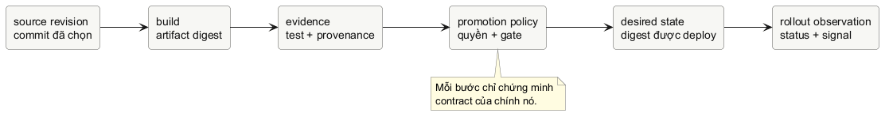

# Chương 18 — Đưa thay đổi ra production

Sau Chương 17, ta có thể đặt một artifact có digest vào desired state. Nhưng một digest không tự trả lời artifact ấy đến từ source nào, đã đi qua test nào, job nào có quyền deploy, hay rollout xong có nghĩa gì với người dùng. Một pipeline xanh chỉ là tín hiệu về những bước nó đã chạy; nếu các bước không nói rõ contract, màu xanh tạo cảm giác an toàn mạnh hơn bằng chứng thực tế.

Mental model của chương là: **delivery là chuỗi bằng chứng gắn một source revision với một artifact bất biến, rồi cho phép promotion theo policy hẹp.** Pipeline không “đưa code lên production”. Nó build một artifact, ghi identity của artifact, thu evidence cho các gate đã định nghĩa, và chỉ một job có quyền phù hợp mới cập nhật desired state bằng chính digest ấy. Rollback cũng là một promotion có chủ đích tới artifact đã biết, không phải nút hoàn tác cho mọi side effect của hệ thống.

## Một commit xanh vẫn chưa là release

Giả sử một PR pass unit test. Sau đó runner build image, job deploy dùng tag `:main`, cluster pull image, và rollout hiện `3/3 Available`. Chuỗi này còn nhiều câu hỏi chưa được trả lời: image đang chạy có đúng là image vừa build không; source revision nào đã tạo image; credential deploy có quyền rộng đến đâu; `3/3` chỉ ra replica available hay chứng minh request business thành công; và nếu data migration đã chạy, rollback image có đảo dữ liệu lại không?

Đây không phải lý do để bỏ CI/CD vì “quá phức tạp”. Nó là lý do để mỗi bước hứa một điều nhỏ, kiểm chứng được. Source revision là identity của đầu vào source. Artifact digest là identity của output build. Test là evidence về behavior mà test bao phủ. Provenance là evidence về quan hệ build mà verifier đã xác nhận. Promotion policy quyết định evidence nào đủ để thay desired state. Rollout status là observation về controller và replica, không phải SLO.

@figure Một delivery đáng tin là chuỗi contract hẹp. Mũi tên không biến test pass thành lời hứa về mọi failure mode.

@table Mỗi tín hiệu delivery cho phép kết luận đến đâu

| Evidence | Điều có thể nói | Điều chưa thể nói |
| --- | --- | --- |
| Commit/revision | Source input đã được chọn. | Artifact nào thật sự được build. |
| Image digest | Một artifact content-addressed cụ thể. | Artifact đó qua test hay provenance nào. |
| Test pass | Contract của test hiện có đã pass. | Toàn bộ behavior production, data hay dependency. |
| Rollout complete | Controller đã đạt điều kiện rollout của workload. | SLO, chi phí, hay business transaction của user. |

Tag dễ đọc vẫn có ích cho con người, nhưng tag là một tên có thể trỏ sang artifact khác theo thời gian. Promotion production nên mang digest mà gate đã xét, không rebuild “cùng commit” ở job sau rồi hy vọng hai output giống nhau. Nếu cần reproducibility cao hơn, build policy phải pin input phù hợp, ghi revision/toolchain và quản lý base image/dependency; digest chỉ nhận diện output, không tự giải thích output được tạo thế nào.

## Gate không phải nghi thức, mà là policy có người chịu trách nhiệm

Một pipeline tốt không bắt mọi thay đổi chạy toàn bộ suite đắt tiền chỉ vì dashboard thích nhiều ô xanh. Nó đặt gate theo risk và feedback loop. Static check hoặc unit test nhanh có thể chạy sớm trên mọi thay đổi. Integration test có dependency thật có thể chạy ở stage khác, với timeout và teardown rõ ràng. Build/push chỉ chạy khi source đã qua gate cần thiết. Promotion production cần identity bất biến, evidence được xác minh, permission hẹp và một đường rollback đã được diễn tập.

Cost guardrail cũng là một contract. Một job integration có thể tạo cluster tạm, registry storage hay egress; phải có owner, timeout, concurrency limit, cleanup và giới hạn phạm vi. “Tốn tiền” không tự làm một job sai, còn “CI xanh” không hợp thức hóa resource không có lifecycle. Hãy đo chi phí của stage nặng trước khi tối ưu, giống cách Chương 10 đặt benchmark trước khi đổi code.

> **Dừng để dự đoán:** Nếu build job pass nhưng không ghi digest vào promotion record, deploy job đang chứng minh điều gì khi nó pull `:main`? Nếu security scan báo sạch nhưng image deploy là output của một build khác, scan đã xét đúng artefact chưa?

Không có gate chung cho mọi sản phẩm. Một payment service có thể cần review/approval và contract test khác một CLI nội bộ. Điều cần giữ chung là policy không fail-open: evidence thiếu hoặc không hợp lệ phải dẫn đến từ chối promotion có giải thích, không âm thầm đổi tag hay dùng credential mạnh hơn để “chạy cho xong”.

## Quyền deploy là capability, không phải biến môi trường tiện tay

CI runner có thể chạy source và action mà workflow cho phép, nên credential deploy không nên xuất hiện ở mọi job. Với GitHub Actions, `GITHUB_TOKEN` nên bắt đầu bằng quyền đọc tối thiểu rồi tăng quyền tại job thực sự cần. Cloud credential dài hạn được chép vào secret là một boundary rủi ro khác: secret có thể bị dùng nhầm, log redaction không phải một bằng chứng tuyệt đối, và policy ở cloud mới quyết định token có làm được gì.

OIDC là một cách đưa capability về đúng job cần nó. Workflow xin identity token; cloud provider kiểm tra claim/trust condition rồi cấp access token ngắn hạn cho job. Nó không tự cấp quyền deploy: trust policy vẫn phải giới hạn repository, branch/tag hoặc environment, role và resource. `id-token: write` chỉ cho phép job xin token OIDC, không tự cho phép sửa cloud resource. Đó là lý do “bật OIDC” không thể thay thế review policy IAM.

~~~yaml
permissions:
  contents: read

jobs:
  deploy-production:
    permissions:
      contents: read
      id-token: write
    environment: production
~~~

Đoạn YAML chỉ mô tả **ý định phân quyền**, chưa phải workflow deploy chạy được: nó không định nghĩa cloud role, subject claim, approval rule, digest, action version hay command. Đừng copy snippet rồi thêm secret quyền admin để vượt qua bước trust. Thiết kế đúng phải viết từ resource mà job được phép thay đổi, identity của workflow được cloud tin, và điều kiện nào khiến token bị từ chối.

## Promotion phải giữ identity của artifact

Lab không ký image và không gọi registry. Nó giữ lại boundary quyết định: candidate có digest hợp lệ, revision để truy vết, test evidence và provenance evidence; thiếu gate trả một `Decision` từ chối, còn digest sai là input lỗi. Phân biệt hai case này giúp caller không biến configuration sai thành “release bị từ chối bình thường”.

~~~go
type Candidate struct {
	Digest             string
	Revision           string
	TestsPassed        bool
	ProvenanceVerified bool
}

type Decision struct {
	Allowed bool
	Digest  string
	Reason  string
}

func Evaluate(candidate Candidate) (Decision, error) {
	if !validDigest(candidate.Digest) {
		return Decision{}, ErrInvalidDigest
	}
	if strings.TrimSpace(candidate.Revision) == "" {
		return Decision{}, ErrMissingRevision
	}
	if !candidate.TestsPassed {
		return Decision{Reason: ReasonTestsNotPassed}, nil
	}
	if !candidate.ProvenanceVerified {
		return Decision{Reason: ReasonProvenanceMissing}, nil
	}
	return Decision{Allowed: true, Digest: candidate.Digest}, nil
}
~~~

`ProvenanceVerified` ở đây là input đã được verifier khác kiểm tra; bool này **không** mô hình hóa chữ ký, trust root, identity của builder hay policy admission. Đây là chủ ý sư phạm: trước khi dùng framework attestation hay API registry, ta cần thấy promotion decision phải giữ đúng digest và fail closed khi evidence vắng mặt. Một struct nhỏ không được phép giả vờ thay supply-chain system thật.

## Rollback là một release khác, không phải máy quay thời gian

Kubernetes Deployment có revision cho thay đổi Pod template và có thể rollout quay về revision trước. Nhưng revision không bao phủ mọi state ngoài Pod template: thay đổi `replicas` không tạo revision, history có thể bị dọn theo `revisionHistoryLimit`, external config có thể đã đổi, còn database migration và message đã gửi không tự đảo. Vì thế “rollback được” phải được nói thành câu cụ thể hơn: *rollback artifact/template nào, trong môi trường nào, với data contract và side effect nào?*

Một runbook rollback cần ít nhất: tiêu chí kích hoạt, digest/revision đã biết tốt, owner được phép promote, lệnh hay automation đã thử trong môi trường phù hợp, evidence sau rollout, và quyết định cho data. Nếu release mới chỉ đổi binary stateless, rollback có thể là promotion digest cũ rồi quan sát rollout. Nếu release đổi schema theo hướng không tương thích, rollback có thể cần feature flag, expand/contract migration hoặc dừng phát hành thay vì chạy `undo` ngay.

~~~text
rollback request
  -> chọn artifact/revision đã biết
  -> kiểm tra data và blast radius policy
  -> promote digest cũ
  -> quan sát rollout + signal
  -> ghi lại quyết định và kết quả
~~~

Đừng tự động rollback chỉ vì một metric chớp đỏ nếu policy chưa định nghĩa window, ownership và false-positive cost. Nhưng cũng đừng để “manual rollback” nghĩa là một người gõ tag tùy ý lúc incident. Cùng identity, gate và permission boundary của forward delivery phải được giữ khi quay lại.

## Case study: rollout xanh, user vẫn fail

Một release `sha256:abc...` pass unit và integration test, provenance đã verify, rồi được deploy bằng digest. Deployment báo complete: Pod mới available. Vài phút sau, availability SLI tụt vì config ở production trỏ tới endpoint dependency đã retire. Không evidence nào ở đây mâu thuẫn nhau:

- Build/promotion proof nói artifact và gate nào đã được dùng.
- Deployment status nói controller đã thay replica theo policy.
- SLI/log/trace của Chương 16 nói user path đang fail và giúp tìm cohort/config lệch.

Action đúng không phải kết luận “CI vô dụng” hay “Kubernetes đánh lừa mình”. Team kiểm tra blast radius, candidate config và data contract; nếu rollback digest cũ khôi phục khả năng phục vụ mà không phá migration, họ promote digest cũ theo runbook. Sau incident, gate cần được sửa ở boundary đã thiếu: configuration validation hoặc integration environment gần production hơn, không nhất thiết là thêm một security scan vô liên quan.

## Lab: tự viết admission decision fail-closed

Mở `labs/part18-promotion-evidence/exercise/admission_test.go` trước. Test không dùng network, registry, secret hay crypto library. Nó yêu cầu anh tự định nghĩa đúng sự khác nhau giữa candidate malformed và candidate hợp lệ nhưng chưa đủ evidence. Exercise đỏ vì `Evaluate` chưa được viết; fixed giữ implementation nhỏ để test các invariant trước khi bất kỳ CI vendor nào xuất hiện.

~~~powershell
cd labs/part18-promotion-evidence
go test -tags exercise ./exercise
go test ./fixed
go vet ./fixed
go test -race ./fixed
~~~

Sau khi làm xong, thử viết một test mới: nếu `TestsPassed` là false nhưng provenance true, `Decision` có được giữ digest hay không? Hãy chọn policy và diễn đạt lý do. Lab hiện chọn không giữ digest trong decision bị từ chối để caller không vô tình lấy identity đó đi deploy; policy khác chỉ hợp lệ khi được ghi rõ và có test riêng.

<!-- pagebreak -->

**Đáp án — chỉ đọc sau khi đã tự làm.** Validate digest rồi revision trước vì chúng là input contract. Sau đó kiểm tra từng gate và return decision từ chối không error; `error` dành cho candidate malformed. Chỉ decision allowed mới mang digest. `validDigest` chấp nhận đúng prefix `sha256:` và 64 chữ số hexadecimal thường; nó là validation định dạng, không phải xác thực content tồn tại hay chữ ký.

## Điểm dừng: evidence không thay thế trách nhiệm

Pipeline, OIDC, attestation, Deployment và rollback không làm software tự an toàn. Chúng làm đường đi của một thay đổi có thể kiểm tra: source nào, artifact nào, gate nào, quyền nào, rollout nào và hành động nào khi xấu. Đó là nền để một Go service có thể được phát hành nhiều lần mà không biến mỗi lần phát hành thành một niềm tin mơ hồ.

Từ đây, sách có thể quay vào case study lớn hơn: một service nhận input, chạy work có deadline, phát signal, được đóng gói, rồi được đưa qua delivery policy và phục hồi có evidence. Mỗi công cụ chỉ được thêm khi câu hỏi vận hành đã tồn tại.

@references
1. GitHub Docs. Secure use reference: least privilege, `GITHUB_TOKEN`, secret risks và OIDC. docs.github.com/en/actions/reference/security/secure-use
2. GitHub Docs. OpenID Connect: token ngắn hạn, trust relationship và cloud authorization. docs.github.com/en/actions/concepts/security/openid-connect
3. GitHub Docs. Security for GitHub Actions: artifact attestations và deployment hardening. docs.github.com/en/actions/how-tos/secure-your-work
4. Kubernetes Authors. Deployments: rollout status, revision, rollback và giới hạn của revision history. kubernetes.io/docs/concepts/workloads/controllers/deployment/
