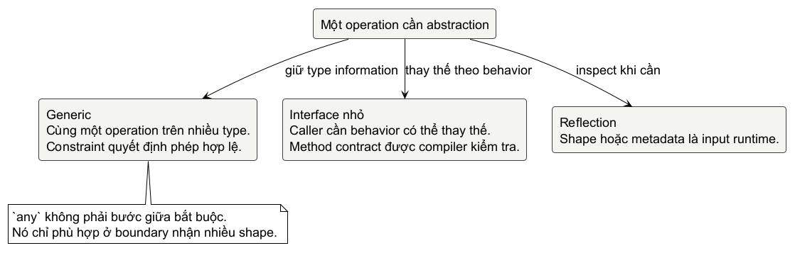

# Chương 19 — Giữ type information khi abstraction lớn lên

Một service có hai danh sách target: tên miền và cổng. Cả hai đều cần cùng một thao tác: giữ lại phần tử đầu tiên của mỗi giá trị, theo đúng thứ tự ban đầu. Nếu viết thẳng, ta có hai hàm gần như giống nhau. Sự lặp này chưa nguy hiểm; nó làm câu hỏi thiết kế hiện ra rõ: phần nào trong thao tác thực sự khác theo type, và phần nào là quy luật chung?

~~~go
func uniqueNames(các giá trị []string) []string {
	seen := make(map[string]struct{}, len(các giá trị))
	result := make([]string, 0, len(các giá trị))
	for _, giá trị := range các giá trị {
		if _, exists := seen[giá trị]; !exists {
			seen[giá trị] = struct{}{}
			result = append(result, giá trị)
		}
	}
	return result
}

func uniquePorts(các giá trị []int) []int {
	// cùng vòng lặp, chỉ khác type của giá trị và map
}
~~~

Một phản ứng thường thấy là đổi mọi thứ thành `any`. hàm sẽ bớt lặp trên giấy, nhưng bên gọi mất thông tin mà compiler có thể dùng để bắt lỗi. Phản ứng ngược lại là tạo một abstraction generic cho mọi mẩu mã nguồn trùng nhau. Nó cũng tệ: một type tham số chỉ có ý nghĩa khi thao tác chung thật sự rõ hơn sau khi tách nó ra.

Mental model của chương là: **generic giữ type information cho compiler khi cùng một thao tác áp dụng lên một tập type; interface giữ contract hành vi khi concrete type có thể thay đổi; reflection chỉ phù hợp khi shape hay metadata thực sự là input lúc runtime.** Đây là ba boundary khác nhau, không phải ba mức “linh hoạt” để tăng dần.

@figure Chọn abstraction theo câu hỏi cần trả lời. Sơ đồ là mental model, không mô tả representation runtime của interface hay cách compiler sinh mã nguồn.

## Bắt đầu bằng duplication, không bằng dấu ngoặc vuông

`uniqueNames` và `uniquePorts` đều chỉ cần một phép: so sánh hai giá trị bằng `==`. Điều đó loại slice, map và hàm, nhưng đủ cho `string`, `int`, con trỏ, struct có field comparable, và named type có underlying type tương ứng. `comparable` ghi đúng boundary ấy.

~~~go
func Unique[T comparable](các giá trị []T) []T {
	seen := make(map[T]struct{}, len(các giá trị))
	result := make([]T, 0, len(các giá trị))
	for _, giá trị := range các giá trị {
		if _, exists := seen[giá trị]; !exists {
			seen[giá trị] = struct{}{}
			result = append(result, giá trị)
		}
	}
	return result
}

names := Unique([]string{"api", "db", "api"})
các cổng := Unique([]int{443, 8080, 443})
~~~

`T` là type tham số, còn `comparable` là constraint: tập type đối số mà `T` được phép nhận, đồng thời là giới hạn thao tác trong body. Vì bên gọi đưa `[]string` hay `[]int`, compiler infer type đối số; không cần viết `Unique[string](...)`. Viết explicit vẫn hợp lệ khi ngữ cảnh chưa đủ để infer, nhưng nó không phải nghi thức phải thêm vào mọi lời gọi.

Nếu thử `Unique([][]byte{{1}, {1}})`, mã nguồn không compile. Đó là kết quả có ích: slice không comparable, nên map key và `==` không có semantics mà hàm này đã hứa. Chuyển input thành `[]any` không sửa được hợp đồng; hai interface giá trị có dynamic type là slice còn có thể panic khi bị so sánh. Khi equality cho byte slice cần nghĩa khác, chẳng hạn `bytes.Equal`, API mới phải nói rõ nghĩa đó thay vì giả vờ `Unique` phổ quát.

`any` là alias của `interface{}`. Nó có chỗ ở boundary thực sự nhận nhiều shape, như Chương 14 nhận destination để inspect bằng reflection. Nhưng `func UniqueAny(values []any) []any` buộc implementation phải type switch, type assertion hoặc chịu lỗi runtime để biết so sánh thế nào. Generic không làm type biến mất; nó yêu cầu compiler kiểm tra type đối số thỏa constraint trước khi mã nguồn chạy.

## Constraint là danh sách phép được phép, không phải giấy phép bao hết type

Có thao tác cần thứ tự thay vì equality. Ta có thể tự định nghĩa constraint nhỏ theo đúng domain của ví dụ, thay vì copy một constraint rộng chỉ để hàm trông “tái sử dụng được”.

~~~go
type Measurable interface {
	~int | ~int64 | ~float64
}

func Max[T Measurable](left, right T) T {
	if left > right {
		return left
	}
	return right
}

type Milliseconds int64

slowest := Max(Milliseconds(120), Milliseconds(80))
~~~

Union `|` nói rằng một type đối số thuộc một trong các term. Dấu `~` mở term ra cho mọi defined type có **underlying type** tương ứng. Không có `~int64`, `Milliseconds` không thỏa constraint dù `left > right` có nghĩa hoàn toàn rõ. Ngược lại, `~` không “chuyển đổi ngầm”: `int` và `int64` vẫn là hai type khác, nên `Max(1, int64(2))` không có một `T` duy nhất để infer.

Constraint có type term như `~int | ~int64` là general interface: nó dùng để giới hạn type tham số, không phải một interface giá trị để truyền quanh chương trình. Một interface nhận giá trị cần mô tả behavior bằng method; một constraint có thể mô tả tập type và các thao tác compiler cho phép. Đặt cả hai dưới cùng từ “interface” dễ làm mờ hai nhiệm vụ này.

> **Dừng để dự đoán:** `Max(Milliseconds(120), Milliseconds(80))` trả về type nào? Không phải `int64`. Sau substitution, `T` là `Milliseconds`, nên result giữ named type ấy. Đây là lợi ích của việc không ép giá trị đi qua `any` rồi type assertion lại.

## Generic named type giữ invariant cùng dữ liệu

Khi dữ liệu và thao tác đi cùng nhau, generic named type có thể làm API gọn hơn. Set dưới đây chỉ nhận `comparable` vì Go map key cần constraint đó. Constraint nằm ở khai báo của type, nên mỗi method đều kế thừa invariant thay vì lặp lại nó.

~~~go
type Set[T comparable] map[T]struct{}

func (set Set[T]) Has(giá trị T) bool {
	_, found := set[giá trị]
	return found
}

các cổng := Set[int]{443: {}, 8080: {}}
~~~

`Set[string]` và `Set[int]` là instantiated types khác nhau. bên gọi không thể vô tình gọi `Set[string].Has(443)`. Đây không phải lời hứa rằng generic mã nguồn luôn nhanh hơn mã nguồn interface; performance phụ thuộc tải công việc, compiler và version, nên phải đo nếu nó trở thành lý do chọn thiết kế. Ở đây lợi ích đã rõ trước benchmark: API nói chính xác giá trị nào có thể vào set.

Go 1.27 còn cho method tự khai báo type tham số của nó. Điều này hữu ích khi thao tác thuộc namespace của data type nhưng result đổi element type.

~~~go
type Batch[E any] []E

func (batch Batch[E]) Map[F any](fn func(E) F) Batch[F] {
	result := make(Batch[F], len(batch))
	for i, giá trị := range batch {
		result[i] = fn(giá trị)
	}
	return result
}

labels := Batch[int]{2, 4}.Map(func(cổng int) string {
	return fmt.Sprintf("cổng=%d", cổng)
})
~~~

Đây là generic method của Go 1.27, khác với method thông thường trên generic bộ tiếp nhận như `Set[T].Has`. Generic method được instantiate khi dùng. Nó không biến interface method thành generic: interface method không được tự khai báo type tham số, và một generic method không phải cách để implement một interface method generic. Nếu consumer chỉ cần gọi `Map` trên một concrete `Batch`, method giúp tổ chức mã nguồn; nếu consumer cần một behavior thay thế được, một interface nhỏ với chữ ký hàm cụ thể thường rõ hơn.

## Interface thay vì generics khi câu hỏi là “ai làm được việc này?”

Một probe HTTP, một probe TCP và fake dùng trong test có thể trả outcome bằng các implementation khác nhau. bên gọi không cần giữ concrete type của chúng; bên gọi cần gọi một behavior. Interface ghi contract đó ở compile time.

~~~go
type Checker interface {
	Check(context.Context) error
}

type httpChecker struct{}

func (httpChecker) Check(context.Context) error { return nil }

func RunOne(ctx context.Context, checker Checker) error {
	return checker.Check(ctx)
}

var _ Checker = httpChecker{}
~~~

Dòng cuối là compile-time assertion: nếu `httpChecker` thiếu `Check`, package không compile. Khi program chạy, một giá trị của interface có static type `Checker`, còn concrete giá trị bên trong có thể có dynamic type khác ở từng lần gọi. Đó là lý do interface hữu ích cho polymorphism theo behavior, không phải vì nó “nhận được mọi type”.

Khi mã nguồn cần hiểu concrete case nào đang ở trong interface, type assertion và type switch là công cụ trực tiếp. Chúng không cần reflection.

~~~go
func describe(giá trị any) string {
	switch typed := giá trị.(type) {
	case string:
		return "name=" + typed
	case int:
		return "cổng"
	}
	return "unsupported"
}
~~~

`value.(int)` không có comma-ok sẽ panic khi assertion sai. Dạng `port, ok := value.(int)` trả zero giá trị của `int` và `false`, nên bên gọi có thể chọn policy error của mình. Type switch chỉ so dynamic type với các case đã biết; `reflect.Type` và struct tag của Chương 14 chỉ nên xuất hiện khi metadata runtime là dữ liệu của bài toán, chẳng hạn decoder/schema công cụ. Đừng dùng reflection để thay một type switch có vài case rõ ràng.

## Typed nil: type động vẫn còn, dù con trỏ bên trong nil

Đoán output trước khi chạy đoạn này:

~~~go
type ProbeError struct {
	Target string
}

func (err *ProbeError) Error() string {
	return "probe failed"
}

var problem *ProbeError = nil
var result error = problem

fmt.Println(problem == nil)
fmt.Println(result == nil)
~~~

Kết quả là `true`, rồi `false`. `problem` là nil con trỏ. Khi gán nó vào `error`, interface giá trị vẫn mang dynamic type `*ProbeError`; dynamic giá trị của type đó là nil con trỏ. Interface chỉ bằng `nil` khi cả dynamic type lẫn dynamic giá trị đều không được đặt. Đây là language semantics của interface giá trị, không phải mẹo về layout nội bộ runtime.

Bug thường gặp nằm ở đường return:

~~~go
func checkTarget(ok bool) error {
	var problem *ProbeError
	if !ok {
		problem = &ProbeError{Target: "api"}
	}
	return problem // ok == true vẫn trả error khác nil
}
~~~

Hãy return `nil` rõ ràng ở nhánh thành công, hoặc chỉ tạo concrete error ở nhánh failure. Đừng “sửa” bằng reflection để kiểm tra nil của mọi error; bên gọi thường chỉ cần contract `err == nil`, còn API của concrete error phải quyết định separately liệu bộ tiếp nhận nil có hợp lệ không. `labs/part19-type-information/typednil` giữ chính bug này để anh sửa bằng một thay đổi nhỏ và test chứng minh bên gọi nhìn đúng contract.

## Lab: ba boundary, ba cách tự kiểm tra

Lab `labs/part19-type-information` bắt đầu ở test/tag exercise và contract, không ở implementation có sẵn.

~~~powershell
cd labs/part19-type-information
go test -tags exercise ./exercise
go test ./fixed
go test -race ./fixed
go test -tags typednilexercise ./typednil
go test ./typednil/fixed
go vet ./...
~~~

Ba task lần lượt yêu cầu anh viết `Unique[T comparable]` từ test, review `Load[T any]` chưa nói format/ownership/decode, và sửa typed-nil fixture để nhánh success trả `nil error` thật. Chỉ sau đó mới mở `review/answer.md` và `fixed/`; chúng là reference để so reasoning, không phải chuẩn duy nhất cho naming.

Điểm dừng của chương không phải “thấy `[]` là dùng generic”. Hãy hỏi thao tác có cần giữ type nào, constraint nào thực sự cho phép thao tác ấy, behavior nào nên là interface, và metadata nào chỉ runtime mới biết. Trả lời được bốn câu đó, abstraction bớt giống một màn ảo thuật và bắt đầu trở thành một contract có thể đọc.

@references
1. Go Team. The Go Programming Language Specification: interface các giá trị, type assertions, type switches, type constraints, instantiation và method các khai báo. go.dev/ref/spec
2. Go Team. Go 1.27 Release Notes: generic methods và các thay đổi về type inference. go.dev/doc/go1.27
3. Go Team. FAQ: nil interface giá trị và nil con trỏ được lưu trong interface. go.dev/doc/faq
4. Go Team. Generic Methods. go.dev/blog/generic-methods
