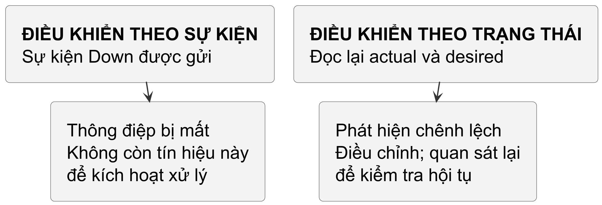

<!-- BOOK_ROLE: APPLICATION_SYSTEMS -->

# Chương 21 — Vòng lặp điều hòa và Controller Pattern

Trong Chương 20, dự án `opsprobe` đã trang bị cho ta một hệ thống thăm dò trạng thái hoàn chỉnh: kiểm tra định kỳ, phân loại kết quả rành mạch (`OutcomeSuccess`, `OutcomeFailure`, `OutcomeTimeout`), bảo toàn dữ liệu bằng giao dịch nguyên tử SQLite, và đo lường độ trễ qua Prometheus. Nhưng khi một dịch vụ phụ thuộc sập nguồn khiến dashboard chuyển màu đỏ rực, câu hỏi tiếp theo của một kỹ sư vận hành không còn là "làm sao để phát hiện?", mà là: "làm sao để hệ thống tự khôi phục trạng thái lành lặn mà không cần con người thức dậy lúc nửa đêm bấm nút restart?".

Chương này chuyển từ quan sát sang điều hòa: controller đọc trạng thái, tính sai lệch, thực hiện một thao tác rồi quan sát lại. Kubernetes dùng mẫu này cho nhiều controller; các công cụ khác có lịch chạy và mô hình quản lý state riêng, không nên gộp tất cả thành cùng một vòng lặp liên tục.

## Kích hoạt theo mức và Kích hoạt theo cạnh

Để hiểu vòng lặp điều hòa trong controller của chương này, ta phân biệt hai cách thiết kế: **Edge-Triggered (Kích hoạt theo cạnh)** và **Level-Triggered (Kích hoạt theo mức)**. Đây không phải lựa chọn bắt buộc của mọi hệ thống phân tán đáng tin cậy.

@figure Khi một thông điệp bị mất, controller dựa vào trạng thái có thể đọc lại observation và tiếp tục điều hòa. Khả năng hội tụ vẫn phụ thuộc việc quan sát và điều chỉnh thành công.

Trong mô hình edge-triggered, consumer phản ứng với chuyển trạng thái. Nếu mất event mà không có replay, resync hoặc quan sát bổ sung, consumer có thể không biết state đã đổi và giữ kết luận cũ. Đây là lý do một controller cần recovery từ observation hiện tại, không chỉ một chuỗi event được giả định không bao giờ mất.

Trong mô hình hướng trạng thái của lab, controller so observation hiện tại với desired state thay vì thực thi từng event như một command. Desired 3/current 1 dẫn tới đề xuất tạo thêm 2. Observation có thể cũ hoặc thiếu, nên chưa đủ để kết luận có thể tạo ngay: actuator vẫn cần identity, precondition và quyền phù hợp.

Ngay cả khi controller bị tắt đột ngột lúc đang khởi động bản sao thứ hai, ở lần thức dậy kế tiếp, nó lại tiếp tục so sánh và nhận ra sai lệch còn tồn tại. Nó có thể yêu cầu hành động tiếp, nhưng chỉ một quan sát mới mới xác nhận được sự hội tụ. Đặc tính hướng về trạng thái mong muốn này gọi là **sự hội tụ trạng thái (State Convergence)**.

## Bốn pha của Vòng lặp điều hòa

Ta dùng bốn pha dưới đây làm mô hình đọc control loop của chương, không phải quy trình bắt buộc cho mọi controller:

| Bước | Tên gọi | Nhiệm vụ kỹ thuật trong Go |
| :--- | :--- | :--- |
| **1** | **Observe** | Đọc trạng thái thực tế từ hệ thống hoặc store. |
| **2** | **Diff** | So sánh trạng thái thực tế với trạng thái mong muốn. |
| **3** | **Act** | Thực thi hành động khắc phục để triệt tiêu sai lệch. |
| **4** | **Schedule / Observe again** | Chờ sự kiện, resync hoặc lịch thử lại để đọc một quan sát mới; không suy diễn trạng thái từ kết quả lời gọi. |

Trong Go, ta đóng gói hành vi này thành một interface nhỏ gọn:

~~~go
type Result struct {
	Requeue      bool
	RequeueAfter time.Duration
}

type Reconciler interface {
	Reconcile(
		ctx context.Context, key string,
	) (Result, error)
}
~~~

Quy ước này thể hiện rõ ranh giới trách nhiệm: `Reconciler` chỉ tập trung vào logic điều hòa của một tài nguyên duy nhất được định danh bởi `key`. Việc quản lý hàng đợi, phân phối worker và kiểm soát tần suất thử lại do tầng `Controller` bên ngoài đảm nhiệm.

## Hàng đợi công việc có kiểm soát tốc độ

Một sai lầm thường gặp của lập trình viên Go là sử dụng ngay một unbuffered channel (`chan string`) để làm hàng đợi cho controller. Trên môi trường production, channel thô nhanh chóng bộc lộ ba lỗ hổng nghiêm trọng:

Một là, thiếu gộp key trùng: trong scenario một consumer nhận và xử lý đủ 50 item cùng key từ channel mà không gộp, nó gọi reconcile 50 lần. Đây là cách viết queue ngây thơ, không phải lời hứa về mọi lịch chạy của channel; các lượt cũng có thể đọc observation khác nhau. Queue có dirty/processing giúp gộp lịch xử lý, không gộp mọi side effect thành exactly-once.

Hai là, xử lý cùng key song song: hai worker có thể cùng đọc observation thiếu replica rồi đều yêu cầu tạo thêm. Tuần tự hóa theo key trong một process giảm cạnh tranh đó, nhưng không phối hợp các process hay ngăn observation cũ; cần ownership và precondition ở actuator. Không gọi mọi thao tác trùng là split-brain, vốn liên quan các bên cùng cho rằng mình giữ quyền điều phối.

Ba là, retry storm: nếu dependency liên tục lỗi mà key bị đưa lại ngay không có budget/backoff, worker có thể tạo một vòng retry dày, tiêu CPU và tăng tải lên dependency. Đây là busy retry, không phải spin-lock — một cơ chế chờ lock khác. Chính sách retry cần giới hạn tốc độ và hỗ trợ cancellation.

Để nhìn rõ ba bài toán đó, lab dùng một `WorkQueue` tối giản. Nó mô phỏng các ý tưởng `dirty`, `processing` và đưa lại key sau `Done`, chứ không phải bản sao chính xác của `client-go/util/workqueue`.

~~~go
type WorkQueue struct {
	mu           sync.Mutex
	cond         *sync.Cond
	queue        []string
	dirty        map[string]struct{}
	processing   map[string]struct{}
	failures     map[string]int
	shuttingDown bool
	config       RateLimiterConfig
}
~~~

Cơ chế phối hợp giữa `dirty` và `processing` tạo nên tính năng then chốt của hàng đợi:

~~~go
func (q *WorkQueue) Add(item string) {
	q.mu.Lock()
	defer q.mu.Unlock()

	if q.shuttingDown {
		return
	}
	// 1. Deduplication: Nếu item đã nằm trong dirty, bỏ qua
	if _, exists := q.dirty[item]; exists {
		return
	}
	q.dirty[item] = struct{}{}

	// 2. Nếu item đang xử lý, không đẩy vào slice
	// để tránh hai worker cùng reconcile một key
	if _, isProcessing := q.processing[item]; isProcessing {
		return
	}

	q.queue = append(q.queue, item)
	q.cond.Signal()
}
~~~

Khi một worker hoàn tất lượt xử lý và gọi `Done(item)`:

~~~go
func (q *WorkQueue) Done(item string) {
	q.mu.Lock()
	defer q.mu.Unlock()

	delete(q.processing, item)

	// Nếu trong lúc worker đang chạy, có thêm sự kiện mới
	// cho cùng key này, item lập tức được đưa lại vào queue
	if _, exists := q.dirty[item]; exists {
		q.queue = append(q.queue, item)
		q.cond.Signal()
	}
}
~~~

Trong mô hình này, một key không được hai worker xử lý đồng thời. Nếu `Add` xuất hiện khi key đang xử lý, `dirty` ghi nhận rằng cần có một lượt sau `Done`. Đây là cơ chế gộp lịch xử lý, không phải cam kết exactly-once: worker có thể lỗi, tiến trình có thể dừng, và trạng thái có thẩm quyền vẫn phải được đọc lại ở lần reconcile sau.

> **Dừng để dự đoán.** Giả sử hàng đợi đang rỗng và Worker 1 vừa lấy key `"pod-1"` ra để chạy `Reconcile`. Trong lúc hàm reconcile đang thực thi dở dang, liên tiếp có hai sự kiện `Add("pod-1")` mới xuất hiện. Hàng đợi phối hợp `dirty` và `processing` như thế nào để đảm bảo worker thứ hai không nhảy vào can thiệp, và chuyện gì xảy ra khi Worker 1 gọi `Done("pod-1")`?

#### Đáp án — chỉ đọc sau khi đã tự làm
Bảng dưới đây mô tả sự dịch chuyển trạng thái nội bộ của hàng đợi qua từng thời điểm:

| Thời điểm | Thao tác | `queue` | `dirty` | `processing` | Ý nghĩa vận hành |
| :--- | :--- | :---: | :---: | :---: | :--- |
| $T_0$ | Ban đầu | `[]` | `{}` | `{}` | Hàng đợi rỗng. |
| $T_1$ | `Add("pod-1")` | `["pod-1"]` | `{"pod-1"}` | `{}` | Đưa vào slice và đánh dấu dirty. |
| $T_1'$ | Worker 1 gọi `Get()` | `[]` | `{}` | `{"pod-1"}` | Lấy ra xử lý: xóa khỏi dirty, đưa vào processing. |
| $T_2$ | `Add("pod-1")` (lần 1) | `[]` | `{"pod-1"}` | `{"pod-1"}` | Thấy đang processing: chỉ đánh dấu dirty, không thêm vào slice. |
| $T_2'$ | `Add("pod-1")` (lần 2) | `[]` | `{"pod-1"}` | `{"pod-1"}` | Thấy đã trong dirty: gộp lại (deduplicate), bỏ qua. |
| $T_3$ | Worker 1 gọi `Done("pod-1")` | `["pod-1"]` | `{"pod-1"}` | `{}` | Xóa khỏi processing; thấy dirty còn key: đưa lại vào slice. |
| $T_4$ | Lượt `Get()` kế tiếp | `[]` | `{}` | `{"pod-1"}` | Reconcile lại để quan sát trạng thái mới nhất. |

Cơ chế này hiện thực hóa mô hình điều hòa dựa trên trạng thái (level-triggered), không phải một hệ thống hàng đợi tin nhắn đảm bảo chuyển phát từng sự kiện riêng lẻ. Việc gộp sự kiện (coalescing) bảo đảm rằng dù có bao nhiêu thay đổi dồn dập trong lúc xử lý, hàng đợi chỉ lên lịch thêm đúng một lượt reconcile kế tiếp sau khi worker hiện tại hoàn tất, đồng thời ngăn chặn việc hai worker cùng xử lý một key song song. Quan trọng hơn, hàng đợi trong bộ nhớ không đưa ra cam kết exactly-once: nếu tiến trình bị dừng đột ngột, toàn bộ dữ liệu trong slice và map sẽ biến mất và controller phụ thuộc hoàn toàn vào chu kỳ quan sát kế tiếp để tái lập bức tranh trạng thái có thẩm quyền từ nguồn chân lý.

## Kiểm soát giãn cách lũy thừa khi có sự cố

Khi `Reconcile` thất bại, thay vì đưa key trở lại hàng đợi ngay lập tức, ta áp dụng thuật toán **Exponential Backoff** thông qua phương thức `AddRateLimited`:

~~~go
func (q *WorkQueue) AddRateLimited(item string) bool {
	q.mu.Lock()
	defer q.mu.Unlock()

	if q.shuttingDown {
		return false
	}
	failures := q.failures[item] + 1
	q.failures[item] = failures

	if failures > q.config.MaxRetries {
		return false // Vượt quá số lần thử lại tối đa
	}

	// Chờ tăng gấp đôi: base * 2^(failures-1)
	multiplier := 1 << (failures - 1)
	delay := q.config.BaseDelay * time.Duration(multiplier)
	if delay > q.config.MaxDelay {
		delay = q.config.MaxDelay
	}

	time.AfterFunc(delay, func() {
		q.Add(item)
	})
	return true
}
~~~

Với `BaseDelay=50ms`, lịch thử lại của mô hình này tăng theo 50ms, 100ms, 200ms, 400ms, rồi chạm trần `MaxDelay`. Giãn cách giúp giới hạn nhịp retry khi hệ thống đích gặp lỗi; nó không loại bỏ mọi đợt retry dồn dập giữa nhiều key hay nhiều controller. Khi reconcile thành công, controller gọi `q.Forget(item)` để xóa bộ đếm thất bại.

## Tính lũy đẳng: hành động có thể thử lại, quan sát được đọc lại

Vì một tài nguyên có thể được đưa vào hàng đợi nhiều lần do sự kiện lặp, resync định kỳ hoặc retry sau lỗi, reconcile phải được thiết kế để an toàn khi gọi lại. Công thức `f(f(x)) = f(x)` chỉ là một trực giác về trạng thái thuần; nó không mô tả đầy đủ hợp đồng production, nơi lời gọi ra bên ngoài có thể thành công nhưng phản hồi bị mất, còn cache có thể cũ.

Khi quan sát mới đã khớp trạng thái mong muốn, reconcile nên là no-op. Khi cần hành động, actuator phải có precondition hoặc idempotency key phù hợp với hệ thống đích. Sau khi `Act` trả về `nil`, controller mới biết lời gọi đã kết thúc mà không báo lỗi; nó chưa biết thế giới bên ngoài đã hội tụ. Sự xác nhận chỉ đến từ lần `Observe` kế tiếp.

Hãy xem xét một Reconciler tự chữa lành cụ thể:

~~~go
func (r *SelfHealingReconciler) Reconcile(
	ctx context.Context, key string,
) (Result, error) {
	state, exists := r.getObservedState(key)
	if !exists {
		return Result{}, nil // Không tồn tại: No-op
	}

	// 1. Phân tích sai lệch giữa thực tế và mong muốn
	isDegraded := !state.Healthy ||
		state.Replicas < r.desiredReplicas

	// 2. Đã đạt trạng thái mong muốn thì không đổi thêm
	if !isDegraded {
		return Result{}, nil
	}

	// 3. Thực thi hành động tự chữa lành (Act)
	if err := r.healTarget(ctx, key); err != nil {
		return Result{}, fmt.Errorf("heal %s: %w", key, err)
	}

	// 4. Không tự sửa actual state.
	// Event hoặc resync sẽ đưa key quay lại
	// khi lớp quan sát thấy trạng thái bên ngoài đã đổi.
	return Result{}, nil
}
~~~

Nếu `payment-service` đang có 1 replica trong khi yêu cầu là 3, hàm gọi actuator với `context.Context`. Một test cố ý để actuator trả `nil` nhưng giữ quan sát cũ vẫn cho thấy target chưa khỏe; reconciler không được gán `Healthy=true` chỉ để làm bài kiểm thử xanh. Khi quan sát sau đó phản ánh 3 replica khỏe, lượt reconcile kế tiếp mới là no-op. Lab cũng chặn actuator bằng channel rồi thay quan sát trong lúc action đang chạy, để chứng minh action cũ không được ghi đè quan sát mới.

## Tắt nguồn mềm mại cho Controller

Controller quản lý nhiều worker goroutine. Khi context bị hủy, controller đóng hàng đợi để đánh thức worker rồi chờ chúng thoát. Công việc đang chạy có thể trả lỗi do cancellation, không nhất thiết hoàn tất nghiệp vụ; policy drain đến khi hoàn tất cần được thiết kế riêng:

~~~go
func (c *Controller) Run(ctx context.Context) error {
	var wg sync.WaitGroup

	// Đánh thức và đóng hàng đợi khi context bị hủy
	go func() {
		<-ctx.Done()
		c.queue.ShutDown()
	}()

	for i := 0; i < c.concurrency; i++ {
		wg.Add(1)
		go func() {
			defer wg.Done()
			for c.processNextWorkItem(ctx) {
			}
		}()
	}

	wg.Wait()
	return ctx.Err()
}
~~~

Phương thức `queue.ShutDown()` giải phóng các goroutine đang bị block ở lệnh `cond.Wait()`. Vòng lặp `for c.processNextWorkItem(ctx)` nhận được tín hiệu `shutdown == true` khi hàng đợi đã cạn, kết thúc vòng lặp và thông báo qua `wg.Done()`. Việc đóng queue chỉ giúp worker thoát; nó không tự bảo đảm ghi bên ngoài hoàn tất. Actuator phải tôn trọng `ctx`, và tác dụng phụ đã gửi sang hệ thống khác cần idempotency hoặc quan sát lại riêng.

## Thực hành Lab: Kiểm chứng Controller và WorkQueue

Toàn bộ kiến trúc trên được đóng gói tại thư mục thực hành `labs/part21-reconciliation-controller`:

~~~powershell
cd labs/part21-reconciliation-controller
go test -v ./...     # Chạy toàn bộ test suite
go test -race ./...  # Kiểm tra race condition
go vet ./...        # Phân tích tĩnh cú pháp
~~~

Bộ kiểm thử dùng channel để xác nhận actuator nhận được hủy context, một action thành công không tự bịa observation, và observation mới xuất hiện khi action đang chạy không bị ghi đè. Test backoff hiện chỉ xác nhận có nhiều lượt thử trong cửa sổ kiểm thử; nó chưa đo hoặc chứng minh chính xác các khoảng giãn cách tăng theo cấp số nhân.

## Bước phát triển tiếp theo

Chương này chỉ xây mô hình điều hòa tối giản: quan sát, so sánh, hành động, rồi quan sát lại. Kết hợp với tín hiệu từ `opsprobe` (Chương 20), nó cho ta một nơi để thấy rõ vì sao action result và observed state là hai bằng chứng khác nhau.

Đây là nền tảng trực tiếp cho Chương 22, nơi cùng các câu hỏi ấy gặp List/Watch, cache và workqueue của `client-go`; Chương 23 mới thêm API riêng, status, ownership và finalizer của một operator. Hàng đợi trong chương này là mô hình tái lập để đọc cơ chế, không phải bản thay thế cho implementation của Kubernetes.

@references
1. Kubernetes Authors. Controller pattern and declarative state management. kubernetes.io/docs/concepts/architecture/controller/
2. B. Grant. Declarative application management in Kubernetes. github.com/kubernetes/community
3. Kubernetes Authors. Package `client-go/util/workqueue` reference and design. pkg.go.dev/k8s.io/client-go/util/workqueue
4. S. Newman. Building Microservices: Designing Fine-Grained Systems and Self-Healing Architecture. O'Reilly Media.
5. Go Team. Advanced Go Concurrency Patterns: Pipelines and cancellation. go.dev/blog/pipelines
