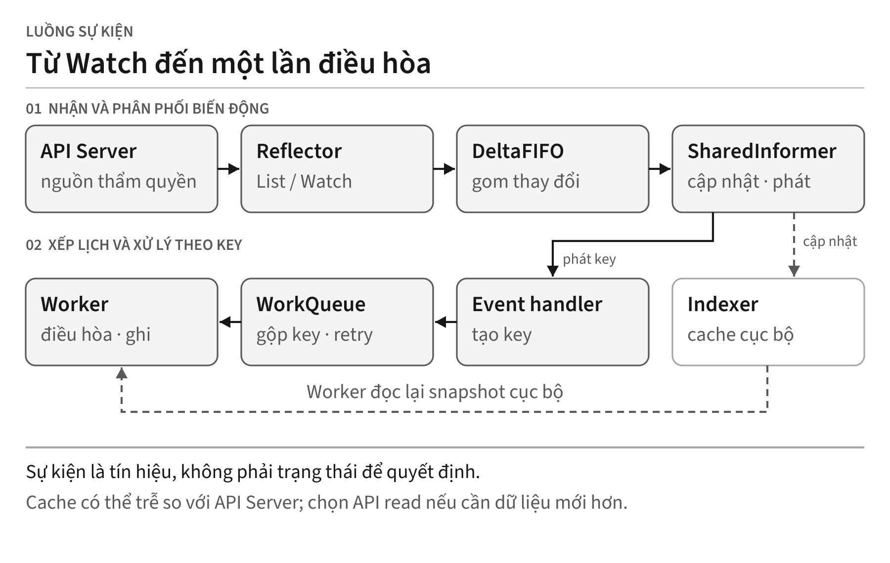
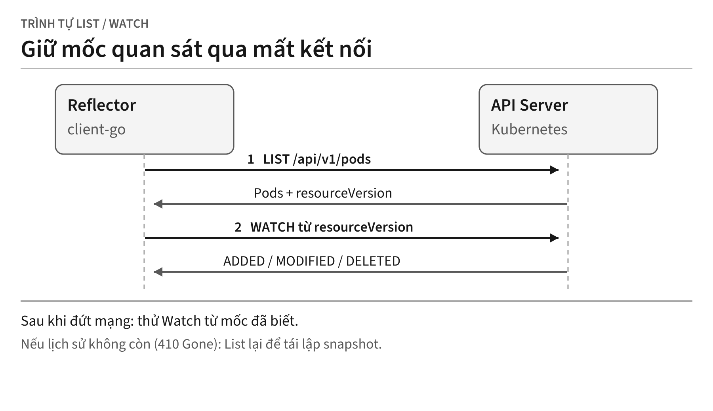

<!-- BOOK_ROLE: APPLICATION_SYSTEMS -->

# Chương 22 — Từ watch đến một controller Kubernetes thật

Chương 21 dùng một queue tối giản để thấy sự khác nhau giữa action result và observed state. Khi nối tới Kubernetes API, ta phải thêm recovery của stream, cache sync, đồng bộ theo key và xử lý conflict. Một channel có thể là thành phần của thiết kế, nhưng riêng nó không cung cấp các contract ấy.

Chẳng hạn, trong scenario 500 cập nhật đến trong một giây, giữ toàn bộ payload cũ để xử lý có thể khiến worker hành động theo observation đã lỗi thời. Tải và hậu quả phải đo trong môi trường cụ thể; con số này chỉ đặt bài toán gộp key và đọc lại trạng thái.

Chương này dùng `client-go` v0.37.0 để dựng một controller nhỏ và kiểm tra các boundary đó. Lab không thay thế thiết kế RBAC, recovery hay kiểm chứng trên cluster production.

---

## 1. Bản chất: Tín hiệu thông báo không phải là Chân lý

Câu hỏi trung tâm của chương này là:
> *Khi nhận được một sự kiện từ Kubernetes API Server, ta có nên tin vào dữ liệu đính kèm bên trong sự kiện đó để ra quyết định điều hòa hay không?*

Với policy của controller trong chương, event là tín hiệu để xếp key, không phải snapshot được giữ tới lúc quyết định. Handler vẫn có thể dùng payload cho lọc hoặc lấy metadata; worker đọc lại observation trước khi điều hòa.

Trong các hệ thống phân tán quy mô lớn, **Sự kiện thông báo (Notification Hint)** chỉ là một lời nhắc nhở: *"Tài nguyên X tại namespace Y dường như vừa có biến đổi, hãy kiểm tra lại đi!"*. Bản thân sự kiện không phải là **Trạng thái thẩm quyền (Authoritative State)**. 

API Server là boundary thẩm quyền cho Kubernetes object; informer cache là bản sao cục bộ giúp controller điều hòa hiệu quả, không phải nguồn chân lý và có thể trễ. Worker đọc cache để tránh xử lý payload event cũ, nhưng write/read-after-write hoặc quyết định cần freshness phải chọn API read hay cache bằng policy rõ ràng.

### Bẫy tư duy: Xử lý theo payload của sự kiện

Hãy tưởng tượng kịch bản sau: lúc `t₀`, Pod `web-app` có trạng thái `Pending` và API Server phát sự kiện `E₁(Pending)`. Đến lúc `t₁`, Kubelet khởi động xong container khiến Pod chuyển sang `Running`, và API Server phát sự kiện `E₂(Running)`. Do độ trễ mạng hoặc hàng đợi bận rộn, worker trong controller nhận `E₁` chậm mất 3 giây. Nếu worker dùng ngay dữ liệu bên trong `E₁`, nó sẽ tưởng Pod vẫn đang `Pending` và ra lệnh hủy Pod để tạo lại. Hành động này phá hủy trực tiếp Pod vừa khởi động lành lặn lúc `t₁`.

Policy được dùng trong lab:
> **Policy hàng đợi:** Đẩy key `namespace/name`, rồi đọc observation hiện hành trong Informer cache khi xử lý. Cache là observation local và có thể chậm hơn API server; không gọi nó là trạng thái mới nhất tuyệt đối của cluster.

---

## 2. Kiến trúc toàn cảnh của một client-go Controller

Luồng chính đi từ API Server qua `Reflector` và `DeltaFIFO` tới `SharedInformer`. Cache được cập nhật trước khi handler phát key cho hàng đợi; lúc xử lý, worker đọc lại observation cục bộ thay vì giữ payload sự kiện cũ.

@figure Luồng sự kiện của controller. Đường nét đứt biểu thị cache cục bộ: dữ liệu này có thể trễ so với API Server.

### Bốn thành phần then chốt trong chuỗi cung ứng dữ liệu

| Thành phần Informer | Vai trò kỹ thuật | Tương tác trong hệ thống |
| :--- | :--- | :--- |
| `Reflector` | Mở kết nối List/Watch tới API Server | Đẩy các biến động tài nguyên vào bộ đệm `DeltaFIFO`. |
| `Indexer (Local Store)` | Bộ nhớ đệm in-memory có đồng bộ truy cập | Phục vụ lookup local và giảm read tới API server; chi phí cần đo theo index và workload. |
| `SharedInformer` | Phân phối sự kiện từ `DeltaFIFO` | Đảm bảo local cache cập nhật trước khi event handler kích hoạt. |
| `Typed Rate-Limited WorkQueue` | Hàng đợi công việc chuyên dụng | Gộp key trùng và kiểm soát thử lại; không thay thế đồng bộ dữ liệu dùng chung. |

---

## 3. Giao thức List/Watch và vai trò của resourceVersion

List cung cấp snapshot và resourceVersion; Watch tiếp nhận các thay đổi theo mốc được API hỗ trợ. Đây là contract Kubernetes API, không phải quy tắc rằng hệ thống không được polling hay sử dụng transport khác.

@figure List tạo mốc quan sát cho Watch; khi nối lại không thể tiếp tục vì lịch sử đã hết, Reflector phải List lại.

### Cơ chế hoạt động

Thứ nhất là đường List truyền thống: Reflector lấy danh sách cùng `resourceVersion` opaque. Nó đưa snapshot vào store là `DeltaFIFO`; vòng xử lý của Informer cập nhật Indexer, không phải Reflector ghi thẳng vào Indexer. Hình đang minh họa đường này. Trong client-go đã ghim còn có watch-list khi server và cấu hình hỗ trợ; không suy ra mọi lần khởi tạo đều gọi List riêng.

Thứ hai là Watch từ mốc đã nhận, chẳng hạn `?watch=true&resourceVersion=1040`. API gửi stream thay đổi sau mốc ấy khi lịch sử còn phục vụ được. HTTP/1.1 có thể dùng chunked transfer; HTTP/2 không dùng kiểu đóng khung đó. ResourceVersion không phải offset etcd mà client được phép diễn giải.

Thứ ba là tự phục hồi sau sự cố mạng: Nếu đường truyền bị đứt ở sự kiện `1042`, Reflector thử kết nối lại từ phiên bản đã biết. Đây là cơ chế bắt kịp thay đổi khi lịch sử còn giữ được, không phải lời hứa rằng mọi lần nối lại đều không cần List.

Thứ tư là xử lý lỗi HTTP 410 Gone: Nếu kết nối bị gián đoạn quá lâu khiến etcd đã dọn dẹp các bản ghi lịch sử (compact log), API Server sẽ trả về mã lỗi `410 Gone (Too old resource version)`. Khi đó, Reflector hiểu rằng khoảng trống dữ liệu không thể bù đắp, nó sẽ tự động kích hoạt một chu kỳ `List` mới từ đầu để tái lập snapshot chuẩn.

---

## 4. Xử lý xóa và bí ẩn của Tombstone

Trong vòng đời của một tài nguyên, sự kiện xóa (`OnDelete`) ẩn chứa một cạm bẫy kỹ thuật kinh điển mà hầu hết kỹ sư mới tiếp cận `client-go` đều vấp phải: **Tombstone** (Bia mộ dữ liệu).

Khi không nhận được delete event nhưng một lần List lại cho thấy key đã mất, DeltaFIFO có thể tạo `DeletedFinalStateUnknown`. Trường Obj là observation cuối cùng còn biết, có thể cũ, không phải snapshot tại lúc xóa. Handler cần chấp nhận cả object thông thường lẫn tombstone và không suy ra identity mới từ tên cũ.

Nếu bạn ép kiểu trực tiếp:
~~~go
// CẢNH BÁO: Panic runtime nếu đối tượng rơi vào Tombstone!
pod := obj.(*corev1.Pod)
~~~
Chương trình sẽ văng lỗi `panic: interface conversion: interface {} is cache.DeletedFinalStateUnknown, not *v1.Pod`.

### Giải pháp an toàn tiêu chuẩn:

Thư viện `client-go` cung cấp hàm chuẩn hóa `cache.DeletionHandlingMetaNamespaceKeyFunc`:

~~~go
func (c *Controller) handleDelete(obj any) {
	key, err := cache.DeletionHandlingMetaNamespaceKeyFunc(obj)
	if err != nil {
		runtime.HandleError(err)
		return
	}
	c.queue.Add(key)
}
~~~

`DeletionHandlingMetaNamespaceKeyFunc` hỗ trợ object thông thường và tombstone `DeletedFinalStateUnknown` để lấy key. Caller vẫn phải xử lý error nếu object không có metadata phù hợp; helper không xác minh mọi dữ liệu nhận được là an toàn.

Key chỉ mang `namespace/name`, nên không phân biệt được một đối tượng cũ đã bị xóa với đối tượng mới cùng tên. Nếu cleanup ngoài Kubernetes cần danh tính bền vững, hãy ghi nhận `metadata.uid` lúc đối tượng còn tồn tại và ràng buộc tài nguyên ngoài với UID đó; đừng suy diễn UID từ một tombstone chỉ còn key.

---

## 5. Hàng đợi WorkQueue: Ba tập hợp và Kiểm soát tốc độ

Channel cung cấp gửi/nhận và thứ tự theo contract ngôn ngữ; nó không tự có dirty set, processing set hay policy retry. Trong implementation client-go v0.37.0, `workqueue.Typed[T]` phối hợp Queue có thể thay thế cùng hai tập key sau:

| Tập hợp | Ý nghĩa kỹ thuật | Trách nhiệm |
| :--- | :--- | :--- |
| `queue []T` | Danh sách thứ tự chờ | Xác định key nào sẽ được worker lấy ra xử lý kế tiếp. |
| `dirty set[T]` | Tập hợp các key bị bẩn | Lưu các key có sự kiện phát sinh nhưng chưa hoàn tất điều hòa. Giúp **gộp trùng lặp (deduplication)**. |
| `processing set[T]` | Tập hợp key đang xử lý | Cơ chế queue để cùng key không được phân phối song song. Đây không thay thế race detector hay synchronization cho state do Reconciler sở hữu. |

### Quy trình điều phối của WorkQueue

`Add(key)` trước hết đánh dấu key trong `dirty`; key đã bẩn thì không được xếp thêm một bản sao. Nếu key đang ở `processing`, sự kiện mới chờ lượt xử lý hiện tại kết thúc. Nếu không, key được đưa vào `queue`. `Get()` lấy key ra, xóa dấu `dirty` và đánh dấu nó đang xử lý.

Khi worker xử lý xong, nó bắt buộc phải gọi `queue.Done(key)`. Lúc này WorkQueue sẽ xóa key khỏi tập `processing`. Nếu trong quá trình worker đang chạy mà có sự kiện mới tới (key đã được đánh dấu vào `dirty`), `Done()` sẽ tự động đưa key đó trở lại `queue` để xử lý tiếp!

### Cơ chế Rate Limiting: Quên hay Phạt?

Một worker sau khi xử lý xong một lượt điều hòa (`reconcile`) sẽ đứng trước hai tình huống:

Thứ nhất, nếu thành công: Gọi `c.queue.Forget(key)` để xóa sạch lịch sử số lần thất bại, đưa bộ đếm backoff về mức 0, và gọi `c.queue.Done(key)`.

Thứ hai, nếu gặp thất bại tạm thời: Không gọi `Forget`, mà gọi `c.queue.AddRateLimited(key)`. Thời gian chờ do `RateLimiter` đã cấu hình quyết định. Lab dùng `DefaultTypedItemBasedRateLimiter` của client-go v0.37.0: lùi lũy thừa theo key, có mức trần, không tự thêm jitter hay token bucket toàn cục. Đây là cơ chế hạn chế tốc độ thử lại, không phải bảo đảm tránh mọi sự cố dây chuyền.

---

## 6. Hiện thực Controller hoàn chỉnh trong Go

Đoạn dưới trích phần lõi của `labs/part22-client-go-controller/controller.go`, dùng API generic ở client-go v0.37.0. Version được ghim để có thể đối chiếu, không phải yêu cầu luôn dùng dependency mới nhất.

~~~go
type Reconciler interface {
	Reconcile(ctx context.Context, key string) error
}

type Controller struct {
	indexer    cache.Indexer
	queue      workqueue.TypedRateLimitingInterface[string]
	informer   cache.SharedIndexInformer
	reconciler Reconciler
}
~~~

Hàm khởi chạy `Run` bảo đảm khế ước đồng bộ hóa bộ nhớ đệm trước khi phân phối công việc cho các worker:

~~~go
func (c *Controller) Run(
	ctx context.Context, workers int,
) error {
	defer runtime.HandleCrash()
	defer c.queue.ShutDown()

	// Khế ước bắt buộc: Đợi local cache đồng bộ hoàn tất
	if c.informer != nil {
		synced := cache.WaitForNamedCacheSyncWithContext(
			ctx, c.informer.HasSynced,
		)
		if !synced {
			return fmt.Errorf("hết hạn chờ sync cache")
		}
	}

	var wg sync.WaitGroup
	for i := 0; i < workers; i++ {
		wg.Add(1)
		go func() {
			defer wg.Done()
			for c.processNextItem(ctx) {
			}
		}()
	}

	<-ctx.Done()
	c.queue.ShutDown()
	wg.Wait()
	return nil
}
~~~

### Vòng lặp điều phối của từng Worker

Mỗi worker lấy một key ra khỏi hàng đợi và bọc trong khối bảo vệ:

~~~go
func (c *Controller) processNextItem(ctx context.Context) bool {
	key, shutdown := c.queue.Get()
	if shutdown {
		return false
	}
	defer c.queue.Done(key)

	err := c.reconcileHandler(ctx, key)
	if err == nil {
		// Thành công: Xóa lịch sử retry để giải phóng bộ nhớ
		c.queue.Forget(key)
		return true
	}

	// Thất bại: Thử lại có kiểm soát tốc độ (tối đa 5 lần)
	if c.queue.NumRequeues(key) < 5 {
		c.queue.AddRateLimited(key)
		return true
	}

	// Đã vượt quá ngưỡng thử lại: Hủy bỏ và ghi log lỗi
	c.queue.Forget(key)
	runtime.HandleError(
		fmt.Errorf(
			"bỏ cuộc sau 5 lần thử key %q: %w", key, err,
		),
	)
	return true
}
~~~

### Logic hòa giải: Đọc từ Cache thay vì Payload sự kiện

~~~go
func (c *Controller) reconcileHandler(
	ctx context.Context, key string,
) error {
	// 1. Luôn truy vấn snapshot mới nhất từ local indexer
	obj, exists, err := c.indexer.GetByKey(key)
	if err != nil {
		return fmt.Errorf("lỗi đọc cache key %s: %w", key, err)
	}

	if !exists {
		// Không thấy tài nguyên trong cache cục bộ.
		return c.reconciler.Reconcile(ctx, key)
	}

	pod, ok := obj.(*corev1.Pod)
	if !ok {
		return fmt.Errorf("sai kiểu *corev1.Pod: %T", obj)
	}

	// Không xử lý pod đang trong tiến trình bị xóa dở
	if pod.DeletionTimestamp != nil {
		return nil
	}

	return c.reconciler.Reconcile(ctx, key)
}
~~~

---

## 7. Bằng chứng kiểm thử: Kiểm chứng 6 hành vi then chốt

Bộ kiểm thử tại `labs/part22-client-go-controller/controller_test.go` kiểm tra sáu contract của lab dưới đây. Chúng không mô phỏng mọi điều kiện biên của cluster production:

~~~
=== RUN   TestEventDeduplication
--- PASS: TestEventDeduplication (0.00s)
=== RUN   TestCacheNewerThanEvent
--- PASS: TestCacheNewerThanEvent (0.00s)
=== RUN   TestRateLimitedRetryDecoupledFromDomain
--- PASS: TestRateLimitedRetryDecoupledFromDomain (0.00s)
=== RUN   TestSafeDeletionAndTombstone
--- PASS: TestSafeDeletionAndTombstone (0.00s)
=== RUN   TestCleanCancellationShutdown
--- PASS: TestCleanCancellationShutdown (0.05s)
=== RUN   TestCacheNotSyncedGuard
--- PASS: TestCacheNotSyncedGuard (0.02s)
PASS
ok      part22-client-go-controller   3.829s
~~~

### 1. Bằng chứng gộp trùng sự kiện (TestEventDeduplication)
Test thêm mười lần cùng key của Pod `production/web-proxy` vào queue trước khi worker chạy. Queue có một item và sau một lần xử lý, bộ đếm reconcile bằng một. Kết quả chứng minh gộp key đang chờ trong lịch chạy này, không phải giảm 90% tải hay bảo đảm exactly-once khi sự kiện đến trong lúc xử lý.

### 2. Đọc trạng thái mới từ Cache thay vì Payload cũ (TestCacheNewerThanEvent)
Test enqueue Pod có `ResourceVersion: "1"`, rồi cập nhật Indexer thành `"3"` trước khi worker xử lý. Kết quả quan sát là `"3"`, xác nhận đường xử lý đọc lại cache thay vì giữ payload cũ. Test không chứng minh cache luôn mới so với API Server.

### 3. Tách biệt lỗi tạm thời và Lũy thừa thử lại (TestRateLimitedRetry)
`TestRateLimitedRetryDecoupledFromDomain` giả lập hai lần reconcile thất bại rồi lần thứ ba thành công. Các assertion kiểm tra hai lần retry, ba lần gọi và không drop; nhánh thành công trong source gọi `Forget(key)` để xóa lịch sử retry của key.

### 4. An toàn trước Tombstone (TestSafeDeletionAndTombstone)
Test truyền `cache.DeletedFinalStateUnknown` qua `enqueue`, kiểm tra key `production/tombstone-pod` được đưa vào queue rồi ghi nhận action xóa trong kết quả. Lab không thực hiện hay chứng minh dọn dẹp tài nguyên ngoại vi.

### 5. Dừng sạch tài nguyên (TestCleanCancellationShutdown)
Test chạy ba worker, thêm năm key rồi gọi `cancel()`. Assertion yêu cầu `ctrl.Run` trả về trong hai giây; 50 ms là khoảng sleep trước cancellation, không phải số đo shutdown. Source đóng queue và chờ worker, nhưng test này không kiểm kê mọi goroutine hay bảo đảm độ trễ shutdown ở production.

### 6. Khế ước bảo vệ Cache Chưa Đồng Bộ (TestCacheNotSyncedGuard)
Trong lab, `WaitForNamedCacheSyncWithContext` trả false thì controller từ chối khởi động worker và trả lỗi cache sync. Gate ấy ngăn đường xử lý trước sync trong lifecycle này; sync không bảo đảm cache mãi không stale hay RBAC sẽ không thay đổi về sau.

---

## 8. Kiểm soát đồng thời lạc quan (OCC) và Lỗi 409 Conflict

Khi controller quyết định cập nhật trạng thái Pod lên API Server, nó gửi một lệnh HTTP `PUT` hoặc `PATCH`. Trong môi trường phân tán, một controller khác hoặc người dùng thông qua `kubectl` có thể đã sửa đổi Pod đó trước bạn một phần nghìn giây.

Với `Update` dưới đây, resourceVersion là precondition: version cũ khiến API server trả `409 Conflict`. Không phải mọi PATCH đều có cùng điều kiện; patch có thể bỏ resourceVersion hoặc dùng cơ chế conflict/field ownership khác. Hãy đọc contract của loại write đang dùng, không suy ra OCC chỉ từ phương thức HTTP.

~~~
Operation cannot be fulfilled on pods "payment-api":
the object has been modified; please apply your changes
to the latest version and try again
~~~

### Mẫu hình chuẩn: retry.RetryOnConflict

Tuyệt đối không coi 409 là một lỗi hệ thống nghiêm trọng khiến controller sập nguồn. Đây là một hiện tượng bình thường trong hệ phân tán. Cách xử lý chuẩn xác bằng `k8s.io/client-go/util/retry`:

~~~go
func updatePodAnnotation(
	ctx context.Context,
	client kubernetes.Interface,
	namespace, name string,
) error {
	return retry.RetryOnConflict(
		retry.DefaultRetry,
		func() error {
			// 1. Phải Get lại bản ghi mới nhất
			latest, err := client.CoreV1().Pods(namespace).Get(
				ctx, name, metav1.GetOptions{},
			)
			if err != nil {
				return err
			}

			// 2. Thực hiện sửa đổi trên bản sao mới
			if latest.Annotations == nil {
				latest.Annotations = make(map[string]string)
			}
			now := time.Now().UTC().Format(time.RFC3339)
			latest.Annotations["reconciled-at"] = now

			// 3. Ghi đè lại API Server
			_, err = client.CoreV1().Pods(namespace).Update(
				ctx, latest, metav1.UpdateOptions{},
			)
			return err
		},
	)
}
~~~

Mẫu hình này tự động thử lại với backoff ngắn, đọc lại snapshot mới nhất của đối tượng, áp dụng thay đổi và lưu lại.

---

## 9. Các cạm bẫy người học thường gặp (Learner Pitfalls)

| Cạm bẫy thực tế | Hậu quả trên Production | Giải pháp phòng ngừa |
| :--- | :--- | :--- |
| **Đọc API trực tiếp ở mọi lượt mà không có budget.** | Tăng tải và độ trễ tùy workload. | Dùng cache khi freshness cho phép; dùng API reader có chủ đích cho precondition hay read-after-write. |
| **Quên Done(key).** | Key còn trong processing; Add mới có thể đánh dirty nhưng không được xếp lại cho tới Done. | Đặt defer Done sau Get thành công. |
| **Gọi Forget(key)** khi Reconcile gặp lỗi. | Làm mất lịch sử thử lại của key. Backoff bị xóa bỏ, dẫn đến bão thử lại liên tục. | Chỉ gọi `Forget(key)` khi điều hòa thành công hoặc khi quyết định từ bỏ sau nhiều lần thử. |
| **Chạy worker pool** trước khi đồng bộ xong cache. | Nếu diễn giải object chưa có trong cache thành đã bị xóa, worker có thể cleanup nhầm. | Gate worker bằng cache sync; ngay cả sau sync, cleanup vẫn cần bằng chứng identity/ownership riêng. |

---

## 10. Bài tập thực hành thiết kế Controller

### Thử thách 1: Tích hợp Metric đo đạc độ trễ và chiều sâu hàng đợi
**Yêu cầu:** Hãy thiết kế hai metric Prometheus để giám sát sức khỏe của controller: metric Gauge `controller_workqueue_depth` đo số lượng key đang chờ xử lý trong `queue`, và metric Histogram `controller_reconcile_duration_seconds` đo thời gian thực thi của một chu kỳ `Reconcile`.

*Gợi ý:* Đặt điểm đo `time.Now()` trước khi gọi `c.reconciler.Reconcile` và cập nhật metric trong lệnh `defer`.

### Thử thách 2: Xử lý Pod bị cô lập (Orphaned Pod Cleanup)
**Yêu cầu:** Khi cache không còn object, key chỉ chứa namespace/name. Viết nhánh từ chối xóa file ngoài cụm nếu không có record durable ràng buộc UID và file. Chứng minh trường hợp object mới cùng tên không bị cleanup nhầm. Đây là bài tập nhận diện thiếu bằng chứng, không phải yêu cầu xóa cho bằng được.

---

## 11. Hướng dẫn giải và Phân tích kiến trúc bài tập

### Lời giải Thử thách 1: Đo lường quan sát controller

Khai báo các bộ đo Prometheus:

~~~go
var (
	queueDepth = prometheus.NewGaugeVec(
		prometheus.GaugeOpts{
			Name: "controller_workqueue_depth",
			Help: "Số lượng phần tử đang chờ trong workqueue",
		},
		[]string{"controller"},
	)
	reconcileDuration = prometheus.NewHistogramVec(
		prometheus.HistogramOpts{
			Name:    "controller_reconcile_duration_seconds",
			Help:    "Thời gian thực thi hàm Reconcile",
			Buckets: prometheus.DefBuckets,
		},
		[]string{"controller", "status"},
	)
)
~~~

Thu thập số liệu đo lường trong vòng lặp xử lý:

~~~go
func (c *Controller) processNextItemWithMetrics(
	ctx context.Context,
) bool {
	key, shutdown := c.queue.Get()
	if shutdown {
		return false
	}
	defer c.queue.Done(key)

	start := time.Now()
	err := c.reconcileHandler(ctx, key)
	duration := time.Since(start).Seconds()

	status := "success"
	if err != nil {
		status = "error"
	}
	reconcileDuration.WithLabelValues(
		"pod_controller", status,
	).Observe(duration)
	// ... xử lý retry tiếp theo
	return true
}
~~~

### Lời giải Thử thách 2: Xử lý dọn dẹp tài nguyên cô lập
~~~go
func (r *CleanUpReconciler) Reconcile(
	ctx context.Context, key string,
) error {
	namespace, name, err := cache.SplitMetaNamespaceKey(key)
	if err != nil {
		return fmt.Errorf("key sai %q: %w", key, err)
	}

	obj, exists, err := r.indexer.GetByKey(key)
	if err != nil {
		return err
	}

	if !exists {
		// Key chỉ có namespace/name, không có UID.
		// Không xóa ngoại vi theo tên.
		// Một Pod cùng tên có thể đã được tạo lại.
		return fmt.Errorf(
			"pod %s/%s absent: cleanup needs recorded UID",
			namespace, name,
		)
	}

	// Pod vẫn tồn tại -> Điều hòa trạng thái bình thường
	_ = obj.(*corev1.Pod)
	return nil
}
~~~

Vì thế, đừng đặt external cleanup nguy hiểm sau nhánh `!exists` chỉ dựa vào key. Thiết kế production nên dùng finalizer khi object còn mang `metadata.uid`, hoặc một record durable đã liên kết UID với tài nguyên ngoài. Khi chỉ còn `namespace/name`, lựa chọn an toàn là không xóa và đưa tình huống vào luồng đối soát.

---

List/Watch, cache và workqueue cung cấp các contract khác nhau cho controller. Chương 23 thêm API riêng, ownership và finalizer để quyết định khi nào tài nguyên ngoài cụm được phép dọn dẹp.
