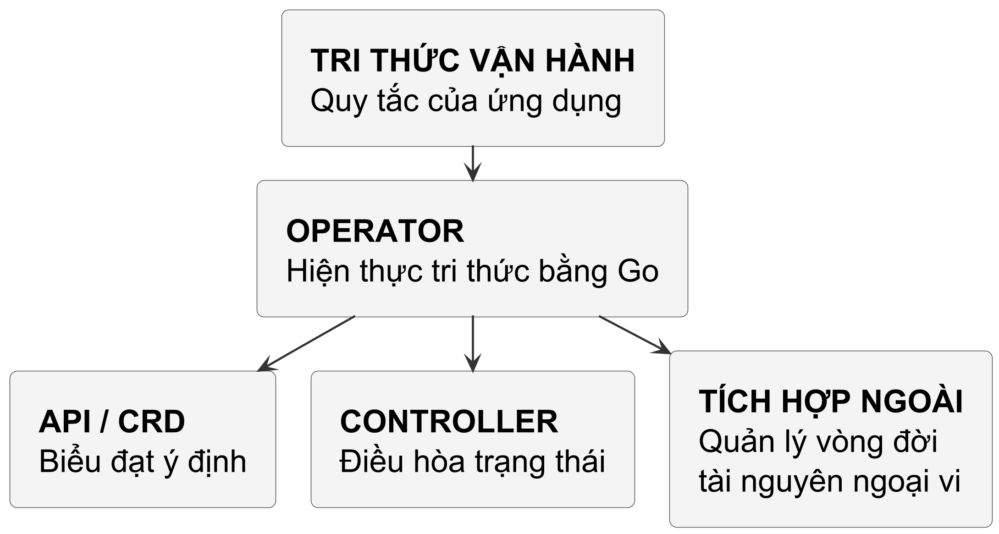
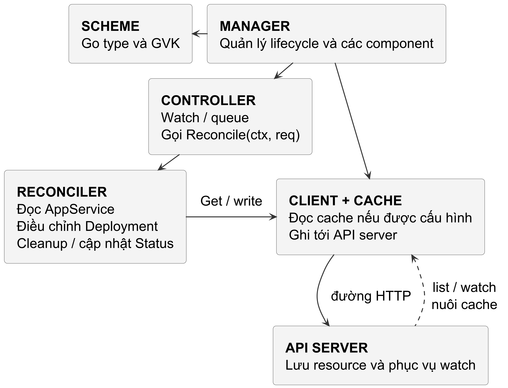
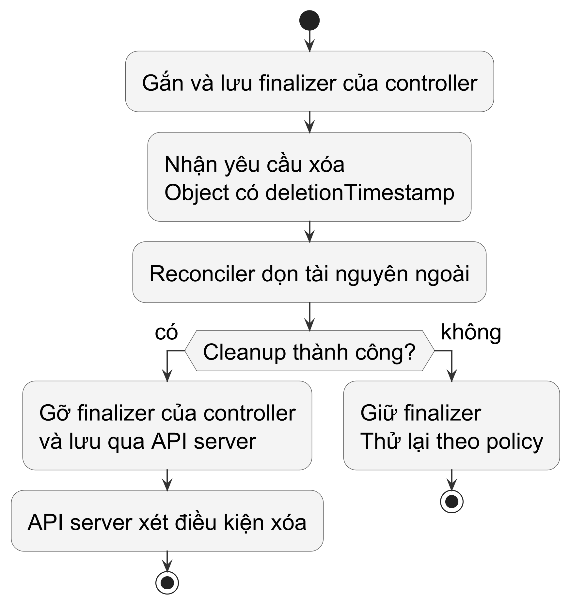

<!-- BOOK_ROLE: APPLICATION_SYSTEMS -->

# Chương 23 — Từ controller đến operator: API riêng và vòng đời tài nguyên

Trong Chương 22, chúng ta đã nắm vững nền móng của một controller cấp thấp: dùng `client-go`, `SharedInformer` và `TypedRateLimitingInterface` để điều hòa các tài nguyên lõi như Pod. Nhưng khi hệ thống phát triển, nhu cầu quản trị hạ tầng vượt xa các khối cơ bản của Kubernetes.

Bạn không chỉ muốn quản lý Pod đơn lẻ; bạn muốn định nghĩa cả một hệ sinh thái: một cụm cơ sở dữ liệu phân tán tự động sao lưu định kỳ, một dịch vụ thanh toán tự động cấp phát tài nguyên trên đám mây, hoặc một ứng dụng nội bộ tự động cấu hình ingress, chứng chỉ SSL và tài khoản IAM.

Nếu làm theo cách thủ công, bạn phải bảo trì hàng trăm file YAML dài vô tận và phụ thuộc vào con người chạy lệnh `kubectl apply`. Đây chính là lúc khái niệm **Operator** ra đời: *đóng gói tri thức của một kỹ sư vận hành giàu kinh nghiệm (Domain Operational Knowledge) vào trong mã nguồn Go tự động*.

---

## 1. Operator là gì và Khi nào cần Operator?

Câu hỏi trung tâm của chương này là:
> *Sự khác biệt cốt lõi giữa một Kubernetes Controller thông thường và một Kubernetes Operator là gì?*

Operator dùng controller để tự động hóa vòng đời một ứng dụng hay domain cụ thể, thường cùng một CRD. Controller nói chung cũng có thể làm việc với custom resource; không có quy tắc rằng nó chỉ hiểu tài nguyên dựng sẵn. Điểm khác biệt hữu ích là tri thức vận hành mà reconciliation thể hiện, không một loại controller đặc biệt do Go hay Kubernetes compiler nhận diện.

@figure Operator biểu đạt tri thức vận hành qua API, vòng lặp điều hòa và các tích hợp quản lý tài nguyên. Các thành phần này là vai trò thiết kế, không phải ba bước chạy tuần tự.

Thay vì bắt người dùng phải tự tạo `Deployment`, gắn `ConfigMap`, tạo `Secret` và mở `Service`, Operator cung cấp một tài nguyên duy nhất gọn gàng:

~~~yaml
apiVersion: apps.example.com/v1alpha1
kind: AppService
metadata:
  name: payment-api
spec:
  image: "payment:v2.4.0"
  replicas: 3
  port: 8080
~~~

Khi bạn nộp khai báo trên, Operator sẽ tự động sinh ra Deployment tương ứng, gắn nhãn, cấu hình health check, theo dõi sức khỏe và cập nhật trạng thái thực tế về cho bạn.

---

## 2. Kiến trúc của controller-runtime

Viết Operator bằng `client-go` thuần túy đòi hỏi tự nối các phần quản lý cache, queue và lifecycle. Thư viện `sigs.k8s.io/controller-runtime` cung cấp lớp tổ chức chung cho các phần này; lượng code tiết kiệm phụ thuộc yêu cầu của operator, không có con số chung.

Sơ đồ dưới đây tách trách nhiệm quản lý tiến trình, xử lý khóa và truy cập tài nguyên:

@figure Manager tổ chức các component; controller gọi Reconciler cho một khóa. Client dùng cache cho đường đọc được cấu hình và HTTP cho đường ghi; sơ đồ lược bỏ các đường đọc không qua cache.

### Bốn trụ cột của controller-runtime

| Trụ cột `controller-runtime` | Vai trò kiến trúc | Tương tác trong hệ thống |
| :--- | :--- | :--- |
| `Manager` | Quản lý vòng đời tiến trình Operator | Quản lý bộ đệm chung, leader election, server metrics và probe. |
| `Scheme` | Đăng ký ánh xạ kiểu dữ liệu | Ánh xạ giữa Go struct (`v1alpha1.AppService`) và `GroupVersionKind`. |
| `Client` với cache | Phân tách đường đọc và ghi theo cấu hình | Get/List có thể đọc cache; kiểu bị DisableFor, metadata discovery hay cache chưa khởi tạo vẫn có đường HTTP. Writes đi tới API. |
| `Reconciler` | Hiện thực logic điều hòa cốt lõi | Nhận `ctrl.Request` chứa `NamespacedName`, hội tụ trạng thái. |

---

## 3. Bản thiết kế CRD: Ranh giới rạch ròi giữa Spec và Status

Với API của lab, ta tách **Spec** — ý định người dùng — khỏi **Status** — điều controller quan sát. Đây là contract của API; quyền ghi thực tế còn phụ thuộc RBAC và subresource:

| Khối dữ liệu | Ý nghĩa | Ai có quyền ghi? | Trách nhiệm |
| :--- | :--- | :--- | :--- |
| **Spec** | Trạng thái mong muốn (Desired State). | Người dùng, Helm, CI/CD pipeline, GitOps (ArgoCD). | Khai báo hệ thống cần đạt được điều gì. |
| **Status** | Trạng thái quan sát được. | Controller được policy giao trách nhiệm; RBAC quyết định quyền ghi thực tế. | Báo observation và generation đã quan sát. |

### Quy tắc chống trượt (Anti-Drift Rule)

> **Policy của lab:** Reconciler không sửa `Spec` để ghi observation hoặc tự ghi đè ý định người dùng. Observation đi vào `Status`; một controller có chức năng thay spec cần ownership và policy riêng.

Nếu người dùng cấu hình `replicas: 3`, mà Reconciler thấy tải cao rồi tự ý sửa `spec.replicas = 5`, hệ thống sẽ rơi vào cuộc chiến bất tận giữa Operator và công cụ GitOps (ArgoCD liên tục kéo về 3, Operator liên tục đẩy lên 5).

Mọi kết quả quan sát (số replica đang sẵn sàng, phiên bản thực tế đang chạy, điều kiện lỗi) bắt buộc phải ghi vào trường `Status`.

### Phân lập Status Subresource

Để bảo vệ ranh giới này, Kubernetes cung cấp cơ chế **Status Subresource** (`/status` endpoint). Khi cập nhật trạng thái, bạn phải gọi:

~~~go
// ĐÚNG: Chỉ sửa Status, không đổi metadata.generation
if err := r.Status().Update(ctx, appService); err != nil {
	return ctrl.Result{}, err
}
~~~

Với CRD bật status subresource, write vào resource chính bỏ qua thay đổi Status. Generation tăng khi phần dữ liệu thuộc quy tắc generation của CRD thay đổi, không phải cứ gọi Update là tăng. Một write tạo event cũng chưa chứng minh loop vô tận: predicate, nội dung thay đổi và logic reconcile đều ảnh hưởng. Đọc status qua đường đúng và xử lý conflict của write đó.

---

## 4. Quản lý tài nguyên con: OwnerReferences và Garbage Collection

Khi `AppService` sinh ra một `Deployment`, làm sao để Kubernetes biết hai đối tượng này có quan hệ cha - con?

Câu trả lời là **OwnerReference** (Tham chiếu chủ sở hữu). Thư viện `controller-runtime` cung cấp hàm chuẩn hóa:

~~~go
if err := controllerutil.SetControllerReference(
	appService, newDeployment, r.Scheme,
); err != nil {
	return fmt.Errorf("không thể gán owner reference: %w", err)
}
~~~

### OwnerReference giúp quản lý vòng đời thế nào

Thứ nhất là cascading deletion theo policy: garbage collector dùng ownerReferences hợp lệ để xét dependent, nhưng propagation policy, owner khác còn tồn tại và finalizer có thể giữ object. Lab gắn owner cho Deployment; không suy ra mọi tài nguyên con bị xóa ngay hay tài nguyên ngoài cluster được thu hồi. Về ranh giới namespace, OwnerReference là ownership metadata có quy tắc scope chặt chẽ chứ không phải liên kết cha con tùy ý. Đối với namespaced dependent, tài nguyên có thể tham chiếu owner namespaced trong cùng namespace hoặc owner cluster-scoped; nếu trỏ tới owner namespaced ở namespace khác, tham chiếu không hợp lệ và bị coi như owner không tồn tại, khiến dependent có thể bị thu hồi khi mọi owner hợp lệ khác không còn. Ngược lại, cluster-scoped dependent chỉ được phép tham chiếu owner cluster-scoped; nếu trỏ tới namespaced owner, tham chiếu trở nên không thể phân giải (unresolvable), từ Kubernetes v1.20+ garbage collector sẽ ghi nhận warning event OwnerRefInvalidNamespace và dependent không thể được thu hồi dựa trên tham chiếu đó.

Thứ hai là khả năng theo dõi sự kiện ngược dòng (Watch Events): Controller có thể cấu hình `Watches(&appsv1.Deployment{}, handler.EnqueueRequestForOwner(...))`. Bất cứ khi nào ai đó sửa đổi hoặc xóa Deployment con, sự kiện sẽ tự động ánh xạ ngược về `AppService` cha để Reconciler thức dậy sửa chữa.

---

## 5. Finalizer: Cổng gác vòng đời và Dọn dẹp tài nguyên ngoại vi

Nếu `OwnerReference` giải quyết xuất sắc việc dọn dẹp các tài nguyên nội bộ trong Kubernetes, thì điều gì sẽ xảy ra nếu ứng dụng của bạn tạo ra các tài nguyên bên ngoài cụm như một cơ sở dữ liệu Amazon RDS, một bản ghi DNS trên Cloudflare, hay một hàng đợi tin nhắn AWS SQS?

Nếu đối tượng `AppService` bị xóa trước khi cleanup hoàn tất, controller có thể mất dữ liệu để xác định tài nguyên ngoài cụm. Trong scenario này, finalizer giữ object đủ lâu cho việc thu hồi; vẫn cần cơ chế điều tra hoặc đối soát để xử lý sự cố ngoài đường chạy bình thường. Không có số chi phí chung suy ra từ một object bị xóa.

Đây chính là sứ mệnh của **Finalizer** (Bộ chốt vòng đời).

@figure Cleanup thất bại giữ finalizer để có thể thử lại. Cleanup thành công chỉ cho phép gỡ finalizer của controller này; API server còn phải xét các điều kiện xóa khác.

API server chỉ có thể hoàn tất xóa khi các điều kiện lifecycle, gồm toàn bộ finalizer còn lại, cho phép. Gỡ finalizer của controller này không hứa object biến mất ngay; controller không trực tiếp gọi etcd để xóa.

### Cạm bẫy Finalizer Deadlock

Cleanup cần an toàn khi gọi lại. Một response not-found có thể được coi là đã hoàn tất nếu API và identity chứng minh đúng tài nguyên đích đã mất; không bỏ qua mọi 404, vì nó cũng có thể liên quan endpoint, quyền hoặc identity sai.

Nếu coi mọi 404 khi cleanup là lỗi phải retry, controller có thể giữ finalizer dù resource ngoài đã mất. Object có thể kẹt `Terminating` cho tới khi logic được sửa hoặc có can thiệp. Chỉ coi not-found là cleanup thành công khi đã xác nhận đúng identity và contract API, không bỏ qua mọi lỗi ngoài bằng cùng một nhánh.

---

## 6. Hiện thực Operator hoàn chỉnh trong Go

Dưới đây là phần lõi Reconciler của `labs/part23-controller-runtime-operator/`:

Định nghĩa cấu trúc điều hòa với khả năng tiêm phụ thuộc (Dependency Injection) cho bộ dọn dẹp ngoại vi:

~~~go
const AppServiceFinalizer = "apps.example.com/finalizer"

type ExternalCleaner interface {
	Cleanup(
		ctx context.Context, app *appsv1alpha1.AppService,
	) error
}

type AppServiceReconciler struct {
	client.Client
	Scheme          *runtime.Scheme
	ExternalCleaner ExternalCleaner
}
~~~

### Vòng lặp điều hòa trung tâm

Hàm `Reconcile` điều phối toàn bộ vòng đời: từ kiểm tra xóa, tạo tài nguyên con, đến sửa chữa sai lệch cấu hình:

~~~go
func (r *AppServiceReconciler) Reconcile(
	ctx context.Context, req ctrl.Request,
) (ctrl.Result, error) {
	appService := &appsv1alpha1.AppService{}
	err := r.Get(ctx, req.NamespacedName, appService)
	if err != nil {
		if errors.IsNotFound(err) {
			return ctrl.Result{}, nil
		}
		return ctrl.Result{}, err
	}

	// 1. Xử lý Finalizer: Kiểm soát vòng đời xóa
	if !appService.DeletionTimestamp.IsZero() {
		return r.handleDeletion(ctx, appService)
	}

	// Đảm bảo đối tượng luôn có Finalizer bảo vệ
	if !controllerutil.ContainsFinalizer(
		appService, AppServiceFinalizer,
	) {
		controllerutil.AddFinalizer(
			appService, AppServiceFinalizer,
		)
		return ctrl.Result{}, r.Update(ctx, appService)
	}

	// 2. Điều hòa Deployment con và sửa sai lệch (Drift)
	if err := r.reconcileDeployment(
		ctx, appService,
	); err != nil {
		return ctrl.Result{}, err
	}

	// 3. Cập nhật Status Subresource
	return ctrl.Result{}, r.updateStatus(ctx, appService)
}
~~~

### Ngữ nghĩa trả về của Result và Error trong controller-runtime

Trong `controller-runtime` v0.25.1, giá trị trả về của `Reconcile(ctx, req)` quyết định hành vi tiếp theo của hàng đợi theo bốn nhánh rành mạch:

Nhánh thứ nhất, trả về `(ctrl.Result{}, err)` với `err != nil`: Nếu lỗi không phải `reconcile.TerminalError`, controller ghi log lỗi và đưa lại request vào hàng đợi với thuật toán Rate Limiting (`AddRateLimited`). Nếu vô tình trả về đồng thời `err != nil` và cờ `Requeue` hoặc `RequeueAfter`, controller sẽ ghi warning log và bỏ qua hai cờ requeue để ưu tiên xử lý lỗi.

Nhánh thứ hai, trả về `(ctrl.Result{RequeueAfter: d}, nil)` với `d > 0`: Controller xóa lịch sử lỗi của request (`Forget`) và lên lịch đưa request trở lại hàng đợi sau khoảng thời gian `d` (`AddAfter`).

Nhánh thứ ba, trả về `(ctrl.Result{Requeue: true}, nil)`: Controller đưa request trở lại hàng đợi có kiểm soát tốc độ qua rate limiter. Trong các phiên bản controller-runtime mới, cách trả về này dần được thay thế bằng lỗi hoặc `RequeueAfter` tường minh.

Nhánh thứ tư, trả về `(ctrl.Result{}, nil)`: Điều hòa thành công. Controller xóa lịch sử lỗi (`Forget`), không xếp lại request, và worker chỉ thức dậy khi có sự kiện watch mới tác động lên tài nguyên.

### Xử lý Xóa an toàn và Dọn dẹp ngoại vi

~~~go
func (r *AppServiceReconciler) handleDeletion(
	ctx context.Context, app *appsv1alpha1.AppService,
) (ctrl.Result, error) {
	hasFin := controllerutil.ContainsFinalizer(
		app, AppServiceFinalizer,
	)
	if hasFin {
		if r.ExternalCleaner == nil {
			return ctrl.Result{}, fmt.Errorf(
				"external cleaner is required",
			)
		}
		err := r.ExternalCleaner.Cleanup(ctx, app)
		if err != nil {
			return ctrl.Result{}, fmt.Errorf(
				"cleanup lỗi: %w", err,
			)
		}
		// Dọn dẹp xong: gỡ finalizer của controller này
		controllerutil.RemoveFinalizer(
			app, AppServiceFinalizer,
		)
		if err := r.Update(ctx, app); err != nil {
			return ctrl.Result{}, err
		}
	}
	return ctrl.Result{}, nil
}
~~~

### Tự động nhận diện và sửa chữa sai lệch (Drift Correction)

Nếu ai đó dùng `kubectl scale` để sửa số replica của Deployment con từ 3 xuống 1, Reconciler phát hiện sự không đồng nhất giữa `appService.Spec.Replicas` và `deployment.Spec.Replicas`, từ đó tự động ép trạng thái về đúng bản thiết kế ban đầu:

~~~go
func (r *AppServiceReconciler) syncDeploymentDrift(
	app *appsv1alpha1.AppService, dep *appsv1.Deployment,
) bool {
	drifted := false
	if dep.Spec.Replicas == nil ||
		*dep.Spec.Replicas != app.Spec.Replicas {
		dep.Spec.Replicas = &app.Spec.Replicas
		drifted = true
	}
	if len(dep.Spec.Template.Spec.Containers) > 0 {
		c := &dep.Spec.Template.Spec.Containers[0]
		if c.Image != app.Spec.Image {
			c.Image = app.Spec.Image
			drifted = true
		}
	}
	return drifted
}
~~~

---

## 7. Bằng chứng kiểm thử: Chứng minh 5 quy luật Operator

Bộ kiểm thử tại `labs/part23-controller-runtime-operator/controllers/appservice_controller_test.go` dùng `fake.NewClientBuilder()` cho contract logic của reconciler. Đây không mô phỏng toàn diện API server: validation, generation/resourceVersion và nhiều semantics của subresource không giống cluster thật. Khi cần xác minh interaction với API server, dùng `envtest` hoặc cluster integration test riêng. Vì vậy lab vẫn ghi `ObservedGeneration` vào status để consumer biết status đã phản ánh spec nào, nhưng không dùng fake client để tuyên bố đã kiểm chứng đầy đủ lifecycle của generation.

~~~
=== RUN   TestReconcileCreateOwnedDeployment
--- PASS: TestReconcileCreateOwnedDeployment (0.51s)
=== RUN   TestReconcileDriftCorrection
--- PASS: TestReconcileDriftCorrection (0.01s)
=== RUN   TestReconcileFinalizerExecution
--- PASS: TestReconcileFinalizerExecution (0.01s)
=== RUN   TestReconcileStatusSubresource
--- PASS: TestReconcileStatusSubresource (0.01s)
=== RUN   TestNotFoundResourceNoOp
--- PASS: TestNotFoundResourceNoOp (0.01s)
PASS
ok      part23-controller-runtime-operator/controllers   1.875s
~~~

### 1. Khởi tạo tài nguyên con kèm OwnerReference (TestReconcileCreateOwnedDeployment)
Khi tạo mới một `AppService`, Reconciler tự động sinh một `Deployment` mang tên tương ứng. Bằng chứng kiểm thử xác nhận `dep.OwnerReferences[0].Name == "cache-service"`, và `app.Finalizers` lập tức được bổ sung khóa `apps.example.com/finalizer`.

### 2. Tự phục hồi sai lệch cấu hình (TestReconcileDriftCorrection)
Lab sửa desired deployment rồi gọi Reconcile để kiểm tra logic khôi phục những field controller sở hữu. Test không đo tốc độ hội tụ của cluster thật; cache, event delivery, retry và API error vẫn ảnh hưởng thời gian sửa drift.

### 3. Vòng đời Finalizer (TestReconcileFinalizerExecution)
Gán `DeletionTimestamp` vào đối tượng. Reconciler gọi `ExternalCleaner.Cleanup()` rồi mới gỡ Finalizer; thiếu cleaner là lỗi và finalizer phải giữ lại. Test chỉ chứng minh contract của lab; việc object thực sự biến mất là trách nhiệm API server/garbage collection và không được suy ra từ fake client.

### 4. Cập nhật Status Subresource độc lập (TestReconcileStatusSubresource)
Kiểm chứng rằng khi Deployment con đạt trạng thái sẵn sàng (`AvailableReplicas: 3`), Reconciler cập nhật `appService.Status.AvailableReplicas = 3` và gán nhãn `Phase = "Ready"` thông qua cổng `r.Status().Update()` mà không làm biến đổi bất kỳ trường nào trong `Spec`.

### 5. An toàn khi tài nguyên biến mất (TestNotFoundResourceNoOp)
Gửi yêu cầu điều hòa cho một tài nguyên không hề tồn tại. Reconciler trả về `(ctrl.Result{}, nil)` một cách nhẹ nhàng, không gây panic hay sinh lỗi rác trong log hệ thống.

---

### Đặt cùng assertion trước API server thật

Fake client ở trên cho phép kiểm tra reconciler đã gọi đúng đường ghi và xử lý các object của fixture. Nó không phải một API server thu nhỏ. `TestFakeDoesNotProveGeneration` trong thư mục `integration` đổi spec mà generation vẫn là 1 trên fake của `controller-runtime v0.25.1`. Đừng sửa số ấy thành 2 bằng test helper rồi gọi đó là bằng chứng Kubernetes tự tăng generation.

Thử một contract cụ thể: status subresource phải tách đường ghi mong muốn khỏi đường ghi quan sát. Test `TestRealAPIContract` nạp CRD có structural schema và `subresources.status` vào một control plane `envtest` riêng. Nó không đọc kubeconfig của anh và không sửa cluster từ Chương 17. Sau create, status tự khai bị bỏ; root `Update` không ghi được status; `Status().Update` không đổi được spec. Spec update tăng generation từ 1 lên 2, còn observedGeneration vẫn 1 cho tới khi controller báo quan sát mới. Cuối cùng, status writer dùng resourceVersion cũ phải nhận conflict thay vì ghi đè observation mới.

~~~bash
# Từ module labs/part23-controller-runtime-operator
export KUBEBUILDER_ASSETS=/path/to/k8s-1.37-assets
go test -tags integration -count=1 -v ./integration
~~~

Đường thực thi này cần Linux/WSL và các binary `kube-apiserver`, `etcd` tương thích Kubernetes 1.37.x; dependency của lab đã ghim API v0.37.0. Môi trường Windows hiện tại chưa có assets đó, nên kiểm định API thật là `NOT_RUN`, không phải PASS. Test fake chạy được và việc biên dịch test cho Linux chỉ kiểm tra mã dùng đúng API thư viện. Khi tái lập trên Linux đủ prerequisite, hãy đọc output của chính test, không dùng kết quả compile làm chứng nhận integration.

**Dừng trước đáp án.** Nếu thay `Status().Update` bằng `Update`, test nào phải bắt được lỗi dù request không trả error? Chạy lại với `RELIABILITY_MUTANT=root_status_write` trên môi trường đủ assets; assertion của đường status phải đỏ. Đây là biến thể được chuẩn bị cho integration, chưa được ghi đã chạy ở máy thiếu control plane.

**Đáp án.** Root endpoint có thể chấp nhận request nhưng bỏ status, đồng thời chấp nhận spec mà code vô tình mang theo. Test đọc object lại bằng client không cache, kiểm tra cả phase, image và generation. Chỉ kiểm tra `err == nil` sẽ bỏ lọt việc ghi sai endpoint. Khi gặp conflict thật, reconciler phải đọc observation mới rồi tính lại thay đổi; ghi cùng object cũ nhiều lần không phải một cách sửa conflict.

`envtest` chạy API server và etcd, không chạy kubelet, scheduler hay garbage collector. Vì vậy test này không chứng minh Pod ready, owner reference đã thu hồi child hay external finalizer đã dọn cloud. Tách contract API khỏi vòng điều hòa và khỏi workload thật giúp ta biết chính xác bằng chứng còn thiếu ở đâu.

## 8. Các cạm bẫy người học thường gặp (Learner Pitfalls)

| Cạm bẫy thực tế | Hậu quả trên Production | Giải pháp phòng ngừa |
| :--- | :--- | :--- |
| **Ghi observation vào Spec** dù API quy định user sở hữu Spec. | Có thể xung đột với GitOps và gây reconcile lặp. | Giữ observation ở Status; xác định field ownership khi có chức năng sửa Spec. |
| **Dùng `Update` cho Status khi CRD bật status subresource.** | Status có thể bị bỏ qua; generation không phải cứ Update là tăng. | Dùng `Status().Update` cho status và kiểm tra conflict/observedGeneration theo API. |
| **Cleanup coi mọi not-found là lỗi hoặc mọi 404 là thành công.** | Có thể giữ finalizer không cần thiết hoặc bỏ cleanup sai đích. | Xác minh resource identity và contract API trước khi coi not-found là hoàn tất. |
| **Không thiết kế ownership** cho tài nguyên con. | Garbage collector không suy ra quan hệ cha/con từ tên; tài nguyên có thể còn lại khi cha bị xóa. | Nếu policy giao cleanup cho garbage collector, gắn owner reference hợp lệ; kiểm tra scope và deletion policy, không gắn owner tùy tiện cho tài nguyên chia sẻ. |

---

## 9. Bài tập thực hành thiết kế Operator

### Thử thách 1: Tự động khởi tạo và đồng bộ ConfigMap đi kèm Deployment
**Yêu cầu:** Mở rộng `AppServiceReconciler` để mỗi khi điều hòa một `AppService`, nó tự động tạo và đồng bộ một `ConfigMap` con (`<app-name>-config`) chứa file cấu hình ứng dụng `app.json` với nội dung `{"port": <Spec.Port>}`. `ConfigMap` này phải được gắn `OwnerReference` trỏ về `AppService`. Nếu `ConfigMap` đã tồn tại nhưng dữ liệu bị lệch (drift), reconciler phải cập nhật lại nội dung.

### Thử thách 2: Báo cáo Condition chuẩn mực trong Status
**Yêu cầu:** Kubernetes khuyến nghị sử dụng slice `[]metav1.Condition` để thể hiện trạng thái chi tiết của tài nguyên. Hãy bổ sung hàm trợ giúp để cập nhật Condition `Type="DeploymentReady"` với `Status="True"` khi số lượng Pod sẵn sàng bằng số lượng replica mong muốn, hoặc `Status="False"` kèm Reason `"ReplicasUnavailable"` khi chưa đủ.

---

## 10. Hướng dẫn giải và Phân tích kiến trúc bài tập

### Lời giải Thử thách 1: Đồng bộ ConfigMap con và Xử lý Trôi cấu hình

~~~go
func (r *AppServiceReconciler) reconcileConfigMap(
	ctx context.Context, app *appsv1alpha1.AppService,
) error {
	desiredJSON := fmt.Sprintf(`{"port": %d}`, app.Spec.Port)
	cm := &corev1.ConfigMap{
		ObjectMeta: metav1.ObjectMeta{
			Name:      app.Name + "-config",
			Namespace: app.Namespace,
		},
		Data: map[string]string{
			"app.json": desiredJSON,
		},
	}

	// Gán quan hệ cha con để garbage collector tự động dọn dẹp
	if err := controllerutil.SetControllerReference(
		app, cm, r.Scheme,
	); err != nil {
		return err
	}

	found := &corev1.ConfigMap{}
	key := client.ObjectKeyFromObject(cm)
	err := r.Get(ctx, key, found)
	if errors.IsNotFound(err) {
		return r.Create(ctx, cm)
	}
	if err != nil {
		return err
	}

	// Kiểm tra quyền sở hữu, từ chối ghi đè nếu owner khác
	if !metav1.IsControlledBy(found, app) {
		return fmt.Errorf(
			"configmap %s exists but not owned by %s",
			found.Name, app.Name,
		)
	}

	// Phát hiện và sửa trôi cấu hình (configuration drift)
	if found.Data["app.json"] != cm.Data["app.json"] {
		found.Data = cm.Data
		return r.Update(ctx, found)
	}
	return nil
}
~~~

#### Phân tích ranh giới điều hòa (Reconcile Boundaries)

Trong một reconciler chuẩn mực, việc kiểm soát và bảo vệ ranh giới tài nguyên gồm ba kỷ luật cốt lõi:

Thứ nhất là kiểm tra quyền sở hữu (ownership verification). Khi `r.Get` tìm thấy ConfigMap đã tồn tại trên cụm, reconciler không được vội vàng cập nhật dữ liệu. Tài nguyên này có thể do một tiến trình khác tạo ra hoặc do người quản trị cấu hình thủ công. Hàm sử dụng `metav1.IsControlledBy(found, app)` để xác minh quyền điều khiển. Nếu ConfigMap không thuộc sở hữu của `AppService` hiện tại, chính sách an toàn nhất là từ chối can thiệp và trả về lỗi tường minh, tuyệt đối không ghi đè lên tài nguyên của chủ sở hữu khác.

Thứ hai là khắc phục trôi cấu hình (drift correction). Với ConfigMap đã xác thực đúng quyền sở hữu, việc chỉ kiểm tra `IsNotFound` khi khởi tạo ban đầu là chưa đủ. Nếu ai đó vô tình chỉnh sửa ConfigMap trực tiếp hoặc trường `Spec.Port` của `AppService` được cập nhật sau đó, logic chỉ tạo mới sẽ bỏ sót sai lệch dữ liệu. Do đó, hàm điều hòa đối chiếu nội dung thực tế qua phép so sánh `found.Data["app.json"] != cm.Data["app.json"]`, rồi gọi `Update(ctx, found)` khi có khác biệt để bảo đảm tính nhất quán sau cùng (eventual consistency).

Thứ ba là ranh giới tác động đến tiến trình trong Pod (workload boundary). Cập nhật ConfigMap trên API server không làm cho Pod tự động khởi động lại, trừ khi ứng dụng tự thiết lập cơ chế theo dõi file trên đĩa để nạp lại. Nếu ứng dụng nạp cấu hình qua biến môi trường (`envFrom`) hoặc mount qua `subPath`, kubelet sẽ không tự đẩy dữ liệu mới vào container. Để giải quyết ranh giới này, bản thân ConfigMap thay đổi không thể tự động làm đổi Deployment; chính reconciler của Operator phải chủ động tính mã băm SHA-256 của chuỗi `app.json` mới rồi gán vào annotation của Pod template trong Deployment (chẳng hạn `app.kubernetes.io/config-hash: <sha256>`). Khi Operator cập nhật Deployment với template annotation mới, Deployment controller của Kubernetes mới nhận diện được sự thay đổi ở cấp độ Pod template và kích hoạt Rolling Update để thay thế toàn bộ Pod bằng phiên bản nạp cấu hình mới.

### Lời giải Thử thách 2: Quản lý Condition bằng meta.SetStatusCondition

Sử dụng thư viện chuẩn `k8s.io/apimachinery/pkg/api/meta`:

~~~go
import "k8s.io/apimachinery/pkg/api/meta"

func (r *AppServiceReconciler) updateConditions(
	app *appsv1alpha1.AppService, isReady bool,
) {
	condition := metav1.Condition{
		Type:               "DeploymentReady",
		Status:             metav1.ConditionFalse,
		Reason:             "ReplicasUnavailable",
		Message:            "Chưa đủ bản sao sẵn sàng",
		LastTransitionTime: metav1.Now(),
	}

	if isReady {
		condition.Status = metav1.ConditionTrue
		condition.Reason = "DeploymentAvailable"
		condition.Message = "Tất cả bản sao đều khỏe mạnh"
	}

	meta.SetStatusCondition(
		&app.Status.Conditions, condition,
	)
}
~~~

Hàm `meta.SetStatusCondition` tự động kiểm tra: nếu điều kiện đã tồn tại và không thay đổi trạng thái, nó sẽ giữ nguyên trường `LastTransitionTime` cũ, giúp hệ thống theo dõi chính xác thời điểm chuyển giao trạng thái.

---

Custom Resource, controller-runtime và finalizer cho ta các cơ chế để đọc và xây một operator nhỏ. Lab không chứng minh đã làm chủ mọi operator production; workload thật còn có schema evolution, ownership, retry, RBAC và recovery riêng. Chương 24 chuyển boundary ấy sang AWS SDK for Go v2 và credential tạm thời.
