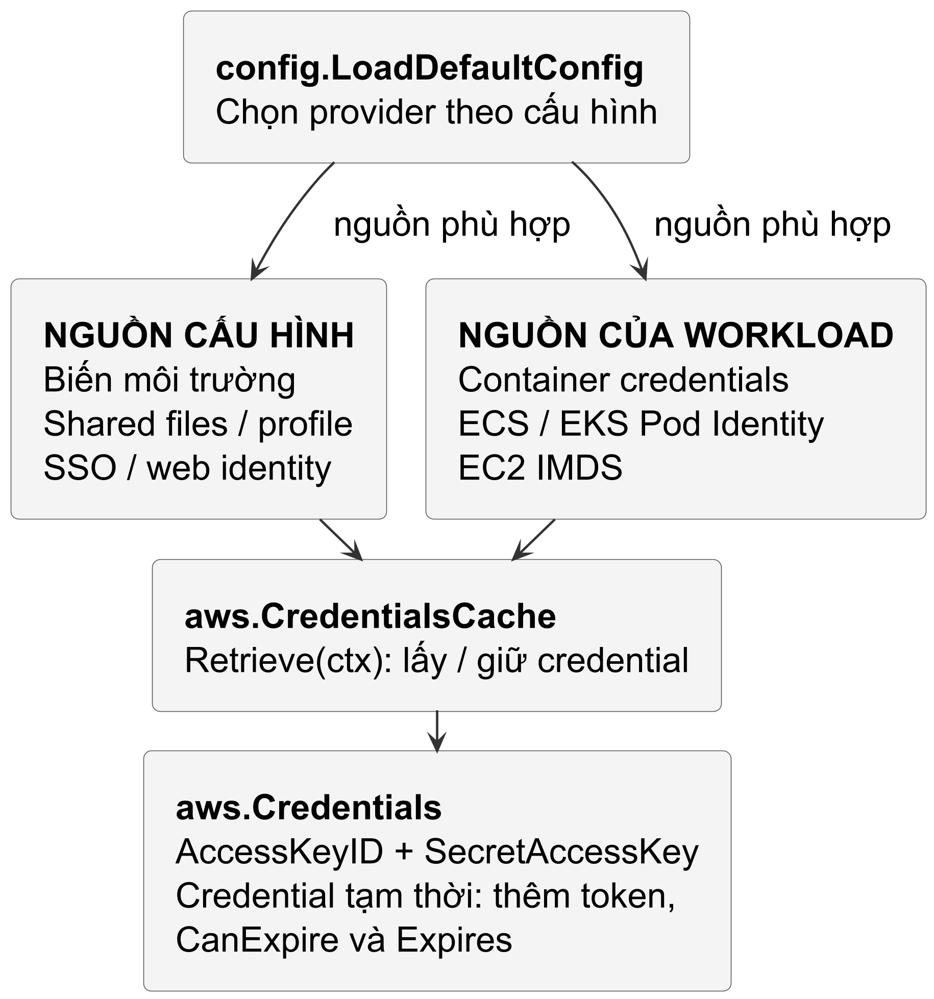
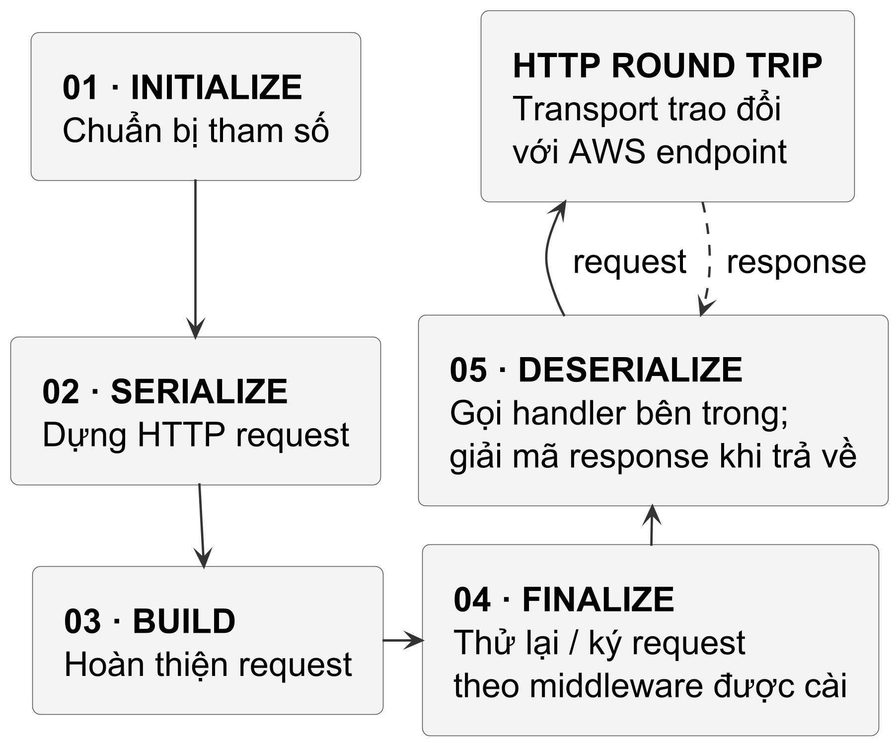

<!-- BOOK_ROLE: APPLICATION_SYSTEMS -->

# Chương 24 — Tự động hóa AWS bằng Go mà không biến credential thành bí mật dài hạn

Trong hành trình xây dựng các công cụ vận hành và nền tảng hạ tầng, giao tiếp với các dịch vụ điện toán đám mây là nhiệm vụ thiết yếu của kỹ sư DevOps/SRE. Cho dù bạn viết công cụ dọn dẹp snapshot định kỳ, sao lưu cơ sở dữ liệu lên Amazon S3, hay điều phối máy chủ qua EC2, bạn đều phải trả lời một câu hỏi bảo mật sống còn:

> *Làm thế nào để chương trình Go giao tiếp an toàn với AWS API mà không bao giờ nhúng Access Key dài hạn vào mã nguồn, file cấu hình hay biến môi trường?*

Để lộ cặp khóa `AWS_ACCESS_KEY_ID` và `AWS_SECRET_ACCESS_KEY` dài hạn trong repo hoặc log có thể cho phép sử dụng quyền của khóa cho đến khi bị thu hồi. Vì vậy chương này ưu tiên credential tạm thời và quyền tối thiểu; không gán thứ hạng nguyên nhân sự cố khi không có bộ dữ liệu tương ứng.

Chương 21 đến Chương 23 đã xây dựng mô hình điều hòa: quan sát trạng thái, tính sai lệch, hành động và quan sát lại để đảm bảo tính lũy đẳng trong Kubernetes. Khi mở rộng sang đám mây, các nguyên lý ấy vẫn giữ nguyên giá trị: việc tự động hóa AWS API (như dọn dẹp snapshot hay lưu trữ backup) cũng là một dạng điều hòa với hệ thống ngoại vi, nơi tính lũy đẳng nghiệp vụ, ranh giới lỗi và quyền hạn tạm thời quyết định độ tin cậy của hệ thống. Chương này trang bị cho bạn tư duy thiết kế hệ thống tự động hóa đám mây dựa trên thư viện chính thức AWS SDK for Go v2: từ cơ chế cấp quyền động ngắn hạn (Temporary Credentials), xác định Region, ngăn xếp middleware Smithy, ký chữ ký số SigV4, đến duyệt dữ liệu lớn qua Paginator và phân loại lỗi chuẩn mực.

---

## 1. Chuỗi định danh ngầm định và Quyền tạm thời

Ưu tiên production là thông tin xác thực tạm thời từ role/OIDC; điều đó không làm mọi nguồn trong default chain trở thành temporary credential. Với `config.LoadDefaultConfig`, các nguồn nền tảng gồm static credentials từ biến môi trường, shared config/credentials files, container credentials (ECS) và role credentials qua EC2 IMDS; cấu hình SSO hay web identity chọn provider tương ứng. Chain vẫn có thể nhận static credentials từ environment hoặc shared files, đặc biệt trên máy phát triển và trong test.

Các khóa tạm thời này có thời hạn hiệu lực hữu hạn: thời lượng phiên của IAM Role có thể cấu hình linh hoạt từ 15 phút tới 12 giờ tùy theo cấu hình vai trò, trong khi các cơ chế phiên liên kết (chained roles) hay `AssumeRoleWithWebIdentity` áp dụng giới hạn riêng. Mỗi bộ thông tin xác thực tạm thời luôn gắn liền với một Session Token (`AWS_SESSION_TOKEN`). Cần đặc biệt lưu ý: nếu khóa tạm thời bị rò rỉ trong thời gian còn hiệu lực, kẻ tấn công vẫn có thể sử dụng hợp lệ cho đến khi hết hạn hoặc cho đến khi quản trị viên chủ động thu hồi phiên (thông qua IAM revocation policy, cập nhật inline policy, hoặc vô hiệu hóa IAM role).

@figure Cấu hình quyết định provider được chọn; đây là bản đồ nguồn, không phải thứ tự ưu tiên bất biến. Credential có thể là static hoặc tạm thời. Cache lấy credential khi có lượt Retrieve cần dữ liệu hợp lệ.

### Cơ chế bộ đệm và xác thực đồng bộ của SDK (`aws.CredentialsCache`)

Ở source SDK được ghim, credential resolution có nhánh theo cấu hình, không phải một danh sách ưu tiên bất biến: profile được chọn tường minh, environment credentials và web-identity token có các nhánh riêng; profile có thể dùng source profile, SSO hay credential process trước khi tới container/IMDS. Đọc `config/resolve_credentials.go` cùng options của caller khi cần giải thích vì sao một provider được chọn. Không suy ra credential tạm thời chỉ từ việc gọi `LoadDefaultConfig`.

Đối với các khối lượng công việc container hóa và điều phối đám mây, SDK phân định rõ ba cơ chế cấp phát định danh độc lập thay vì gộp chung mọi môi trường:

Một là, IAM Roles for Service Accounts (IRSA) trên Kubernetes: Pod gắn projected OIDC web identity token (qua biến `AWS_WEB_IDENTITY_TOKEN_FILE` và `AWS_ROLE_ARN`), kích hoạt Web Identity provider gọi tới AWS STS thông qua API `AssumeRoleWithWebIdentity`.

Hai là, ECS Task Role: Container credential provider kết nối tới ECS agent credential endpoint cục bộ thông qua biến môi trường `AWS_CONTAINER_CREDENTIALS_RELATIVE_URI`.

Ba là, EKS Pod Identity: Container credential provider tương tác trực tiếp với EKS Pod Identity Agent trên node thông qua `AWS_CONTAINER_CREDENTIALS_FULL_URI` và token xác thực tại `AWS_CONTAINER_AUTHORIZATION_TOKEN_FILE`.

Nhằm giảm thiểu số lượt gọi mạng lặp lại trước mỗi HTTP request, SDK v2 bọc provider bên trong cấu trúc `aws.CredentialsCache`. Cần lưu ý rằng `aws.CredentialsCache` không cần một background goroutine riêng để định kỳ làm mới credentials. Lượt `Retrieve(ctx)` tiếp theo sẽ lấy lại credentials từ provider khi cache không còn hợp lệ. Cụ thể, mỗi khi mã nguồn gọi `Retrieve(ctx)`, bộ đệm kiểm tra trực tiếp thời điểm hết hạn của khóa: nếu `ExpiryWindow > 0`, cache coi credentials hết hạn sớm hơn thời điểm hết hạn thực tế (effective expiration sớm hơn) để lượt `Retrieve(ctx)` tiếp theo làm mới chúng một cách đồng bộ; nếu `ExpiryWindow <= 0`, tùy chọn này bị bỏ qua. Nhờ cơ chế kiểm tra đồng bộ theo yêu cầu, `CredentialsCache` duy trì tính hợp lệ của phiên làm việc mà không cần duy trì tiến trình quét nền.

### Xác định Region và Ranh giới Dịch vụ Vùng

Khi nạp cấu hình qua `config.LoadDefaultConfig`, việc xác định Region tuân theo chuỗi phân giải: cờ tùy chọn tường minh `config.WithRegion("ap-southeast-1")`, biến môi trường `AWS_REGION` hoặc `AWS_DEFAULT_REGION`, cấu hình profile trong file `~/.aws/config`, và EC2 instance metadata (IMDS).

Khác với các dịch vụ mang tính toàn cầu (global services như IAM), hầu hết dịch vụ AWS (như Amazon S3, DynamoDB, EC2) đều vận hành theo từng region vật lý riêng biệt. Nếu không xác định được Region từ các nguồn cấu hình trên, SDK v2 sẽ trả về lỗi khi khởi tạo cuộc gọi đến dịch vụ vùng. Đặc biệt với Amazon S3, dù tên bucket là duy nhất trên phạm vi toàn cầu, mỗi bucket vẫn cư trú tại một region xác định; gửi request tới bucket ở region khác mà không cấu hình cross-region có thể dẫn đến lỗi điều hướng HTTP 301 hoặc lỗi ký chữ ký số SigV4.

---

## 2. Luồng thực thi của AWS SDK v2 và Smithy Middleware

AWS SDK for Go v2 dùng Smithy, một ngôn ngữ mô hình hóa service và bộ công cụ sinh SDK. Smithy không phải wire protocol thay cho HTTP hay SigV4; stack middleware là phần tổ chức đường gọi của SDK.

Một operation như `s3.PutObject` đi qua năm step của **Middleware Stack**. Các step gọi handler bên trong; response đi ngược ra ngoài. Vì vậy Deserialize gọi bước trao đổi HTTP trước khi giải mã response trả về:

@figure Mũi tên liền biểu diễn đường gọi vào handler, mũi tên đứt biểu diễn response trở về Deserialize. Middleware cụ thể và vị trí xử lý checksum phụ thuộc operation cùng cấu hình; sơ đồ không mô tả từng lần retry.

### Chữ ký số SigV4 (Signature Version 4)

Trong đường gọi SigV4 đang xét, middleware ký ở pha **Finalize** xây canonical request từ phương thức HTTP, đường dẫn, query, các header được ký và giá trị payload hash theo chế độ signing. Đây là đại diện của request cho thuật toán xác thực, không phải chữ ký của từng packet mạng.

SDK dùng signing key suy ra từ secret, ngày, region và service để tạo chữ ký SigV4 cho canonical request. Server kiểm tra những phần được ký; không phải mọi header đều được đưa vào SignedHeaders và một số chế độ cho phép unsigned payload. Sửa phần được bao phủ có thể gây lỗi xác minh, nhưng không suy ra một mã lỗi HTTP cố định cho mọi service. TLS vẫn cần bảo vệ đường truyền; SigV4 không thay thế TLS.

SigV4 xác thực yêu cầu cho AWS và bảo vệ các phần được ký; nó không tự cung cấp bí mật nội dung, chống phát lại ở mọi ngữ cảnh, hay ký mọi header/payload trong mọi lựa chọn dịch vụ. TLS vẫn bảo vệ kênh truyền, còn caller phải hiểu service và tùy chọn signing của lời gọi mình dùng.

---

## 3. Quản lý dữ liệu lớn bằng Paginator

Nếu chỉ gọi một trang của API liệt kê, công cụ có thể bỏ sót object ở các trang sau:

~~~go
// CẢNH BÁO: Chỉ lấy tối đa 1.000 file đầu tiên!
resp, err := client.ListObjectsV2(ctx, &s3.ListObjectsV2Input{
	Bucket: aws.String("big-data-bucket"),
})
~~~

Một bucket trên S3 có thể chứa 10 triệu đối tượng. API `ListObjectsV2` mặc định chỉ trả về tối đa 1.000 file mỗi lần gọi và trả về mã thông báo tiếp tục (`NextContinuationToken`).

Nếu bạn tự viết vòng lặp `for` với token thủ công, mã nguồn sẽ trở nên cồng kềnh và dễ gặp lỗi vòng lặp vô tận nếu xử lý sai điều kiện ngắt. 

### Mẫu hình chuẩn: SDK Paginator

`NewListObjectsV2Paginator` quản lý continuation token và trả từng trang. Nó không hứa tổng bộ nhớ O(1) theo mọi input: kích thước trang và cách caller giữ kết quả vẫn phải có budget.

~~~go
paginator := s3.NewListObjectsV2Paginator(
	client, &s3.ListObjectsV2Input{
		Bucket: aws.String("big-data-bucket"),
	},
)

for paginator.HasMorePages() {
	page, err := paginator.NextPage(ctx)
	if err != nil {
		return fmt.Errorf("lỗi đọc trang: %w", err)
	}
	for _, obj := range page.Contents {
		// Xử lý từng file mà không làm đầy RAM
		processFile(*obj.Key)
	}
}
~~~

Paginator chỉ giữ trang đang xử lý; mức nhớ của caller còn phụ thuộc xử lý của nó. `ListAllKeys` trong lab cố ý gom kết quả vào `[]string`, nên dùng O(n) theo tổng số key. Với scan lớn, xử lý từng `page.Contents` hoặc gọi callback thay vì tích lũy toàn bộ.

---

## 4. Phân loại lỗi và Thử lại: smithy.APIError

Khi một lệnh gọi AWS thất bại, bạn không thể chỉ so sánh chuỗi lỗi bằng `strings.Contains(err.Error(), "404")`. AWS trả về lỗi có cấu trúc chuẩn mực thông qua interface `smithy.APIError`.

Thử lại ở tầng transport của SDK (`aws.Retryer`, mặc định tối đa 3 lần với backoff lũy thừa và jitter cho lỗi tạm thời) không bảo đảm tính lũy đẳng nghiệp vụ (business idempotency). Nếu một yêu cầu ghi bị ngắt kết nối mạng sau khi máy chủ AWS đã tiếp nhận và thực thi, việc SDK tự động thử lại có thể gây ra tác dụng phụ lặp lại ngoài mong muốn. Một số API của AWS cung cấp token lũy đẳng tường minh (như `ClientToken` trong EC2) để máy chủ nhận diện yêu cầu lặp; nhưng với Amazon S3 `PutObject`, ngữ nghĩa phụ thuộc chặt chẽ vào cấu hình bucket và điều kiện tiền đề. Khi bucket bật Versioning, nhiều lượt `PUT` với cùng một key sẽ tạo ra các version riêng biệt chứ không ghi đè tại chỗ, vì vậy việc dùng chung key không đảm bảo một tác dụng phụ duy nhất. Khi nghiệp vụ đòi hỏi tạo mới mà không ghi đè, hệ thống có thể cần yêu cầu có điều kiện (conditional request như `If-None-Match: *` khi dịch vụ hỗ trợ), nhưng đây không phải giải pháp vạn năng cho mọi tình huống. Tính lũy đẳng nghiệp vụ bắt buộc phải được thiết kế dựa trên đúng hợp đồng của từng thao tác và dịch vụ cụ thể. Trong policy của lab, `AccessDenied` không được retry như lỗi tạm thời. Các lỗi throttling hay service unavailable có thể cần backoff/jitter, nhưng retry còn phụ thuộc operation, budget và idempotency. Với timeout sau write, server có thể đã thực hiện side effect; không lặp mù quáng chỉ vì tên lỗi chứa `RequestTimeout`. Dùng classifier kết hợp với contract service và retryer đã cấu hình.

~~~go
func ClassifyError(err error) (bool, string) {
	if err == nil {
		return false, ""
	}

	// 1. Kiểm tra lỗi nghiệp vụ cụ thể của dịch vụ S3
	var noSuchKey *types.NoSuchKey
	if errors.As(err, &noSuchKey) {
		return false, "NoSuchKey"
	}
	var noSuchBucket *types.NoSuchBucket
	if errors.As(err, &noSuchBucket) {
		return false, "NoSuchBucket"
	}

	// 2. Kiểm tra lỗi giao tiếp chung qua smithy.APIError
	var apiErr smithy.APIError
	if errors.As(err, &apiErr) {
		code := apiErr.ErrorCode()
		switch code {
		case "SlowDown", "ThrottlingException",
			"TooManyRequestsException", "RequestTimeout",
			"ServiceUnavailable":
			return true, code
		default:
			return false, code
		}
	}
	return false, "UnknownError"
}
~~~

---

## 5. Hiện thực Storage Client và Middleware tùy biến

Dưới đây là cấu trúc mã nguồn trích xuất từ dự án mẫu `labs/part24-aws-sdk-go-v2/`. Trong khi mã nguồn triển khai thực tế trên production sẽ sử dụng `config.LoadDefaultConfig(ctx)` để gọi trực tiếp tới các endpoint dịch vụ AWS thật, dự án lab minh họa kiến trúc bằng `httptest.Server` giả lập giao thức S3 nhằm kiểm chứng hành vi nội tại của SDK v2 (middleware, provider, paginator, phân loại lỗi) hoàn toàn cô lập, không yêu cầu tài khoản đám mây thật hay chi phí vận hành:

### 1. Provider cấp khóa tạm thời tự xoay vòng

Provider giả dưới đây trả credential có thời hạn để kiểm tra cache của SDK. Nó không gọi STS hay mô phỏng xác thực và phân quyền của STS:

~~~go
type DynamicCredentialProvider struct {
	retrieveCount atomic.Int64
	ttl           time.Duration
	roleArn       string
}

func (p *DynamicCredentialProvider) Retrieve(
	ctx context.Context,
) (aws.Credentials, error) {
	count := p.retrieveCount.Add(1)
	now := time.Now()

	return aws.Credentials{
		AccessKeyID:     fmt.Sprintf("ASIA-TEMP-KEY-%d", count),
		SecretAccessKey: fmt.Sprintf("SECRET-TOKEN-%d", count),
		SessionToken:    fmt.Sprintf("SESSION-TOKEN-%d", count),
		Source:          "DynamicCredentialProvider",
		CanExpire:       true,
		Expires:         now.Add(p.ttl),
	}, nil
}
~~~

### 2. Can thiệp vào Smithy Middleware để thêm Header Audit

Để kiểm tra việc chèn một header của ứng dụng vào outbound request, ta viết middleware ở pha `Build`. Test chỉ kiểm tra header tại server cục bộ; không suy ra CloudTrail sẽ lưu custom header ấy:

~~~go
type AuditHeaderMiddleware struct {
	Origin string
}

func (m *AuditHeaderMiddleware) ID() string {
	return "AuditHeaderMiddleware"
}

func (m *AuditHeaderMiddleware) HandleBuild(
	ctx context.Context,
	in middleware.BuildInput,
	next middleware.BuildHandler,
) (middleware.BuildOutput, middleware.Metadata, error) {
	req, ok := in.Request.(*smithyhttp.Request)
	if ok && req != nil {
		req.Header.Set("X-Audit-Origin", m.Origin)
	}
	return next.HandleBuild(ctx, in)
}
~~~

Khi khởi tạo client, ta đăng ký middleware này vào pipeline:

~~~go
s3Client := s3.NewFromConfig(cfg, func(o *s3.Options) {
	o.APIOptions = append(
		o.APIOptions,
		func(stack *middleware.Stack) error {
			return stack.Build.Add(
				&AuditHeaderMiddleware{
					Origin: "automated-backup-worker",
				},
				middleware.After,
			)
		},
	)
})
~~~

---

## 6. Bằng chứng kiểm thử: Kiểm chứng 5 hành vi then chốt
 
Toàn bộ bộ kiểm thử tại `labs/part24-aws-sdk-go-v2/storage_test.go` vận hành độc lập bằng `httptest.Server` (phân loại mức kiểm chứng: `MOCK_VERIFIED` đối với tầng HTTP transport và `UNIT_TESTED` đối với logic provider/paginator/middleware), mô phỏng cấu trúc phản hồi XML của S3 và kiểm chứng 5 hành vi kiến trúc then chốt mà không cần tài nguyên AWS thực tế:

~~~
=== RUN   TestCredentialsCacheReuseAndExpiredRefresh
--- PASS: TestCredentialsCacheReuseAndExpiredRefresh (0.11s)
=== RUN   TestCustomSmithyMiddlewareAuditHeader
--- PASS: TestCustomSmithyMiddlewareAuditHeader (0.01s)
=== RUN   TestS3OperationsPutAndGet
--- PASS: TestS3OperationsPutAndGet (0.00s)
=== RUN   TestPaginatorListAllKeys
--- PASS: TestPaginatorListAllKeys (0.00s)
=== RUN   TestErrorClassification
--- PASS: TestErrorClassification (0.00s)
PASS
ok      part24-aws-sdk-go-v2   2.054s
~~~

### 1. Tự động làm mới khóa hết hạn (TestCredentialsCacheReuseAndExpiredRefresh)
Test bọc provider giả lập có TTL 100 ms trong `aws.NewCredentialsCache` với cấu hình mặc định. Ở lần gọi thứ hai khi credential còn hạn, cache trả về ngay kết quả đã lưu mà không gọi lại provider. Chỉ sau khi credential hết hạn, lần gọi tiếp theo mới kích hoạt cache gọi lại provider để cấp phát credential mới. Đây là unit test cục bộ với fake provider nhằm kiểm chứng cơ chế bộ đệm của SDK; test không gửi request tới AWS STS thật và không chứng minh credential được refresh thành công khi mạng hay dịch vụ IAM từ xa gặp sự cố.

### 2. Tiêm Header qua Smithy Middleware (TestCustomSmithyMiddlewareAuditHeader)
Máy chủ HTTP cục bộ bắt gói tin `PutObject` và kiểm tra header `X-Audit-Origin`. Giá trị nhận được chính xác là `"automated-backup-worker"`, chứng minh middleware đã can thiệp thành công vào luồng gửi tin của SDK.

### 3. Đọc ghi luồng dữ liệu an toàn (TestS3OperationsPutAndGet)
Kiểm chứng tính toàn vẹn của chuỗi dữ liệu nhị phân khi upload và download qua S3 Client.

### 4. Thu thập toàn bộ danh sách file qua Paginator (TestPaginatorListAllKeys)
Máy chủ giả lập trả về trang 1 kèm `IsTruncated: true` và `NextContinuationToken`, sau đó trả về trang 2 với `IsTruncated: false`. Hàm `ListAllKeys` tự động gọi 2 lần HTTP và thu thập đầy đủ 3 file mà không cần người dùng tự quản lý token phân trang.

### 5. Phân loại lỗi chính xác (TestErrorClassification)
Kiểm chứng hàm phân loại bóc tách chính xác các lỗi nghiệp vụ mô hình hóa của S3 (`types.NoSuchKey` và `types.NoSuchBucket`) thông qua `errors.As` (đều xác định `isRetryable = false`), đồng thời phân biệt chính xác mã lỗi tạm thời `SlowDown` (đánh dấu `isRetryable = true`) và lỗi phân quyền `AccessDenied` (đánh dấu `isRetryable = false`) của interface `smithy.APIError`.

---

## 7. Các cạm bẫy người học thường gặp (Learner Pitfalls)

| Cạm bẫy thực tế | Hậu quả trên Production | Giải pháp phòng ngừa |
| :--- | :--- | :--- |
| **Hardcode Access Key** trong mã nguồn hoặc image. | Có thể lộ credential và các quyền credential cho phép. | Chọn provider credential tạm thời phù hợp môi trường; `LoadDefaultConfig` còn có thể chọn static credential nếu cấu hình để nó làm vậy. |
| **Không đóng Response Body** khi gọi `s3.GetObject`. | Body và tài nguyên Transport có thể bị giữ lại, làm tăng áp lực tài nguyên khi lặp nhiều request. | Đặt `defer resp.Body.Close()` sau khi `GetObject` thành công; việc tái sử dụng kết nối còn có điều kiện riêng. |
| **Tự viết vòng phân trang mà không xử lý token và ngân sách.** | Có thể lặp lại trang, bỏ sót dữ liệu hoặc giữ quá nhiều object. | Ưu tiên paginator của SDK; vẫn kiểm tra context, error, số trang và lượng dữ liệu giữ lại. |
| **Thử lại mù quáng** với lỗi phân quyền `AccessDenied`. | Làm tắc nghẽn hàng đợi và kích hoạt các cảnh báo bảo mật bất thường trong SIEM. | Dùng `errors.As(err, &apiErr)` để chỉ thử lại các lỗi tạm thời (`SlowDown`, `5xx`). |

---

## 8. Bài tập thực hành thiết kế Cloud Tool

### Thử thách 1: Tích hợp Context Timeout chặt chẽ cho thao tác đám mây
**Yêu cầu:** Viết `PutObjectWithTimeout` nhận `timeout time.Duration` và truyền context có deadline tới SDK. Test với server giả chậm để quan sát caller ngừng chờ trên đường chạy ấy. Cancellation không chứng minh tác động phía server bị rollback hoặc resource được giải phóng tức thời ở mọi tầng.

### Thử thách 2: Thiết kế Waiter kiểm tra Bucket sẵn sàng
**Yêu cầu:** Sau `CreateBucket`, dùng `s3.NewBucketExistsWaiter` để chờ điều kiện tồn tại được quan sát qua `HeadBucket`. Đặt thời gian chờ tối đa 30 giây, khoảng lùi từ 2 đến 5 giây. Đây không phải phép kiểm chứng DNS toàn cầu hay toàn bộ độ sẵn sàng của ứng dụng.

---

## 9. Hướng dẫn giải và Phân tích kiến trúc bài tập

### Lời giải Thử thách 1: Quản trị thời gian chết bằng Context

~~~go
func (s *CloudStorage) PutObjectWithTimeout(
	parentCtx context.Context,
	bucket, key string,
	body io.Reader,
	timeout time.Duration,
) error {
	ctx, cancel := context.WithTimeout(parentCtx, timeout)
	defer cancel()

	err := s.PutObject(ctx, bucket, key, body)
	if err != nil {
		if errors.Is(ctx.Err(), context.DeadlineExceeded) {
			return fmt.Errorf(
				"upload %s/%s quá hạn sau %v: %w",
				bucket, key, timeout, err,
			)
		}
		return err
	}
	return nil
}
~~~

### Lời giải Thử thách 2: Đồng bộ hóa bằng SDK Waiter

~~~go
func WaitForBucketReady(
	ctx context.Context,
	client *s3.Client,
	bucket string,
) error {
	waiter := s3.NewBucketExistsWaiter(
		client,
		func(o *s3.BucketExistsWaiterOptions) {
			o.MaxDelay = 5 * time.Second
			o.MinDelay = 2 * time.Second
		},
	)

	// Chờ tối đa 30 giây
	maxWait := 30 * time.Second
	return waiter.Wait(
		ctx,
		&s3.HeadBucketInput{Bucket: aws.String(bucket)},
		maxWait,
	)
}
~~~

`BucketExistsWaiter` lặp `HeadBucket` theo policy waiter của SDK cho đến khi đạt trạng thái chấp nhận được, lỗi hoặc hết `maxWait`. Nó chỉ chứng minh điều kiện tồn tại bucket; không chứng minh DNS, IAM policy hay ứng dụng đã sẵn sàng cho một workflow lớn hơn. Vì vậy timeout và điều kiện chấp nhận phải bám đúng operation đang chờ.

---

Credential provider, middleware và paginator giải quyết các boundary khác nhau. Trước khi dùng trên AWS thật, cần kiểm tra role, IAM policy, budget retry và side effect của operation. Chương 25 chuyển sang webhook và GitHub API, nơi identity của delivery cũng không đồng nghĩa identity của một thao tác nghiệp vụ.
