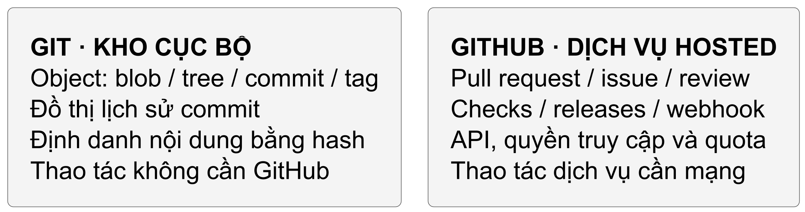
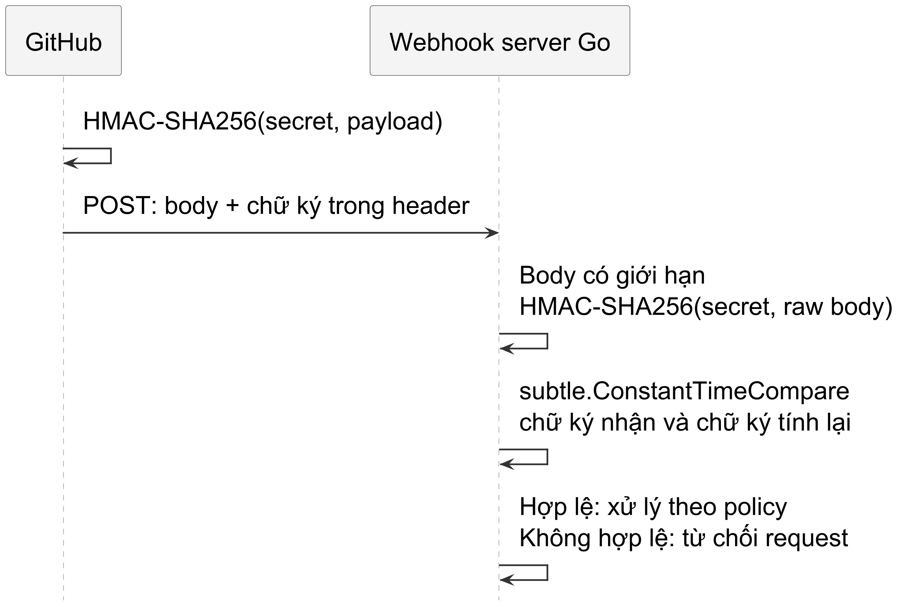
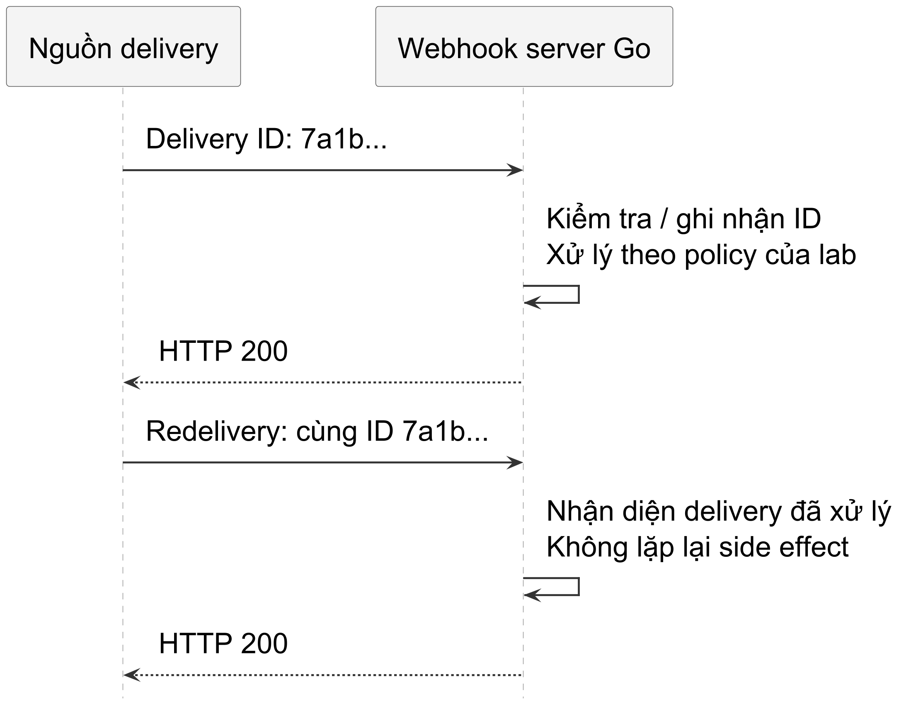

<!-- BOOK_ROLE: APPLICATION_SYSTEMS -->

# Chương 25 — Git và GitHub dưới góc nhìn của một hệ thống tự động hóa

Trong workflow GitOps, Git có thể là nguồn khai báo desired state. Nó không chứa toàn bộ state production: database, secret ngoài repo, status của controller và observation vận hành vẫn có owner riêng. Chương này xét cách một bot đọc source revision và metadata GitHub mà không trộn hai loại dữ liệu ấy.

Một commit được merge vào nhánh `main` có thể tự động kích hoạt ArgoCD triển khai ứng dụng lên Kubernetes. Một nhãn (label) được gắn vào Pull Request có thể kích hoạt bot tự động cấp phát môi trường kiểm thử tạm thời (Ephemeral Environment) trên AWS.

Chương này xét hai lỗi thiết kế bằng ví dụ: đánh đồng object Git cục bộ với dữ liệu GitHub qua API, và xử lý webhook mà không xét authentication, duplicate delivery hay crash window. Không cần giả định mọi kỹ sư đều mắc chúng để kiểm tra boundary.

Chương này phân tích sâu bản chất kỹ thuật của Git và GitHub dưới góc nhìn của một hệ thống hướng sự kiện (Event-Driven System), từ đó hướng dẫn bạn xây dựng các bot tự động hóa chuẩn mực bằng Go.

---

## 1. Hai thế giới: Trạng thái Git cục bộ và Trạng thái GitHub

Câu hỏi trung tâm của chương này là:
> *Vì sao một hệ thống tự động hóa tin cậy phải tách bạch hoàn toàn giữa Trạng thái Git (Local Git State) và Trạng thái GitHub (GitHub Hosted State)?*

@figure Git quản lý object và lịch sử trong kho; GitHub bổ sung các dịch vụ cộng tác có API, quyền truy cập và giới hạn riêng.

### Hai mô hình dữ liệu song hành

Git cục bộ lưu commit, tree và blob trong đồ thị định danh nội dung. Đọc object đã có có thể không cần mạng, nhưng storage có thể là disk hoặc memory, còn clone/fetch cần transport tới remote. Không có latency microsecond chung cho mọi thao tác go-git; số liệu cần workload và storage cụ thể. GitHub metadata như pull request và review là một boundary khác, không nằm trong tree source của commit.

Metadata Pull Request, label và review không nằm trong Git tree của commit. Lab dùng `go-github/v92` cho REST API và `go-git/v5` cho object Git cục bộ. Một bot chỉ cần một trong hai cũng hợp lệ; chọn theo dữ liệu và thao tác thực sự cần, không theo một kiến trúc “toàn diện” bắt buộc.

---

## 2. Bảo mật Webhook: Phòng ngừa Timing Side-Channel bằng HMAC-SHA256

Khi GitHub gửi một sự kiện (ví dụ `pull_request.opened`) đến máy chủ của bạn qua HTTP Webhook, làm sao bạn biết chắc chắn thông điệp này thực sự do GitHub phát ra chứ không phải do một kẻ xấu giả mạo?

GitHub ký toàn bộ nội dung gói tin (raw payload) bằng mã khóa bí mật (Webhook Secret) thông qua thuật toán HMAC-SHA256, và đính kèm vào header:
`X-Hub-Signature-256: sha256=<hex_digest>`

@figure Server tính chữ ký từ chính raw body đã nhận rồi so sánh với header. Không tuần tự hóa lại JSON trước khi kiểm tra chữ ký.

### Rủi ro rò rỉ thông tin qua thời gian thực thi (Timing Side-Channel)

Nếu bạn dùng toán tử thông thường để so sánh chữ ký:

~~~go
// CẢNH BÁO: Rò rỉ thông tin qua thời gian thực thi!
if actualSig == expectedSig { ... }
~~~

Toán tử so sánh chuỗi hoặc mảng byte mặc định trong hầu hết ngôn ngữ lập trình thường kết thúc sớm (early exit) ngay khi phát hiện byte không trùng khớp đầu tiên. Sự chênh lệch thời gian xử lý này vô tình tạo ra một kênh phụ (side-channel). Dù độ trễ biến thiên trên mạng Internet công cộng có thể làm nhiễu tín hiệu đo đạc, trong các môi trường nội bộ, mạng cục bộ tốc độ cao hoặc qua phương pháp phân tích thống kê trên lượng mẫu thử lớn, việc so sánh không hằng số thời gian vẫn có thể cung cấp manh mối để kẻ tấn công thu hẹp không gian tìm kiếm mã xác thực.

### So sánh chữ ký an toàn với crypto/hmac.Equal hoặc crypto/subtle

Trong Go, bạn bắt buộc phải dùng hàm `hmac.Equal` hoặc `subtle.ConstantTimeCompare`:

~~~go
func VerifyHMACSHA256(
	payload []byte, signatureHeader string, secret []byte,
) bool {
	if !strings.HasPrefix(signatureHeader, "sha256=") {
		return false
	}
	actualHex := strings.TrimPrefix(signatureHeader, "sha256=")
	actualSig, err := hex.DecodeString(actualHex)
	if err != nil {
		return false
	}

	mac := hmac.New(sha256.New, secret)
	mac.Write(payload)
	expectedSig := mac.Sum(nil)

	// So sánh hằng số thời gian (constant-time)
	return hmac.Equal(actualSig, expectedSig)
}
~~~

`hmac.Equal` so hai MAC mà không rò rỉ nội dung qua thời gian so sánh theo API contract. Nó không chứng minh toàn bộ endpoint constant-time hay không có side-channel; caller vẫn cần giới hạn payload, xử lý chữ ký và bảo vệ secret.

---

## 3. Khế ước phân tán: Delivery ID và Tính Lũy Đẳng

Trong kiến trúc tích hợp webhook, một ngộ nhận phổ biến là cho rằng GitHub sẽ tự động thử lại (auto-retry) mỗi khi máy chủ nhận trả về mã lỗi 5xx hoặc bị timeout. Trên thực tế, trong các cấu hình webhook tiêu chuẩn, GitHub không tự động redeliver khi endpoint nhận bị lỗi. Việc redelivery chỉ xảy ra khi có thao tác kích hoạt lại từ người vận hành qua giao diện quản trị (Operator UI), lời gọi REST API redeliver từ mã nguồn tự động hóa, hoặc các công cụ nội bộ gọi API này. Khi một lần chuyển giao được kích hoạt lại (redelivered), GitHub giữ nguyên giá trị GUID trong header `X-GitHub-Delivery`.

Mỗi lần phát sự kiện, GitHub đính kèm một mã UUID duy nhất tại header:
`X-GitHub-Delivery: 7a1b2c3d-4e5f-6a7b-8c9d-0e1f2a3b4c5d`

@figure Lab nhận diện cùng Delivery ID để tránh lặp side effect trong đường chạy được kiểm thử. Lưu bền, xử lý crash và delivery đồng thời cần policy cùng cơ chế riêng.

Delivery ID giúp nhận diện cùng một delivery khi redeliver. Nó không được HMAC payload ký kèm như một phần header, nên riêng việc lưu ID chưa chống replay từ bên giữ payload/chữ ký hợp lệ rồi đổi ID. Sau xác thực, cần ràng buộc event, repository và operation identity; state xử lý phải bền vững nếu muốn giữ kết quả qua crash.

Delivery ID chỉ khử trùng lặp **một lần chuyển giao**; nó không tự là khóa lũy đẳng của nghiệp vụ như “deploy commit X vào môi trường Y”. Cần có state machine tối thiểu `processing → completed`: redelivery đang xử lý bị giữ lại, attempt lỗi phải được đánh fail để có thể thử lại, còn completed mới bị suppress. Business mutation cần operation key riêng và, ở production, durable/transactional store có TTL. Lab giữ ledger trong RAM nên mọi bảo đảm chỉ tồn tại trong process lifetime.

Trên môi trường production thực tế, một hệ thống tự động hóa chịu lỗi đòi hỏi phải kết hợp một trong các cơ chế sau:

Một là, kho lưu trữ phân tán bền bỉ (Durable idempotency store): Lưu trữ delivery ID vào kho dữ liệu phân tán có TTL (như Redis hoặc DynamoDB).

Hai là, ràng buộc duy nhất trong cơ sở dữ liệu (Database uniqueness/transaction): Ghi delivery ID vào bảng sự kiện với ràng buộc khóa duy nhất (unique constraint) trong cùng transaction xử lý nghiệp vụ.

Ba là, mã định danh thao tác (Operation identity): Sinh token lũy đẳng gắn với trạng thái cụ thể của tài nguyên đích thay vì chỉ dựa vào sự kiện webhook.

Bốn là, thiết kế mutation lũy đẳng theo identity và trạng thái đã quan sát. Khai báo desired state giúp xác định đích nhưng không tự làm mọi thao tác create/delete lũy đẳng; precondition, ownership và retry sau partial failure vẫn cần được thiết kế như Ch21–23.

Thiết kế bộ tiếp nhận có kiểm tra trùng lặp trong bộ nhớ:

~~~go
type WebhookReceiver struct {
	secret []byte
	ledger *DeliveryLedger
}

func (r *WebhookReceiver) Process(
	deliveryID, signature string,
	payload []byte,
	handle func() error,
) (bool, error) {
	if !VerifyHMACSHA256(payload, signature, r.secret) {
		return false, ErrInvalidSignature
	}
	if _, accepted := r.ledger.Begin(deliveryID); !accepted {
		return true, nil
	}
	if err := handle(); err != nil {
		r.ledger.Fail(deliveryID)
		return false, err
	}
	r.ledger.Complete(deliveryID)
	return false, nil
}
~~~

`Complete` xảy ra sau `handle`; lỗi giải phóng reservation để thử lại. Trong process còn sống, ledger của lab ngăn delivery đồng thời hoặc đã hoàn tất chạy lại handler. Production cần state bền, atomic claim và recovery; TTL/lease đơn lẻ không đóng crash window giữa side effect ngoài database và việc ghi Complete.

---

### Ledger trong RAM không sống qua lần khởi động lại

Giữ nguyên lab webhook ở trên để kiểm tra HMAC và cạnh tranh trong một process. Bây giờ thử đưa nó qua khe lỗi của Chương 13: handler đã tạo một thay đổi, nhưng process chết trước `Complete`. Sau restart, ledger RAM trống; delivery giống hệt có thể đi qua lần nữa. Đây không phải lỗi của mutex hay HMAC. Mutex bảo vệ state đang sống, còn chữ ký xác nhận payload; không thứ nào lưu nghĩa vụ nghiệp vụ sau khi process biến mất.

Trong lab outbox của Chương 13, `credit-001` là operation identity nghiệp vụ, không tự lấy tên từ transport delivery ID. Khi nhận webhook, trước hết phải xác thực payload và ánh xạ nó sang operation mà application cho phép. Một delivery ID mới cho cùng operation không được tạo tác dụng phụ mới; ngược lại, hai operation khác nhau không được gộp chỉ vì tình cờ có cùng nội dung. Việc ánh xạ này là policy của bot, chưa được fixture GitHub cũ chứng minh.

Hãy tự dựng bảng ba checkpoint trong `TestRecoveryWindows`, rồi chạy test. Ở checkpoint sau send, phía nhận đã commit mà phía gửi vẫn pending. Lần dispatch mới bắt buộc có khả năng gửi lặp. `TestSendRetryAndReceiverConflict` kiểm tra hai attempts và một hiệu ứng, đồng thời từ chối payload xung đột ở phía nhận. Bằng chứng này dùng hai database cục bộ và sender gọi receiver trực tiếp; nó không xác nhận GitHub cung cấp một idempotency contract tương đương cho mọi endpoint.

Một bot thật cần chọn side effect có thể lặp an toàn, đọc lại trạng thái có identity ổn định hoặc dùng cơ chế idempotency của API thực tế. Nếu một request tạo comment đã timeout sau khi server xử lý, không được suy “thất bại nên cứ tạo lại”. Outbox giữ việc chưa được xác nhận, không biến network thành transaction. Policy retry còn cần budget, delay, giới hạn số lần và đường đối soát; lab này giữ retry do người vận hành/test gọi lại, không thêm vòng retry nền vô hạn.

## 4. Quản trị Rate Limit: Primary và Secondary

Khi bot gọi GitHub API, rate limit là một budget cần quan sát. Nó không phải rủi ro production duy nhất hay luôn là nút thắt lớn nhất:

Tuyệt đối không xem "5.000 requests/giờ" là con số phổ quát cố định. GitHub áp dụng hạn mức phân cấp tùy theo loại định danh và ngữ cảnh ủy quyền:

| Loại định danh (Authentication Context) | Hạn mức Primary Quota | Dấu hiệu nhận diện |
| :--- | :--- | :--- |
| **Chưa xác thực (Unauthenticated)** | 60 requests/giờ (tính theo địa chỉ IP) | Dễ bị nghẽn trong môi trường NAT/CI chung |
| **PAT / OAuth User** | Mức cơ bản 5.000 request/giờ theo user; app Enterprise đủ điều kiện có mức cao hơn. | Đọc X-RateLimit-Limit của response. |
| **GitHub App user access token** | Chung quota theo user; app thuộc Enterprise Cloud đủ điều kiện có thể là 15.000/giờ. | Không coi mỗi app là một quota user độc lập. |
| **GitHub App: Installation (Non-Enterprise)** | Base 5.000 req/h; nếu repos > 20: +50/h/repo; nếu org users > 20: +50/h/user; trần tối đa 12.500 req/h | Phù hợp nhất cho bot tự động hóa cấp tổ chức |
| **GitHub App: Enterprise Cloud Installation** | Trần tối đa 15.000 requests/giờ | Áp dụng cho tổ chức trên GitHub Enterprise Cloud |
| **GITHUB_TOKEN trong GitHub Actions** | 1.000 requests/giờ cho mỗi repository (hoặc Enterprise rate nếu resource thuộc Enterprise Cloud) | Áp dụng cho runner tiêu chuẩn trong GitHub Actions |
| **GitHub Enterprise Server (On-Premises)** | Cấu hình độc lập bởi quản trị viên hệ thống | Tùy biến theo chính sách triển khai tự lưu trữ |

Ngoài primary rate limit, GitHub còn áp dụng secondary rate limit, chẳng hạn cho mức đồng thời hay tốc độ tạo nội dung. Khi vượt mức, response có thể là `403` hoặc `429`. Nếu có `Retry-After`, phải chờ ít nhất khoảng ấy; header này không được bảo đảm luôn có. Khi thiếu nó, đọc thông báo và các rate-limit header khác, rồi áp dụng budget chờ/thử lại theo hướng dẫn API, không loop tức thời.

### Thuật toán bóc tách Rate Limit trong Go

~~~go
func ParseRateLimit(
	header http.Header, now time.Time,
) RateLimitStatus {
	status := RateLimitStatus{}

	remStr := header.Get("X-RateLimit-Remaining")
	if remStr != "" {
		if rem, err := strconv.Atoi(remStr); err == nil {
			status.Remaining = rem
			if rem == 0 {
				status.IsExhausted = true
			}
		}
	}

	resetStr := header.Get("X-RateLimit-Reset")
	if resetStr != "" {
		epoch, err := strconv.ParseInt(resetStr, 10, 64)
		if err == nil {
			status.ResetAt = time.Unix(epoch, 0)
			if status.IsExhausted && status.ResetAt.After(now) {
				status.RetryAfter = status.ResetAt.Sub(now)
			}
		}
	}

	// Secondary rate limit dùng header Retry-After
	retryStr := header.Get("Retry-After")
	if retryStr != "" {
		if sec, err := strconv.Atoi(retryStr); err == nil {
			status.RetryAfter = time.Duration(sec) * time.Second
			status.IsExhausted = true
		}
	}
	return status
}
~~~

---

## 5. Tương tác GitHub API (`go-github/v92`) và Git trên bộ nhớ (`go-git/v5`)

Một công cụ tự động hóa toàn diện cần tương tác đồng thời với cả hai thế giới: giao tiếp với GitHub API thông qua thư viện `go-github/v92` do Google duy trì để truy xuất siêu dữ liệu, và thao tác cây thư mục Git cục bộ thông qua `go-git/v5`.

### Tích hợp GitHub Client

Trong gói `labs/part25-github-automation/github_client.go`, ta đóng gói `github.Client` để hỗ trợ cấu hình linh hoạt endpoint mạng (cho phép trỏ tới máy chủ kiểm thử cục bộ `httptest.Server` hoặc máy chủ GitHub Enterprise):

~~~go
type GitHubClient struct {
	client *github.Client
}

func NewGitHubClient(
	httpClient *http.Client, baseURL string,
) (*GitHubClient, error) {
	var opts []github.ClientOptionsFunc
	if httpClient != nil {
		opts = append(opts, github.WithHTTPClient(httpClient))
	}
	if baseURL != "" {
		if !strings.HasSuffix(baseURL, "/") {
			baseURL += "/"
		}
		opts = append(opts, github.WithURLs(&baseURL, nil))
	}
	gh, err := github.NewClient(opts...)
	if err != nil {
		return nil, fmt.Errorf("bad client options: %w", err)
	}
	return &GitHubClient{client: gh}, nil
}

func (c *GitHubClient) GetRepository(
	ctx context.Context, owner, repo string,
) (*github.Repository, *github.Rate, error) {
	repository, resp, err := c.client.Repositories.Get(
		ctx, owner, repo,
	)
	if err != nil {
		return nil, nil, err
	}
	var rate *github.Rate
	if resp != nil {
		rate = &resp.Rate
	}
	return repository, rate, nil
}
~~~

### Thao tác Git trên bộ nhớ (In-memory Git) với go-git

Gọi Git CLI tạo dependency vào executable và lifecycle subprocess; thư mục làm việc cần ownership riêng nếu chạy đồng thời. `go-git` là lựa chọn khác: ví dụ này dùng `memory.NewStorage()` cho object store và `memfs.New()` cho working tree, không chứng minh mọi dùng CLI đều xung đột:

~~~go
func NewInMemGitRepository() (*InMemGitRepository, error) {
	fs := memfs.New()
	storer := memory.NewStorage()

	repo, err := git.Init(storer, fs)
	if err != nil {
		return nil, fmt.Errorf("lỗi init git mem: %w", err)
	}

	return &InMemGitRepository{repo: repo, fs: fs}, nil
}
~~~

Ghi file và tạo commit với chữ ký tác giả trong bộ nhớ:

~~~go
func (r *InMemGitRepository) WriteFileAndCommit(
	filePath string, content []byte, author, msg string,
) (string, error) {
	wt, err := r.repo.Worktree()
	if err != nil {
		return "", err
	}

	f, err := r.fs.Create(filePath)
	if err != nil {
		return "", err
	}
	_, _ = f.Write(content)
	_ = f.Close()

	if _, err := wt.Add(filePath); err != nil {
		return "", err
	}

	hash, err := wt.Commit(msg, &git.CommitOptions{
		Author: &object.Signature{
			Name:  author,
			Email: author + "@bot.local",
			When:  time.Now(),
		},
	})
	if err != nil {
		return "", err
	}
	return hash.String(), nil
}
~~~

Với `memory.NewStorage()` và `memfs` của ví dụ, Git object và working tree không được chủ động ghi ra filesystem. Hashing, allocation và GC vẫn có chi phí; hệ điều hành có thể page/swap memory, nên không suy ra “không một byte xuống đĩa vật lý” hay một mức latency từ cấu hình in-memory.

---

## 6. Bằng chứng kiểm thử: Chứng minh 5 quy luật tự động hóa

Test trong `labs/part25-github-automation/` kiểm tra các case HMAC, ledger, rate-limit parser và Git trong memory; HTTP fixture kiểm tra đường dùng `go-github`. Chúng không chứng minh GitHub thật luôn delivery thành công, không có replay đổi header ID, hay mọi lịch crash đều an toàn:

~~~
=== RUN   TestWebhookHMACVerification
--- PASS: TestWebhookHMACVerification (0.00s)
=== RUN   TestWebhookDeliveryIdempotency
--- PASS: TestWebhookDeliveryIdempotency (0.00s)
=== RUN   TestRateLimitParsingPrimaryAndSecondary
--- PASS: TestRateLimitParsingPrimaryAndSecondary (0.00s)
=== RUN   TestInMemGitCommitAndHead
--- PASS: TestInMemGitCommitAndHead (0.00s)
=== RUN   TestGitHubClientIntegrationWithMockServer
--- PASS: TestGitHubClientIntegrationWithMockServer (0.00s)
PASS
ok      part25-github-automation   0.263s
~~~

### 1. Xác thực chữ ký an toàn (TestWebhookHMACVerification)
Kiểm chứng 4 ca biên: chữ ký đúng định dạng `sha256=` với secret hợp lệ; từ chối khi sửa đổi 1 byte trong payload; từ chối khi dùng sai Webhook Secret; và từ chối khi header sai định dạng.

### 2. Khử trùng lặp sự kiện (TestWebhookDeliveryIdempotency)
Gửi 2 webhook mang cùng một `X-GitHub-Delivery`. Lần đầu tiên xử lý thành công (`isDuplicate = false`). Lần thứ hai được nhận diện chính xác là sự kiện gửi lặp (`isDuplicate = true`), bảo vệ hệ thống không bị kích hoạt kép khi có redelivery từ UI hoặc qua REST API.

### 3. Bóc tách Rate Limit hai tầng (TestRateLimitParsing)
Kiểm chứng cả hai tình huống: khi chạm trần Primary Quota (`Remaining: 0`), tính đúng thời gian cần chờ đến mốc `ResetAt`; khi chạm trần Secondary Quota (`Retry-After: 120`), chuyển đổi chính xác thành khoảng chờ 120 giây.

### 4. Vận hành Git trên RAM (TestInMemGitCommitAndHead)
Tạo liên tiếp 2 commit trong bộ nhớ RAM, kiểm tra mã băm SHA của commit thứ nhất và thứ hai, xác nhận con trỏ HEAD dịch chuyển chuẩn xác theo đồ thị DAG.

### 5. Tương tác GitHub Client (TestGitHubClientIntegrationWithMockServer)
Kiểm chứng việc khởi tạo client `google/go-github/v92`, định tuyến qua máy chủ giả lập `httptest.Server`, trích xuất chính xác cấu trúc repository và thông tin hạn mức `Rate` từ tiêu đề phản hồi.

---

## 7. Các cạm bẫy người học thường gặp (Learner Pitfalls)

| Cạm bẫy thực tế | Hậu quả trên Production | Giải pháp phòng ngừa |
| :--- | :--- | :--- |
| **So sánh chữ ký bằng ==** thay vì `hmac.Equal`. | Rò rỉ thông tin qua thời gian thực thi (timing side-channel). | Dùng `crypto/hmac.Equal` hoặc `crypto/subtle.ConstantTimeCompare`. |
| **Bỏ qua X-GitHub-Delivery** và xử lý mù quáng mọi webhook. | Gây trùng lặp hành vi (tạo 2 PR, merge 2 lần) khi có redelivery từ UI hoặc qua REST API. | Lưu `X-GitHub-Delivery` vào bộ đệm và bỏ qua các sự kiện trùng lặp. |
| **Gọi API dồn mà không quan sát quota.** | Có thể cạn primary hoặc secondary budget theo token/endpoint thực tế. | Đọc rate-limit headers; chọn budget chờ/retry theo workload. Mốc Remaining dưới 50 chỉ là ví dụ policy, không phải ngưỡng an toàn chung. |
| **Dùng thư mục tạm chung không có ownership/cleanup.** | Có thể xung đột hoặc để lại dữ liệu nhạy cảm. | Dùng thư mục riêng và cleanup rõ, hoặc memory storage khi kích thước và lifecycle phù hợp; RAM không tự là ranh giới bảo mật. |

---

## 8. Bài tập thực hành thiết kế Bot Tự động hóa

### Thử thách 1: Lọc sự kiện theo nhánh (Branch Filtering Middleware)
**Yêu cầu:** Một webhook `push` được gửi tới mỗi khi có commit mới. Hãy viết hàm lọc sự kiện chỉ cho phép xử lý nếu sự kiện nhắm vào nhánh `refs/heads/main`. Bỏ qua tất cả các sự kiện của nhánh tính năng (`feature/*`) mà không kích hoạt quy trình triển khai.

### Thử thách 2: Bộ điều tốc thông minh (Smart Backoff with Jitter)
**Yêu cầu:** Với fixture `Retry-After: 30`, tính thời gian chờ ít nhất 30 giây rồi thêm jitter 10–25%. Nếu nhiều worker cùng chờ, jitter có thể giảm nhịp gửi đồng loạt, không bảo đảm tránh secondary limit. Các tỷ lệ này là cấu hình bài tập, không phải ngưỡng GitHub hay security policy production.

---

## 9. Hướng dẫn giải và Phân tích kiến trúc bài tập

### Lời giải Thử thách 1: Lọc sự kiện theo nhánh đích

~~~go
type PushPayload struct {
	Ref string `json:"ref"`
}

func ShouldDeployFromWebhook(payload []byte) bool {
	var push PushPayload
	if err := json.Unmarshal(payload, &push); err != nil {
		return false
	}

	// Chỉ kích hoạt tự động hóa trên nhánh chính (main)
return push.Ref == "refs/heads/main"
}
~~~

Đây chỉ là bộ lọc tối thiểu để luyện đọc payload, không phải policy triển khai. Endpoint production phải xác thực chữ ký trước khi parse, allowlist cả tên event và action, repository/owner, installation ID (nếu dùng GitHub App) và ref; sau đó ràng buộc các giá trị đó với cấu hình deployment. Chỉ kiểm tra `ref` sẽ cho phép một kho hoặc installation ngoài phạm vi kích hoạt hành động nhạy cảm.

### Lời giải Thử thách 2: Tính toán Backoff kết hợp Jitter

~~~go
func CalculateBackoffWithJitter(
	baseDelay time.Duration,
	next func() float64,
) (time.Duration, error) {
	if next == nil {
		return 0, errors.New("jitter source is required")
	}
	value := next() // contract: 0 <= value < 1
	if value < 0 || value >= 1 {
		return 0, errors.New("invalid jitter value")
	}
	return baseDelay + time.Duration(
		float64(baseDelay)*(0.10+value*0.15),
	), nil
}
~~~

Jitter chỉ giảm tương quan, không triệt tiêu hoàn toàn bão yêu cầu. Hàm nhận nguồn jitter qua dependency injection; production có thể bọc `crypto/rand` hoặc PRNG được sở hữu riêng, còn test truyền giá trị cố định để tái lập được. Không dùng global RNG như một contract ngầm.

---

Nắm vững cách vận hành **HMAC-SHA256 + Delivery Idempotency + Rate-Limit-Aware Client + In-Memory Git** giúp bạn tự tin xây dựng những hệ thống GitOps và CI/CD bot an toàn, vững chắc. Trong Chương 26, chúng ta sẽ mở rộng năng lực bảo vệ phần mềm lên tầm chuỗi cung ứng: xây dựng **Cổng kiểm soát chuỗi cung ứng phần mềm có thể kiểm chứng (Supply Chain Verification Gate)** bằng Go với chữ ký số Cosign không cần khóa (keyless), OCI manifest digest bất biến và quét lỗ hổng mã nguồn bằng `govulncheck`.
