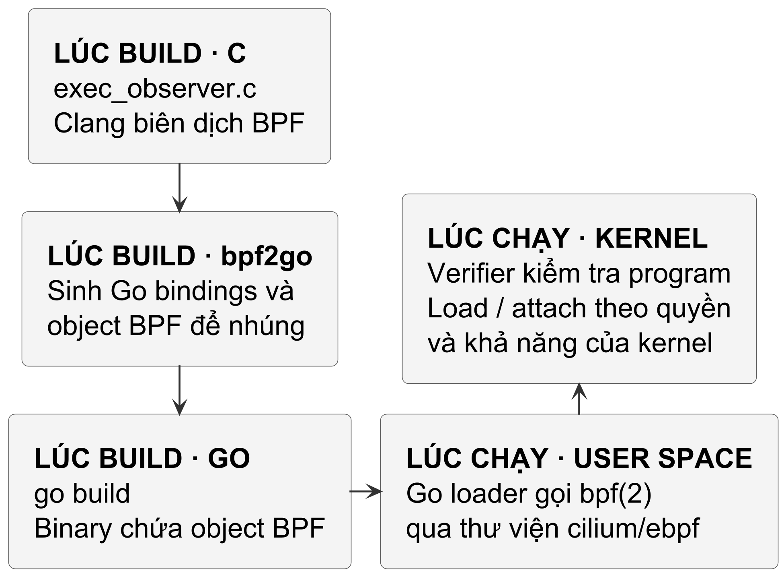

<!-- BOOK_ROLE: APPLICATION_SYSTEMS -->

# Chương 27 — Quan sát Linux từ kernel bằng eBPF và Go

Cho đến thời điểm này của cuốn sách, chúng ta đã xây dựng các công cụ giám sát dựa trên ba trụ cột Observability truyền thống: Metrics (Prometheus), Logs và Tracing (OpenTelemetry). 

Instrumentation đặt trong application cần code ứng dụng tham gia để tạo metric và span có ngữ nghĩa nghiệp vụ. Nhưng metrics, logs và tracing không chỉ có nguồn ấy: OS, proxy và các tầng hạ tầng cũng có thể cung cấp tín hiệu độc lập. Câu hỏi ở đây là điểm quan sát nào còn thấy được hành vi khi application không chủ động báo cáo.

Xét một scenario: tiến trình web bị khai thác RCE, mở `/bin/sh`, tải payload vào `/tmp` rồi thực thi mà không tạo span hay metric trong application. Instrumentation của chính application có thể thiếu dấu vết đó; log OS, proxy hoặc audit vẫn có thể hữu ích. Ta bổ sung một điểm quan sát kernel cho hook đã chọn, không tuyên bố eBPF là nguồn nhìn thấy mọi hành vi.

eBPF cho phép đặt điểm quan sát gần kernel cho những hook mà policy và kernel hỗ trợ; nó không nhìn thấy “mọi hành vi” và không thay thế audit log hay kiểm soát truy cập. Trước đây, can thiệp vào kernel thường dùng Linux Kernel Module (LKM) bằng C, có blast radius lớn khi lỗi. eBPF kết hợp `cilium/ebpf` cho phép nạp bytecode qua verifier, nhưng khả năng attach, quyền hạn và overhead vẫn phải được kiểm chứng trên kernel/workload thật.

---

## 1. Mental Model: Chuỗi luân chuyển sự kiện Kernel - Go Userspace

Mô hình trung tâm cần tách hai thời điểm. Verifier kiểm tra chương trình khi nạp, không chạy lại như một bước trong đường đi của từng sự kiện:

| Thời điểm | Đường xử lý của lab | Ranh giới |
| :--- | :--- | :--- |
| Nạp và gắn chương trình | Loader nạp object; kernel verifier kiểm tra bytecode; loader gắn chương trình vào tracepoint. | Chấp nhận chương trình không chứng minh policy quan sát đầy đủ hoặc overhead phù hợp. |
| Một lời gọi `execve` đi qua hook | Chương trình lấy trường sự kiện, reserve/submit record vào ring buffer; Go đọc record, giải mã ABI rồi áp dụng heuristic. | Record có thể mất; sự kiện đầu vào syscall không chứng minh exec thành công. |

Với hook `sys_enter_execve` của lab, record chứa PID, UID, GID, tên tiến trình gọi và đường dẫn được đọc từ argument. Reader của `cilium/ebpf` ở version ghim có thể đọc dữ liệu đã sẵn sàng trước khi cần chờ qua `epoll`. Little-endian là lựa chọn ABI của object `bpfel` đang build, không phải quy tắc cho mọi kernel hay chương trình eBPF. Go chỉ phân tích những record nhận được; không có record không đồng nghĩa không có hành vi.

---

## 2. Kernel Verifier: Kiểm tra trước khi nạp

Tại sao Linux Kernel lại cho phép mã do người dùng viết chạy trực tiếp bên trong không gian bộ nhớ của nhân?

Câu trả lời nằm ở **Bộ kiểm định nhân (Kernel Verifier)**. Trước khi bất kỳ chương trình eBPF nào được nạp vào kernel thông qua lời gọi hệ thống `SYS_BPF`, Verifier sẽ phân tích tĩnh toàn bộ mã bytecode và thực thi các quy tắc kiểm tra nghiêm ngặt:

| Tiêu chuẩn an toàn Verifier | Cơ chế kiểm tra | Mục đích bảo vệ Kernel |
| :--- | :--- | :--- |
| **Kiểm tra đường thực thi hữu hạn** | Phân tích CFG, state và các loop mà kernel/version cho phép chứng minh an toàn. | Hạn chế đường chạy không an toàn; không biến mọi program được nạp thành không có overhead. |
| **Kiểm soát truy cập bộ nhớ** | Bắt buộc kiểm tra biên; truy cập userspace qua `bpf_probe_read_user_str()`. | Chống rò rỉ hoặc ghi đè trái phép lên không gian nhớ kernel. |
| **Giới hạn stack của mô hình BPF đang xét** | Tài liệu verifier mô tả frame 512 byte; call chain, program type và tính năng kernel còn có kiểm tra riêng. | Không dùng số này làm tổng stack budget cho mọi call chain hay version. |
| **Theo dõi thanh ghi BPF và FP** | `R10` là frame pointer chỉ đọc; verifier theo dõi kiểu và trạng thái thanh ghi BPF. | Đây là thanh ghi của máy BPF, không phải lời hứa giữ nguyên mọi thanh ghi vật lý của CPU. |

> **Tình huống minh họa suy luận: Ranh giới giữa trình biên dịch C và Kernel Verifier.**
> Xét một đoạn mã C eBPF minh họa việc tra cứu và cập nhật bộ đếm trong map:
> ~~~c
> struct event *val = bpf_map_lookup_elem(&counters, &key);
> val->count++;
> ~~~
> Về mặt cú pháp C thuần túy, trình biên dịch Clang có thể coi việc truy cập `val->count` là hợp lệ và phát sinh mã bytecode ELF. Tuy nhiên, khi chương trình Go nạp bytecode này vào kernel, bộ kiểm định Verifier sẽ từ chối chương trình tại thời điểm load. Vì sao Verifier lại nghiêm ngặt hơn trình biên dịch ngôn ngữ, và người viết eBPF phải thay đổi cách viết như thế nào?

#### Đáp án — chỉ đọc sau khi đã tự làm

Trình biên dịch C chỉ chịu trách nhiệm kiểm tra cú pháp và hệ thống kiểu ở tầng ngôn ngữ; nó không thể biết trước liệu tại thời điểm thực thi trong nhân, phần tử ứng với `key` có thực sự tồn tại trong bộ nhớ hay không. Hàm trợ giúp `bpf_map_lookup_elem` luôn có khả năng trả về con trỏ NULL nếu tra cứu thất bại. Trong không gian nhân Linux, việc giải tham chiếu con trỏ NULL tiềm ẩn nguy cơ nghiêm trọng đối với tính toàn vẹn của hệ thống: nó có thể gây ra kernel oops, làm đổ vỡ tiến trình liên quan, làm hỏng trạng thái nhân hoặc kích hoạt kernel panic tùy thuộc vào ngữ cảnh thực thi và cấu hình nhân.

Do đó, Kernel Verifier thực hiện phân tích đường đi trừu tượng và theo dõi trạng thái thanh ghi BPF chứa kết quả trả về dưới dạng con trỏ có thể mang giá trị NULL. Khi thanh ghi chưa được chứng minh an toàn, mọi chỉ thị đọc hoặc ghi bộ nhớ thông qua thanh ghi đó đều bị Verifier chặn đứng và từ chối nạp vì lỗi truy cập bộ nhớ không hợp lệ. Để vượt qua rào cản này, lập trình viên bắt buộc phải chèn một nhánh kiểm tra điều kiện tường minh ngay sau khi tra cứu:

~~~c
struct event *val = bpf_map_lookup_elem(&counters, &key);
if (!val) {
    return 0; // Thoát an toàn nếu không tìm thấy key
}
val->count++;
~~~

Nhánh kiểm tra `if (!val)` cung cấp cho Verifier bằng chứng cần thiết để chứng minh rằng trên mọi nhánh thực thi đi tới câu lệnh `val->count++`, con trỏ trong thanh ghi chắc chắn khác NULL. Tuy nhiên, việc vượt qua kiểm tra con trỏ NULL chỉ giải quyết riêng lỗi truy cập con trỏ chưa kiểm chứng; nó hoàn toàn không bảo đảm chương trình sẽ vượt qua tất cả các tiêu chuẩn kiểm định khác của Verifier, chẳng hạn như giới hạn kích thước stack, tính hữu hạn của vòng lặp hay tính hợp lệ của các vùng đệm bộ nhớ truyền vào hàm trợ giúp.

---

## 3. Kiến trúc CGO-Free và Trình sinh mã `bpf2go`

Khi lập trình eBPF với Go, nhiều người lầm tưởng rằng bắt buộc phải cài đặt trình biên dịch Clang/LLVM cồng kềnh trên máy chủ sản xuất hoặc phải kích hoạt CGO.

Thư viện **`github.com/cilium/ebpf`** cung cấp đường nạp và quản lý object eBPF từ Go không phụ thuộc cgo ở phía userspace:

@figure Clang và bpf2go thuộc toolchain build. Binary Go mang object BPF đến runtime; kernel vẫn kiểm tra program, quyền và khả năng hỗ trợ trước khi load hoặc attach thành công.

Đường build dưới đây yêu cầu Linux có BTF, `bpftool`, Clang hỗ trợ target BPF và header libbpf. Chạy từ thư mục lab; `vmlinux.h` cung cấp kiểu tracepoint mà header `linux/bpf.h` không khai báo. Header được sinh từ kernel mục tiêu, không phải source Go viết tay:

~~~bash
bpftool btf dump file /sys/kernel/btf/vmlinux \
    format c > bpf/vmlinux.h
~~~

Chỉ thị trong `gen.go` dùng `bpf2go` của module đã ghim:

~~~bash
go run github.com/cilium/ebpf/cmd/bpf2go \
    -target bpfel -cc clang \
    bpf bpf/exec_observer.c -- \
    -I./bpf -O2 -g
~~~

Một là, giai đoạn phát triển: Kỹ sư viết mã C eBPF, sau đó chạy `go generate` với `bpf2go` và Clang trên máy phát triển để biên dịch mã nguồn C thành bytecode eBPF (định dạng ELF) cùng các tệp Go bindings tương ứng.

Hai là, tự động nhúng Bytecode: Công cụ `bpf2go` tự động sinh ra tệp Go chứa mã bytecode ELF đã được nhúng thẳng vào binary thông qua tính năng `//go:embed`.

Ba là, phía Go có thể nạp object eBPF đã build sẵn qua syscall Linux mà không cần cgo. Điều đó không xóa dependency của môi trường: kernel phải hỗ trợ tính năng và hook cần dùng, caller phải có quyền phù hợp, và BTF hay các asset build-time cần khớp cách ứng dụng được đóng gói. Không cần C runtime cho loader thuần Go không đồng nghĩa không cần điều kiện nào trên host.

Bốn là, test Go dùng nguồn đọc giả lập (`RecordReader`) để kiểm tra giải mã và điều phối channel mà không cần quyền nạp BPF. Lab chưa cung cấp một ứng dụng load/attach hoàn chỉnh; object thật, adapter ring buffer và quyền trên host phải được nối và kiểm chứng riêng. `CollectionSpec` dựng trong test không thay cho ELF được compiler tạo.

---

## 4. Kênh truyền dữ liệu tốc độ cao: BPF Ring Buffer

Để đưa dữ liệu từ Kernel lên Go Userspace, eBPF cung cấp cấu trúc dữ liệu **BPF Ring Buffer (`BPF_MAP_TYPE_RINGBUF`)**. Khác với perf event array thường dùng buffer theo CPU, Ring Buffer dùng vùng nhớ chung và có thể giữ thứ tự reservation giữa producer. Đây hữu ích cho event tuần tự như fork/exec/exit; nó không biến record thành đồng hồ toàn cục chính xác, cũng không cho phép suy ra toàn bộ causal order của event song song trên nhiều CPU.

Reader ở userspace ánh xạ ring buffer bằng `mmap` để lấy record; không cần một syscall riêng cho mỗi record, nhưng vẫn có chi phí đồng bộ, polling/wakeup và decode. Lab reserve bộ nhớ trong ring rồi submit. Reserve có thể thất bại vì đầy hoặc điều kiện đường chạy; khi đó chương trình bỏ record. Cần đếm loss nếu policy cần biết tín hiệu thiếu, không coi bỏ record là bảo đảm hệ thống không bị ảnh hưởng.

---

## 5. Viết mã Kernel: Bắt sự kiện `sys_enter_execve`

Dưới đây là phần khai báo cấu trúc sự kiện và bản đồ Ring Buffer trong C eBPF (`labs/part27-ebpf-observer/bpf/exec_observer.c`):

~~~c
// +build ignore
#include "vmlinux.h"
#include <bpf/bpf_helpers.h>
#include <bpf/bpf_tracing.h>

char __license[] SEC("license") = "Dual MIT/GPL";

struct exec_event {
    __u32 pid;
    __u32 uid;
    __u32 gid;
    char  comm[16];
    char  filename[128];
};

_Static_assert(sizeof(struct exec_event) == 156,
               "event ABI mismatch");

struct {
    __uint(type, BPF_MAP_TYPE_RINGBUF);
    __uint(max_entries, 256 * 1024); // 256KB buffer
} events SEC(".maps");
~~~

Tiếp theo là hàm móc vào tracepoint `sys_enter_execve` để bắt thông tin mỗi khi có lời gọi thực thi nhị phân:

~~~c
SEC("tracepoint/syscalls/sys_enter_execve")
int trace_execve(struct trace_event_raw_sys_enter *ctx) {
    struct exec_event *event;

    // Cấp phát trực tiếp trong ringbuffer
    event = bpf_ringbuf_reserve(
        &events, sizeof(struct exec_event), 0
    );
    if (!event) {
        return 0; // Buffer đầy hoặc bộ nhớ bận
    }

    // Xóa toàn record, kể cả phần đuôi chuỗi chưa được ghi
    __builtin_memset(event, 0, sizeof(*event));
    __u64 pid_tgid = bpf_get_current_pid_tgid();
    event->pid = (__u32)(pid_tgid >> 32);

    __u64 uid_gid = bpf_get_current_uid_gid();
    event->uid = (__u32)(uid_gid);
    event->gid = (__u32)(uid_gid >> 32);

    // Đọc tên của tiến trình gọi (calling task)
    if (bpf_get_current_comm(
        &event->comm, sizeof(event->comm)
    ) < 0) {
        bpf_ringbuf_discard(event, 0);
        return 0;
    }

    // Đọc đường dẫn file nhị phân đích từ tham số syscall
    const char *fn = (const char *)ctx->args[0];
    if (bpf_probe_read_user_str(
        &event->filename, sizeof(event->filename), fn
    ) < 0) {
        bpf_ringbuf_discard(event, 0);
        return 0;
    }

    // Gửi sự kiện lên Userspace
    bpf_ringbuf_submit(event, 0);
    return 0;
}
~~~

### Đặc điểm kỹ thuật trong mã nguồn C eBPF

Hook `sys_enter_execve` biểu thị lời gọi bắt đầu, không chứng minh exec thành công. Lỗi `ENOENT` hay `EACCES` có thể xuất hiện sau đó. Chương trình tại hook có cơ hội tạo record, nhưng reserve, đọc argument và việc truyền record vẫn có thể thất bại; không hứa mỗi attempt đều được ghi nhận đầy đủ.

Record được khởi tạo toàn bộ rồi mới điền trường. Nếu helper đọc tên hoặc đường dẫn lỗi, chương trình discard thay vì publish dữ liệu thiếu; nếu buffer chuỗi quá ngắn, helper có thể trả chuỗi bị cắt. Lab chưa có bộ đếm loss hoặc cờ truncation. PID/TGID ở đây là định danh mà helper kernel trả về, không hứa trùng PID nhìn thấy từ mọi container namespace. `Timestamp` của Go là giờ decode, không phải thời điểm kernel bắt đầu syscall.

Bên cạnh đó, hàm `bpf_get_current_comm` tại thời điểm này phản ánh tên của tiến trình đang phát lệnh gọi (calling task như `bash`, `python` hoặc `containerd`), trong khi đường dẫn tệp nhị phân đích phải được trích xuất từ tham số `ctx->args[0]`. Để phân giải PID tương thích với không gian người dùng, mã nguồn dịch bit phải 32 bit từ giá trị 64-bit của `bpf_get_current_pid_tgid()`, bởi trong nhân Linux định danh Thread Group ID (TGID) mới tương ứng với PID của tiến trình. Cuối cùng, việc đọc đường dẫn chuỗi người dùng bắt buộc phải thông qua hàm trợ giúp `bpf_probe_read_user_str` nhằm ngăn ngừa lỗi vi phạm trang nhớ (page fault) khi con trỏ trỏ tới vùng địa chỉ chưa hợp lệ.

---

## 6. Xây dựng Trình giải mã nhị phân và Thu thập trong Go

Khi sự kiện từ kernel được đẩy vào Ring Buffer, ứng dụng Go nhận được một mảng byte nhị phân thô (`[]byte`). Nhiệm vụ của chúng ta là giải mã mảng byte này thành struct Go với hiệu năng tối đa.

### Mô hình dữ liệu và giải mã ABI (`event.go`)

~~~go
package ebpfobserver

import (
	"bytes"
	"encoding/binary"
	"errors"
	"fmt"
	"time"
)

// EventPayloadSize đại diện cho kích thước struct C (156B).
const EventPayloadSize = 156

type ExecEvent struct {
	PID       uint32    `json:"pid"`
	UID       uint32    `json:"uid"`
	GID       uint32    `json:"gid"`
	Comm      string    `json:"comm"`
	Filename  string    `json:"filename"`
	Timestamp time.Time `json:"timestamp"`
}
~~~

Hàm giải mã bóc tách từng trường dữ liệu theo chuẩn little-endian:

~~~go
// DecodeExecEvent giải mã mảng byte thô từ Ring Buffer.
func DecodeExecEvent(data []byte) (*ExecEvent, error) {
	if len(data) < EventPayloadSize {
		return nil, fmt.Errorf(
			"truncated event: want %d bytes, got %d",
			EventPayloadSize, len(data),
		)
	}

	pid := binary.LittleEndian.Uint32(data[0:4])
	uid := binary.LittleEndian.Uint32(data[4:8])
	gid := binary.LittleEndian.Uint32(data[8:12])

	commBytes := data[12:28]
	fileBytes := data[28:156]

	return &ExecEvent{
		PID:       pid,
		UID:       uid,
		GID:       gid,
		Comm:      parseCString(commBytes),
		Filename:  parseCString(fileBytes),
		Timestamp: time.Now().UTC(),
	}, nil
}

// parseCString cắt bỏ các byte null kết thúc chuỗi của C.
func parseCString(b []byte) string {
	idx := bytes.IndexByte(b, 0)
	if idx >= 0 {
		return string(b[:idx])
	}
	return string(b)
}
~~~

---

## 7. Điều phối luồng sự kiện và Phát hiện Bất thường An ninh (`observer.go`)

Để kiểm thử được trên mọi nền tảng mà không phụ thuộc vào quyền root Linux khi chạy unit test, chúng ta trừu tượng hóa nguồn đọc bằng interface `RecordReader`:

~~~go
// RecordReader trừu tượng hóa nguồn đọc từ BPF Ring Buffer.
type RecordReader interface {
	Read() ([]byte, error)
	Close() error
}

type Observer struct {
	reader    RecordReader
	events    chan *ExecEvent
	errs      chan error
	done      chan struct{}
	closeOnce sync.Once
}

func NewObserver(
	reader RecordReader, bufferSize int,
) *Observer {
	if bufferSize <= 0 {
		bufferSize = 128
	}
	return &Observer{
		reader: reader,
		events: make(chan *ExecEvent, bufferSize),
		errs:   make(chan error, 16),
		done:   make(chan struct{}),
	}
}
~~~

Đoạn rút gọn dưới đây cho thấy goroutine xử lý; `readLoop`, `sendErr` và `sendEvent` biểu diễn các nhánh tương ứng trong implementation lab, không phải các method đã được khai báo trong source. Khi thử chương trình, dùng `observer.go` đầy đủ, gồm cả goroutine gọi `Close` khi context bị hủy. `Start` chỉ được gọi một lần cho một observer:

~~~go
func (o *Observer) Start(
	ctx context.Context,
) (<-chan *ExecEvent, <-chan error) {
	go func() {
		defer close(o.events)
		defer close(o.errs)
		o.readLoop(ctx)
	}()
	return o.events, o.errs
}
~~~

Vòng lặp đọc dữ liệu từ Ring Buffer và đẩy vào channel với khả năng hủy qua context:

~~~go
func (o *Observer) readLoop(ctx context.Context) {
	for {
		select {
		case <-ctx.Done():
			return
		case <-o.done:
			return
		default:
			data, err := o.reader.Read()
			if err != nil {
				if errors.Is(err, io.EOF) ||
					errors.Is(err, ErrObserverClosed) {
					return
				}
				o.sendErr(ctx, err)
				continue
			}

			event, decodeErr := DecodeExecEvent(data)
			if decodeErr != nil {
				o.sendErr(ctx, decodeErr)
				continue
			}
			o.sendEvent(ctx, event)
		}
	}
}
~~~

`context` chỉ mở đường thoát ở `select`; nó không chui vào interface `RecordReader.Read()`. Vì vậy lab đăng ký một nhánh cancellation gọi `reader.Close()`. Contract cần có là `Close` làm một `Read` đang block trở về; fake reader mới trong test block thật rồi được `Close` giải phóng. Nếu source reader khác không có contract đó, phải bọc hoặc đổi API thay vì hứa cancellation tức thì.

### Động cơ phát hiện bất thường an ninh (Heuristic Security Rules)
Khi nhận được sự kiện, chúng ta đối chiếu với các quy tắc an ninh phỏng đoán. Cần lưu ý: Đây là các **quy tắc phỏng đoán (Heuristics)** hỗ trợ giám sát, không phải lá chắn bảo mật tuyệt đối, bởi kẻ tấn công nâng cao có thể lẩn tránh bằng cách gọi `execveat`, nạp nhị phân từ RAM qua `memfd_create`, hoặc dùng symlink:

~~~go
type SecurityAlert struct {
	Event  *ExecEvent
	Rule   string
	Reason string
}

func checkBasicRules(e *ExecEvent) *SecurityAlert {
	fn := strings.ToLower(e.Filename)
	comm := strings.ToLower(e.Comm)

	// Luật 1: Thực thi từ thư mục tạm (/tmp, /dev/shm)
	if strings.HasPrefix(fn, "/tmp/") ||
		strings.HasPrefix(fn, "/dev/shm/") {
		return &SecurityAlert{
			Event:  e,
			Rule:   "SEC01_EXEC_FROM_TEMP_DIRECTORY",
			Reason: "process executed from writable temp path",
		}
	}

	// Luật 2: Daemon web tự ý mở shell tương tác (RCE)
	isShell := fn == "/bin/sh" || fn == "/bin/bash"
	isWeb := comm == "nginx" || comm == "node" ||
		comm == "python"
	if isShell && isWeb {
		return &SecurityAlert{
			Event:  e,
			Rule:   "SEC02_SHELL_FROM_WEBSERVER",
			Reason: "interactive shell spawned from web daemon",
		}
	}
	return nil
}
~~~

Tiếp theo là quy tắc phát hiện các tiện ích mạng chạy bằng quyền root:

~~~go
func DetectSecurityAnomalies(e *ExecEvent) *SecurityAlert {
	if e == nil {
		return nil
	}
	if alert := checkBasicRules(e); alert != nil {
		return alert
	}

	// Luật 3: Tiện ích dò quét mạng chạy với quyền root (UID 0)
	fn := strings.ToLower(e.Filename)
	isNet := strings.HasSuffix(fn, "/nc") ||
		strings.HasSuffix(fn, "/ncat")
	if isNet && e.UID == 0 {
		return &SecurityAlert{
			Event:  e,
			Rule:   "SEC03_ROOT_NETWORK_RECON",
			Reason: "network recon tool executed as root",
		}
	}
	return nil
}
~~~

---

## 8. Kiểm chứng Lab thực tế (`labs/part27-ebpf-observer`)

Bộ kiểm thử tại `labs/part27-ebpf-observer/observer_test.go` vận hành độc lập (phân loại kiểm chứng: `UNIT_TESTED` / `MODEL_ONLY` đối với mô hình streaming channel, ABI decoding 156 bytes, heuristic anomaly detection và kiểm tra cấu trúc BPF Spec mà không đòi hỏi quyền root của Linux). Chạy bộ kiểm thử hoàn chỉnh với cờ kiểm tra tương tranh dữ liệu:

~~~bash
go test -v -race ./...
~~~

Một transcript lịch sử của sáu test dưới đây chỉ minh họa tên test; thời gian không phải số đo cho lần chạy hiện tại hay cho kernel thật:

~~~
=== RUN   TestEncodeDecodeExecEvent
--- PASS: TestEncodeDecodeExecEvent (0.00s)
=== RUN   TestDecodeExecEventTruncated
--- PASS: TestDecodeExecEventTruncated (0.00s)
=== RUN   TestObserverStreaming
--- PASS: TestObserverStreaming (0.00s)
=== RUN   TestObserverContextCancellation
--- PASS: TestObserverContextCancellation (0.00s)
=== RUN   TestDetectSecurityAnomalies
--- PASS: TestDetectSecurityAnomalies (0.00s)
=== RUN   TestModeledCollectionSpec
--- PASS: TestModeledCollectionSpec (0.00s)
PASS
ok      part27-ebpf-observer   0.742s
~~~

### Phân tích kết quả kiểm thử và Ranh giới kiểm chứng:

Bộ kiểm thử được phân loại ở cấp độ `UNIT_TESTED` kết hợp `MODEL_ONLY`. Biên dịch object ELF là bước build, cần compiler và các header hoặc type asset mà mã C sử dụng; nó không tự đòi hỏi quyền nạp vào kernel. Load/attach tracepoint cần kernel Linux hỗ trợ hook và quyền phù hợp với kernel, loại program cùng chính sách bảo mật. Lab này chưa chạy bước ấy trên Linux (`SKIPPED_WITH_REASON`); thiếu kernel headers không phải lý do chung khiến object đã build không thể được nạp.

Sáu kịch bản kiểm thử kiểm tra các contract cục bộ: giải mã little-endian theo layout 156 byte của lab; từ chối dữ liệu bị cắt ngắn (`Truncated`); điều phối channel; ngắt luồng đọc qua Context; áp dụng heuristic cảnh báo; và dựng `CollectionSpec` từ `cilium/ebpf` với Map `RingBuf`, Program `TracePoint`. Việc không phát hiện race hay goroutine bị giữ lại trên những đường chạy được kiểm tra không phải bằng chứng cho mọi lịch thực thi. Bộ test cũng không chứng minh load/attach thành công, thu đủ sự kiện hoặc overhead chấp nhận được trên kernel production; những điều đó cần kiểm chứng riêng trong môi trường Linux mục tiêu.

---

## 9. Các cạm bẫy người học thường gặp (Learner Pitfalls)

| Cạm bẫy thực tế | Hậu quả trên Production | Giải pháp phòng ngừa |
| :--- | :--- | :--- |
| **Dùng stack vượt giới hạn của kernel/program type.** | Verifier có thể từ chối khi compiler hiện thực dữ liệu trên stack quá lớn; một khai báo bị tối ưu bỏ không tự tạo stack use. | Kiểm tra bytecode và verifier log; với event ring buffer của lab, reserve/submit tránh đặt toàn bộ event trên stack. |
| **Lấy nhầm 32 bit thấp** của `bpf_get_current_pid_tgid()`. | Thu được Thread ID (TID) thay vì Process ID (PID), khiến log hiển thị PID sai lệch hoàn toàn. | Luôn dịch bit phải 32 bit: `(__u32)(pid_tgid >> 32)` để lấy đúng PID của tiến trình. |
| **Xử lý sự kiện userspace quá chậm** trong vòng lặp đọc. | Tràn bộ đệm Ring Buffer trong kernel, khiến các sự kiện quan trọng bị âm thầm đánh rơi (dropped). | Sử dụng buffered channel và mô hình Worker Pool ở tầng Go để tiêu thụ sự kiện với tốc độ cao. |
| **Chạy ứng dụng thiếu quyền** Linux capabilities. | Load/attach có thể trả `EPERM`. | Quyền cần thiết phụ thuộc kernel version, cấu hình LSM và loại program; kiểm tra policy của node. Không copy một bộ capability như công thức chung. |

---

## 10. Bài tập thực hành thiết kế Observer eBPF

### Thử thách 1: Bộ đếm tần suất thực thi tiến trình (Exec Rate Limiter)
**Yêu cầu:** Với fixture này, đếm exec attempt theo tên `Comm` trong cửa sổ cố định khoảng 1 giây, cảnh báo khi vượt 50. Đây là nhóm theo tên, không phải identity của một process; nhiều task có thể cùng Comm. Muốn đếm theo process cần PID/TGID cùng lifecycle và namespace phù hợp. Test phải phân biệt cửa sổ cố định với trượt; ngưỡng 50 chỉ là cấu hình bài tập.

### Thử thách 2: Bóc tách tham số dòng lệnh từ Syscall (Argv Extraction)
**Yêu cầu:** `ctx->args[1]` trỏ tới mảng pointer `argv`. Thiết kế việc đọc có giới hạn từng pointer/chuỗi ở phía kernel và wire format với delimiter NUL. Ở Go, decode record thành `Args []string` mà không split hay trim khoảng trắng. Hook hiện tại chưa thu argv; đây là bài tập thiết kế thêm, không phải khả năng đã có.

---

## 11. Hướng dẫn giải và Phân tích kiến trúc bài tập

### Lời giải Thử thách 1: Bộ phát hiện tần suất thực thi

~~~go
type ForkBombDetector struct {
	mu       sync.Mutex
	counts   map[string]int
	lastTick time.Time
}

func NewForkBombDetector() *ForkBombDetector {
	return &ForkBombDetector{
		counts:   make(map[string]int),
		lastTick: time.Now(),
	}
}

func (d *ForkBombDetector) Check(
	e *ExecEvent, threshold int,
) bool {
	d.mu.Lock()
	defer d.mu.Unlock()

	now := time.Now()
	if now.Sub(d.lastTick) >= time.Second {
		// Reset bộ đếm mỗi giây
		d.counts = make(map[string]int)
		d.lastTick = now
	}

	d.counts[e.Comm]++
	return d.counts[e.Comm] > threshold
}
~~~

### Lời giải Thử thách 2: Bóc tách đối số dòng lệnh

~~~go
type ExecEventExtended struct {
	ExecEvent
	Args []string `json:"args"`
}

func ParseNULSeparatedArgs(raw []byte) []string {
	if len(raw) == 0 {
		return nil
	}
	// Payload đã được validate, không gồm padding cuối buffer.
	if raw[len(raw)-1] == 0 {
		raw = raw[:len(raw)-1]
	}
	tokens := bytes.Split(raw, []byte{0})
	args := make([]string, len(tokens))
	for i, tok := range tokens {
		args[i] = string(tok) // Giữ cả argument rỗng.
	}
	return args
}
~~~

`argv` là mảng con trỏ tới các chuỗi C; wire format phải ghi số argument, độ dài payload đã dùng và cờ truncation, bên cạnh giới hạn capture. Decoder trên chỉ nhận payload hợp lệ: mỗi argument kết thúc bằng NUL, không truyền toàn bộ buffer còn padding. `a\x00\x00` phải thành hai argument `"a"`, `""`; bỏ mọi token rỗng sẽ làm mất đối số hợp lệ. Khoảng trắng cũng là dữ liệu, không dùng để split hay trim. Hook hiện tại chỉ thu filename; đây là thiết kế mở rộng, không phải khả năng capture argv đã có.

---

eBPF bổ sung một điểm quan sát mạnh, có giới hạn và cần được đo đạc; heuristic của lab chỉ tạo tín hiệu để điều tra, không phải cơ chế ngăn chặn hay bằng chứng xâm nhập. Trước khi dùng trên node thật, hãy xác minh kernel, capability, hook, tỷ lệ drop và policy dữ liệu của chính môi trường đó.

Chương 28 chuyển từ điểm quan sát kernel sang boundary công cụ Agent: ai được gọi, target nào được phép và bằng chứng nào cho phép một thay đổi. MCP chuẩn hóa giao tiếp, không thay thế authorization hay trách nhiệm vận hành. Chương 29 tiếp tục xét bằng chứng và giới hạn của tự động hóa.
