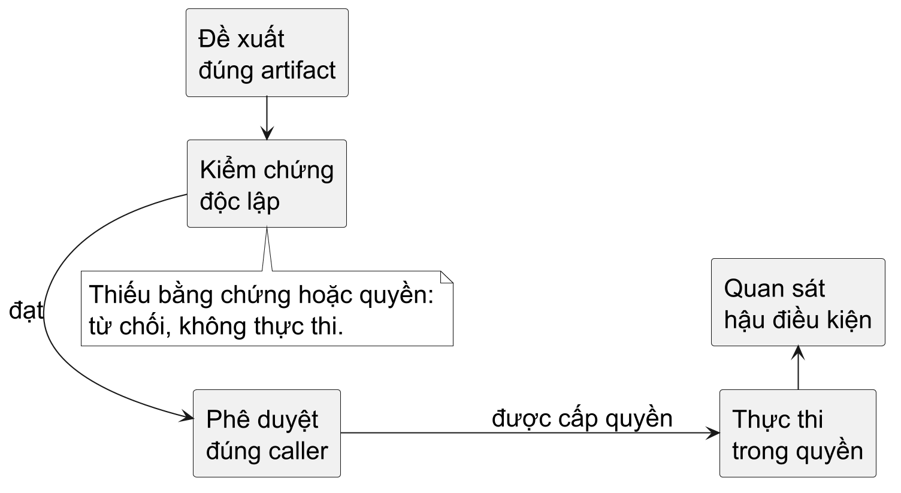

<!-- BOOK_ROLE: APPLICATION_SYSTEMS -->

# Chương 29 — Kỹ sư và bằng chứng trong kỷ nguyên Agent

Một Agent vừa đề xuất đổi timeout, tăng số replica và restart một service. Nó đưa ra một đoạn giải thích mạch lạc, một patch hợp lệ và dòng “tests passed”. Nếu anh bấm đồng ý, điều gì đã thực sự được chứng minh? Có thể chỉ là test của một checkout khác đã xanh; có thể patch đang dùng một config khác production; cũng có thể quyền restart chưa từng được cấp cho caller này. Chất lượng câu trả lời và quyền tác động vào hệ thống không phải cùng một đại lượng.

Chương 28 đã dạy cách trao một công cụ có giới hạn. Chương này đổi góc nhìn từ tool sang công việc của kỹ sư: **đề xuất → bằng chứng → quyền → hành động giới hạn → hậu điều kiện**. Agent có thể hỗ trợ nhiều bước, nhưng một bước không tự thay thế bước kế tiếp. Một hash đúng không chứng minh code đúng; test đúng không cấp quyền deploy; deploy thành công không chứng minh người dùng đã được phục vụ tốt hơn. Đây là mô hình để thiết kế quy trình và để đọc những lời hứa về nghề nghiệp, không phải một dự báo rằng chức danh nào sẽ tồn tại mãi.

## Đọc số liệu theo câu hỏi nó thực sự trả lời

Ngày chốt kiểm chứng của chương là 29-09-2026. “AI giúp lập trình nhanh hơn” thiếu ít nhất ba đối tượng: ai làm, làm việc gì, và nhanh hơn theo phép đo nào. Dữ liệu sau không dùng chung mẫu hay cùng loại outcome, nên không được lấy trung bình các phần trăm để tạo một con số về “năng suất AI”.

Nghiên cứu của Peng và cộng sự, công bố tháng 2-2023 trên arXiv, là một thí nghiệm có phân nhóm ngẫu nhiên với 95 lập trình viên được tuyển qua Upwork, diễn ra 15-05 đến 20-06-2022. Công việc là viết HTTP server JavaScript. Nhóm có GitHub Copilot giảm 55,8% thời gian hoàn thành trong phân tích những người hoàn thành; khoảng tin cậy 95% là 21–89%. Mẫu phần lớn từ Ấn Độ và Pakistan. Đây là bằng chứng cho một nhiệm vụ chuẩn hóa với công cụ năm 2022, không cho toàn bộ vòng đời service, Go hay incident production. Nhóm tác giả có liên hệ Microsoft/GitHub; nghiên cứu không đo đầy đủ chất lượng bảo trì dài hạn.

METR công bố ngày 10-07-2025 một RCT với 16 contributor có kinh nghiệm, làm 246 task trên repository mã nguồn mở quen thuộc, dùng công cụ thuộc giai đoạn tháng 2–6-2025. Cho phép AI làm thời gian hoàn thành tăng 19%, khoảng tin cậy 95% 2–39%. Đối tượng đo là nhóm contributor và task được tuyển, không phải mẫu đại diện lao động của một quốc gia. Kết quả trái trực giác này không chứng minh AI vô dụng; nó cho thấy một benchmark nhỏ và một thay đổi trong codebase có context lâu năm có thể cho kết quả khác nhau.

Bản cập nhật METR ngày 24-02-2026 nêu vấn đề chọn người, chọn task và đo thời gian khi người tham gia dùng công cụ mới hoặc làm nhiều việc song song. Tác giả coi các ước lượng mới là không đáng tin để định lượng hiệu ứng hiện tại. Vì vậy cũng không được dùng con số chậm 19% của năm 2025 như định luật cho Agent năm 2026. “Chưa đo chắc” là một kết luận có ích: nó ngăn cả quảng cáo lẫn phản đối AI dựa trên một thí nghiệm đã đổi bối cảnh.

Go Developer Survey 2025 do Go team công bố 21-01-2026, thu thập 09–30-09-2025, dùng 5.379 phản hồi sau làm sạch. Mời qua kênh công khai và lời mời ngẫu nhiên trong VS Code/GoLand; đây không phải mẫu ngẫu nhiên của toàn thị trường lao động. Phản hồi chủ yếu từ Bắc Mỹ và châu Âu. CLI và API service là nhóm use case nổi bật, và có người dùng Go cho hạ tầng cloud. Điều đó cho bối cảnh ecosystem, không cho số việc làm Go ở Việt Nam. Nhận xét về AI là tự báo cáo, không phải phép đo tốc độ có nhóm đối chứng.

Ở lớp thị trường, BLS cập nhật Occupational Outlook Handbook ngày 27-08-2026, dự báo việc làm tại Mỹ của nhóm software developers, quality assurance analysts và testers tăng 10% trong 2025–2035. Đây là dự báo nghề nghiệp từ chương trình Employment Projections, không phải quan sát rằng việc làm đã tăng từng ấy, không tách Go, DevOps hay SRE và không mô tả Việt Nam. Openings còn gồm nhu cầu thay người rời nghề, không chỉ vị trí mới. Sách không có dữ liệu đủ mạnh để suy ra lương hay nhu cầu Go tại Việt Nam từ nhóm nghề rộng này.

DORA 2025 đặt AI trong bối cảnh năng lực tổ chức: một công cụ có thể khuếch đại cả điểm mạnh lẫn điểm yếu đang có. Trang công bố thuộc chương trình nghiên cứu do Google Cloud dẫn dắt, có đối tác ngành. Ta dùng framing này như một gợi ý kiểm tra quy trình, không lấy nó làm bằng chứng nhân quả rằng mua công cụ sẽ làm SLO tốt hơn. Khi cần một con số từ survey, phải đọc mẫu, câu hỏi và phương pháp của chính số đó; chương không đưa phần trăm từ một báo cáo chỉ đọc phần giới thiệu.

## Tự động hóa task không đồng nghĩa xóa một nghề

Một chức danh là bó công việc, quyền hạn và trách nhiệm trong một tổ chức. Tạo YAML, tra syntax API, viết boilerplate test, phân loại log, điều tra nguyên nhân và quyết định chấp nhận rủi ro là những task khác nhau. Tự động hóa được một task có thể giảm công gõ, tăng số thay đổi có thể đề xuất, hoặc chuyển thời gian sang review. Nó không tự nói tổ chức sẽ tăng hay giảm headcount; còn có giá công cụ, nhu cầu sản phẩm, chi phí phối hợp, quy định và cách doanh nghiệp tổ chức công việc. Phần này là suy luận về thiết kế công việc, không phải thống kê tuyển dụng.

Sự thật khó chịu là thuộc nhiều CLI và YAML không tạo một hàng rào bền nếu task chỉ là biến một yêu cầu rõ thành cú pháp quen thuộc. Khi tool làm tốt phần ấy, kỹ sư phải cạnh tranh ở chỗ khác: đặt contract, nhận diện thiếu dữ liệu, giới hạn blast radius, hiểu vì sao một counterexample bác bỏ lời giải và kiểm tra thay đổi trong môi trường thật. Không phải ai cũng tự động chuyển sang phần việc khó hơn; học các năng lực ấy cần thực hành độc lập, không chỉ biết viết prompt.

Cơ hội cũng không chỉ là “viết code nhanh”. Một internal developer platform có thể giảm các thao tác lặp lại bằng API chuẩn, deployment contract và policy có thể kiểm tra. Reliability engineering có thể dùng tự động hóa để thu thập trace, so config và khoanh vùng failure. AI infrastructure cần người hiểu network, resource budget, identity, chi phí và đường đi của dữ liệu. Security và incident response cần phân biệt đề xuất hữu ích với hành động làm mất bằng chứng hoặc mở thêm quyền. Những hướng ấy có giá trị khi tổ chức thực sự có bài toán, không phải bảo đảm mỗi người biết Go đều được tuyển.

Ở tầng entry-level, ta có thể đặt một scenario: nếu phần lớn task đầu vào từng là boilerplate, người mới có ít cơ hội học qua việc tự viết chúng. Đây là rủi ro đào tạo cần thiết kế lại, không phải một claim rằng mọi vị trí junior đã biến mất. Một cách đáp ứng là giữ bài tập solo nhỏ, yêu cầu dự đoán trước khi chạy, review code sinh ra bằng counterexample và tự điều tra một failure chưa có đáp án. Một portfolio tốt nên cho thấy anh biết bác bỏ lời giải sai, không chỉ có nhiều repository được Agent tạo.

## Go nằm ở đâu trong bó công việc ấy?

Các chương trước đã cho ví dụ kiểm chứng được: CLI gom dữ liệu vận hành, HTTP service, controller Kubernetes, cloud SDK, GitHub automation và tool server MCP. Go có static types, build/test tooling thống nhất và standard library phù hợp với nhiều bài toán I/O. Chúng giúp tạo vòng phản hồi cho cả người lẫn Agent: compiler bắt một lớp lỗi, test bắt những contract đã được mô tả, race detector tìm access racy trên đường chạy được thực thi. Không công cụ nào thay bài toán chọn contract.

Đây là lựa chọn theo workload. Một CLI thuần Go có thể giảm phụ thuộc runtime khi phân phối, nhưng cgo, chứng chỉ, timezone, file config và quyền OS vẫn có thể tạo dependency ngoài binary. Service có GC cần budget memory và latency. Interface nhỏ giúp thay implementation, nhưng không diễn đạt tự động ownership, deadline hoặc retry semantics. Simplicity làm một số bước review dễ hơn; nó cũng để lại công việc thiết kế bằng convention và test thay vì một hệ kiểu kiểm tra mọi invariant.

Nếu task chủ yếu là khám phá dữ liệu và notebook với library ML sẵn có, Python có thể hợp lý hơn. Nếu cần một subsystem có yêu cầu ownership hoặc kiểm soát memory rất chặt, Rust hay C/C++ có thể đáng cân nhắc tùy hệ thống và năng lực team. Browser UI có ecosystem khác. Một hệ thống có thể dùng Go ở control plane và ngôn ngữ khác ở data plane; boundary protocol và lifecycle quan trọng hơn tranh luận một ngôn ngữ phải làm tất cả. Chương 14 đã cho một ví dụ nhỏ về chi phí interop, không một bảng xếp hạng ngôn ngữ.

## Một cuộc điều tra trước khi cho phép restart

Xét scenario local sau, không phải sự cố production đã quan sát. Agent đọc log “timeout” rồi đề xuất restart `local-demo`. Nó viện dẫn test xanh từ một phút trước. Trong phút ấy, diff thay đổi từ A sang B. Chính sách chỉ kiểm tra `testsPassed` và `approved` sẽ cho B đi qua bằng chứng của A. Bug không nằm ở model viết sai câu; nó nằm ở việc hệ thống không gắn bằng chứng với đúng object đang được chấp nhận.

@figure Đề xuất không có quyền thực thi. Mỗi bước kiểm tra phải gắn với đúng artifact, target và caller; mũi tên diễn tả policy của scenario, không phải một protocol đảm bảo an toàn sẵn có.

Hãy review policy lỗi này trước khi đọc lab:

~~~go
if evidence.Passed && approved {
	return nil
}
return ErrDenied
~~~

Nó thiếu identity của thay đổi, tuổi bằng chứng, caller, target và action. Một `Passed` do Agent tự khai còn không phải bằng chứng độc lập. Thêm hash vào cùng payload chưa chữa trust: bên không tin cậy có thể bịa cả hash lẫn cờ xanh. Verifier và nơi lưu approval phải nằm ngoài quyền ghi của Agent. Chương 26 đã tách artifact identity khỏi provenance; Chương 28 đã tách authenticated identity khỏi argument của tool. Ta ghép hai boundary ấy, không tạo framework mới.

## Lab: viết rào chắn từ contract, không từ lời giải

Mở `labs/part29-change-evidence/gate_test.go` trước `gate.go`. Trong một bản sao thử nghiệm, bỏ implementation tham chiếu rồi dựng API theo test. Một request hợp lệ cần operator đã xác thực, action duy nhất `restart-demo`, target local trong allowlist, SHA-256 hợp lệ của diff, evidence mới và xanh gắn với digest của plan, approval chưa hết hạn gắn với cùng caller và plan. Thiếu một phần phải từ chối. Đây là policy dạy học: giới hạn tuổi một phút là dữ liệu của fixture, không phải một tiêu chuẩn bảo mật cho production.

Digest bao gồm version của encoding, action, target và diff hash. Version giữ nghĩa của encoding khi format đổi; SHA-256 chỉ giúp so identity, không kiểm tra tác dụng của diff. Không lấy một JSON có thứ tự tùy ý rồi giả định mọi producer đều hash ra cùng giá trị; lab dùng một struct với encoding cố định trong Go và giữ contract ấy trong test. Nếu hệ thống có nhiều ngôn ngữ, cần định nghĩa encoding canonical như một protocol riêng.

Chạy từ thư mục lab:

~~~powershell
go test -v ./...
go vet ./...
go test -race ./...
~~~

Test phải từ chối diff đổi, target khác, action khác, caller khác, viewer, thiếu evidence, test lỗi, evidence cũ hoặc ở tương lai và approval hết hạn. Test deterministic kiểm tra cùng plan cho cùng digest và target đổi thì digest đổi. Nó không chứng minh thuật toán hash không có collision; đó không phải điều một unit test nhỏ đo được.

Reference implementation không chạy shell, không restart một service và không nhận credential production. Evidence và approval là input tin cậy của fixture; trong hệ thật, nguồn của chúng cần authentication và storage policy. `Check` trả `nil` cũng chưa ngăn approval bị dùng hai lần, chưa khóa artifact khỏi đổi giữa check và execute, chưa xác nhận target state hay rollback. Giới hạn này là chủ đích: lab chỉ chứng minh contract kiểm tra local. Không gọi nó là một authorization service production-ready.

**Bài thiết kế tiếp theo.** Approval chỉ được dùng một lần. Hai executor có thể cùng đọc approval hợp lệ. Hãy viết failing test cho hai consumer trước khi chọn mutex hay transaction; chỉ một consumer được claim quyền dùng, consumer còn lại bị từ chối. Nếu executor crash sau claim nhưng trước action, policy có cho retry không, và action có idempotent không? Câu trả lời phải dựa trên hành động thật, không trên việc đã có một lock trong code.

**Hướng phân tích — chỉ đọc sau khi đã viết contract.** Một cờ đã dùng trong memory không giải quyết hai process. Check và claim cần một atomic boundary trong storage đáng tin; action ngoài storage có thể vẫn tạo khoảng crash. Có thể cần state machine pending/claimed/observed, idempotency key hoặc điều tra trước retry. Mỗi lựa chọn đổi failure mode. Đây là cùng trách nhiệm của transaction ở Chương 13 và reconciliation ở Chương 21, nay áp dụng cho tự động hóa có Agent.

## Năng lực nào cần luyện nếu không muốn chỉ làm người bấm duyệt?

Sự khác biệt giữa review và đọc lướt là anh có thể tạo một phép thử bác bỏ. Với code concurrency, vẽ access và cạnh happens-before thay vì tin nhãn thread-safe. Với network, lần timeout qua DNS, connect, TLS, response body; một status code không giải thích whole request path. Với Linux, phân biệt process, descriptor, namespace, quota và memory được kế toán. Với distributed systems, hỏi duplicate, stale observation, retry và side effect xảy ra ở boundary nào. Đây là những kỹ năng chuyển được giữa tool, không phụ thuộc một model cụ thể.

Observability cũng không phải chỉ cài dashboard. Một trace có đủ correlation để phân biệt queue wait với dependency wait không? Một metric đổi vì traffic mix hay vì code? Agent có thể viết query và tóm tắt log; kỹ sư vẫn cần chọn measurement contract và bảo vệ dữ liệu nhạy cảm. Trong incident, tự động hóa thu thập read-only thường có rủi ro khác tự động hóa xóa Pod hoặc đổi firewall. Hành động “sửa nhanh” có thể làm mất hiện trạng cần điều tra. Quyền và bằng chứng phải tăng theo tác động, không theo mức tự tin của văn bản.

Một bài học độc lập có thể kết thúc bằng một hồ sơ nhỏ: requirement anh viết, phản ví dụ anh tìm, artifact đúng version, test anh chạy, phép đo có giới hạn, quyết định quyền và hậu điều kiện anh quan sát. Đừng chỉ lưu transcript dài. Hồ sơ tốt cho người khác tái kiểm tra lý do quyết định, kể cả khi Agent hay library đã đổi. Đó là năng lực verification có thể luyện được, không phải lời hứa miễn nhiễm với thay đổi thị trường.

## Kết thúc ở một quyết định có thể bảo vệ

Không có kết luận chắc rằng “AI sẽ lấy nghề” hay “kỹ sư giỏi sẽ không bị ảnh hưởng” từ các nguồn đã đọc. Có bằng chứng về công cụ giúp một số task, về task khác chậm hơn trong một bối cảnh cũ, và về khó khăn khi đo công cụ đang thay đổi. Có dự báo nghề rộng tại Mỹ, không có một dự báo riêng đủ mạnh cho Go/SRE ở Việt Nam. Từ đó, lời khuyên của sách là một khuyến nghị có điều kiện: học xây và kiểm chứng hệ thống, dùng AI để mở rộng khả năng làm việc nhưng giữ quyền hạn, artifact và outcome thành những đối tượng có thể audit.

Khi người khác hỏi vì sao anh chấp nhận một thay đổi, câu trả lời tốt không phải “Agent nói thế” hoặc “test đều xanh”. Nó là: contract nào, bằng chứng của artifact nào, dưới điều kiện nào, do ai cấp quyền, và hệ thống sau hành động đã được quan sát ra sao. Bách khoa thực dụng không kết thúc ở việc nhớ thêm một package. Nó kết thúc ở khả năng biết mình đang chứng minh điều gì — và điều gì vẫn chưa được chứng minh.

@references
1. Peng, S.; Kalliamvakou, E.; Cihon, P.; Demirer, M. The Impact of AI on Developer Productivity: Evidence from GitHub Copilot. arXiv:2302.06590, 2023. arxiv.org/abs/2302.06590
2. Becker, J.; Rush, N.; Barnes, B.; Rein, D. Measuring the Impact of Early-2025 AI on Experienced Open-Source Developer Productivity. METR, 10-07-2025. metr.org/Early_2025_AI_Experienced_OS_Devs_Study-paper.pdf
3. METR. We are Changing our Developer Productivity Experiment Design. 24-02-2026. metr.org/blog/2026-02-24-uplift-update/
4. Go Team. Results from the 2025 Go Developer Survey. 21-01-2026, mục Survey methodology. go.dev/blog/survey2025
5. U.S. Bureau of Labor Statistics. Occupational Outlook Handbook: Software Developers, Quality Assurance Analysts, and Testers. Cập nhật 27-08-2026; Mỹ, dự báo 2025–2035. bls.gov/ooh/computer-and-information-technology/software-developers.htm
6. DORA. State of AI-assisted Software Development 2025, trang công bố và ranh giới framing. dora.dev/research/2025/dora-report/
